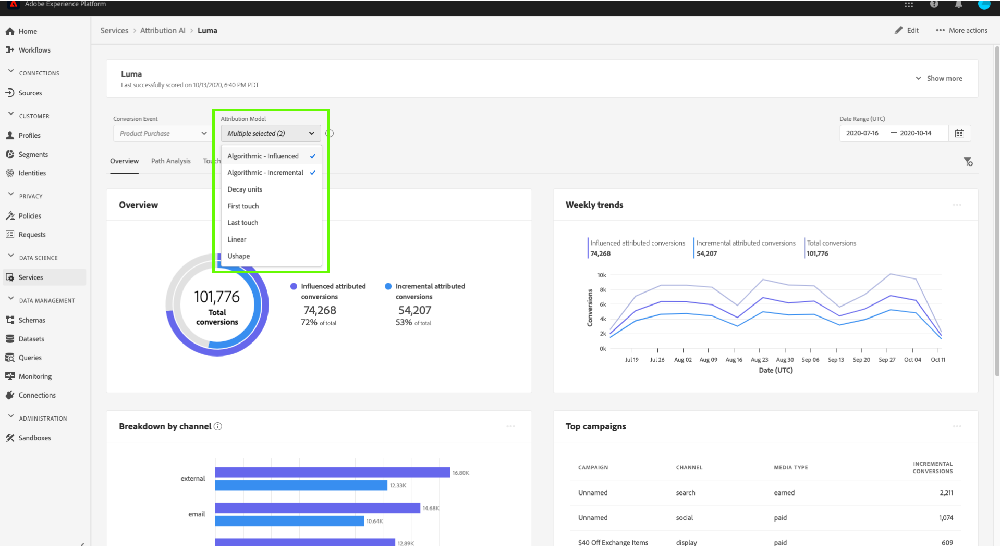

# Attribution AI에서 인사이트 발견

Attribution AI 서비스 인스턴스는 마케팅 성과 및 ROI와 관련된 마케팅 결정을 내리고 측정하는 데 도움이 되는 통찰력을 제공합니다. 서비스 인스턴스를 선택하면 고객 여정의 각 단계에서 모든 고객과의 상호 작용이 미치는 영향을 이해할 수 있도록 시각화와 필터를 제공합니다.

이 문서는 Adobe Intelligent Services 사용자 인터페이스에서 서비스 인스턴스 인사이트와 상호 작용하는 데 대한 가이드 역할을 합니다.

## 시작하기

Attribution AI에 대한 통찰력을 활용하려면 성공적인 실행 상태의 서비스 인스턴스를 사용할 수 있어야 합니다. 새 서비스 인스턴스를 만들려면 [Attribution AI 사용자 인터페이스 안내서](./user-guide.md)를 방문하십시오. 최근에 서비스 인스턴스를 만들었는데 여전히 트레이닝과 점수 지정 중이라면 24시간 후에 실행을 완료하십시오.

## 서비스 인스턴스 인사이트 개요

[!DNL Adobe Experience Platform] UI의 왼쪽 탐색 영역에서 **[!UICONTROL Services]**&#x200B;을 선택합니다. **[!UICONTROL Services]** 브라우저가 나타나고 사용 가능한 Adobe Intelligent Services가 표시됩니다. Attribution AI 컨테이너에서 **[!UICONTROL Open]**&#x200B;을 선택합니다.

Attribution AI 서비스 페이지가 나타납니다. 이 페이지에는 Attribution AI의 서비스 인스턴스가 나열되며 인스턴스 이름, 전환 이벤트, 인스턴스 실행 횟수, 마지막 업데이트 상태 등에 대한 정보가 표시됩니다. 시작할 서비스 인스턴스 이름을 선택합니다.

>[!NOTE]
>
>성공적인 점수 실행을 완료한 서비스 인스턴스만 선택할 수 있습니다.

그런 다음, 시각화 및 데이터와 상호 작용할 수 있는 다양한 필터가 제공되는 서비스 인스턴스에 대한 인사이트 페이지가 나타납니다. 시각화 및 필터는 이 안내서 전반에서 자세히 설명합니다.

### 서비스 인스턴스 세부 사항

서비스 인스턴스에 대한 추가 세부 정보를 보려면 오른쪽 맨 위에서 **[!UICONTROL Show more]**&#x200B;을 선택합니다.

자세한 목록이 나타납니다. 나열된 속성에 대한 자세한 내용은 [Attribution AI 사용자 안내서](./user-guide.md)를 참조하십시오.

### 인스턴스 편집

인스턴스를 편집하려면 오른쪽 위 탐색에서 **[!UICONTROL Edit]**을 선택합니다.

인스턴스의 이름, 설명 및 점수 지정 빈도를 편집할 수 있는 편집 대화 상자가 나타납니다. 인스턴스 상태가 비활성화되어 있으면 점수 지정 빈도를 편집할 수 없습니다. 변경 내용을 확인하고 대화 상자를 닫으려면 오른쪽 하단 모서리에서 **[!UICONTROL Save]**&#x200B;을 선택합니다.

### 추가 작업 {#more-actions}

**[!UICONTROL More actions]** 단추는 **[!UICONTROL Edit]** 옆의 오른쪽 위 탐색에 있습니다. **[!UICONTROL More actions]**&#x200B;을 선택하면 다음 작업 중 하나를 선택할 수 있는 드롭다운이 열립니다.

- **[!UICONTROL Clone]**:인스턴스를 복제합니다.
- **[!UICONTROL Delete]**:인스턴스를 삭제합니다.
- **[!UICONTROL Download summary data]**:요약 데이터가 포함된 CSV 파일을 다운로드합니다.
- **[!UICONTROL Access scores]**:Attribution AI  **[!UICONTROL Access scores]** 튜토리얼의  [액세스 점수로 리디렉션됩니다](./download-scores.md).
- **[!UICONTROL View run history]**:서비스 인스턴스와 연관된 모든 점수 실행 목록이 포함된 팝업이 나타납니다.

## 데이터 필터링

Attribution AI 인사이트를 통해 데이터를 필터링하고 선택한 필터를 기반으로 UI 시각적 효과를 자동으로 업데이트할 수 있습니다.

### 전환 이벤트

Attribution AI에서 새 인스턴스를 만들면 필수 필드 중 하나가 &quot;전환 이벤트&quot;입니다. 전환 이벤트는 전자 상거래 주문, 매장 내 구매 및 웹 사이트 방문과 같은 마케팅 활동의 영향을 식별하는 비즈니스 목표입니다.

인스턴스 내에서 **[!UICONTROL Conversion events]** 드롭다운을 사용하면 데이터를 필터링하기 위해 인스턴스에 대해 정의된 이벤트를 선택할 수 있습니다. 특정 이벤트를 선택하면 UI 시각화가 해당 이벤트에 속하는 전환만 채우도록 변경됩니다.

### 속성 모델

**[!UICONTROL Attribution Model]**&#x200B;을 선택하면 사용할 수 있는 다양한 속성 모델이 모두 포함된 드롭다운이 열립니다. 여러 모델을 선택하여 결과를 비교할 수 있습니다. 서로 다른 속성 모델과 작동 방법에 대한 자세한 내용은 각 모델에 대한 정보가 포함된 표를 포함하는 [Attribution AI](./overview.md) 개요를 참조하십시오.

### 지역

>[!NOTE]
>
>이 필터는 서비스 인스턴스를 만들 때 Attribution AI 사용자 인터페이스 안내서에서 옵션 단계 [지역 기반 모델링](./user-guide.md#region-based-modeling-optional)을 수행한 경우에만 제공됩니다.

이 필터를 사용하면 인스턴스 생성 프로세스에서 설정한 모든 영역을 선택할 수 있습니다.

### 필터 추가

**[!UICONTROL Add filters]** 팝업을 열려면 **필터** 아이콘을 선택하여 필터를 추가할 수 있습니다. **[!UICONTROL Add filters]** 팝업을 사용하면 채널, 지리적 위치, 미디어 유형 및 제품별로 필터링할 수 있습니다. 서비스 인스턴스에 적용할 수 있는 필터만 팝오버로 채워집니다. 예를 들어 지리적 데이터 또는 미디어 유형을 제공하지 않은 경우 해당 필터 속성을 인스턴스에 사용할 수 없습니다.

- **[!UICONTROL Channel]채널** 속성을 선택하면 사용 가능한 마케팅 채널을 필터링할 수 있습니다. 여러 채널을 선택하여 비교할 수 있습니다.
- **[!UICONTROL Geography]지리** 속성을 선택하면 지역 기반 모델에 따라 국가 코드를 필터링할 수 있습니다. 데이터에 따라 이 필터가 없거나 없을 수 있습니다. 국가 번호는 2자입니다. 전체 국가 코드 목록 [여기](https://datahub.io/core/country-list)를 참조하십시오.
- **[!UICONTROL Media type]:** 미디어 유형 속성을 선택하면 정의된 미디어 유형을 필터링할 수 있습니다.
- **[!UICONTROL Product]제품 속성을** 선택하면 인스턴스 생성 시 처음에 인제스트한 모든 제품을 필터링할 수 있습니다.

### 날짜 범위

달력 아이콘을 선택하여 날짜 범위 팝업을 엽니다. 시작 및 종료 전환 이벤트 날짜는 UI에 채워진 데이터의 양을 결정합니다. 채워진 데이터 양을 포커스 또는 확장할 수 있도록 날짜 범위를 좁히거나 넓히도록 선택할 수 있습니다.

## 데이터 개요

**[!UICONTROL Overview]** 카드는 속성 모델별 총 전환 수를 보여줍니다. 이 문서에 앞서 설명한 필터를 사용하여 검색을 구체적으로 수행하는 방법에 따라 총 개수가 변경됩니다. 모델을 더 선택하면 해당 범례에 해당하는 고유한 색상이 있는 추가 서클이 개요에 추가됩니다.

## 주간 트렌드

**[!UICONTROL Weekly trends]** 카드는 필터링 프로세스 동안 설정한 날짜 범위로 총 전환을 분석합니다.

**주별 트렌드** 카드의 오른쪽 상단에 있는 줄임표를 선택하면 일별, 주별 또는 월별 트렌드를 선택할 수 있는 드롭다운이 표시됩니다.

특정 속성 모델의 데이터 행을 마우스로 가리키면 해당 날짜에 대한 총 전환 수를 보여주는 팝업이 만들어집니다.

## 채널별 분류

**[!UICONTROL Breakdown by channel]** 카드는 각 채널과 관련된 총 전환 수를 결정하는 데 사용됩니다. 이 카드를 사용하여 각 채널의 효과성과 ROI를 결정할 수 있습니다.

**[!UICONTROL Breakdown by channel]** 카드의 오른쪽 상단에 있는 줄임표를 선택하면 터치포인트를 기준으로 데이터를 채울 수 있는 드롭다운이 열립니다.

## 주요 캠페인

**[!UICONTROL Top campaigns]** 카드에는 캠페인의 개요와 각 채널에서 캠페인이 수행되는 방법이 표시됩니다. 이 카드를 사용하면 특정 채널에 대한 특정 캠페인의 효과를 팀에 알리며 향후 투자해야 하는 캠페인과 같은 통찰력을 얻을 수 있습니다.

## 터치포인트 위치별 분류

**[!UICONTROL Path Analysis]** 탭을 선택하면 **[!UICONTROL Breakdown by touchpoint position]** 및 **[!UICONTROL Top conversion paths]** 그래프가 로드됩니다.

**[!UICONTROL Breakdown by touchpoint position]** 그래프는 모든 전환 경로에서 비교한 터치포인트의 위치별 기여도 전환의 분류입니다. 이 그래프는 전환 경로의 여러 단계에서 더 효과적인 접점을 파악하는 데 도움이 됩니다. 스테이지는 스타터, 플레이어, 그 이상이다.

- **시작:** 터치점이 전환 경로에서 첫 번째 터치였음을 나타냅니다.
- **플레이어:** 터치포인트가 전환으로 이어지는 첫 번째 또는 마지막 터치가 아님을 나타냅니다.
- **자세히:** 전환하기 전의 마지막 터치포인트입니다.

>!![NOTE]
모든 접점 및 위치에 대한 기여도 모델의 합계는 100이어야 합니다.

## 주요 전환 경로

**[!UICONTROL Top conversion paths]** 그래프는 선택한 영역의 상위 전환 경로에 대한 영향 및 알고리즘 점수를 보여줍니다. 이 그래프를 사용하면 전환에 기여하는 접점과 각 접점에 대한 기여도 점수를 시각화할 수 있습니다. 이 정보를 사용하여 특정 영역에서 가장 빈번한 경로를 보고 다른 터치포인트 세트 간에 패턴이 있는지 확인할 수 있습니다.

## 터치포인트 효과

**[!UICONTROL Touchpoint Effectiveness]** 탭을 선택하면 **[!UICONTROL Touchpoint effectiveness]** 카드가 로드됩니다. 이 카드는 Attribution AI의 데이터 배포를 사용하여 각 접점에 대한 정보를 표시합니다. 이 테이블의 데이터는 카드의 오른쪽 상단에 있는 **[!UICONTROL As of]** 날짜로 표시된 특정 기간 동안에만 생성됩니다.

**[!UICONTROL Touchpoint effectiveness]** 카드 정보를 사용하여 터치포인트가 전환에 기여하는 방법을 이해할 수 있습니다. 다음 성능 지표를 사용하여 각 접점이 얼마나 효과적인지 확인할 수도 있습니다.

**터치 패스**:이 지표는 터치포인트의 전환을 성취하고/성취하지 못한 경로의 백분율을 표시합니다. 전환하지 않는 경로에 대한 전환을 완료하는 경로(백분율)의 비율이 높은 경우 전환율이 더 높은 것으로 표시됩니다.

**효율성 측정**:이 지표는 1부터 5까지의 척도로 별을 표시합니다. 척도는 전환으로 이어지는 접점의 상대적 중요도를 나타냅니다.

>[!NOTE]
터치포인트 볼륨이 크면 효율성 측정이 향상되지 않습니다.

**총 볼륨**:터치포인트를 사용자가 터치한 총 횟수입니다. 전환으로 연결되지 않는 경로뿐만 아니라 전환 경로에 나타나는 터치포인트도 포함되어 있습니다.

## 다음 단계

데이터 필터링을 완료하고 적절한 정보를 표시할 수 있게 되면 점수를 이용할 수 있는 옵션이 있습니다. 스코어에 액세스하는 방법에 대한 자세한 설명은 Attribution AI](./download-scores.md) 자습서의 [액세스 점수를 참조하십시오. 또한 [기타 작업](#more-actions)에 명시된 요약 데이터를 다운로드할 수도 있습니다. &quot;요약 데이터 다운로드&quot;를 선택하면 날짜별로 집계된 요약 데이터가 다운로드됩니다.

## 추가 리소스

다음 비디오는 Attribution AI 인사이트 페이지를 사용하여 마케팅 채널 및 캠페인의 ROI를 이해하는 방법을 학습하기 위해 고안되었습니다.

>[!VIDEO](https://video.tv.adobe.com/v/32669?learn=on&quality=12)
