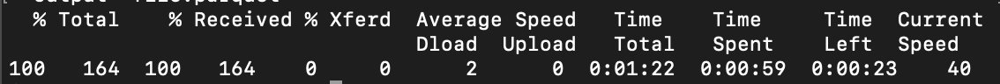

# Attribution AI에서 점수 다운로드

이 문서는 Attribution AI에 대한 점수를 다운로드하는 데 필요한 지침입니다.

## 시작하기

Attribution AI을 사용하면 점수를 Parquet 파일 형식으로 다운로드할 수 있습니다. 이 자습서에서는 [시작하기](./getting-started.md) 안내서.

또한 Attribution AI에 대한 점수에 액세스하려면 실행 상태가 성공적으로 설정된 서비스 인스턴스가 있어야 합니다. 새 서비스 인스턴스를 생성하려면 [Attribution AI 사용 안내서](./user-guide.md). 최근에 서비스 인스턴스를 만들었지만 여전히 교육 및 점수 책정 중이라면 실행을 완료하려면 24시간을 허용하십시오.

## 데이터 세트 ID 찾기 {#dataset-id}

Attribution AI 인사이트에 대한 서비스 인스턴스 내에서 *추가 작업* 오른쪽 상단 탐색의 드롭다운을 선택하고 을(를) 선택합니다 **[!UICONTROL 점수 책정 액세스]**.


다운로드 점수 설명서 및 현재 인스턴스에 대한 데이터 세트 ID에 대한 링크가 포함된 새 대화 상자가 나타납니다. 데이터 세트 ID를 클립보드에 복사하여 다음 단계로 진행합니다.


## 배치 ID 검색 {#retrieve-your-batch-id}

이전 단계에서 데이터 세트 ID를 사용하여 배치 ID를 검색하려면 카탈로그 API를 호출해야 합니다. 조직에 속한 배치 목록 대신 가장 최근 성공적인 배치를 반환하기 위해 이 API 호출에 추가 쿼리 매개 변수가 사용됩니다. 추가 배치를 반환하려면 `limit` 반환하려는 금액에 대한 쿼리 매개 변수입니다. 사용 가능한 쿼리 매개 변수 유형에 대한 자세한 내용은 다음 안내서를 참조하십시오 [쿼리 매개 변수를 사용하여 카탈로그 데이터 필터링](../../catalog/api/filter-data.md).

**API 형식**

```http
GET /batches?&dataSet={DATASET_ID}&createdClient=acp_foundation_push&status=success&orderBy=desc:created&limit=1
```

| 매개 변수 | 설명 |
| --------- | ----------- |
| `{DATASET_ID}` | 데이터 세트 ID는 &quot;액세스 점수&quot; 대화 상자에서 사용할 수 있습니다. |

**요청**

```shell
curl -X GET 'https://platform.adobe.io/data/foundation/catalog/batches?&dataSet=5e8f81ce7a4ecb18a8d25b22&createdClient=acp_foundation_push&status=success&orderBy=desc:created&limit=1' \
  -H 'Authorization: Bearer {ACCESS_TOKEN}' \
  -H 'x-api-key: {API_KEY}' \
  -H 'x-gw-ims-org-id: {ORG_ID}' \
  -H 'x-sandbox-name: {SANDBOX_NAME}'
```

**응답**

성공적인 응답은 배치 ID 개체가 포함된 페이로드를 반환합니다. 이 예에서 반환되는 개체의 키 값은 배치 ID입니다 `01E5QSWCAASFQ054FNBKYV6TIQ`. 다음 API 호출에서 사용할 배치 ID를 복사합니다.

>[!NOTE]
>
> 다음 응답에는 `tags` 가독성을 위해 개량된 객체.

```json
{
    "01E5QSWCAASFQ054FNBKYV6TIQ": {
        "status": "success",
        "tags": {
            "Tags": [ ... ],
        },
        "relatedObjects": [
            {
                "type": "dataSet",
                "id": "5e8f81cf7a4ecb28a8d85b22"
            }
        ],
        "id": "01E5QSWCAASFQ054FNBKYV6TIQ",
        "externalId": "01E5QSWCAASFQ054FNBKYV6TIQ",
        "replay": {
            "predecessors": [
                "01E5N7EDQQP4JHJ93M7C3WM5SP"
            ],
            "reason": "Replacing for 2020-04-09",
            "predecessorListingType": "IMMEDIATE"
        },
        "inputFormat": {
            "format": "parquet"
        },
        "imsOrg": "412657965Y566A4A0A495D4A@AdobeOrg",
        "started": 1586715571808,
        "metrics": {
            "partitionCount": 1,
            "outputByteSize": 2380339,
            "inputFileCount": -1,
            "inputByteSize": 2381007,
            "outputRecordCount": 24340,
            "outputFileCount": 1,
            "inputRecordCount": 24340
        },
        "completed": 1586715582735,
        "created": 1586715571217,
        "createdClient": "acp_foundation_push",
        "createdUser": "sensei_exp_attributionai@AdobeID",
        "updatedUser": "acp_foundation_dataTracker@AdobeID",
        "updated": 1586715583582,
        "version": "1.0.5"
    }
}
```

## 배치 ID를 사용하여 다음 API 호출을 검색합니다 {#retrieve-the-next-api-call-with-your-batch-id}

배치 ID가 있으면에서 새 GET 요청을 수행할 수 있습니다 `/batches`. 이 요청은 다음 API 요청으로 사용되는 링크를 반환합니다.

**API 형식**

```http
GET batches/{BATCH_ID}/files
```

| 매개 변수 | 설명 |
| --------- | ----------- |
| `{BATCH_ID}` | 이전 단계에서 검색한 배치 ID입니다 [배치 ID 검색](#retrieve-your-batch-id). |

**요청**

자체 배치 ID를 사용하여 다음 요청을 수행합니다.

```shell
curl -X GET 'https://platform.adobe.io/data/foundation/export/batches/01E5QSWCAASFQ054FNBKYV6TIQ/files' \
  -H 'Authorization: Bearer {ACCESS_TOKEN}' \
  -H 'x-api-key: {API_KEY}' \
  -H 'x-gw-ims-org-id: {ORG_ID}' \
  -H 'x-sandbox-name: {SANDBOX_NAME}'
```

**응답**

성공적인 응답은 다음을 포함하는 페이로드를 반환합니다 `_links` 개체. 내 `_links` 개체는 `href` 를 값으로 새 API 호출로 사용. 이 값을 복사하여 다음 단계로 진행합니다.

```json
{
    "data": [
        {
            "dataSetFileId": "01E5QSWCAASFQ054FNBKYV6TIQ-1",
            "dataSetViewId": "5e8f81cf7a4ecb28a8d85b22",
            "version": "1.0.0",
            "created": "1586715582571",
            "updated": "1586715582571",
            "isValid": false,
            "_links": {
                "self": {
                    "href": "https://platform.adobe.io:443/data/foundation/export/files/01E5QSWCXXYFQ054FNBKYV2BAQ-1"
                }
            }
        }
    ],
    "_page": {
        "limit": 100,
        "count": 1
    }
}
```

## 파일 검색 {#retrieving-your-files}

사용 `href` 이전 단계에서 API 호출로 얻은 값을 사용하여 파일 디렉토리를 검색할 새 GET 요청을 만듭니다.

**API 형식**

```http
GET files/{DATASETFILE_ID}
```

| 매개 변수 | 설명 |
| --------- | ----------- |
| `{DATASETFILE_ID}` | dataSetFile ID는 `href` 값에서 [이전 단계](#retrieve-the-next-api-call-with-your-batch-id). 또한 `data` 개체 유형 아래의 배열 `dataSetFileId`. |

**요청**

```shell
curl -X GET 'https://platform.adobe.io/data/foundation/export/files/01E5QSWCAASFQ054FNBKYV6TIQ-1' \
  -H 'Authorization: Bearer {ACCESS_TOKEN}' \
  -H 'x-api-key: {API_KEY}' \
  -H 'x-gw-ims-org-id: {ORG_ID}' \
  -H 'x-sandbox-name: {SANDBOX_NAME}'
```

**응답**

응답에는 단일 항목이 있거나 해당 디렉토리에 속하는 파일 목록이 있는 데이터 배열이 포함됩니다. 아래 예에는 파일 목록이 포함되어 있으며 가독성을 위해 요약되어 있습니다. 이 시나리오에서는 파일에 액세스하려면 각 파일의 URL을 따라야 합니다.

```json
{
    "data": [
        {
            "name": "part-00000-tid-5614147572541837832-908bd66a-d856-47fe-b7da-c8e7d22a4097-1370467-1.c000.snappy.parquet",
            "length": "2380211",
            "_links": {
                "self": {
                    "href": "https://platform.adobe.io:443/data/foundation/export/files/01E5QSWCXXYFQ054FNBKYV2BAQ-1?path=part-00000-trd-5714147572541837832-938bd66a-d556-41fe-b7da-c8e7d22a4097-1320467-1.c000.snappy.parquet"
                }
            }
        }
    ],
    "_page": {
        "limit": 100,
        "count": 1
    }
}
```

| 매개 변수 | 설명 |
| --------- | ----------- |
| `_links.self.href` | 디렉토리에서 파일을 다운로드하는 데 사용되는 GET 요청 URL입니다. |


를 복사합니다. `href` 의 모든 파일 객체에 대한 값 `data` 배열로 이동한 다음 다음 단계로 진행합니다.

## 파일 데이터 다운로드

파일 데이터를 다운로드하려면 다음에 GET 요청을 하십시오 `"href"` 이전 단계에서 복사한 값 [파일 검색](#retrieving-your-files).

>[!NOTE]
>
>명령줄에서 직접 이 요청을 하는 경우 요청 헤더 뒤에 출력을 추가하라는 메시지가 표시될 수 있습니다. 다음 요청 예는 를 사용합니다 `--output {FILENAME.FILETYPE}`.

**API 형식**

```http
GET files/{DATASETFILE_ID}?path={FILE_NAME}
```

| 매개 변수 | 설명 |
| --------- | ----------- |
| `{DATASETFILE_ID}` | dataSetFile ID는 `href` 값에서 [이전 단계](#retrieve-the-next-api-call-with-your-batch-id). |
| `{FILE_NAME}` | 파일 이름입니다. |

**요청**

```shell
curl -X GET 'https://platform.adobe.io:443/data/foundation/export/files/01E5QSWCXXYFQ054FNBKYV2BAQ-1?path=part-00000-trd-5714147572541837832-938bd66a-d556-41fe-b7da-c8e7d22a4097-1320467-1.c000.snappy.parquet' \
  -H 'Authorization: Bearer {ACCESS_TOKEN}' \
  -H 'x-api-key: {API_KEY}' \
  -H 'x-gw-ims-org-id: {ORG_ID}' \
  -H 'x-sandbox-name: {SANDBOX_NAME}' \
  -O 'file.parquet'
```

>[!TIP]
>
>GET 요청을 수행하기 전에 파일을 저장할 올바른 디렉터리 또는 폴더에 있는지 확인하십시오.

**응답**

이 응답은 현재 디렉터리에서 요청한 파일을 다운로드합니다. 이 예에서 파일 이름은 &quot;file.parquet&quot;입니다.



다운로드한 점수는 Parquet 형식으로 표시되며 [!DNL Spark]-shell 또는 Parquet reader를 사용하여 점수를 확인합니다. 원시 스코어카드의 경우 [Apache Parquet 툴](https://parquet.apache.org/docs/). Parquet 툴을 사용하여 데이터를 분석할 수 있습니다. [!DNL Spark].

## 다음 단계

이 문서에서는 Attribution AI 점수를 다운로드하는 데 필요한 단계에 대해 설명합니다. 점수 산출 결과에 대한 자세한 내용은 [속성 AI 입력 및 출력](./input-output.md) 설명서.

## Snowflake을 사용하여 점수 액세스

>[!IMPORTANT]
>
>Snowflake을 사용하여 점수 액세스에 대한 자세한 내용은 attributionai-support@adobe.com에 문의하십시오.

Snowflake을 통해 집계된 Attribution AI 점수에 액세스할 수 있습니다. 현재, Snowflake을 위해 Reader 계정에 자격 증명을 설정하고 수신하려면 attributionai-support@adobe.com에서 Adobe 지원을 이메일로 보내야 합니다.

Adobe 지원이 요청을 처리하면 Snowflake에 대한 Reader 계정의 URL과 아래 해당 자격 증명이 제공됩니다.

- Snowflake URL
- 사용자 이름
- 암호

>[!NOTE]
>
>Reader 계정은 JDBC 커넥터를 지원하는 SQL 클라이언트, 워크시트 및 BI 솔루션을 사용하여 데이터를 쿼리하는 것입니다.

자격 증명과 URL이 있으면 터치 포인트 날짜 또는 전환 날짜별로 집계한 모델 테이블을 쿼리할 수 있습니다.

### Snowflake에서 스키마 찾기

제공된 자격 증명을 사용하여 Snowflake에 로그인합니다. 을(를) 클릭합니다. **워크시트** 왼쪽 위 주 탐색의 탭에서 왼쪽 패널의 데이터베이스 디렉토리로 이동합니다.


다음을 클릭합니다. **스키마 선택** 화면 오른쪽 상단 모서리에서 을(를) 클릭합니다. 표시되는 팝오버에서 올바른 데이터베이스를 선택했는지 확인합니다. 그런 다음 *스키마* 드롭다운을 클릭하고 나열된 스키마 중 하나를 선택합니다. 선택한 스키마 아래에 나열된 점수 테이블에서 직접 쿼리할 수 있습니다.


## PowerBI를 Snowflake에 연결(선택 사항)

Snowflake 자격 증명을 사용하여 PowerBI Desktop과 Snowflake 데이터베이스 간의 연결을 설정할 수 있습니다.

먼저, *서버* 상자에 Snowflake URL을 입력합니다. 다음, 아래 *웨어하우스*&#x200B;를 입력합니다. 그런 다음 사용자 이름과 암호를 입력합니다.


연결이 설정되면 Snowflake 데이터베이스를 선택한 다음 적절한 스키마를 선택합니다. 이제 모든 테이블을 로드할 수 있습니다.
