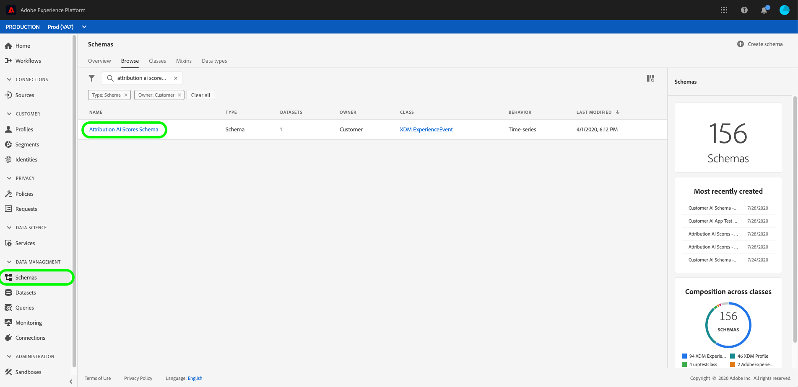

# [!DNL Attribution AI]의 입력 및 출력

다음 문서에서는 [!DNL Attribution AI]에서 사용되는 다양한 입력 및 출력을 간략하게 설명합니다.

## [!DNL Attribution AI] 입력 데이터

기여도 AI는 다음 데이터 세트를 분석하여 알고리즘 점수를 계산합니다.

- [Analytics 소스 커넥터](../../sources/tutorials/ui/create/adobe-applications/analytics.md)를 사용하는 Adobe Analytics 데이터 세트
- Adobe Experience Platform 스키마의 일반 경험 이벤트 (EE) 데이터 세트
- CEE(소비자 경험 이벤트) 데이터 세트

이제 각 데이터 세트가 ECID와 같은 동일한 ID 유형(네임스페이스)을 공유하는 경우 **ID 맵**(필드)을 기반으로 서로 다른 소스에서 여러 데이터 세트를 추가할 수 있습니다. ID와 네임스페이스를 선택하면 결합되는 데이터의 볼륨을 나타내는 ID 열 완전성 지표가 나타납니다. 여러 데이터 세트를 추가하는 방법에 대한 자세한 내용은 [기여도 AI 사용 안내서](./user-guide.md#identity)를 참조하세요.

채널 정보가 항상 기본적으로 매핑되는 것은 아닙니다. 경우에 따라 mediaChannel (필드)이 비어 있으면 필드를 필수 열이므로 mediaChannel에 매핑할 때까지 &quot;계속&quot;할 수 없습니다. 채널은 데이터 세트에서 감지되면 기본적으로 mediaChannel에 매핑됩니다. **미디어 유형** 및 **미디어 작업**&#x200B;과 같은 다른 열은 여전히 선택 사항입니다.

채널 필드를 매핑한 후 전환 이벤트, 접점 이벤트를 선택하고, 개별 데이터 세트에서 특정 필드를 선택할 수 있는 &#39;이벤트 정의&#39; 단계로 진행합니다.

>[!IMPORTANT]
>
>Adobe Analytics 소스 커넥터는 데이터를 채우는 데 최대 4주가 걸릴 수 있습니다. 최근에 커넥터를 설정한 경우 데이터 세트에 기여도 AI에 필요한 최소 데이터 길이가 있는지 확인해야 합니다. [내역 데이터](#data-requirements) 섹션을 검토하여 정확한 알고리즘 점수를 계산하기에 충분한 데이터가 있는지 확인하십시오.

[!DNL Consumer Experience Event]&#x200B;(CEE) 스키마 설정에 대한 자세한 내용은 [Intelligent Services 데이터 준비](../data-preparation.md) 안내서를 참조하십시오. Adobe Analytics 데이터 매핑에 대한 자세한 내용은 [Analytics 필드 매핑](../../sources/connectors/adobe-applications/analytics.md) 설명서를 참조하십시오.

[!DNL Consumer Experience Event]&#x200B;(CEE) 스키마의 일부 열이 기여도 AI에 필수는 아닙니다.

스키마 또는 선택한 데이터 세트에서 아래에 권장되는 필드를 사용하여 터치 포인트를 구성할 수 있습니다.

| 권장 열 | 다음에 필요: |
| --- | --- |
| 기본 ID 필드 | 접점/전환 |
| 타임스탬프 | 접점/전환 |
| 채널.유형(_t) | 접점 |
| Channel.mediaAction | 접점 |
| Channel.mediaType | 접점 |
| Marketing.trackingCode | 접점 |
| Marketing.campaignname | 접점 |
| Marketing.campaigngroup | 접점 |
| Commerce | 전환 |

일반적으로 속성은 &quot;commerce&quot; 아래의 주문, 구매 및 체크아웃과 같은 전환 열에서 실행됩니다. 채널 및 마케팅 열은 기여도 AI에 대한 터치포인트를 정의하는 데 사용됩니다(예: `channel._type = 'https://ns.adobe.com/xdm/channel-types/email'`). 최적의 결과와 통찰력을 위해 가능한 한 많은 전환 및 터치포인트 열을 포함하는 것이 좋습니다. 또한 위의 열에만 국한되지 않습니다. 다른 권장 또는 사용자 지정 열을 전환 또는 터치포인트 정의로 포함할 수 있습니다.

터치포인트 구성과 관련된 채널 또는 캠페인 정보가 mixin 또는 pass through 필드 중 하나에 있는 한 EE(경험 이벤트) 데이터 세트에는 채널 및 마케팅 Mixin이 명시적으로 필요하지 않습니다.

>[!TIP]
>
>CEE 스키마에서 Adobe Analytics 데이터를 사용하는 경우 Analytics에 대한 터치포인트 정보는 일반적으로 `channel.typeAtSource`(예: `channel.typeAtSource = 'email'`)에 저장됩니다.

## 이전 데이터 {#data-requirements}

>[!IMPORTANT]
>
> 기여도 AI가 작동하는 데 필요한 최소 데이터 양은 다음과 같습니다.
> - 좋은 모델을 실행하려면 최소한 3개월(90일) 이상의 데이터를 제공해야 합니다.
> - 1000개 이상의 전환이 필요합니다.

Attribution AI는 모델 교육을 위한 입력으로 내역 데이터를 필요로 합니다. 필요한 데이터 지속 시간은 주로 두 가지 주요 요소인 훈련 기간과 룩백 기간에 의해 결정됩니다. 교육 기간이 더 짧은 입력은 최근 트렌드에 더 민감하게 반응하는 반면, 교육 기간이 더 긴 입력은 보다 안정적이고 정확한 모델을 생성하는 데 도움이 됩니다. 비즈니스 목표를 가장 잘 나타내는 과거 데이터로 목표를 모델링하는 것이 중요합니다.

[교육 창 구성](./user-guide.md#training-window)은(는) 발생 시간을 기준으로 모델 교육에 포함되도록 설정된 전환 이벤트를 필터링합니다. 현재 최소 교육 기간은 1 분기(90일)입니다. [전환 확인 기간](./user-guide.md#lookback-window)은(는) 이 전환 이벤트와 관련된 전환 이벤트 접점이 포함되기 전까지 며칠을 표시해야 하는지를 나타내는 시간대를 제공합니다. 이 두 개념은 함께 애플리케이션에 필요한 입력 데이터(일 단위로 측정)의 양을 결정합니다.

기본적으로 기여도 AI는 교육 기간을 가장 최근 2분기(6개월)로 정의하고 전환 확인 기간을 56일로 정의합니다. 즉, 지난 2분기 동안 발생한 정의된 전환 이벤트를 모두 고려하여 연결된 전환 이벤트 56일 전에 발생한 모든 터치포인트를 검색합니다.

**수식**:

필요한 최소 데이터 길이 = 교육 기간 + 전환 확인 기간

>[!TIP]
>
> 기본 구성을 사용하는 응용 프로그램에 필요한 최소 데이터 길이는 2분기(180일) + 56일 = 236일입니다.

예:

- 지난 90일(3개월) 내에 발생한 전환 이벤트를 기여하고, 전환 이벤트 전 4주 내에 발생한 모든 터치포인트를 추적하려는 경우 입력 데이터 기간은 지난 90일 + 28일(4주)에 걸쳐 지속되어야 합니다. 교육 기간은 90일이며 전환 확인 기간은 총 118일로 28일입니다.

## 기여도 AI 출력 데이터

기여도 AI는 다음을 출력합니다.

- [원시 세분화 점수](#raw-granular-scores)
- [집계된 점수](#aggregated-attribution-scores)

**출력 스키마 예:**

### 원시 세분화 점수 {#raw-granular-scores}

기여도 AI는 가능한 가장 세부적인 수준에서 속성 점수를 출력하므로 모든 점수 열에서 점수를 나누고 분류할 수 있습니다. UI에서 이러한 점수를 보려면 [원시 점수 경로 보기](#raw-score-path)에 대한 섹션을 읽어 보십시오. API를 사용하여 점수를 다운로드하려면 [Attribution AI에서 점수 다운로드](./download-scores.md) 문서를 방문하십시오.

>[!NOTE]
>
> 다음 중 하나가 참인 경우에만 점수 출력 데이터 세트의 입력 데이터 세트에서 원하는 보고 열을 볼 수 있습니다.
> - 보고 열은 접점 또는 전환 정의 구성의 일부로 구성 페이지에 포함됩니다.
> - 보고 열은 추가 점수 데이터 세트 열에 포함됩니다.

다음 표에서는 원시 스코어 예 출력의 스키마 필드에 대해 설명합니다.

| 열 이름(DataType) | Null 허용 | 설명 |
| --- | --- | --- |
| timestamp(DateTime) | False | 전환 이벤트 또는 관찰이 발생한 시간입니다.   **예:** 2020-06-09T00:01:51.000Z |
| identityMap (맵) | True | CEE XDM 포맷과 유사한 사용자의 identityMap. |
| eventType (String) | True | 해당 시계열 레코드에 대한 기본 이벤트 유형.   **예:** &quot;주문&quot;, &quot;구매&quot;, &quot;방문&quot; |
| eventMergeId (String) | True | 본질적으로 동일한 이벤트이거나 병합해야 하는 여러 [!DNL Experience Events]을(를) 상호 연관하거나 함께 병합하는 ID입니다. 이는 수집하기 전에 데이터 생성자에 의해 채워지도록 되어 있습니다.   **예:** 575525617716-0-edc2ed37-1aab-4750-a820-1c2b3844b8c4 |
| _id(문자열) | False | 시계열 이벤트에 대한 고유 식별자.   **예:** 4461-edc2ed37-1aab-4750-a820-1c2b3844b8c4 |
| _tenantId(개체) | False | 임차인 ID에 해당하는 최상위 개체 컨테이너입니다.   **예:** _atsdsnrmmsv2 |
| your_schema_name(객체) | False | 전환 이벤트와 관련된 모든 터치포인트 이벤트 및 해당 메타데이터가 있는 스코어 행.   **예:** 기여도 AI 점수 - 모델 이름__2020 |
| 세그먼테이션(문자열) | True | 모델이 만들어지는 지역 세분화와 같은 전환 세그먼트. 세그먼트가 없는 경우 세그먼트는 conversionName과 동일합니다.   **예:** ORDER_US |
| conversionName (String) | True | 설정 중에 구성된 전환의 이름입니다.   **예:** 주문, 리드, 방문 |
| conversion(객체) | False | 전환 메타데이터 열입니다. |
| dataSource (문자열) | True | 데이터 소스에 대한 전역 고유 식별자.   **예:** Adobe Analytics |
| eventSource (String) | True | 실제 이벤트가 발생한 소스.   **예:** Adobe.com |
| eventType (String) | True | 해당 시계열 레코드에 대한 기본 이벤트 유형.   **예:** 순서 |
| 지역(문자열) | True | 전환이 전달된 지리적 위치 `placeContext.geo.countryCode`입니다.   **예:** US |
| priceTotal(더블) | True | 전환  을(를) 통해 얻은 매출 **예:** 99.9 |
| product(String) | True | 제품 자체의 XDM 식별자.   **예:** RX 1080 ti |
| productType (String) | True | 이 제품 보기에 대해 사용자에게 표시되는 제품의 표시 이름입니다.   **예:**&#x200B;개 Gpu |
| 수량(정수) | True | 전환 중 구매한 수량입니다.   **예:** 1 1080 ti |
| receivedTimestamp(DateTime) | True | 전환의 타임스탬프를 수신했습니다.   **예:** 2020-06-09T00:01:51.000Z |
| skuId(문자열) | True | 공급업체가 정의한 제품에 대한 고유 식별자인 SKU(Stock Keeping Unit).   **예:** MJ-03-XS-Black |
| timestamp(DateTime) | True | 변환의 타임스탬프입니다.   **예:** 2020-06-09T00:01:51.000Z |
| passThrough(객체) | True | 모델을 구성하는 동안 사용자가 지정한 추가 점수 데이터 세트 열입니다. |
| commerce_order_purchaseCity (문자열) | True | 추가 점수 데이터 세트 열.   **예:** 도시: 산호세 |
| customerProfile(객체) | False | 모델 구축에 사용된 사용자의 ID 세부 정보. |
| id(객체) | False | `id` 및 `namespace` 등 모델을 만드는 데 사용되는 사용자의 세부 정보를 포함합니다. |
| id (문자열) | True | 쿠키 ID, Adobe Analytics ID(AAID) 또는 Experience Cloud ID(ECID, MCID 또는 방문자 ID라고도 함) 등과 같은 사용자의 ID입니다.   **예:** 17348762725408656344688320891369597404 |
| 네임스페이스(문자열) | True | 경로 및 모델 구축에 사용되는 ID 네임스페이스.   **예:** aaid |
| touchpointsDetail(오브젝트 배열) | True | 다음에서 순서가 지정된 전환으로 이어지는 접점 세부 정보 목록 | 터치포인트 발생 또는 타임스탬프. |
| touchpointName(문자열) | True | 설정 중에 구성된 터치포인트의 이름입니다.   **예:** PAID_SEARCH_CLICK |
| scores(객체) | True | 이 전환에 대한 터치포인트 기여도를 점수로 표시합니다. 이 개체에서 생성된 점수에 대한 자세한 내용은 [집계된 속성 점수](#aggregated-attribution-scores) 섹션을 참조하십시오. |
| touchPoint(객체) | True | 접점 메타데이터. 이 개체에서 생성된 점수에 대한 자세한 내용은 [집계된 점수](#aggregated-scores) 섹션을 참조하십시오. |

### 원시 스코어 경로 보기(UI) {#raw-score-path}

UI에서 원시 점수에 대한 경로를 볼 수 있습니다. Experience Platform UI에서 **[!UICONTROL 스키마]**&#x200B;를 선택한 다음 **[!UICONTROL 찾아보기]** 탭에서 기여도 AI 스코어 스키마를 검색하고 선택합니다.

그런 다음 UI의 **[!UICONTROL 구조]** 창에서 필드를 선택하면 **[!UICONTROL 필드 속성]** 탭이 열립니다. **[!UICONTROL 필드 속성]** 내에는 원시 점수에 매핑되는 경로 필드가 있습니다.

### 집계된 속성 점수 {#aggregated-attribution-scores}

날짜 범위가 30일 미만인 경우 집계된 점수를 Experience Platform UI에서 CSV 형식으로 다운로드할 수 있습니다.

기여도 AI는 알고리즘 및 규칙 기반 점수라는 두 가지 범주의 기여도 점수를 지원합니다.

기여도 AI는 증분 및 영향을 받는 두 가지 유형의 알고리즘 점수를 생성합니다. 영향을 받는 점수는 각 마케팅 접점이 담당하는 전환의 비율입니다. 증분 점수는 마케팅 접점에 의해 직접 발생한 한계 영향의 양입니다. 증분 점수와 영향을 받은 점수 간의 주요 차이점은 증분 점수가 기준선 효과를 고려한다는 것입니다. 전환이 순전히 이전 마케팅 접점에 의해 발생한다고 가정하지 않습니다.

다음은 Adobe Experience Platform UI의 Attribution AI 스키마 출력 예제를 간략하게 살펴보겠습니다.

이러한 각 속성 점수에 대한 자세한 내용은 아래 표를 참조하십시오.

| 속성 점수 | 설명 |
| ----- | ----------- |
| 영향을 받음(알고리즘) | 영향을 받는 점수는 각 마케팅 접점이 담당하는 전환의 비율입니다. |
| 증분(알고리즘) | 증분 점수는 마케팅 접점에 의해 직접 발생한 한계 영향의 양입니다. |
| 첫 번째 터치 | 전환 경로의 초기 접점에 모든 크레딧을 할당하는 규칙 기반 속성 점수입니다. |
| 마지막 터치 | 전환에 가장 가까운 접점에 모든 크레딧을 할당하는 규칙 기반 속성 점수. |
| 선형 | 전환 경로의 각 접점에 동일한 크레딧을 할당하는 규칙 기반 속성 점수. |
| U자형 | 첫 번째 접점에 크레딧의 40%를 할당하고 마지막 접점에 크레딧의 40%를 할당하며 나머지 접점은 나머지 20%를 균등하게 분할하는 규칙 기반 속성 점수입니다. |
| 시간 감소 | 전환에 더 가까운 접점이 전환에서 시간상 더 먼 접점보다 더 많은 크레딧을 받는 규칙 기반 속성 점수. |

**원시 점수 참조(속성 점수)**

아래 표는 속성 점수를 원시 점수에 매핑합니다. 원시 점수를 다운로드하려면 [Attribution AI에서 점수 다운로드](./download-scores.md) 설명서를 참조하십시오.

| 속성 점수 | 원시 스코어 참조 열 |
| --- | --- |
| 영향을 받음(알고리즘) | _tenantID.your_schema_name.element.touchpoint.algorithmicImpacted |
| 증분(알고리즘) | _tenantID.your_schema_name.touchpointsDetail.element.touchpoint.algorithmicImpacted |
| 첫 번째 터치 | _tenantID.your_schema_name.touchpointsDetail.element.touchpoint.firstTouch |
| 마지막 터치 | _tenantID.your_schema_name.touchpointsDetail.element.touchpoint.lastTouch |
| 선형 | _tenantID.your_schema_name.touchpointsDetail.element.touchpoint.linear |
| U자형 | _tenantID.your_schema_name.touchpointsDetail.element.touchpoint.uShape |
| 시간 감소 | _tenantID.your_schema_name.touchpointsDetail.element.touchpoint.decayUnits |

### 집계된 점수 {#aggregated-scores}

날짜 범위가 30일 미만인 경우 집계된 점수를 Experience Platform UI에서 CSV 형식으로 다운로드할 수 있습니다. 이러한 각 집계 열에 대한 자세한 내용은 아래 표를 참조하십시오.

| 열 이름 | 제한 | Null 허용 | 설명 |
| --- | --- | --- | --- |
| customerevents_date(DateTime) | 사용자 정의 및 고정 형식 | False | 고객 이벤트 날짜(YYYY-MM-DD 형식).   **예**: 2016-05-02 |
| mediatouchpoints_date(DateTime) | 사용자 정의 및 고정 형식 | True | YYYY-MM-DD 형식의 미디어 접점 날짜   **예**: 2017-04-21 |
| 세그먼트(문자열) | 계산됨 | False | 모델이 만들어지는 지역 세분화와 같은 전환 세그먼트. 세그먼트가 없는 경우 세그먼트는 conversion_scope와 같습니다.   **예**: ORDER_AMER |
| conversion_scope (String) | 사용자 정의 | False | 사용자가 구성한 변환의 이름입니다.   **예**: 순서 |
| touchpoint_scope (문자열) | 사용자 정의 | True |   사용자가 구성한 터치포인트의 이름 **예**: PAID_SEARCH_CLICK |
| product(String) | 사용자 정의 | True | 제품의 XDM 식별자.   **예**: 참조 |
| product_type (String) | 사용자 정의 | True | 이 제품 보기에 대해 사용자에게 표시되는 제품의 표시 이름입니다.   **예**: gpu, 노트북 |
| 지역(문자열) | 사용자 정의 | True | 전환이 전달된 지리적 위치(placeContext.geo.countryCode)   **예**: US |
| event_type (String) | 사용자 정의 | True | 이 시계열 레코드  에 대한 기본 이벤트 유형 **예**: 유료 전환 |
| media_type (String) | 열거형 | False | 미디어 유형이 유료, 소유 또는 소득인지 설명합니다.   **예**: 유료, 소유 |
| channel (String) | 열거형 | False | [!DNL Consumer Experience Event] XDM에서 유사한 속성을 가진 채널을 대략적으로 분류하는 데 사용되는 `channel._type` 속성입니다.   **예**: 검색 |
| action (String) | 열거형 | False | `mediaAction` 속성은 경험 이벤트 미디어 작업의 유형을 제공하는 데 사용됩니다.   **예**: 클릭 |
| campaign_group (문자열) | 사용자 정의 | True | 여러 캠페인이 &#39;50%_DISCOUNT&#39;처럼 함께 그룹화된 캠페인 그룹의 이름입니다.   **예**: 상업용 |
| campaign_name(문자열) | 사용자 정의 | True | &#39;50%_DISCOUNT_USA&#39; 또는 &#39;50%_DISCOUNT_ASIA&#39; 등 마케팅 캠페인을 식별하는 데 사용되는 캠페인 이름.   **예**: 추수감사절 할인 |

**원시 점수 참조(집계됨)**

아래 표는 집계된 점수를 원시 점수에 매핑합니다. 원시 점수를 다운로드하려면 [Attribution AI에서 점수 다운로드](./download-scores.md) 설명서를 참조하십시오. UI 내에서 원시 점수 경로를 보려면 이 문서의 [원시 점수 경로 보기](#raw-score-path) 섹션을 방문하십시오.

| 열 이름 | 원시 스코어 참조 열 |
| --- | --- |
| customerevents_date | 타임스탬프 |
| mediatouchpoints_date | _tenantID.your_schema_name.touchpointsDetail.element.touchpoint.timestamp |
| 세그먼트 | _tenantID.your_schema_name.segmentation |
| conversion_scope | _tenantID.your_schema_name.conversion.conversionName |
| touchpoint_scope | _tenantID.your_schema_name.touchpointsDetail.element.touchpointName |
| 제품 | _tenantID.your_schema_name.conversion.product |
| product_type | _tenantID.your_schema_name.conversion.product_type |
| 지역 | _tenantID.your_schema_name.conversion.geo |
| event_type | eventType |
| media_type | _tenantID.your_schema_name.touchpointsDetail.element.touchpoint.mediaType |
| channel | _tenantID.your_schema_name.touchpointsDetail.element.touchpoint.mediaChannel |
| 작업 | _tenantID.your_schema_name.touchpointsDetail.element.touchpoint.mediaAction |
| campaign_group | _tenantID.your_schema_name.touchpointsDetail.element.touchpoint.campaignGroup |
| campaign_name | _tenantID.your_schema_name.touchpointsDetail.element.touchpoint.campaignName |

>[!IMPORTANT]
>
> - 기여도 AI는 추가 교육 및 채점을 위해 업데이트된 데이터만 사용합니다. 마찬가지로 데이터 삭제를 요청하면 Customer AI는 삭제된 데이터를 사용하지 않습니다.
> - 기여도 AI는 Experience Platform 데이터 세트를 활용합니다. 브랜드가 수신할 수 있는 소비자 권한 요청을 지원하기 위해 브랜드는 Experience Platform Privacy Service을 사용하여 액세스 및 삭제에 대한 소비자 요청을 제출하고 데이터 레이크, ID 서비스 및 실시간 고객 프로필에서 데이터를 제거해야 합니다.
> - 모델의 입력/출력에 사용하는 모든 데이터 세트는 Experience Platform 지침을 따릅니다. Experience Platform 데이터 암호화는 사용되지 않는 데이터 및 전송 중인 데이터에 적용됩니다. [데이터 암호화](../../../help/landing/governance-privacy-security/encryption.md)에 대한 자세한 내용은 설명서를 참조하세요.

## 다음 단계 {#next-steps}

데이터를 준비하고 모든 자격 증명 및 스키마를 준비한 후에는 [Attribution AI 사용 안내서](./user-guide.md)를 따라 시작합니다. 이 안내서에서는 Attribution AI의 인스턴스를 만드는 방법을 안내합니다.
