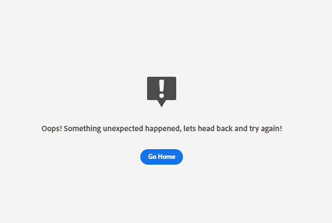

# Attribution AI 오류 문제 해결

이 문서에서는 Attribution AI에 대해 자주 묻는 질문에 대한 답변을 제공합니다.

## Chrome 시크릿에서 Attribution AI에 액세스할 수 없음

Google Chrome의 시크릿 모드 보안 설정의 업데이트로 인해 Google Chrome의 시크릿 모드에서 로드 오류가 발생합니다. experience.adobe.com 을 신뢰할 수 있는 도메인으로 만들기 위해 Chrome에서 문제가 활발히 진행되고 있습니다.

 

### 권장 수정 사항

이 문제를 해결하려면 experience.adobe.com 을 항상 쿠키를 사용할 수 있는 사이트로 추가해야 합니다. 다음으로 이동하여 시작 **chrome://settings/cookies**. 다음으로 아래로 스크롤하여 **사용자 지정된 비헤이비어** 섹션 뒤에 다음을 선택합니다. **추가** &quot;항상 쿠키를 사용할 수 있는 사이트&quot; 옆에 있는 버튼입니다. 표시되는 팝오버에서 을 복사하여 붙여넣습니다 `[*.]experience.adobe.com` 그런 다음 **서드파티 쿠키 포함** 이 사이트 확인란에서 참조할 수 있습니다. 완료되면 다음을 선택합니다. **추가** 시크릿으로 Attribution AI을 다시 로드합니다.

