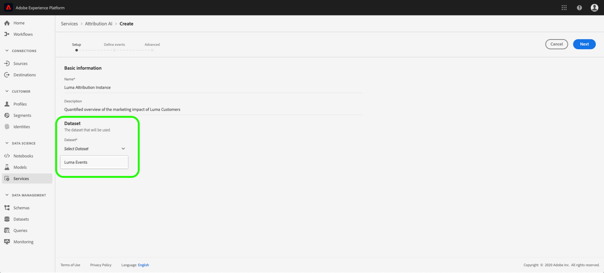
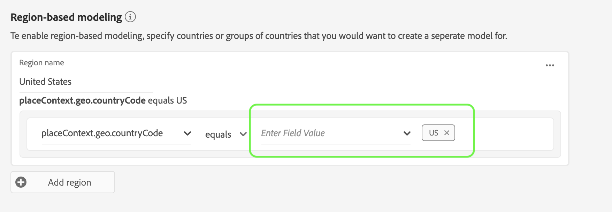

# 기여도 AI 사용 안내서

Intelligent Services의 일부인 기여도 분석 AI는 지정된 결과에 대한 고객 인터랙션의 영향력과 점진적인 영향을 계산하는 멀티채널 알고리즘 방식의 기여도 분석 서비스입니다. 기여도 분석 AI를 사용하면 마케터는 고객 여정의 각 단계에서 개별 고객과의 인터랙션이 미치는 영향을 파악하여 마케팅 및 광고 지출을 측정하고 최적화할 수 있습니다.

이 문서는 Intelligent Services 사용자 인터페이스에서 Attribution AI와 상호 작용하기 위한 가이드 역할을 합니다.

## 인스턴스 만들기

Adobe Experience Platform UI의 왼쪽 **탐색** 영역에서 서비스를 클릭합니다. 서비스 *브라우저가* 나타나고 사용 가능한 Adobe 지능형 서비스가 표시됩니다. 속성 AI의 컨테이너에서 열기를 **클릭합니다**.

속성 AI 서비스 페이지가 나타납니다. 이 페이지에는 Attribution AI의 서비스 인스턴스가 나열되며 인스턴스 이름, 전환 이벤트, 인스턴스 실행 빈도, 마지막 업데이트 상태 등 이러한 인스턴스에 대한 정보가 표시됩니다. 시작하려면 **인스턴스** 만들기를 클릭합니다.

다음으로, 기본 정보를 제공하고 인스턴스에 대한 데이터 세트를 지정할 수 있는 속성 AI의 설정 페이지가 나타납니다.

### 인스턴스 이름 지정

기본 *정보에서*&#x200B;서비스 인스턴스에 대한 이름과 선택적 설명을 제공합니다.

### 데이터 세트 선택

기본 정보를 입력한 후 데이터 세트 **선택 드롭다운을** 클릭하여 데이터 세트를 선택합니다. 데이터 집합은 모델을 교육하고 생성된 후속 데이터에 점수를 부여하는 데 사용됩니다. 드롭다운 선택기에서 데이터 세트를 선택하면 속성 AI와 호환되고 경험 데이터 모델(XDM 파섹) 스키마를 준수하는 것만 나열됩니다. 데이터 세트를 선택한 후 **오른쪽** 상단 모서리의 [다음]을 클릭하여 이벤트 정의 페이지로 이동합니다.

## 이벤트 정의

이벤트를 정의하는 데 사용되는 입력 데이터 유형에는 세 가지가 있습니다.

- **전환 이벤트:** 전자 상거래 주문, 매장 내 구매 및 웹 사이트 방문과 같은 마케팅 활동의 영향을 식별하는 비즈니스 목표
- **조회 창:** 전환 이벤트 터치포인트를 포함할 일 수를 나타내는 기간을 제공합니다.
- **터치포인트:** 전환의 숫자 또는 매출 기반 영향을 평가하는 데 사용되는 수신자, 개인 및 쿠키 수준 마케팅 이벤트.

### 전환 이벤트 정의

전환 이벤트를 정의하려면 [필드 이름 입력] 드롭다운 메뉴를 클릭하여 이벤트에 이름을 지정하고 이벤트 유형을 **선택해야** 합니다.

이벤트를 선택하면 새 드롭다운이 오른쪽에 나타납니다. 두 번째 드롭다운은 작업 사용을 통해 이벤트에 추가적인 컨텍스트를 제공하는 데 사용됩니다. 이 전환 이벤트의 경우 기본 작업이 *존재합니다* .

>[!NOTE] 이벤트를 정의할 때 *전환 이름* 아래의 문자열이 업데이트됩니다.

이벤트 *추가* 및 *그룹* 추가 단추를 사용하여 변환을 추가로 정의합니다. 정의하는 변환에 따라 추가 컨텍스트를 제공하려면 이벤트 *추가 및 그룹**추가* 단추를 사용해야 할 수 있습니다.

이벤트 **추가를 클릭하면** 위에 설명된 것과 동일한 방법으로 입력할 수 있는 추가 필드가 만들어집니다. 이렇게 하면 *전환 이름* 아래의 문자열 정의에 AND *문이 추가됩니다*. x **를** 클릭하여 추가된 이벤트를 제거합니다.

그룹 **추가를** 클릭하면 원본과 별도로 추가 필드를 만들 수 있는 옵션이 제공됩니다. 그룹이 추가되면 파란색 및 *단추가* 표시됩니다. And **를** 클릭하면 매개 변수를 &quot;Or&quot;로 변경할 수 있는 옵션이 제공됩니다. &quot;Or&quot;는 여러 개의 성공적인 전환 경로를 정의하는 데 사용됩니다. &quot;And&quot;는 추가 조건을 포함하도록 전환 경로를 확장합니다.

두 개 이상의 전환이 필요한 경우 전환 **추가를** 클릭하여 새 전환 카드를 만듭니다. 위의 프로세스를 반복하여 여러 전환을 정의할 수 있습니다.

### 룩백 창 정의

전환 정의를 완료한 후에는 조회 창을 확인해야 합니다. 화살표 키를 사용하거나 기본값(56)을 클릭하여 터치포인트를 포함할 전환 이벤트 이전 일 수를 지정합니다. 터치포인트는 다음 단계에서 정의됩니다.

### 터치포인트 정의

터치포인트를 정의하면 전환 [정의 워크플로우가](#define-conversion-events)비슷합니다. 처음에는 터치포인트의 이름을 지정하고 필드 이름 입력 *드롭다운 메뉴에서 터치포인트 값을* 선택해야 합니다. 선택하면 연산자 드롭다운이 기본값 &quot;exists&quot;와 함께 나타납니다. 드롭다운을 클릭하여 연산자 목록을 표시합니다.

이 터치포인트의 경우 **등호를**&#x200B;선택합니다.

터치포인트의 연산자를 선택하면 필드 값 *입력을* 사용할 수 있습니다. 필드 값 입력에 대한 *드롭다운 값은* 이전에 선택한 연산자 및 터치포인트 값을 기반으로 채워집니다. 드롭다운에 값이 채워지지 않으면 해당 값을 수동으로 입력할 수 있습니다. 드롭다운을 클릭하고 **클릭을 선택합니다**.

>[!NOTE] &quot;exists&quot; 및 &quot;not exists&quot; 연산자에게는 필드 값이 연결되어 있지 않습니다.

이벤트 *추가* 및 *그룹* 추가 단추는 터치포인트를 추가로 정의하는 데 사용됩니다. 여러 접점을 둘러싸는 복잡한 특성 때문에 단일 접점에 대해 여러 이벤트와 그룹이 있는 것은 드문 일이 아닙니다.

클릭하면 **이벤트** 추가를 통해 추가 필드를 추가할 수 있습니다. x **를** 클릭하여 추가된 이벤트를 제거합니다.

그룹 **추가를** 클릭하면 원본과 별도로 추가 필드를 만들 수 있는 옵션이 제공됩니다. 그룹이 추가되면 파란색 및 *단추가* 표시됩니다. And **를** 클릭하여 매개 변수를 변경하면 새 매개 변수 &quot;Or&quot;가 여러 개의 성공적인 경로를 정의하는 데 사용됩니다. 이 특정 터치포인트에는 하나의 성공적인 경로만 있으므로 &quot;Or&quot;가 필요하지 않습니다.

>[!NOTE] 터치포인트 이름 아래의 *문자열을* 사용하여 터치포인트에 대한 빠른 개요를 봅니다. 이 문자열은 터치포인트의 이름과 일치합니다.

터치포인트 추가를 클릭하고 **위의** 프로세스를 반복하여 터치포인트를 추가할 수 있습니다.

필요한 모든 터치포인트 정의가 완료되면 위로 스크롤하여 오른쪽 **위** 모서리에서 다음을 클릭하여 마지막 단계로 진행합니다.

## 고급 트레이닝 및 점수 설정

기여도 AI의 마지막 페이지는 *교육* 및 점수 설정에 사용되는 고급 페이지입니다.

### 교육 일정

일정을 *사용하여*&#x200B;점수를 매길 요일과 시간을 선택할 수 있습니다.

점수 지정 빈도 아래의 드롭다운을 *클릭하여* 일별, 주별 및 월별 점수 중에서 선택합니다. 다음으로, 점수를 매길 요일을 선택합니다. 여러 날을 선택할 수 있습니다. 날짜를 두 번째 클릭하여 선택 취소합니다.

채점 작업을 수행할 시간을 변경하려면 시계 아이콘을 클릭합니다. 표시되는 새 오버레이에서 채점할 시간을 입력합니다. 오버레이 외부를 클릭하여 닫습니다.

>[!NOTE] 각 점수 지정 프로세스를 완료하는 데 최대 24시간이 소요될 수 있습니다.

### 지역 기반 모델링(선택 사항)

고객의 행동은 국가와 지역에 따라 크게 다를 수 있습니다. 글로벌 기업의 경우 국가 기반 또는 지역 기반 모델을 사용하면 기여도 분석 정확도를 높일 수 있습니다. 추가된 각 영역은 해당 지역의 데이터를 사용하여 새 모델을 생성합니다.

새 영역을 정의하려면 영역 추가를 클릭하여 **시작합니다**. 표시되는 컨테이너에서 영역 이름을 입력합니다. 필드 이름 입력 드롭다운에서 하나의 값(&quot;placeContext.geo.countryCode&quot;) *만* 채워집니다. 이 값을 선택합니다.

그런 다음 연산자를 선택합니다.

마지막으로, 필드 값 입력 *드롭다운에서 국가 코드를* 입력합니다.

>[!NOTE] 국가 번호는 2자입니다. 전체 목록은 ISO 3166- [1 alpha-2에서](https://datahub.io/core/country-list)찾을 수 있습니다.

### 교육 창

가장 정확한 모델을 얻으려면 비즈니스를 나타내는 내역 데이터로 모델을 교육하는 것이 중요합니다. 기본적으로 모델은 2분기(6개월)의 데이터를 사용하여 교육됩니다. 드롭다운을 선택하여 기본값을 변경합니다. 1~4분기(3-12개월)의 데이터를 사용하여 트레이닝을 수행할 수 있습니다.

>[!NOTE] 트레이닝 기간이 짧을수록 최근 트렌드에 더 민감할 수 있는 반면, 트레이닝 기간이 길수록 모델이 견고해지고 최신 트렌드에 덜 민감합니다.

교육 창을 선택한 후 오른쪽 **위** 모서리에서 마침을 클릭합니다. 데이터를 처리하는 데 약간의 시간이 소요됩니다. 완료되면 인스턴스 설정이 완료되었음을 확인하는 팝업 대화 상자가 나타납니다. 서비스 **인스턴스를 볼** 수 있는 *서비스 인스턴스* 페이지로 리디렉션하려면 확인을 클릭합니다.

## 다음 단계

이 자습서를 따라 Attribution AI에서 서비스 인스턴스를 만들었습니다. 인스턴스 점수가 완료되면(최대 24시간 허용) Attribution AI 통찰력을 찾을 수 있습니다. 또한 점수 지정 결과를 다운로드하려면 원시 점수 [다운로드](./download-scores.md) 설명서를 참조하십시오.