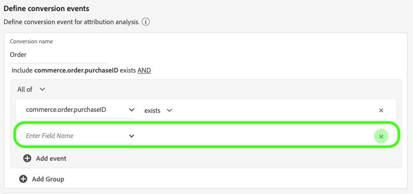
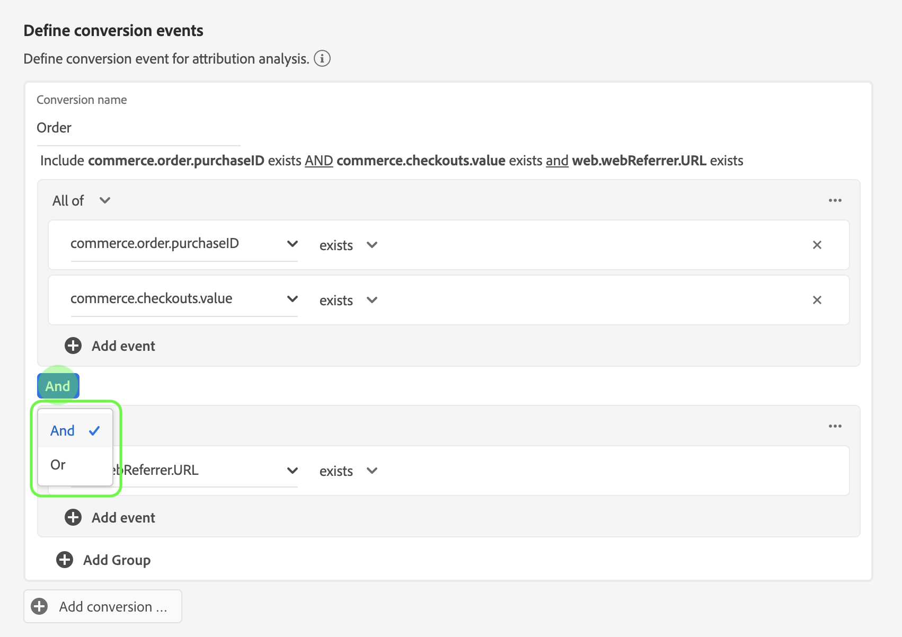

# Attribution AI UI 가이드

Attribution AI은 지능형 서비스의 일부로 고객 상호 작용에 대한 영향과 증분 영향을 지정된 결과에 따라 계산하는 다중 채널 알고리즘 속성 서비스입니다. 마케터는 Attribution AI를 통해 고객 여정의 각 단계에서 개별 고객과의 인터랙션이 미치는 영향을 파악하여 마케팅 및 광고 비용을 측정하고 최적화할 수 있습니다.

이 문서는 Intelligent Services 사용자 인터페이스에서 Attribution AI과 상호 작용하기 위한 가이드 역할을 합니다.

## 인스턴스 만들기

[!DNL Adobe Experience Platform] UI의 왼쪽 탐색 영역에서 **[!UICONTROL Services]**&#x200B;을 클릭합니다. **[!UICONTROL Services]** 브라우저가 나타나고 사용 가능한 Adobe 지능형 서비스가 표시됩니다. Attribution AI 컨테이너에서 **[!UICONTROL Open]**&#x200B;을 클릭합니다.

Attribution AI 서비스 페이지가 나타납니다. 이 페이지에는 Attribution AI의 서비스 인스턴스가 나열되며 인스턴스 이름, 전환 이벤트, 인스턴스 실행 횟수, 마지막 업데이트 상태 등에 대한 정보가 표시됩니다.

**[!UICONTROL Create instance]** 컨테이너의 오른쪽 하단에 있는 **[!UICONTROL Total conversion events scored]** 지표를 찾을 수 있습니다. 이 지표는 모든 샌드박스 환경 및 삭제된 서비스 인스턴스를 포함하여 현재 달력 연도에 대해 Attribution AI이 획득한 총 전환 이벤트 수를 추적합니다.

서비스 인스턴스는 UI 오른쪽의 컨트롤을 사용하여 편집, 복제 및 삭제할 수 있습니다. 이러한 컨트롤을 표시하려면 기존 **[!UICONTROL Service instances]**&#x200B;에서 인스턴스를 선택합니다. 컨트롤에는 다음 정보가 포함되어 있습니다.

- **[!UICONTROL Edit]**:을  **[!UICONTROL Edit]** 선택하면 기존 서비스 인스턴스를 수정할 수 있습니다. 인스턴스의 이름, 설명, 상태 및 점수 지정 빈도를 편집할 수 있습니다.
- **[!UICONTROL Clone]**:을  **[!UICONTROL Clone]** 선택하면 선택한 서비스 인스턴스가 복사됩니다. 그런 다음 워크플로우를 수정하여 일부를 수정하고 새 인스턴스로 이름을 변경할 수 있습니다.
- **[!UICONTROL Delete]**:모든 내역 실행을 포함하는 서비스 인스턴스를 삭제할 수 있습니다.
- **[!UICONTROL Data source]**:이 인스턴스에서 사용하는 데이터 세트에 대한 링크입니다.
- **[!UICONTROL Last run details]**:이것은 실행이 실패할 때만 표시됩니다. 여기에 오류 코드와 같이 실행이 실패한 이유에 대한 정보가 표시됩니다.

- **[!UICONTROL Conversion events]**:이 인스턴스에 대해 구성된 전환 이벤트에 대한 빠른 개요.
- **[!UICONTROL Lookback window]**:전환 이벤트 터치포인트를 포함하기 전 일 수를 나타내는 정의된 기간
- **[!UICONTROL Touchpoints]**:이 인스턴스를 만드는 동안 정의한 모든 터치포인트 목록입니다.

시작하려면 **[!UICONTROL Create instance]**&#x200B;을 선택합니다.

그런 다음 기본 정보를 제공하고 인스턴스에 대한 데이터 세트를 지정할 수 있는 Attribution AI 설정 페이지가 나타납니다.

### 인스턴스 이름 지정

**[!UICONTROL Basic information]** 아래에서 서비스 인스턴스에 대한 이름과 선택적 설명을 입력합니다.

### 데이터 세트 선택

기본 정보를 입력한 후 **데이터 집합 선택** 드롭다운을 클릭하여 데이터 집합을 선택합니다. 데이터 집합은 모델을 교육하는 데 사용되고 이후에 생성되는 데이터에 점수를 매깁니다. 드롭다운 선택기에서 데이터 세트를 선택하면 Attribution AI과 호환되고 XDM(Experience Data Model) 스키마를 준수하는 데이터만 나열됩니다. 데이터 세트를 선택한 후 오른쪽 위 모서리의 **다음**&#x200B;을 클릭하여 이벤트 정의 페이지로 이동합니다.

>[!TIP]
>
>Adobe Analytics 데이터 세트는 Analytics 소스 커넥터를 통해 지원됩니다.

## 이벤트 정의

이벤트를 정의하는 데 사용되는 입력 데이터 유형은 다음과 같이 세 가지가 있습니다.

- **전환 이벤트:** 전자 상거래 주문, 매장 내 구매 및 웹 사이트 방문과 같은 마케팅 활동의 영향을 식별하는 비즈니스 목표
- **전환 이벤트** 터치포인트를 포함시켜야 하는 일 수를 나타내는 시간대를 제공합니다.
- **터치포인트: 전환의** 숫자 또는 매출 기반 영향을 평가하는 데 사용되는 수신자, 개인 또는 쿠키 수준 마케팅 이벤트.

### 전환 이벤트 정의 {#define-conversion-events}

전환 이벤트를 정의하려면 **필드 이름 입력** 드롭다운 메뉴를 클릭하여 이벤트에 이름을 지정하고 이벤트 유형을 선택해야 합니다.

이벤트를 선택하면 새 드롭다운이 오른쪽에 나타납니다. 두 번째 드롭다운은 작업 사용을 통해 이벤트에 추가적인 컨텍스트를 제공하는 데 사용됩니다. 이 전환 이벤트의 경우 기본 작업 *exists*&#x200B;이(가) 사용됩니다.

>[!NOTE]
>
>이벤트를 정의할 때 *전환 이름* 아래의 문자열이 업데이트됩니다.

**[!UICONTROL Add event]** 및 **[!UICONTROL Add Group]** 단추는 변환을 추가로 정의하는 데 사용됩니다. 정의하는 변환에 따라 추가 컨텍스트를 제공하기 위해 **[!UICONTROL Add event]** 및 **[!UICONTROL Add group]** 단추를 사용해야 할 수 있습니다.

**[!UICONTROL Add event]**&#x200B;을 클릭하면 위에 설명한 것과 동일한 방법으로 입력할 수 있는 추가 필드가 만들어집니다. 이렇게 하면 변환 이름 아래의 문자열 정의에 AND 문이 추가됩니다. 추가된 이벤트를 제거하려면 **x**&#x200B;을 클릭합니다.

**[!UICONTROL Add Group]**&#x200B;을(를) 클릭하면 원본과 별도로 추가 필드를 만드는 옵션이 제공됩니다. 그룹이 추가되면 파란색 *And* 단추가 나타납니다. **And**&#x200B;을 클릭하면 매개 변수를 &quot;Or&quot;로 변경하는 옵션이 제공됩니다. &quot;Or&quot;는 여러 개의 성공적인 전환 경로를 정의하는 데 사용됩니다. &quot;And&quot;는 추가 조건을 포함하도록 전환 경로를 확장합니다.

두 개 이상의 전환이 필요한 경우 **전환 추가**&#x200B;를 클릭하여 새 전환 카드를 만듭니다. 위의 프로세스를 반복하여 전환을 여러 개 정의할 수 있습니다.

### 전환 확인 창 정의 {#lookback-window}

전환 정의를 완료한 후 조회 창을 확인해야 합니다. 화살표 키를 사용하거나 기본값(56)을 클릭하여 터치포인트를 포함할 전환 이벤트 이전 일 수를 지정합니다. 터치포인트는 다음 단계에서 정의됩니다.

### 터치포인트 정의

터치포인트를 정의하면 [전환 정의 워크플로우와 비슷한 작업 과정이 따릅니다](#define-conversion-events). 처음에는 터치포인트의 이름을 지정하고 *필드 이름 입력* 드롭다운 메뉴에서 터치포인트 값을 선택해야 합니다. 선택하면 연산자 드롭다운에 기본값 &quot;exists&quot;가 표시됩니다. 드롭다운을 클릭하여 연산자 목록을 표시합니다.

이 터치포인트의 목적을 위해 **같음**&#x200B;을 선택합니다.

터치포인트의 연산자를 선택하면 *필드 값 입력*&#x200B;을 사용할 수 있습니다. *필드 값 입력*&#x200B;에 대한 드롭다운 값이 이전에 선택한 연산자 및 터치포인트 값을 기반으로 채워집니다. 드롭다운에 값이 채워지지 않으면 해당 값을 수동으로 입력할 수 있습니다. 드롭다운을 클릭하고 **CLICK**&#x200B;을 선택합니다.

>[!NOTE]
>
>&quot;exists&quot; 및 &quot;not exists&quot; 연산자에게는 해당 연산자와 연결된 필드 값이 없습니다.

터치포인트를 추가로 정의하는 데 *이벤트 추가* 및 *그룹 추가* 단추가 사용됩니다. 터치포인트와 관련된 복잡한 특성 때문에 하나의 접점에 대해 여러 이벤트와 그룹이 있는 것은 드문 일이 아닙니다.

클릭하면 **이벤트 추가**&#x200B;에서 추가 필드를 추가할 수 있습니다. 추가된 이벤트를 제거하려면 **x**&#x200B;을 클릭합니다.

**그룹 추가**&#x200B;를 클릭하면 원본과 다른 추가 필드를 만들 수 있는 옵션이 제공됩니다. 그룹이 추가되면 파란색 *And* 단추가 나타납니다. **And**&#x200B;을 클릭하여 매개 변수를 변경합니다. 새 매개 변수 &quot;Or&quot;를 사용하여 여러 개의 성공적인 경로를 정의합니다. 이 특정 터치포인트는 하나의 성공 경로만 있으므로 &quot;Or&quot;이 필요하지 않습니다.

>[!NOTE]
>
>터치포인트에 대한 빠른 개요를 보려면 *터치포인트 이름* 아래의 문자열을 사용하십시오. 문자열은 터치포인트의 이름과 일치합니다.

**터치포인트 추가**&#x200B;를 클릭하고 위의 프로세스를 반복하여 터치포인트를 추가할 수 있습니다.

필요한 모든 터치포인트 정의가 완료되면 위로 스크롤하여 오른쪽 상단 모서리의 **다음**&#x200B;을 클릭하여 마지막 단계로 진행합니다.

## 고급 트레이닝 및 점수 설정

Attribution AI의 마지막 페이지는 교육 및 점수 설정에 사용되는 **[!UICONTROL Advanced]** 페이지입니다.

### 교육 일정

*일정*&#x200B;을 사용하여 점수를 매길 요일과 시간을 선택할 수 있습니다.

일별, 주별 및 월별 점수 중에서 선택하려면 *채점 주기* 아래의 드롭다운을 클릭합니다. 다음으로 점수를 매길 요일을 선택합니다. 여러 일을 선택할 수 있습니다. 날짜를 두 번째 클릭하여 선택 해제합니다.

점수를 매길 시간을 변경하려면 시계 아이콘을 클릭합니다. 표시되는 새 오버레이에서 채점할 시간을 입력합니다. 오버레이 외부를 클릭하여 닫습니다.

>[!NOTE]
>
>각 점수 지정 프로세스를 완료하는 데 최대 24시간이 걸릴 수 있습니다.

### 추가 점수 데이터 집합 열(선택 사항)

기본적으로 표준 스키마의 각 서비스 인스턴스에 대해 점수 데이터 세트가 만들어집니다. 전환 이벤트 및 터치포인트 구성을 기반으로 한 열을 점수 데이터 세트 출력에 추가할 수 있습니다. 먼저 입력 데이터 세트에서 열을 선택한 다음 마우스 왼쪽 단추를 햄버거 아이콘 위에 눌러 순서를 변경할 수 있습니다.

### 영역 기반 모델링(선택 사항) {#region-based-modeling-optional}

고객의 행동은 국가와 지역에 따라 크게 다를 수 있습니다. 글로벌 비즈니스의 경우 국가 기반 또는 지역 기반 모델을 사용하면 기여도 분석 정확도를 높일 수 있습니다. 추가된 각 영역은 해당 영역의 데이터로 새 모델을 만듭니다.

새 영역을 정의하려면 **[!UICONTROL Add region]**&#x200B;을 클릭하여 시작합니다. 나타나는 컨테이너에서 영역 이름을 입력합니다. **[!UICONTROL Enter Field Name]** 드롭다운에서 하나의 값(&quot;placeContext.geo.countryCode&quot;)만 채워집니다. 이 값을 선택합니다.

다음으로 연산자를 선택합니다.

마지막으로, **[!UICONTROL Enter Field Value]** 드롭다운에 국가 코드를 입력합니다.

>[!NOTE]
>
>국가 번호는 2자입니다. 전체 목록은 [ISO 3166-1 alpha-2](https://datahub.io/core/country-list)에서 찾을 수 있습니다.

### 교육 창 {#training-window}

가장 정확한 모델을 얻으려면 비즈니스를 나타내는 내역 데이터로 모델을 교육하는 것이 중요합니다. 기본적으로 이 모델은 전환 이벤트 데이터의 2분기(6개월)를 사용하여 훈련됩니다. 드롭다운을 선택하여 기본값을 변경합니다. 1~4분기(3-12개월)의 데이터를 사용하여 트레이닝을 선택할 수 있습니다.

>[!NOTE]
>
>교육 기간이 짧으면 최근 트렌드에 더 민감하지만, 훈련 기간이 길수록 모델이 견고해지고 최근 트렌드에 덜 민감합니다.

교육 창을 선택한 후 오른쪽 위 모서리에서 **[!UICONTROL Finish]**&#x200B;을 클릭합니다. 데이터를 처리하는 데 약간의 시간이 소요됩니다. 완료되면 인스턴스 설정이 완료되었음을 확인하는 팝업 대화 상자가 나타납니다. 서비스 인스턴스를 볼 수 있는 **[!UICONTROL Service instances]** 페이지로 리디렉션하려면 **[!UICONTROL Ok]**&#x200B;을 클릭합니다.

## 다음 단계

이 튜토리얼을 따라 Attribution AI에서 서비스 인스턴스를 만들었습니다. 인스턴스 점수가 완료된 후(최대 24시간 허용), [Attribution AI 인사이트 검색](./discover-insights.md)을(를) 수행할 준비가 되었습니다. 또한 점수 결과를 다운로드하려면 [다운로드 스코어](./download-scores.md) 설명서를 참조하십시오.

## 추가 리소스

다음 비디오에서는 Attribution AI에서 새 인스턴스를 만들기 위한 엔드 투 엔드 워크플로우에 대해 설명합니다.

>[!VIDEO](https://video.tv.adobe.com/v/32668?learn=on&quality=12)
