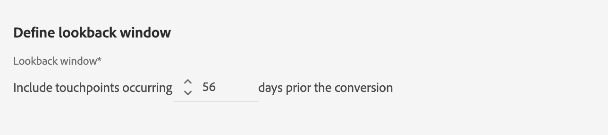

# Attribution AI UI 안내서

Attribution AI는 지능형 서비스의 일부이며 멀티 채널, 알고리즘 기반의 어트리뷰션 서비스로, 지정된 결과에 대한 고객 상호 작용의 영향과 점진적 효과를 계산합니다. 마케터는 Attribution AI를 통해 고객 여정의 각 단계에서 개별 고객과의 인터랙션이 미치는 영향을 파악하여 마케팅 및 광고 비용을 측정하고 최적화할 수 있습니다.

이 문서는 Intelligent Services 사용자 인터페이스에서 Attribution AI와 상호 작용하기 위한 안내서 역할을 합니다.

## 모델 만들기

[!DNL Adobe Experience Platform] UI의 왼쪽 탐색에서 **[!UICONTROL 서비스]**&#x200B;를 선택합니다. **[!UICONTROL 서비스]** 브라우저가 나타나고 사용 가능한 Adobe 지능형 서비스를 표시합니다. 기여도 AI의 컨테이너에서 **[!UICONTROL 열기]**&#x200B;를 선택합니다.

기여도 AI 서비스 페이지가 표시됩니다. 이 페이지에는 기여도 AI의 서비스 모델이 나열되며 모델 이름, 전환 이벤트, 모델 실행 빈도, 마지막 업데이트 상태 등 기여도 AI에 대한 정보가 표시됩니다.

**[!UICONTROL 모델 만들기]** 컨테이너의 오른쪽 하단에 있는 **[!UICONTROL 채점된 총 전환 이벤트]** 지표를 찾을 수 있습니다. 이 지표는 모든 샌드박스 환경 및 삭제된 서비스 모델을 포함하여 현재 달력 연도 동안 Attribution AI가 채점한 총 전환 이벤트 수를 추적합니다.

UI의 오른쪽에 있는 컨트롤을 사용하여 서비스 모델을 편집, 복제 및 삭제할 수 있습니다. 이러한 컨트롤을 표시하려면 기존 **[!UICONTROL 서비스 모델]**&#x200B;에서 모델을 선택하십시오. 컨트롤에는 다음 정보가 포함됩니다.

- **[!UICONTROL 편집]**: **[!UICONTROL 편집]**&#x200B;을 선택하면 기존 서비스 모델을 수정할 수 있습니다. 모델의 이름, 설명, 상태, 채점 빈도 및 추가 점수 데이터 세트 열을 편집할 수 있습니다.
- **[!UICONTROL 복제]**: **[!UICONTROL 복제]**&#x200B;을(를) 선택하면 선택한 서비스 모델이 복사됩니다. 그런 다음 워크플로우를 수정하여 약간 수정하고 새 모델로 이름을 바꿀 수 있습니다.
- **[!UICONTROL 삭제]**: 내역 실행을 포함하는 서비스 모델을 삭제할 수 있습니다. 해당 출력 데이터 세트가 Experience Platform에서 삭제됩니다. 단, 실시간 고객 프로필에 동기화된 점수는 삭제되지 않습니다.
- **[!UICONTROL 데이터 원본]**: 사용 중인 데이터 집합에 대한 링크입니다. 기여도 AI에서 두 개 이상의 데이터 세트를 사용 중인 경우 &quot;다중&quot; 다음에 데이터 세트 수가 표시됩니다. 하이퍼링크를 선택하면 데이터 세트 미리보기 팝오버가 표시됩니다.
- **[!UICONTROL 마지막 실행 세부 정보]**: 실행이 실패할 때만 표시됩니다. 오류 코드와 같이 실행이 실패한 이유에 대한 정보가 여기에 표시됩니다.

- **[!UICONTROL 전환 이벤트]**: 이 모델에 대해 구성된 전환 이벤트에 대한 빠른 개요입니다.
- **[!UICONTROL 전환 확인 기간]**: 전환 이벤트 접점이 포함되기 전 일수를 나타내도록 정의한 시간대입니다.
- **[!UICONTROL 접점]**: 이 모델을 만드는 동안 정의한 모든 접점의 목록입니다.

시작하려면 **[!UICONTROL 모델 만들기]**&#x200B;를 선택하십시오.

다음으로, 서비스 모델에 대한 이름과 선택적 설명을 제공할 수 있는 기여도 AI에 대한 설정 페이지가 표시됩니다.

## 데이터 선택 {#select-data}

<!-- https://www.adobe.com/go/aai-select-data -->

설계별로 기여도 AI는 Adobe Analytics, 경험 이벤트 및 소비자 경험 이벤트 데이터를 사용하여 기여도 점수를 계산할 수 있습니다. 데이터 세트를 선택하면 기여도 AI와 호환되는 데이터 세트만 나열됩니다. 데이터 세트를 선택하려면 데이터 세트 이름 옆의 (**+**) 기호를 선택하거나 확인란을 선택하여 여러 데이터 세트를 한 번에 추가합니다. 검색 옵션을 사용하여 관심 있는 데이터 세트를 빠르게 찾을 수도 있습니다.

사용할 데이터 세트를 선택한 후 **[!UICONTROL 추가]** 버튼을 선택하여 데이터 세트 미리 보기 창에 데이터 세트를 추가합니다.

데이터 집합 옆에 있는 정보 아이콘 을 선택하면 데이터 집합 미리 보기 팝오버가 열립니다.

데이터 세트 미리 보기에는 마지막 업데이트 시간, 소스 스키마 및 처음 10개 열의 미리 보기와 같은 데이터가 포함됩니다.

워크플로우를 따라 이동할 때 초안을 저장하려면 **[!UICONTROL 저장]**&#x200B;을 선택합니다. 초안 모델 구성을 저장하고 워크플로우의 다음 단계로 이동할 수도 있습니다. 모델 구성 중에 초안을 만들고 저장하려면 **[!UICONTROL 저장하고 계속]**&#x200B;을 사용하세요. 이 기능을 사용하면 모델 구성의 초안을 만들고 저장할 수 있으며, 구성 워크플로에서 많은 필드를 정의해야 하는 경우 특히 유용합니다.

### 데이터 세트 완성도 {#dataset-completeness}

<!-- https://www.adobe.com/go/aai-dataset-completeness -->

데이터 세트 미리 보기에는 데이터 세트 완전성 백분율 값이 있습니다. 이 값은 데이터 세트에 비어 있거나 null인 열 수에 대한 빠른 스냅숏을 제공합니다. 데이터 세트에 누락된 값이 많이 포함되어 있고 이러한 값이 다른 곳에서 캡처되는 경우 누락된 값이 포함된 데이터 세트를 포함하는 것이 좋습니다.

>[!NOTE]
>
>데이터 세트 완성도는 기여도 AI에 대한 최대 교육 기간(1년)을 사용하여 계산됩니다. 즉, 데이터 세트 완성도 값을 표시할 때 1년 이상 된 데이터는 고려되지 않습니다.

### ID 선택 {#identity}

이제 ID 맵(필드)을 기반으로 여러 데이터 세트를 서로 결합할 수 있습니다. ID 유형(&quot;ID 네임스페이스&quot;라고도 함)과 해당 네임스페이스 내의 ID 값을 선택해야 합니다. 동일한 네임스페이스에 있는 스키마 내에 ID로 두 개 이상의 필드를 할당한 경우 `EMAIL (personalEmail.address)` 또는 `EMAIL (workEmail.address)`과(와) 같이 네임스페이스가 앞에 있는 ID 드롭다운에 할당된 모든 ID 값이 표시됩니다.

>[!IMPORTANT]
>
>선택하는 모든 데이터 세트에 대해 동일한 ID 유형(네임스페이스)을 사용해야 합니다. 데이터 세트가 호환됨을 나타내는 녹색 확인 표시가 ID 열 내의 ID 유형 옆에 나타납니다. 예를 들어 Phone 네임스페이스와 `mobilePhone.number`을(를) 식별자로 사용하는 경우 나머지 데이터 세트에 대한 모든 식별자에는 Phone 네임스페이스가 포함되어 있고 사용해야 합니다.

ID를 선택하려면 ID 열에 있는 밑줄이 있는 값을 선택합니다. ID 선택 팝오버가 나타납니다.

네임스페이스 내에서 두 개 이상의 ID를 사용할 수 있는 경우 사용 사례에 맞는 올바른 ID 필드를 선택해야 합니다. 예를 들어 이메일 네임스페이스 내에서 두 개의 이메일 ID인 회사 및 개인 이메일을 사용할 수 있습니다. 사용 사례에 따라 개인 이메일은 작성될 가능성이 높고 개별 예측에 더 유용합니다. 즉, `EMAIL (personalEmail.address)`을(를) ID로 선택합니다.

>[!NOTE]
>
> 데이터 세트에 유효한 ID 유형(네임스페이스)이 없으면 기본 ID를 설정하고 [스키마 편집기](../../xdm/schema/composition.md#identity)를 사용하여 ID 네임스페이스에 지정해야 합니다. 네임스페이스 및 ID에 대한 자세한 내용은 [ID 서비스 네임스페이스](../../identity-service/features/namespaces.md) 설명서를 참조하십시오.

## 미디어 채널 및 캠페인 필드 매핑 {#aai-mapping}

<!-- https://www.adobe.com/go/aai-mapping -->

데이터 세트 선택 및 추가를 완료하면 **맵** 구성 단계가 나타납니다. 기여도 AI를 사용하려면 이전 단계에서 선택한 각 데이터 세트에 대해 미디어 채널 필드를 매핑해야 합니다. 데이터 세트 간 미디어 채널 매핑이 없으면 기여도 AI에서 파생된 인사이트가 제대로 표시되지 않아 인사이트 페이지를 해석하기 어려울 수 있기 때문입니다. 미디어 채널만 필요하지만 미디어 작업, 캠페인 이름, 캠페인 그룹 및 캠페인 태그와 같은 선택적 필드 일부를 매핑하는 것이 좋습니다. 이렇게 하면 기여도 AI가 더 명확한 통찰력과 최적의 결과를 제공할 수 있습니다.

## 이벤트 정의 {#define-events}

<!-- https://www.adobe.com/go/aai-define-events -->

이벤트를 정의하는 데 사용되는 입력 데이터에는 세 가지 유형이 있습니다.

- **전환 이벤트:** 전자 상거래 주문, 매장 내 구매 및 웹 사이트 방문과 같은 마케팅 활동의 영향을 식별하는 비즈니스 목표입니다.
- **전환 확인 기간:** 전환 이벤트 접점이 포함되기 전 일 수를 나타내는 기간을 제공합니다.
- **접점:** 전환의 숫자 또는 수익 기반 영향을 평가하는 데 사용되는 수신자, 개인 및/또는 쿠키 수준 마케팅 이벤트입니다.

### 전환 이벤트 정의 {#define-conversion-events}

전환 이벤트를 정의하려면 이벤트 이름을 지정하고 **데이터 세트 및 필드 선택** 드롭다운 메뉴에서 데이터 세트 및 필드를 선택하여 이벤트 유형을 선택해야 합니다.

이벤트를 선택하면 오른쪽에 새 드롭다운이 나타납니다. 두 번째 드롭다운은 작업을 사용하여 이벤트에 추가 컨텍스트를 제공하는 데 사용됩니다. 이 전환 이벤트의 경우 기본 작업 *exists*&#x200B;이(가) 사용됩니다.

>[!NOTE]
>
>이벤트를 정의할 때 *전환 이름* 아래의 문자열이 업데이트됩니다.

그런 다음 이전 단계에서 모든 입력 데이터 세트를 결합하여 생성된 결합된 데이터 세트를 선택할 수 있습니다. 또는 **데이터 집합 및 필드 선택** 드롭다운 메뉴에서 개별 데이터 집합을 기반으로 열을 선택할 수 있습니다.

**[!UICONTROL 이벤트 추가]** 및 **[!UICONTROL 그룹 추가]** 단추를 사용하여 전환을 추가로 정의합니다. 정의하는 변환에 따라 **[!UICONTROL 이벤트 추가]** 및 **[!UICONTROL 그룹 추가]** 단추를 사용하여 추가 컨텍스트를 제공해야 할 수 있습니다.

**[!UICONTROL 이벤트 추가]**&#x200B;를 선택하면 위에 설명된 것과 동일한 방법을 사용하여 채울 수 있는 추가 필드가 만들어집니다. 이렇게 하면 변환 이름 아래의 문자열 정의에 AND 문이 추가됩니다. 추가된 이벤트를 제거하려면 **x**&#x200B;을(를) 선택하십시오.

**[!UICONTROL 그룹 추가]**&#x200B;를 선택하면 원본과 별도로 추가 필드를 만들 수 있는 옵션이 제공됩니다. 그룹이 추가되면 파란색 *And* 단추가 나타납니다. **And**&#x200B;을(를) 선택하면 &quot;Or&quot;을 포함하도록 매개 변수를 변경할 수 있는 옵션이 제공됩니다. &quot;또는&quot;은 여러 개의 성공적인 전환 경로를 정의하는 데 사용됩니다. &quot;And&quot;는 추가 조건을 포함하도록 전환 경로를 확장합니다.

 사용

두 개 이상의 전환이 필요한 경우 **전환 추가**&#x200B;를 선택하여 새 전환 카드를 만드십시오. 위의 프로세스를 반복하여 여러 전환을 정의할 수 있습니다.

### 전환 확인 기간 정의 {#lookback-window}

전환 정의를 완료한 후 전환 확인 기간을 확인해야 합니다. 화살표 키를 사용하거나 기본값(56)을 선택하여 터치포인트를 포함하려는 전환 이벤트까지 남은 일 수를 지정합니다. 터치포인트는 다음 단계에서 정의됩니다.

### 접점 정의

접점 정의는 [전환 정의](#define-conversion-events)와 유사한 워크플로를 따릅니다. 처음에는 터치포인트의 이름을 지정하고 *필드 이름 입력* 드롭다운 메뉴에서 터치포인트 값을 선택해야 합니다. 선택하면 연산자 드롭다운에 기본값이 &quot;exists&quot; 로 표시됩니다. 드롭다운을 선택하여 연산자 목록을 표시합니다.

이 터치포인트용으로 **같음**&#x200B;을 선택하세요.

접점에 대한 연산자를 선택하면 *필드 값 입력*&#x200B;을 사용할 수 있습니다. *필드 값 입력*&#x200B;에 대한 드롭다운 값은 이전에 선택한 연산자 및 터치포인트 값을 기반으로 채워집니다. 드롭다운에 값이 채워지지 않으면 해당 값을 수동으로 입력할 수 있습니다. 드롭다운을 선택하고 **클릭**&#x200B;을 선택합니다.

>[!NOTE]
>
>&quot;존재함&quot; 및 &quot;존재하지 않음&quot; 연산자에 연결된 필드 값이 없습니다.

**이벤트 추가** 및 **그룹 추가** 단추를 사용하여 터치포인트를 추가로 정의합니다. 접점을 둘러싼 복합적인 특성상 하나의 접점에 대해 여러 이벤트와 그룹이 있는 경우가 드물지 않다.

선택한 경우 **이벤트 추가**&#x200B;를 통해 추가 필드를 추가할 수 있습니다. 추가된 이벤트를 제거하려면 **x**&#x200B;을(를) 선택하십시오.

**그룹 추가**&#x200B;를 선택하면 원본과 별도로 추가 필드를 만들 수 있는 옵션이 제공됩니다. 그룹이 추가되면 파란색 *And* 단추가 나타납니다. **및**&#x200B;을(를) 선택하여 매개 변수를 변경합니다. 새 매개 변수 &quot;Or&quot;은 성공한 여러 경로를 정의하는 데 사용됩니다. 이 특정 터치포인트에는 하나의 성공적인 경로만 있으므로 &quot;Or&quot;이 필요하지 않습니다.

>[!NOTE]
>
>터치포인트에 대한 빠른 개요를 보려면 *터치포인트 이름* 아래의 문자열을 사용하십시오. 이 문자열은 터치포인트의 이름과 일치합니다.

**터치포인트 추가**&#x200B;를 선택하고 위의 프로세스를 반복하여 터치포인트를 추가할 수 있습니다.

필요한 모든 터치포인트 정의를 마쳤으면 위로 스크롤하여 오른쪽 상단에서 **다음**&#x200B;을 선택하여 마지막 단계로 진행합니다.

## 고급 교육 및 채점 설정

Attribution AI의 마지막 페이지는 교육 및 채점을 설정하는 데 사용되는 **[!UICONTROL 고급]** 페이지입니다.

### 교육 예약

*일정*&#x200B;을 사용하여 채점을 수행할 요일과 시간을 선택할 수 있습니다.

*채점 빈도*&#x200B;에서 드롭다운을 선택하여 일별, 주별 및 월별 채점 중에서 선택합니다. 그런 다음 채점을 수행할 요일을 선택합니다. 여러 날을 선택할 수 있습니다. 같은 날을 다시 선택하면 선택이 취소됩니다.

채점을 수행할 시간을 변경하려면 시계 아이콘을 선택합니다. 표시되는 새 오버레이에 채점을 수행할 시간을 입력합니다. 오버레이 바깥쪽을 선택하여 닫습니다.

>[!NOTE]
>
>각 채점 프로세스가 완료되는 데 최대 24시간이 소요될 수 있습니다.

### 추가 점수 데이터 세트 열(선택 사항)

기본적으로 표준 스키마의 각 서비스 모델에 대해 점수 데이터 세트가 만들어집니다. 전환 이벤트 및 접점 구성에 따라 열을 채점 데이터 세트 출력에 추가하도록 선택할 수 있습니다. 먼저 입력 데이터 세트에서 열을 선택한 다음 햄버거 아이콘 위에 마우스 왼쪽 버튼을 누른 채 열을 끌어다 놓아 순서를 변경할 수 있습니다.

### 지역 기반 모델링(선택 사항) {#region-based-modeling-optional}

고객의 행동은 국가 및 지역에 따라 크게 다를 수 있습니다. 글로벌 기업의 경우 국가 기반 또는 지역 기반 모델을 사용하면 속성 정확도를 높일 수 있습니다. 추가된 각 영역은 해당 영역의 데이터로 새 모델을 생성합니다.

새 지역을 정의하려면 **[!UICONTROL 지역 추가]**&#x200B;를 선택하여 시작하십시오. 표시되는 컨테이너에서 영역의 이름을 입력합니다. **[!UICONTROL 필드 이름 입력]** 드롭다운에서 하나의 값(&quot;placeContext.geo.countryCode&quot;)만 채웁니다. 이 값을 선택합니다.

그런 다음 연산자를 선택합니다.

마지막으로 **[!UICONTROL 필드 값 입력]** 드롭다운에 국가 코드를 입력합니다.

>[!NOTE]
>
>국가 코드는 2자 길이입니다. 전체 목록은 [ISO 3166-1 alpha-2](https://datahub.io/core/country-list)에서 찾을 수 있습니다.

### 교육 기간 {#training-window}

가능한 가장 정확한 모델을 얻으려면 비즈니스를 나타내는 과거 데이터로 모델을 교육하는 것이 중요합니다. 기본적으로 모델은 2분기(6개월)의 전환 이벤트 데이터를 사용하여 교육됩니다. 드롭다운을 선택하여 기본값을 변경합니다. 1~4개 분기의 데이터(3~12개월)로 교육하도록 선택할 수 있습니다.

>[!NOTE]
>
>교육 기간이 짧을수록 최근 동향에 더 민감하게 반응하는 반면, 교육 기간이 길어질수록 더 강력한 모델이 만들어지고 최근 동향에 덜 민감하게 반응합니다.

교육 기간을 선택하면 오른쪽 상단에서 **[!UICONTROL 완료]**&#x200B;를 선택합니다. 데이터를 처리하는 데 시간이 걸릴 수 있습니다. 완료되면 인스턴스 설정이 완료되었음을 확인하는 팝오버 대화 상자가 나타납니다. 서비스 인스턴스를 볼 수 있는 **[!UICONTROL 서비스 인스턴스]** 페이지로 리디렉션하려면 **[!UICONTROL 확인]**&#x200B;을 선택하십시오.

## 다음 단계

이 자습서에 따라 기여도 AI에서 서비스 인스턴스를 생성했습니다. 인스턴스가 채점을 완료하면(최대 24시간 허용) [기여도 AI 인사이트를 검색](./discover-insights.md)할 준비가 된 것입니다. 또한 채점 결과를 다운로드하려면 [점수 다운로드](./download-scores.md) 설명서를 참조하십시오.

## 추가 리소스

다음 비디오에서는 Attribution AI에서 새 인스턴스를 만들기 위한 전체적인 워크플로우에 대해 간략하게 설명합니다.

>[!VIDEO](https://video.tv.adobe.com/v/32668?learn=on&quality=12)
