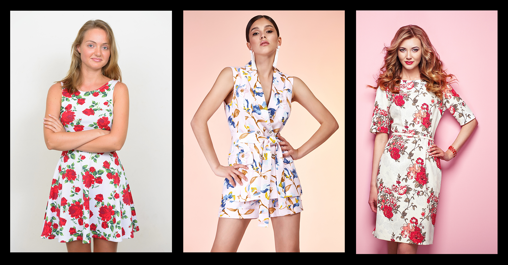

# 시각적 유사성

>[!NOTE]
>
>[!DNL Content and Commerce AI] 베타 버전임 설명서는 변경될 수 있습니다.

이미지가 주어지면 시각적 유사성 서비스는 카탈로그에서 시각적으로 유사한 이미지를 자동으로 찾습니다.

다음 이미지가 이 문서에 표시된 예제 요청에서 사용되었습니다.


**API 형식**

```http
POST /services/v1/predict
```

**요청**

다음 요청은 페이로드에서 제공하는 입력 매개 변수를 기반으로 카탈로그에서 시각적으로 유사한 이미지를 검색합니다. 표시된 입력 매개 변수에 대한 자세한 내용은 예제 페이로드 아래 표를 참조하십시오.

>[!CAUTION]
>
>`analyzer_id` 사용할 항목 [!DNL Sensei Content Framework] 을 결정합니다. 요청을 하기 전에 적절한 `analyzer_id`이 있는지 확인하십시오. 이 서비스에 대한 `analyzer_id`을(를) 받으려면 콘텐츠 및 상거래 AI 베타 팀에 문의하십시오.

```SHELL
curl -i -X POST https://sensei.adobe.io/services/v1/predict \
  -H 'Authorization: Bearer $API_TOKEN' \
  -H 'Content-Type: multipart/form-data' \
  -H 'cache-control: no-cache,no-cache' \
  -H 'x-api-key: $API_KEY' \
  -F file=@test_image.jpg \
  -F 'contentAnalyzerRequests={
   "enable_diagnostics":"true",
   "requests":[
     {
         "analyzer_id": "Feature:cintel-deep-product-search:Service-316a8cf750c6440396061c8f73a7a585",
         "parameters": {
          "application-id": "1234", 
          "content-type": "inline", 
          "encoding": "jpeg", 
          "threshold": "0", 
          "top-N": "0", 
          "custom": {}, 
          "data": [{
            "content-id": "0987", 
            "content": "inline-image", 
            "content-type": "inline", 
            "encoding": "jpeg", 
            "threshold": "0", 
            "top-N": "0", 
            "historic-metadata": [], 
            "custom": {}
            }]
          }
      }
    ]
}'
```

| 속성 | 설명 | 필수입니다 |
| --- | --- | --- |
| `analyzer_id` | 요청이 배포된 [!DNL Sensei] 서비스 ID. 이 ID는 [!DNL Sensei Content Frameworks] 중 어느 것이 사용되는지 결정합니다. 사용자 지정 서비스의 경우 콘텐츠 및 상거래 AI 팀에 문의하여 사용자 지정 ID를 설정하십시오. | 예 |
| `application-id` | 만든 응용 프로그램의 ID. | 예 |
| `data` | 배열에 이미지를 나타내는 각 객체가 포함된 JSON 객체가 포함된 배열입니다. 이 배열의 일부로 전달되는 모든 매개 변수는 `data` 배열 외부에 지정된 전역 매개 변수를 무시합니다. 이 표에 나와 있는 나머지 속성은 `data` 내에서 재정의할 수 있습니다. | 예 |
| `content-id` | 응답에서 반환되는 데이터 요소의 고유 ID. 이 값이 전달되지 않으면 자동 생성된 ID가 할당됩니다. | 아니요 |
| `content` | 시각적 유사성 서비스에 의해 분석되는 내용. 이미지가 요청 본문에 포함된 경우 말림 명령에 `-F file=@<filename>`을 사용하여 이미지를 전달하고 이 매개 변수를 빈 문자열로 남겨둡니다. <br> 이미지가 S3의 파일인 경우 서명된 URL을 전달합니다. 컨텐츠가 요청 본문에 포함된 경우 데이터 요소 목록에는 하나의 객체만 있어야 합니다. 두 개 이상의 객체가 전달되면 첫 번째 객체만 처리됩니다. | 예 |
| `content-type` | 입력이 요청 본문과 S3 버킷에 대한 서명된 URL인지 여부를 나타내는 데 사용됩니다. 이 속성의 기본값은 `inline`입니다. | 아니요 |
| `encoding` | 입력 이미지의 파일 형식입니다. 현재 JPEG 및 PNG 이미지만 처리할 수 있습니다. 이 속성의 기본값은 `jpeg`입니다. | 아니요 |
| `threshold` | 결과를 반환해야 하는 점수(0~1)의 임계값. 모든 결과를 반환하려면 `0` 값을 사용합니다. 이 속성의 기본값은 `0`입니다. | 아니요 |
| `top-N` | 반환할 결과 수입니다(음수가 될 수 없음). 모든 결과를 반환하려면 `0` 값을 사용합니다. `threshold`과 함께 사용할 경우 반환되는 결과 수가 두 제한 중 하나 보다 적습니다. 이 속성의 기본값은 `0`입니다. | 아니요 |
| `custom` | 전달할 사용자 지정 매개 변수입니다. | 아니요 |
| `historic-metadata` | 메타데이터를 전달할 수 있는 배열입니다. | 아니요 |

**응답**

성공적으로 응답하면 카탈로그에 있는 시각적으로 비슷한 각 이미지에 대해 `feature_value` 및 `feature_name`가 포함된 `response` 배열이 반환됩니다.

아래 표시된 예제 응답에서 시각적으로 유사한 다음 이미지가 반환되었습니다.



```json
{
  "status": 200,
  "content_id": "test_image.jpg",
  "cas_responses": [
    {
      "status": 200,
      "analyzer_id": "Feature:cintel-deep-product-search:Service-316a8cf750c6440396061c8f73a7a585",
      "content_id": "test_image.jpg",
      "result": {
        "response_type": "feature",
        "response": [
          {
            "feature_value": [
              {
                "feature_value": "678",
                "feature_name": "G34WS945.F1"
              },
              {
                "feature_value": "678",
                "feature_name": "1431RDM JANELLE RAW JACKE"
              },
              {
                "feature_value": "657",
                "feature_name": "GF4045877841 CARLA FLR"
              },
              {
                "feature_name": "1707-686-SGU PATCH XYZ",
                "feature_value": "657"
              },
              {
                "feature_name": "5495MJT AJA BLK",
                "feature_value": "646"
              },
              {
                "feature_name": "IDEAL",
                "feature_value": "645"
              },
              {
                "feature_value": "644",
                "feature_name": "HCAJRA439 CALI JEAN"
              },
              {
                "feature_name": "KT279RK-ONL",
                "feature_value": "644"
              },
              {
                "feature_name": "SP190404-ELLIS",
                "feature_value": "642"
              },
              {
                "feature_name": "GF4174848718 KENDALL DIS",
                "feature_value": "640"
              }
            ],
            "feature_name": "visual_similarity"
          }
        ]
      }
    }
  ],
  "error": []
}
```
