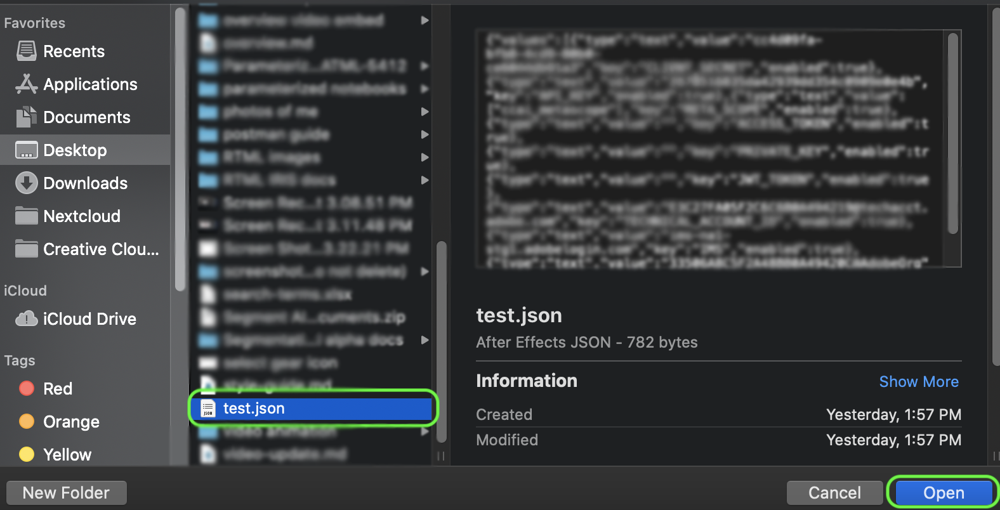
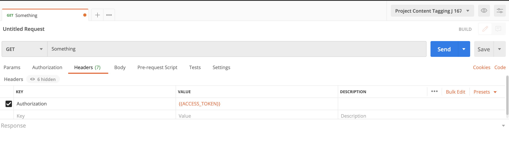

# 콘텐츠 태깅 시작

[!DNL Content tagging] Adobe I/O API를 활용합니다. Adobe I/O API 및 I/O 콘솔 통합을 호출하려면 먼저 [인증 자습서](https://www.adobe.com/go/platform-api-authentication-en).

하지만 다음에 도달하면 **API 추가** 단계: 다음 스크린샷과 같이 API는 Adobe Experience Platform 대신 Creative Cloud 아래에 있습니다.

인증 자습서를 완료하면 아래와 같이 모든 Adobe I/O API 호출에서 필요한 각 헤더의 값이 제공됩니다.

- `Authorization: Bearer {ACCESS_TOKEN}`
- `x-api-key: {API_KEY}`
- `x-gw-ims-org-id: {ORG_ID}`

## Postman 환경 만들기(선택 사항)

Adobe Developer 콘솔 내에서 프로젝트 및 API를 설정한 후에는 Postman용 환경 파일을 다운로드할 수 있는 옵션이 있습니다. 아래 **[!UICONTROL API]** 프로젝트의 왼쪽 레일에서 **[!UICONTROL 콘텐츠 태깅]**. 레이블이 &quot;&quot;로 지정된 카드가 포함된 새 탭이 열립니다[!DNL Try it out]&quot;. 선택 **Postman 다운로드** postman 환경을 구성하는 데 사용되는 JSON 파일을 다운로드합니다.

파일을 다운로드했으면 Postman을 열고 다음을 선택합니다. **톱니바퀴 아이콘** 을(를) 오른쪽 상단에서 **환경 관리** 대화 상자.

그런 다음 을 선택합니다. **가져오기** 다음 범위 내에서 **환경 관리** 대화 상자.

리디렉션되고 컴퓨터에서 환경 파일을 선택하라는 메시지가 표시됩니다. 이전에 다운로드한 JSON 파일을 선택한 다음 를 선택합니다. **열기** 을 클릭하여 환경을 로드합니다.

로 다시 리디렉션됩니다. *환경 관리* 새 환경 이름이 채워진 탭 환경 이름을 선택하여 Postman에서 사용할 수 있는 변수를 보고 편집합니다. 다음을 수동으로 채워야 합니다. `JWT_TOKEN` 및 `ACCESS_TOKEN`. 이 값은 다음을 완료하는 동안 얻어야 합니다. [인증 자습서](https://www.adobe.com/go/platform-api-authentication-en).

완료되면 변수가 아래 스크린샷과 유사하게 표시됩니다. 선택 **업데이트** 을 클릭하여 환경 설정을 완료합니다.

이제 오른쪽 상단의 드롭다운 메뉴에서 환경을 선택하고 저장된 모든 값을 자동으로 채울 수 있습니다. 모든 API 호출을 업데이트하려면 언제든지 값을 다시 편집하면 됩니다.

Postman을 사용한 Adobe I/O API 작업에 대한 자세한 내용은 의 미디어 게시물을 참조하십시오. [Adobe I/O에서 JWT 인증에 Postman 사용](https://medium.com/adobetech/using-postman-for-jwt-authentication-on-adobe-i-o-7573428ffe7f).

## 샘플 API 호출 읽기

이 안내서에서는 요청 형식을 지정하는 방법을 보여 주는 예제 API 호출을 제공합니다. 여기에는 경로, 필수 헤더 및 적절한 포맷의 요청 페이로드가 포함됩니다. API 응답에서 반환되는 샘플 JSON도 제공됩니다. 샘플 API 호출에 대한 설명서에 사용되는 규칙에 대한 자세한 내용은 의 섹션을 참조하십시오. [예제 API 호출을 읽는 방법](../../landing/troubleshooting.md) Experience Platform 문제 해결 안내서에서 참조하십시오.

## 다음 단계 {#next-steps}

모든 자격 증명을 갖게 되면 다음에 대한 사용자 정의 작업자를 설정할 준비가 된 것입니다. [!DNL Content tagging]. 다음 문서는 확장성 프레임워크 및 환경 설정을 이해하는 데 도움이 됩니다.

확장성 프레임워크에 대한 자세한 내용은 [확장성 소개](https://experienceleague.adobe.com/docs/asset-compute/using/extend/understand-extensibility.html) 문서. 이 문서에서는 사전 요구 사항 및 프로비저닝 요구 사항을 간략하게 설명합니다.

환경 설정에 대해 자세히 알아보려면 [!DNL Content tagging], 다음에 대한 안내서를 읽어 보십시오. [개발자 환경 설정](https://experienceleague.adobe.com/docs/asset-compute/using/extend/setup-environment.html). 이 문서에서는 Asset compute 서비스에 대해 개발할 수 있는 설정 지침을 제공합니다.
