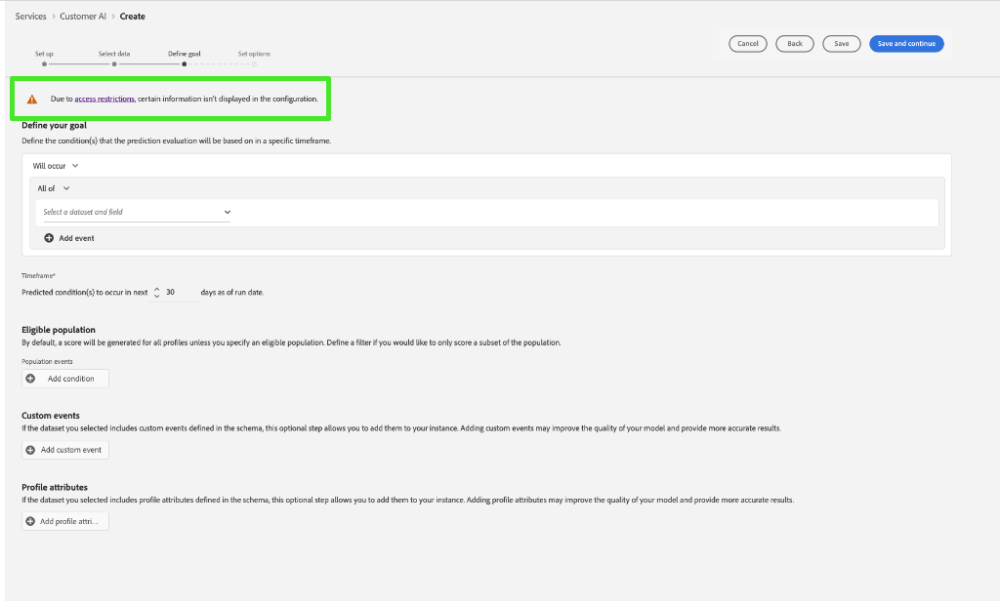

# 고객 AI의 속성 기반 액세스 제어

>[!IMPORTANT]
>
>속성 기반 액세스 제어는 현재 제한된 릴리스에서만 사용할 수 있습니다.

[특성 기반 액세스 제어](../../../access-control/abac/overview.md)는 관리자가 특성을 기반으로 특정 개체 및/또는 기능에 대한 액세스를 제어할 수 있도록 해주는 Adobe Experience Platform의 기능입니다. 속성은 스키마 필드 또는 세그먼트에 추가된 레이블과 같이 객체에 추가된 메타데이터일 수 있습니다. 관리자는 사용자 액세스 권한을 관리하기 위해 속성이 포함된 액세스 정책을 정의합니다.

이 기능을 사용하면 XDM(Experience Data Model) 스키마 필드에 조직 또는 데이터 사용 범위를 정의하는 레이블로 레이블을 지정할 수 있습니다. 이와 동시에 관리자는 사용자 및 역할 관리 인터페이스를 사용하여 XDM 스키마 필드를 둘러싼 액세스 정책을 정의하고 사용자 또는 사용자 그룹(내부, 외부 또는 타사 사용자)에 부여된 액세스를 더 잘 관리할 수 있습니다. 또한 속성 기반 액세스 제어를 통해 관리자는 특정 세그먼트에 대한 액세스를 관리할 수 있습니다.

속성 기반 액세스 제어를 통해 조직 관리자는 모든 Experience Platform 워크플로 및 리소스에서 중요한 개인 데이터(SPD)와 개인 식별 정보(PII) 모두에 대한 사용자의 액세스를 제어할 수 있습니다. 관리자는 특정 필드에만 액세스할 수 있는 사용자 역할과 필드에 해당하는 데이터를 정의할 수 있습니다.

속성 기반 액세스 제어로 인해 일부 필드 및 기능은 액세스가 제한되고 특정 고객 AI 서비스 모델에서 사용할 수 없습니다. 예를 들면 &quot;ID&quot;, &quot;점수 정의&quot; 및 &quot;복제&quot;가 있습니다.

Customer AI 작업 영역 **인사이트 페이지**&#x200B;의 맨 위에서 사이드바, 점수 정의, ID 및 프로필 속성에 있는 세부 사항이 모두 &quot;액세스 제한됨&quot;으로 표시되어 있습니다.

**[!UICONTROL 모델 워크플로 만들기]** 페이지에서 제한된 스키마가 있는 데이터 집합을 미리 보면 [!UICONTROL 액세스 제한으로 인해 특정 정보가 데이터 집합 미리 보기에 표시되지 않습니다.]

제한된 정보가 있는 모델을 만들고 **[!UICONTROL 목표 정의]** 단계로 진행하면 맨 위에 경고가 표시됩니다. [!UICONTROL 액세스 제한으로 인해 특정 정보가 구성에 표시되지 않습니다.]

액세스 제어를 사용할 때 **고객 AI 보기** 및 **고객 AI 관리** 권한은 고객 AI의 다양한 기능에 대한 액세스 권한을 부여합니다. **Customer AI 관리** 권한을 사용하면 모델을 **생성**,**업데이트**, **삭제**, **활성화** 또는 **비활성화**&#x200B;할 수 있고 **Customer AI 보기**&#x200B;를 사용하면 모델을 읽거나 볼 수 있습니다. **만들기**, **업데이트** 및 **삭제** 작업이 감사 로그에 기록됩니다.

[액세스 제어에 대한 권한 할당](../../../access-control/home.md) 또는 [감사 로그를 사용하여 액세스 및 활동을 모니터링하는 방법](../../../landing/governance-privacy-security/audit-logs/overview.md)에 대해 알아보려면 설명서를 참조하세요.

## 다음 단계

이 안내서를 읽으면 [!DNL Experience Platform]에서 액세스 제어의 주요 원칙에 대해 알아보게 됩니다. 이제 [!DNL Admin Console]을(를) 사용하여 제품 프로필을 만들고 [!DNL Experience Platform]에 대한 권한을 할당하는 방법에 대한 자세한 단계를 보려면 [액세스 제어 사용 안내서](../overview.md)로 계속할 수 있습니다.
