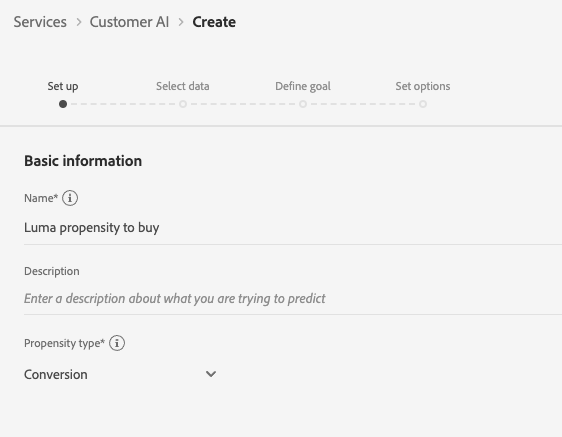
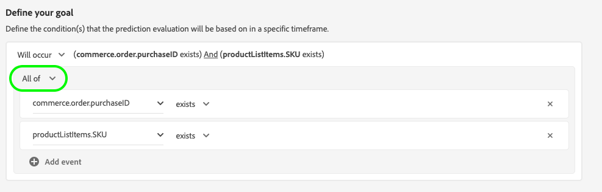
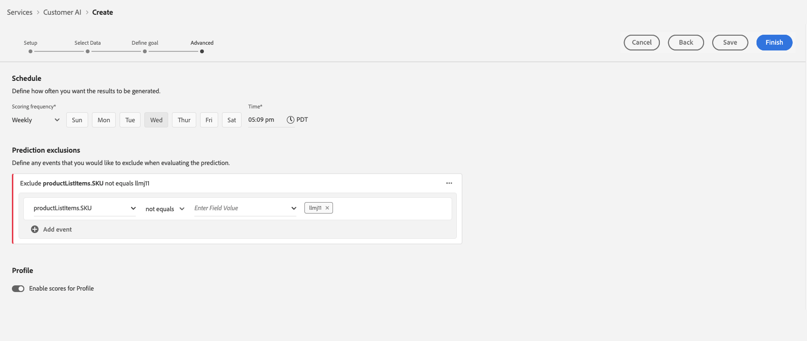

# Customer AI 인스턴스 구성

AI/ML 서비스의 일부인 고객 AI를 사용하면 머신 러닝에 대한 걱정 없이 사용자 정의 성향 점수를 생성할 수 있습니다.

AI/ML 서비스는 다양한 사용 사례에 맞게 구성할 수 있는 사용하기 쉬운 Adobe Sensei 서비스로 고객 AI를 제공합니다. 다음 섹션에서는 고객 AI의 인스턴스를 구성하는 단계를 제공합니다.

## 인스턴스 만들기 {#set-up-your-instance}

Platform UI에서 를 선택합니다. **[!UICONTROL 서비스]** 왼쪽 탐색. 다음 **[!UICONTROL 서비스]** 브라우저가 나타나고 원하는 대로 사용 가능한 모든 서비스를 표시합니다. Customer AI용 컨테이너에서 을 선택합니다. **[!UICONTROL 열기]**.

다음 **고객 AI** UI가 나타나고 모든 서비스 인스턴스가 표시됩니다.

- 다음을 찾을 수 있습니다. **[!UICONTROL 채점된 총 프로필]** 의 오른쪽 하단에 있는 지표 **[!UICONTROL 인스턴스 만들기]** 컨테이너. 이 지표는 모든 샌드박스 환경 및 삭제된 서비스 인스턴스를 포함하여 현재 연도 동안 Customer AI가 채점한 총 프로필 수를 추적합니다.

서비스 인스턴스는 UI의 오른쪽에 있는 컨트롤을 사용하여 편집, 복제 및 삭제할 수 있습니다. 이러한 컨트롤을 표시하려면 기존 컨트롤에서 인스턴스를 선택합니다 **[!UICONTROL 서비스 인스턴스]**. 컨트롤에는 다음 항목이 포함됩니다.

- **[!UICONTROL 편집]**: 선택 **[!UICONTROL 편집]** 기존 서비스 인스턴스를 수정할 수 있습니다. 인스턴스의 이름, 설명 및 채점 빈도를 편집할 수 있습니다.
- **[!UICONTROL 복제]**: 선택 **[!UICONTROL 복제]** 현재 선택한 서비스 인스턴스 설정을 복사합니다. 그런 다음 워크플로우를 수정하여 약간 수정하고 새 인스턴스로 이름을 바꿀 수 있습니다.
- **[!UICONTROL 삭제]**: 내역 실행을 포함하는 서비스 인스턴스를 삭제할 수 있습니다. 해당 출력 데이터 세트가 플랫폼에서 삭제됩니다. 단, 실시간 고객 프로필에 동기화된 점수는 삭제되지 않습니다.
- **[!UICONTROL 데이터 소스]**: 이 인스턴스에서 사용하는 데이터 세트에 대한 링크입니다. 여러 데이터 세트를 사용 중인 경우 하이퍼링크 텍스트를 선택하면 데이터 세트 미리보기 팝오버가 열립니다.
- **[!UICONTROL 마지막 실행 세부 정보]**: 실행이 실패할 때만 표시됩니다. 오류 코드 등 실행이 실패한 이유에 대한 정보가 여기에 표시됩니다.
- **[!UICONTROL 점수 정의]**: 이 인스턴스에 대해 구성한 목표에 대한 빠른 개요입니다.

새 인스턴스를 생성하려면 다음을 선택합니다. **[!UICONTROL 인스턴스 만들기]**.

## 설정

인스턴스 만들기 워크플로가 나타나고 **[!UICONTROL 설정]** 단계.

다음은 인스턴스에 제공해야 하는 값에 대한 중요한 정보입니다.

- **[!UICONTROL 이름]:** 인스턴스의 이름은 Customer AI 점수가 표시되는 모든 위치에 사용됩니다. 따라서 이름은 예측 점수가 무엇을 나타내는지 설명해야 합니다. 예를 들어, &quot;잡지 구독을 취소할 가능성&quot;

- **[!UICONTROL 설명]:** 예측하려는 내용을 나타내는 설명입니다.

- **[!UICONTROL 성향 유형]:** 성향 유형은 점수 및 지표 극성의 의도를 결정합니다. 다음 중 하나를 선택할 수 있습니다 **[!UICONTROL 이탈]** 또는 **[!UICONTROL 전환]**. 아래의 참고 사항을 참조하십시오. [채점 요약](./discover-insights.md#scoring-summary) 성향 유형이 인스턴스에 영향을 미치는 방식에 대한 자세한 내용은 insights 검색 문서에서 확인할 수 있습니다.

필요한 값을 입력한 다음 을 선택합니다. **[!UICONTROL 다음]** 계속합니다.

## 데이터 선택 {#select-data}

설계별로 보면 고객 AI는 Adobe Analytics, Adobe Audience Manager, 일반적인 경험 이벤트 및 소비자 경험 이벤트 데이터를 사용하여 성향 점수를 계산합니다. 데이터 세트를 선택하면 Customer AI와 호환되는 데이터 세트만 나열됩니다. 데이터 세트를 선택하려면 (**+**) 데이터 세트 이름 옆의 기호나 확인란을 선택하여 여러 데이터 세트를 한 번에 추가합니다. 검색 옵션을 사용하여 관심 있는 데이터 세트를 빠르게 찾을 수 있습니다.

사용할 데이터 세트를 선택한 후 **[!UICONTROL 추가]** 단추를 클릭하여 데이터 세트 미리 보기 창에 데이터 세트를 추가합니다.

정보 아이콘 선택  데이터 세트 옆에 데이터 세트 미리보기 팝오버가 열립니다.

데이터 세트 미리 보기에는 마지막 업데이트 시간, 소스 스키마 및 처음 10개 열의 미리 보기와 같은 데이터가 포함됩니다.

선택 **[!UICONTROL 저장]** 워크플로우를 따라 이동할 때 초안을 저장합니다. 초안 모델 구성을 저장하고 워크플로우의 다음 단계로 이동할 수도 있습니다. 사용 **[!UICONTROL 저장 및 계속]** 모델 구성 중에 초안을 만들고 저장합니다. 이 기능을 사용하면 모델 구성의 초안을 만들고 저장할 수 있으며, 구성 워크플로에서 많은 필드를 정의해야 하는 경우 특히 유용합니다.

### 데이터 세트 완성도 {#dataset-completeness}

데이터 세트 미리 보기에 데이터 세트 완전성 백분율 값이 있습니다. 이 값은 데이터 세트에 비어 있거나 null인 열 수에 대한 빠른 스냅숏을 제공합니다. 데이터 세트에 누락된 값이 많이 포함되어 있고 이러한 값이 다른 곳에서 캡처되는 경우 누락된 값이 포함된 데이터 세트를 포함하는 것이 좋습니다. 이 예에서 개인 ID는 비어 있지만 개인 ID는 포함될 수 있는 별도의 데이터 세트에 캡처됩니다.

>[!NOTE]
>
>데이터 세트 완전성은 고객 AI에 대한 최대 교육 기간(1년)을 사용하여 계산됩니다. 즉, 데이터 세트 완성도 값을 표시할 때 1년 이상 된 데이터는 고려되지 않습니다.

### ID 선택 {#identity}

이제 ID 맵(필드)을 기반으로 여러 데이터 세트를 서로 결합할 수 있습니다. ID 유형(&quot;ID 네임스페이스&quot;라고도 함)과 해당 네임스페이스 내의 ID 값을 선택해야 합니다. 동일한 네임스페이스 아래에 있는 스키마 내에 ID로 두 개 이상의 필드를 할당한 경우, 할당된 모든 ID 값이 다음과 같이 네임스페이스 앞에 있는 ID 드롭다운에 표시됩니다. `EMAIL (personalEmail.address)` 또는 `EMAIL (workEmail.address)`.

[동일한 네임스페이스 선택](../images/user-guide/cai-identity-map.png)

>[!IMPORTANT]
>
>선택하는 모든 데이터 세트에 대해 동일한 ID 유형(네임스페이스)을 사용해야 합니다. 데이터 세트가 호환됨을 나타내는 녹색 확인 표시가 ID 열 내의 ID 유형 옆에 나타납니다. 예를 들어 Phone 네임스페이스 및 `mobilePhone.number` 식별자로, 나머지 데이터 세트의 모든 식별자는 Phone 네임스페이스를 포함하고 사용해야 합니다.

ID를 선택하려면 ID 열에 있는 밑줄이 있는 값을 선택합니다. ID 선택 팝오버가 나타납니다.

<!--  -->
[동일한 네임스페이스 선택](../images/user-guide/cai-identity-namespace.png)

네임스페이스 내에서 두 개 이상의 ID를 사용할 수 있는 경우 사용 사례에 맞는 올바른 ID 필드를 선택해야 합니다. 예를 들어 이메일 네임스페이스 내에서 두 개의 이메일 ID인 회사 및 개인 이메일을 사용할 수 있습니다. 사용 사례에 따라 개인 이메일은 작성될 가능성이 높고 개별 예측에 더 유용합니다. 이는 다음을 의미합니다. `EMAIL (personalEmail.address)` 을(를) id로 선택합니다.

>[!NOTE]
>
> 데이터 세트에 유효한 ID 유형(네임스페이스)이 없는 경우 기본 ID를 설정하고 을 사용하여 ID 네임스페이스에 할당해야 합니다. [스키마 편집기](../../../xdm/schema/composition.md#identity). 네임스페이스 및 ID에 대한 자세한 내용은 [ID 서비스 네임스페이스](../../../identity-service/namespaces.md) 설명서를 참조하십시오.

## 목표 정의 {#define-a-goal}

<!-- https://www.adobe.com/go/cai-define-a-goal -->

다음 **[!UICONTROL 목표 정의]** 단계가 나타나고 예측 목표를 시각적으로 정의할 수 있는 대화형 환경이 제공됩니다. 목표는 하나 이상의 이벤트로 구성되며, 각 이벤트의 발생은 이벤트가 보유한 조건을 기반으로 합니다. 고객 AI 인스턴스의 목표는 주어진 기간 내에 목표를 달성할 가능성을 결정하는 것입니다.

목표를 만들려면 다음을 선택합니다. **[!UICONTROL 필드 이름 입력]** 드롭다운 목록의 필드 뒤에 옵니다. 두 번째 입력인 이벤트 조건에 대한 절을 선택한 다음 선택적으로 이벤트를 완료할 대상 값을 제공합니다. 을 선택하여 추가 이벤트를 구성할 수 있습니다. **[!UICONTROL 이벤트 추가]**. 마지막으로 예측 기간을 일 수로 적용하여 목표를 완료한 다음 을 선택합니다 **[!UICONTROL 다음]**.

<!--  -->

### 다음이 발생하고 다음이 발생하지 않습니다.

목표를 정의하는 동안 다음을 선택할 수 있습니다. **[!UICONTROL 다음이 발생합니다.]** 또는 **[!UICONTROL 다음이 발생하지 않습니다.]**. 선택 **[!UICONTROL 다음이 발생합니다.]** 는 고객의 이벤트 데이터를 insights UI에 포함하려면 정의한 이벤트 조건을 충족해야 함을 의미합니다.

예를 들어 고객이 구매할지 여부를 예측하기 위해 앱을 설정하려는 경우 다음을 선택할 수 있습니다. **[!UICONTROL 다음이 발생합니다.]** 뒤에 오는 **[!UICONTROL 모두]** 입력한 다음 **commerce.purchases.id** (또는 유사한 필드) 및 **[!UICONTROL 존재함]** 를 연산자로 사용하십시오.

<!--  -->

다만, 일정 시간대에 어떤 사건이 일어나지 않는지 예측하고자 하는 경우가 있을 수 있다. 이 옵션을 사용하여 목표를 구성하려면 다음을 선택합니다. **[!UICONTROL 다음이 발생하지 않습니다.]** 을 클릭하여 제품에서 사용할 수 있습니다.

예를 들어, 어느 고객의 참여가 줄어들어 다음 달에 계정 로그인 페이지를 방문하지 않는지 예측하려는 경우. 선택 **[!UICONTROL 다음이 발생하지 않습니다.]** 뒤에 오는 **[!UICONTROL 모두]** 입력한 다음 **web.webInteraction.URL** (또는 유사한 필드) 및 **[!UICONTROL 다음과 같음]** 를 사용하는 연산자로 **account-sign** 을 값으로 추가합니다.

### 모두 및 모두

경우에 따라 이벤트의 조합이 발생할지 여부를 예측할 수 있으며, 사전 정의된 집합에서 이벤트가 발생할지 여부를 예측할 수도 있습니다. 고객의 이벤트 조합 여부를 예측하려면 다음을 선택합니다. **[!UICONTROL 모두]** 의 두 번째 수준 드롭다운 옵션 **[!UICONTROL 목표 정의]** 페이지를 가리키도록 업데이트하는 중입니다.

예를 들어, 고객이 특정 제품을 구매하는지 여부를 예측할 수 있습니다. 이 예측 목표는 다음 두 가지 조건으로 정의됩니다. `commerce.order.purchaseID` **존재함** 및 `productListItems.SKU` **다음과 같음** 일부 특정 값.

고객에게 주어진 세트에서 이벤트가 발생할지 여부를 예측하기 위해 **[!UICONTROL 다음 중 하나]** 옵션을 선택합니다.

예를 들어 고객이 특정 URL을 방문하는지 또는 특정 이름을 가진 웹 페이지를 방문하는지 여부를 예측할 수 있습니다. 이 예측 목표는 다음 두 가지 조건으로 정의됩니다. `web.webPageDetails.URL` **다음으로 시작** 특정 값 및 `web.webPageDetails.name` **다음으로 시작** 특정 값.

### 적격 모집단 *(선택 사항)*

기본적으로 적격 모집단을 지정하지 않는 한 모든 프로필에 대해 성향 점수가 생성됩니다. 이벤트를 기반으로 프로필을 포함하거나 제외하는 조건을 정의하여 적격 모집단을 지정할 수 있습니다.

### 사용자 지정 이벤트 (*선택 사항*) {#custom-events}

다음 항목 외에 추가 정보가 있는 경우 [표준 이벤트 필드](../data-requirements.md#standard-events) 고객 AI가 성향 점수를 생성하는 데 사용하는 사용자 지정 이벤트 옵션이 제공됩니다. 이 옵션을 사용하면 영향력이 있다고 판단되는 추가 이벤트를 추가하여 모델의 품질을 향상시키고 보다 정확한 결과를 제공할 수 있습니다. 선택한 데이터 세트에 스키마에 정의된 사용자 지정 이벤트가 포함된 경우 인스턴스에 추가할 수 있습니다.

>[!NOTE]
>
> 사용자 지정 이벤트가 고객 AI 점수 책정 결과에 미치는 영향에 대한 자세한 설명은 다음을 참조하십시오. [사용자 지정 이벤트 예](#custom-event) 섹션.

사용자 지정 이벤트를 추가하려면 **[!UICONTROL 사용자 지정 이벤트 추가]**. 그런 다음 사용자 지정 이벤트 이름을 입력한 다음 스키마의 이벤트 필드에 매핑합니다. 영향력 있는 요인 및 기타 통찰력을 확인할 때 필드 값 대신 사용자 지정 이벤트 이름이 표시됩니다. 즉, 이벤트의 ID/값 대신 사용자 지정 이벤트 이름이 사용됩니다. 사용자 지정 이벤트가 표시되는 방법에 대한 자세한 내용은 [사용자 정의 이벤트 예제 섹션](#custom-event). 이러한 추가적인 사용자 지정 이벤트는 고객 AI가 모델의 품질을 향상시키고 보다 정확한 결과를 제공하는 데 사용됩니다.

그런 다음 사용 가능한 연산자 드롭다운에서 사용할 연산자를 선택합니다. 이벤트와 호환되는 연산자만 나열됩니다.

마지막으로, 선택한 연산자에 1개가 필요한 경우 필드 값을 입력합니다. 이 예제에서는 호텔 또는 레스토랑 예약이 있는지 여부만 확인하면 됩니다. 그러나 보다 정확하게 하려면 equals 연산자를 사용하고 값 프롬프트에 정확한 값을 입력할 수 있습니다.

완료되면 다음을 선택합니다. **[!UICONTROL 다음]** 을 클릭하여 계속하십시오.

### 사용자 지정 프로필 속성(*선택 사항*)

데이터 외에 중요한 프로필 데이터 세트 필드(타임스탬프 포함)를 정의할 수 있습니다. [표준 이벤트 필드](../data-requirements.md#standard-events) 고객 AI에서 성향 점수를 생성하는 데 사용됩니다. 이 옵션을 사용하면 영향력이 있다고 간주하는 프로필 속성을 더 추가할 수 있으므로 모델의 품질을 향상시키고 보다 정확한 결과를 제공할 수 있습니다. 또한 사용자 지정 프로필 속성을 추가하면 고객 AI가 특정 프로필이 성향 버킷에 어떻게 도달했는지 더 잘 보여줄 수 있습니다.

>[!NOTE]
>
>사용자 지정 프로필 속성을 추가하는 것은 사용자 지정 이벤트를 추가하는 것과 동일한 워크플로우를 따릅니다. 사용자 지정 이벤트와 유사한 사용자 지정 프로필 속성은 동일한 방식으로 모델 채점에 영향을 줍니다. 자세한 설명은 다음을 참조하십시오. [사용자 지정 이벤트 예](#custom-event) 섹션.

#### 프로필 스냅샷 내보내기에서 프로필 속성 선택

일별 프로필 스냅샷 내보내기에서 프로필 속성을 포함하도록 선택할 수도 있습니다. 이러한 속성은 프로필 스냅샷 내보내기에 동기화되며 가장 최근에 사용할 수 있는 값을 표시합니다.

>[!WARNING]
>
> 예측 목표의 결과로 업데이트되거나 예측 목표와 상관 관계가 높은 프로필 속성을 선택하지 않도록 주의하십시오. 이로 인해 모델의 데이터 누수 및 과적합이 발생합니다. 이러한 속성의 예는 다음과 같습니다. `total_purchases_in_the_last_3_months` 구매 전환을 예측합니다.

>[!NOTE]
>
>UPS 스냅샷 내보내기의 프로필 속성 사용에 대한 지원은 요청 시 UI에서 사용할 수 있습니다.

### 사용자 지정 이벤트 예 추가 {#custom-event}

다음 예에서는 사용자 지정 이벤트 및 프로필 속성이 Customer AI 인스턴스에 추가됩니다. Customer AI 인스턴스의 목표는 고객이 향후 60일 이내에 다른 Luma 제품을 구매할 가능성을 예측하는 것입니다. 일반적으로 제품 데이터는 제품 SKU에 연결됩니다. 이 경우 SKU는 입니다. `prd1013`. 고객 AI 모델이 교육/채점된 후 이 SKU는 이벤트에 연결되고 성향 버킷에 대한 영향력 있는 요소로 표시될 수 있습니다.

고객 AI는 과 같은 사용자 지정 이벤트에 대해 &quot;다음 이후 일수&quot; 또는 &quot;카운트 수&quot;와 같은 기능 생성을 자동으로 적용합니다. **구매 감시**. 이 이벤트가 고객의 성향이 높거나 중간 또는 낮은 이유에 대한 영향력 있는 요소로 간주되면 Customer AI는 다음과 같이 표시합니다. `Days since prd1013 purchase` 또는 `Count of prd1013 purchase`. 이 이벤트를 사용자 지정 이벤트로 만들면 이벤트에 새 이름을 지정하여 결과를 보다 쉽게 읽을 수 있습니다. 예, `Days since Watch purchase`. 또한 Customer AI는 이벤트가 표준 이벤트가 아닌 경우에도 이 이벤트를 교육 및 점수에 사용합니다. 즉, 영향력이 있다고 판단되는 여러 이벤트를 추가하고, 예약, 방문자 로그 및 기타 이벤트와 같은 데이터를 포함하여 모델을 추가로 사용자 지정할 수 있습니다. 이러한 데이터 포인트를 추가하면 고객 AI 모델의 정확도와 정밀도가 더욱 높아집니다.

## 옵션 설정

옵션 설정 단계를 사용하면 예측 실행을 자동화하는 일정을 구성하고, 특정 이벤트를 필터링하기 위한 예측 제외를 정의하고, 전환할 수 있습니다 **[!UICONTROL 프로필]** 설정/해제.

### 예약 구성 *(선택 사항)* {#configure-a-schedule}

채점 일정을 설정하려면 다음을 구성합니다. **[!UICONTROL 채점 빈도]**. 자동화된 예측 실행은 매주 또는 매월 실행되도록 예약할 수 있습니다.

### 예측 제외 *(선택 사항)*

데이터 세트에 테스트 데이터로 추가된 열이 포함되어 있는 경우 를 선택하여 해당 열 또는 이벤트를 제외 목록에 추가할 수 있습니다. **[!UICONTROL 제외 추가]** 그 뒤에 제외할 필드를 입력합니다. 이렇게 하면 점수를 생성할 때 특정 조건을 충족하는 이벤트가 평가되지 않습니다. 이 기능은 관련이 없는 데이터 입력 또는 프로모션을 필터링하는 데 사용할 수 있습니다.

이벤트를 제외하려면 다음을 선택합니다 **[!UICONTROL 제외 추가]** 이벤트를 정의합니다. 제외를 제거하려면 생략 부호(**[!UICONTROL ...]**)을 클릭하여 이벤트 컨테이너의 오른쪽 상단에서 **[!UICONTROL 컨테이너 제거]**.

### 프로필 전환

프로필 토글을 사용하면 고객 AI가 채점 결과를 실시간 고객 프로필로 내보낼 수 있습니다. 이 토글을 비활성화하면 모델 채점 결과가 프로필에 추가되지 않습니다. 고객 AI 채점 결과는 이 기능이 비활성화된 상태로 계속 사용할 수 있습니다.

고객 AI를 처음 사용하는 경우 모델 출력 결과가 만족스러울 때까지 이 기능을 끌 수 있습니다. 이렇게 하면 모델을 미세 조정하면서 여러 채점 데이터 세트를 고객 프로필에 업로드할 수 없습니다. 모델 교정을 마치면 다음을 사용하여 모델을 복제할 수 있습니다. [복제 옵션](#set-up-your-instance) 다음에서 **서비스 인스턴스** 페이지를 가리키도록 업데이트하는 중입니다. 이렇게 하면 모델의 복사본을 만들고 프로필을 전환할 수 있습니다.

채점 일정, 예측 제외가 포함되며 원하는 프로필 전환이 설정되면 다음을 선택합니다. **[!UICONTROL 완료]** 오른쪽 상단에서 고객 AI 인스턴스를 만듭니다.

인스턴스가 성공적으로 생성되면 예측 실행이 즉시 트리거되고 정의된 일정에 따라 후속 실행이 실행됩니다.

>[!NOTE]
>
>입력 데이터의 크기에 따라 예측 실행이 완료되기까지 최대 24시간이 소요될 수 있습니다.

이 섹션을 따라 고객 AI 인스턴스를 구성하고 예측 실행을 실행했습니다. 프로필 토글이 활성화된 경우 실행이 성공적으로 완료되면 채점 인사이트는 프로필을 예측 점수로 자동으로 채웁니다. 이 자습서의 다음 섹션을 계속하기 전에 최대 24시간을 기다려 주십시오.

## 다음 단계 {#next-steps}

이 자습서에 따라 고객 AI의 인스턴스를 구성하고 성향 점수를 생성했습니다. 이제 세그먼트 빌더를 사용하여 다음을 수행할 수 있습니다. [예측된 점수로 고객 세그먼트 생성](./create-segment.md) 또는 [고객 AI로 통찰력 발견](./discover-insights.md).

## 추가 리소스

다음 비디오는 Customer AI의 구성 워크플로를 이해할 수 있도록 설계되었습니다. 또한 모범 사례 및 사용 사례 예제가 제공됩니다.

>[!IMPORTANT]
>
> 다음 비디오는 최신 버전이 아닙니다. 최신 정보는 설명서를 참조하십시오.

>[!VIDEO](https://video.tv.adobe.com/v/32665?learn=on&quality=12)
