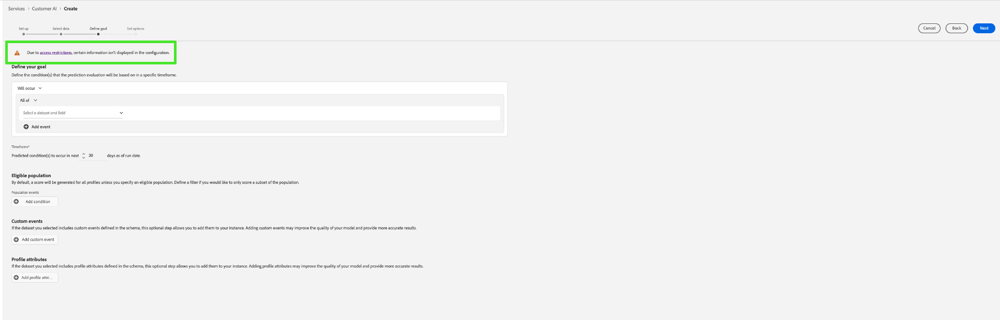

# 고객 AI 인스턴스 구성

고객 AI 는 AI/ML 서비스의 일부로서, 기계 학습에 대한 걱정 없이 사용자 지정 성향 점수를 생성할 수 있습니다.

AI/ML 서비스는 다양한 사용 사례에 대해 구성할 수 있는 간단한 사용 Adobe Sensei 서비스로서 고객 AI를 제공합니다. 다음 섹션에서는 Customer AI 인스턴스를 구성하는 단계를 제공합니다.

## 인스턴스 만들기 {#set-up-your-instance}

플랫폼 UI에서 **[!UICONTROL 서비스]** 을 클릭합니다. 다음 **[!UICONTROL 서비스]** 브라우저가 나타나고 사용 가능한 모든 서비스를 원하는 대로 표시합니다. Customer AI 컨테이너에서 를 선택합니다. **[!UICONTROL 열기]**.

다음 **고객 AI** UI가 나타나고 모든 서비스 인스턴스가 표시됩니다.

- 다음 항목이 있습니다. **[!UICONTROL 점수를 매긴 총 프로필]** 의 오른쪽 하단에 있는 지표 **[!UICONTROL 인스턴스 만들기]** 컨테이너. 이 지표는 모든 샌드박스 환경 및 삭제된 서비스 인스턴스를 포함하여 현재 달력 연도 동안 Customer AI가 채점한 총 프로필 수를 추적합니다.

UI 오른쪽의 컨트롤을 사용하여 서비스 인스턴스를 편집, 복제 및 삭제할 수 있습니다. 이러한 컨트롤을 표시하려면 기존 컨트롤에서 인스턴스를 선택합니다 **[!UICONTROL 서비스 인스턴스]**. 컨트롤에는 다음이 포함되어 있습니다.

- **[!UICONTROL 편집]**: 선택 **[!UICONTROL 편집]** 기존 서비스 인스턴스를 수정할 수 있습니다. 인스턴스의 이름, 설명 및 점수 주기를 편집할 수 있습니다.
- **[!UICONTROL 복제]**: 선택 **[!UICONTROL 복제]** 현재 선택한 서비스 인스턴스 설정을 복사합니다. 그런 다음 워크플로우를 수정하여 작은 수정 사항을 만들고 새 인스턴스로 이름을 변경할 수 있습니다.
- **[!UICONTROL 삭제]**: 임의의 기록 실행을 포함하는 서비스 인스턴스를 삭제할 수 있습니다.
- **[!UICONTROL 데이터 소스]**: 이 인스턴스에서 사용하는 데이터 세트에 대한 링크입니다. 데이터 세트를 여러 개 사용하는 경우 하이퍼링크 텍스트를 선택하면 데이터 세트 미리 보기 팝오버가 열립니다.
- **[!UICONTROL 마지막 실행 세부 사항]**: 실행이 실패한 경우에만 표시됩니다. 여기에 오류 코드와 같이 실행이 실패한 이유에 대한 정보가 표시됩니다.
- **[!UICONTROL 점수 정의]**: 이 인스턴스에 대해 구성한 목표에 대한 간단한 개요입니다.

새 인스턴스를 생성하려면 **[!UICONTROL 인스턴스 만들기]**.

## 설정

인스턴스 만들기 워크플로우는 **[!UICONTROL 설정]** 단계.

다음은 인스턴스에 제공해야 하는 값에 대한 중요한 정보입니다.

- **[!UICONTROL 이름]:** 인스턴스 이름은 고객 AI 점수가 표시되는 모든 위치에서 사용됩니다. 따라서, 이름은 예측 점수가 나타내는 것을 설명할 것이다. 예를 들어, &quot;잡지 구독을 취소할 가능성&quot;입니다.

- **[!UICONTROL 설명]:** 예측하려는 내용을 나타내는 설명입니다.

- **[!UICONTROL 성향 유형]:** 성향 유형은 점수와 지표 극성의 의도를 결정합니다. 다음 중 하나를 선택할 수 있습니다 **[!UICONTROL 이탈]** 또는 **[!UICONTROL 전환]**. 아래의 메모를 참조하십시오 [점수 요약](./discover-insights.md#scoring-summary) 인사이트 살펴보기 문서에서 성향 유형이 인스턴스에 미치는 영향에 대한 자세한 내용을 참조하십시오.

필요한 값을 제공한 다음 을(를) 선택합니다 **[!UICONTROL 다음]** 계속하십시오.

## 데이터 선택 {#select-data}

계획별로, 고객 AI는 Adobe Analytics, Adobe Audience Manager, 일반적으로 경험 이벤트 및 소비자 경험 이벤트 데이터를 사용하여 성향 점수를 계산합니다. 데이터 세트를 선택할 때는 Customer AI와 호환되는 항목만 나열됩니다. 데이터 세트를 선택하려면 (**+**) 데이터 세트 이름 옆에 있는 기호를 선택하거나 확인란을 선택하여 여러 데이터 세트를 한 번에 추가합니다. 검색 옵션을 사용하여 관심 있는 데이터 세트를 신속하게 찾을 수 있습니다.

사용할 데이터 세트를 선택한 후 **[!UICONTROL 추가]** 데이터 세트 미리 보기 창에 데이터 세트를 추가하는 단추.

정보 아이콘 선택  데이터 세트 옆에 데이터 세트 미리 보기 팝오버가 열립니다.

데이터 집합 미리 보기에는 마지막 업데이트 시간, 소스 스키마 및 처음 10개 열의 미리 보기와 같은 데이터가 포함되어 있습니다.

### 데이터 집합 완결성 {#dataset-completeness}

데이터 집합 미리 보기에 데이터 집합 완결성 비율 값이 있습니다. 이 값은 데이터 세트에 비어 있거나 null인 열 수에 대한 빠른 스냅숏을 제공합니다. 데이터 세트에 누락된 값이 많이 포함되어 있고 이러한 값이 다른 곳에서 캡처되는 경우 누락된 값이 포함된 데이터 세트를 포함하는 것이 좋습니다. 이 예에서 개인 ID는 비어 있지만 이 예에서는 포함할 수 있는 별도의 데이터 세트에 개인 ID가 캡처됩니다.

>[!NOTE]
>
>데이터 세트 완전성은 고객 AI의 최대 교육 기간(1년)을 사용하여 계산됩니다. 즉, 데이터 세트 완결성 값을 표시할 때 1년 이상의 데이터를 고려하지 않습니다.

### ID 선택 {#identity}

이제 ID 맵(필드)을 기반으로 여러 데이터 세트를 서로 결합할 수 있습니다. ID 유형(&quot;ID 네임스페이스&quot;라고도 함)과 해당 네임스페이스 내의 ID 값을 선택해야 합니다. 동일한 네임스페이스 아래에 두 개 이상의 필드를 스키마 내에 ID로 할당한 경우 네임스페이스가 앞에 추가하는 ID 드롭다운에 할당된 모든 ID 값이 표시됩니다 `EMAIL (personalEmail.address)` 또는 `EMAIL (workEmail.address)`.

[동일한 네임스페이스 선택](../images/user-guide/cai-identity-map.png)

>[!IMPORTANT]
>
>선택하는 모든 데이터 세트에 대해 동일한 ID 유형(네임스페이스)을 사용해야 합니다. ID 열 내의 ID 유형 옆에 데이터 세트가 호환되는지를 나타내는 녹색 확인 표시가 나타납니다. 예를 들어 Phone 네임스페이스를 사용하는 경우 `mobilePhone.number` 식별자로 나머지 데이터 세트에 대한 모든 식별자는 Phone 네임스페이스를 사용하여 이 식별자를 포함해야 합니다.

ID를 선택하려면 ID 열에 있는 밑줄이 있는 값을 선택합니다. ID 선택 팝오버가 나타납니다.

<!--  -->
[동일한 네임스페이스 선택](../images/user-guide/cai-identity-namespace.png)

네임스페이스 내에서 두 개 이상의 ID를 사용할 수 있는 경우 사용 사례에 대한 올바른 ID 필드를 선택해야 합니다. 예를 들어 이메일 네임스페이스, 작업 및 개인 이메일 내에 두 개의 이메일 ID를 사용할 수 있습니다. 사용 사례에 따라 개인 이메일은 보다 많이 채워질 가능성이 높고 개별 예측에 더 유용합니다. 이것은 `EMAIL (personalEmail.address)` 을 id로 선택합니다.

>[!NOTE]
>
> 데이터 세트에 유효한 ID 유형(네임스페이스)이 없는 경우 기본 ID를 설정하고 을(를) 사용하여 ID 네임스페이스에 할당해야 합니다 [스키마 편집기](../../../xdm/schema/composition.md#identity). 네임스페이스와 ID에 대해 자세히 알아보려면 [ID 서비스 네임스페이스](../../../identity-service/namespaces.md) 설명서.

## 목표 정의 {#define-a-goal}

<!-- https://www.adobe.com/go/cai-define-a-goal -->

다음 **[!UICONTROL 목표 정의]** 단계가 나타나고 예측 목표를 시각적으로 정의할 수 있는 대화형 환경이 제공됩니다. 목표는 하나 이상의 이벤트로 구성되며, 여기서 각 이벤트의 발생은 이벤트가 보유하는 조건을 기반으로 합니다. 고객 AI 인스턴스의 목적은 주어진 기간 내에 목표를 달성할 가능성을 결정하는 것입니다.

목표를 만들려면 **[!UICONTROL 필드 이름 입력]** 드롭다운 목록의 필드가 그 뒤에 옵니다. 두 번째 입력, 이벤트 조건에 대한 절을 선택한 다음 선택적으로 이벤트를 완료할 대상 값을 제공합니다. 추가 이벤트는 **[!UICONTROL 이벤트 추가]**. 마지막으로, 일 단위의 예측 시간 프레임을 적용하여 목표를 완료한 다음, 을 선택합니다 **[!UICONTROL 다음]**.

<!--  -->

### 이 발생하고 발생하지 않습니다

목표를 정의하는 동안 선택할 수 있는 옵션이 있습니다 **[!UICONTROL 이 발생합니다]** 또는 **[!UICONTROL 표시되지 않음]**. 선택 **[!UICONTROL 이 발생합니다]** 은(는) 고객의 이벤트 데이터를 인사이트 UI에 포함하려면 정의한 이벤트 조건을 충족해야 함을 의미합니다.

예를 들어 고객이 구매할지 여부를 예측하기 위해 앱을 설정하려면 다음을 선택할 수 있습니다 **[!UICONTROL 이 발생합니다]** 후 **[!UICONTROL 모두]** 그런 다음 를 입력합니다. **commerce.purchases.id** (또는 유사한 필드) 및 **[!UICONTROL 존재]** 를 반환합니다.

<!--  -->

하지만 특정 기간에 어떤 이벤트가 발생하지 않을 것인지 예측하는 데 관심이 있는 경우가 있을 수 있습니다. 이 옵션을 사용하여 목표를 구성하려면 **[!UICONTROL 표시되지 않음]** 최상위 드롭다운에서 을 클릭합니다.

예를 들어 어떤 고객이 덜 참여하는지 예측하려고 하며 다음 달에 계정 로그인 페이지를 방문하지 않는 경우 선택 **[!UICONTROL 표시되지 않음]** 후 **[!UICONTROL 모두]** 그런 다음 를 입력합니다. **web.webInteraction.URL** (또는 유사한 필드) 및 **[!UICONTROL 다음과 같음]** 를 연산자로 **account-login** 를 값으로 채우는 방법을 설명합니다.

### 모든 및 중

경우에 따라 이벤트 조합이 발생하는지 여부를 예측할 수 있고, 다른 경우 사전 정의된 집합에서 이벤트가 발생하는 경우를 예측할 수 있습니다. 고객의 이벤트 조합 여부를 예측하려면 **[!UICONTROL 모두]** 옵션 을 클릭합니다. **[!UICONTROL 목표 정의]** 페이지.

예를 들어 고객이 특정 제품을 구매하는지 여부를 예측할 수 있습니다. 이 예측 목표는 다음 두 가지 조건으로 정의됩니다. a `commerce.order.purchaseID` **존재** 그리고 `productListItems.SKU` **다음과 같음** 일부 특정 값.

고객이 지정된 세트에서 이벤트가 있는지 여부를 예측하기 위해 를 사용할 수 있습니다 **[!UICONTROL 다음 중 하나 이상]** 선택 사항입니다.

예를 들어 고객이 특정 URL을 방문하는지 또는 특정 이름을 사용하는 웹 페이지를 방문하는지를 예측할 수 있습니다. 이 예측 목표는 다음 두 가지 조건으로 정의됩니다. `web.webPageDetails.URL` **다음으로 시작** 특정 값 및 `web.webPageDetails.name` **다음으로 시작** 특정 값.

### 적격한 모집단 *(선택 사항)*

기본적으로 성향 점수는 적절한 모집단을 지정하지 않는 한 모든 프로필에 대해 생성됩니다. 이벤트를 기반으로 프로필을 포함하거나 제외하는 조건을 정의하여 대상 모집단을 지정할 수 있습니다.

### 사용자 지정 이벤트(*옵션*) {#custom-events}

추가 정보 및 [표준 이벤트 필드](../input-output.md#standard-events) 고객 AI에서 성향 점수를 생성하는 데 사용하는 경우 사용자 지정 이벤트 옵션이 제공됩니다. 이 옵션을 사용하면 모델의 품질을 향상시키고 보다 정확한 결과를 제공하는 데 도움이 될 수 있는 영향력 있는 이벤트로 간주되는 이벤트를 추가할 수 있습니다. 선택한 데이터 세트에 스키마에 정의된 사용자 지정 이벤트가 포함된 경우 해당 이벤트를 인스턴스에 추가할 수 있습니다.

>[!NOTE]
>
> 사용자 지정 이벤트가 고객 AI 점수 결과에 미치는 영향에 대한 자세한 내용은 [사용자 지정 이벤트 예](#custom-event) 섹션을 참조하십시오.

사용자 지정 이벤트를 추가하려면 **[!UICONTROL 사용자 지정 이벤트 추가]**. 그런 다음 사용자 지정 이벤트 이름을 입력한 다음 스키마의 이벤트 필드에 매핑합니다. 사용자 지정 이벤트 이름은 영향력 있는 요소 및 기타 통찰력을 볼 때 필드 값 대신 표시됩니다. 즉, 사용자 지정 이벤트 이름은 이벤트의 ID/값 대신 사용됩니다. 사용자 지정 이벤트가 표시되는 방식에 대한 자세한 내용은 [사용자 지정 이벤트 예제 섹션](#custom-event). 이러한 추가 사용자 지정 이벤트는 Customer AI에서 모델의 품질을 향상시키고 보다 정확한 결과를 제공하기 위해 사용합니다.

다음으로 사용 가능한 연산자 드롭다운에서 사용할 연산자를 선택합니다. 이벤트와 호환되는 연산자만 나열됩니다.

마지막으로 선택한 연산자에 필드 값이 필요한 경우 필드 값을 입력합니다. 이 예에서는 호텔이나 레스토랑 예약이 있는지 확인하기만 하면 됩니다. 그러나 더 정확히 알려면 equals 연산자를 사용하고 값 프롬프트에 정확한 값을 입력할 수 있습니다.

완료되면 을 선택합니다 **[!UICONTROL 다음]** 계속하려면 오른쪽 상단에 있어야 합니다.

### 사용자 지정 프로필 속성 (*옵션*)

데이터에서 중요한 프로필 데이터 세트 필드(타임스탬프 포함)를 [표준 이벤트 필드](../input-output.md#standard-events) 고객 AI에서 성향 점수를 생성하는 데 사용됩니다. 이 옵션을 사용하면 모델의 품질을 향상시키고 보다 정확한 결과를 제공할 수 있는 영향력 있는 프로필 속성을 추가할 수 있습니다. 또한 고객 AI는 사용자 지정 프로필 속성을 추가하면 특정 프로필이 성향 버킷에서 끝나는 방식을 더 잘 보여줄 수 있습니다.

>[!NOTE]
>
>사용자 지정 프로필 속성을 추가하면 사용자 지정 이벤트를 추가하는 것과 동일한 워크플로우를 따릅니다. 사용자 지정 이벤트와 유사한 사용자 지정 프로필 속성은 모델 점수에 동일한 방식으로 영향을 줍니다. 자세한 내용은 [사용자 지정 이벤트 예](#custom-event) 섹션을 참조하십시오.

#### 프로필 스냅샷 내보내기에서 프로필 속성 선택

일별 프로필 스냅샷 내보내기에서 프로필 속성을 포함하도록 선택할 수도 있습니다. 이러한 속성은 프로필 스냅샷 내보내기에 동기화되어 가장 최근에 사용 가능한 값을 표시합니다.

>[!WARNING]
>
> 예측 목표의 결과로 업데이트되거나 예측 목표와 크게 관련이 있는 프로필 속성을 선택하지 않도록 주의하십시오. 이로 인해 모델이 데이터 누출 및 오버피팅됩니다. 이러한 속성의 예는 입니다. `total_purchases_in_the_last_3_months` 은(는) 구매 전환을 예측합니다.

>[!NOTE]
>
>UPS 스냅샷 내보내기에서 프로필 속성을 사용하기 위한 지원은 요청 시 UI에서 사용할 수 있습니다.

### 사용자 지정 이벤트 예제 추가 {#custom-event}

다음 예에서는 사용자 지정 이벤트 및 프로필 속성이 고객 AI 인스턴스에 추가됩니다. Customer AI 인스턴스의 목표는 향후 60일 내에 고객이 다른 Luma 제품을 구입할 가능성을 예측하는 것입니다. 일반적으로 제품 데이터는 제품 SKU에 연결됩니다. 이 경우 SKU는 `prd1013`. 고객 AI 모델이 교육/점수를 받으면 이 SKU를 이벤트에 연결할 수 있고 성향 버킷의 영향을 주는 요소로 표시할 수 있습니다.

Customer AI는 다음과 같은 사용자 지정 이벤트에 대해 &quot;이후 일&quot; 또는 &quot;횟수&quot;와 같은 기능 생성을 자동으로 적용합니다 **구매 보기**. 이 이벤트가 고객이 높음, 보통 또는 낮음 성향을 갖는 이유에 대한 영향력 있는 요인으로 간주되면 고객 AI는 해당 이벤트를 다음과 같이 표시합니다 `Days since prd1013 purchase` 또는 `Count of prd1013 purchase`. 이 이벤트를 사용자 지정 이벤트로 만들면 결과를 보다 쉽게 읽을 수 있도록 새 이름을 이벤트에 제공할 수 있습니다. 예, `Days since Watch purchase`. 또한 Customer AI는 이벤트가 표준 이벤트가 아닌 경우에도 교육 및 점수에서 이 이벤트를 사용합니다. 즉, 예약, 방문자 로그 및 기타 이벤트와 같은 데이터를 포함하여 영향력이 있다고 생각하는 여러 이벤트를 추가하고 모델을 추가로 사용자 지정할 수 있습니다. 이러한 데이터 포인트를 추가하면 고객 AI 모델의 정확도와 정확도가 더 높아집니다.

## 옵션 설정

설정 옵션 단계를 통해 예측 실행을 자동화하고, 예측 제외를 정의하여 특정 이벤트를 필터링하고, 전환을 수행하는 일정을 구성할 수 있습니다 **[!UICONTROL 프로필]** 설정/해제.

### 예약 구성 *(선택 사항)* {#configure-a-schedule}

점수부여 일정을 설정하려면 먼저 다음을 구성합니다 **[!UICONTROL 점수 주기]**. 자동화된 예측 실행은 주별 또는 월별 기준으로 실행되도록 예약할 수 있습니다.

### 예측 제외 *(선택 사항)*

데이터 세트에 테스트 데이터로 추가된 열이 포함되어 있는 경우 을 선택하여 해당 열이나 이벤트를 제외 목록에 추가할 수 있습니다 **[!UICONTROL 제외 추가]** 제외할 필드를 입력한 후 따라서 점수를 생성할 때 특정 조건을 충족하는 이벤트가 평가되지 않습니다. 이 기능을 사용하여 관련이 없는 데이터 입력 또는 프로모션을 필터링할 수 있습니다.

이벤트를 제외하려면 를 선택합니다 **[!UICONTROL 제외 추가]** 이벤트를 정의합니다. 제외를 제거하려면 줄임표(**[!UICONTROL ...]**)을 이벤트 컨테이너의 오른쪽 위에 올린 다음 을 선택합니다 **[!UICONTROL 컨테이너 제거]**.

### 프로필 전환

고객 AI는 프로필 전환을 통해 점수 결과를 실시간 고객 프로필로 내보낼 수 있습니다. 이 전환을 비활성화하면 모델 점수 결과가 프로필에 추가되지 않습니다. 이 기능을 비활성화하여 고객 AI 점수 결과를 계속 사용할 수 있습니다.

Customer AI를 처음 사용하는 경우 모델 출력 결과에 만족될 때까지 이 기능을 끌 수 있습니다. 따라서 모델을 세밀하게 조정하면서 여러 점수 데이터 세트를 고객 프로필에 업로드할 수 없습니다. 모델 보정을 완료하면 [복제 옵션](#set-up-your-instance) 에서 **서비스 인스턴스** 페이지. 이렇게 하면 모델의 복사본을 만들고 프로필을 켜거나 전환할 수 있습니다.

점수 책정 일정 세트, 예측 제외 및 원하는 위치 프로파일 전환이 생기면 을 선택합니다 **[!UICONTROL 완료]** 를 클릭하여 고객 AI 인스턴스를 만듭니다.

인스턴스가 성공적으로 만들어지면 예측 실행이 즉시 트리거되고 정의된 스케줄에 따라 후속 실행이 실행됩니다.

>[!NOTE]
>
>입력 데이터의 크기에 따라 예측 실행을 완료하는 데 최대 24시간이 걸릴 수 있습니다.

이 섹션 다음에 고객 AI 인스턴스를 구성하고 예측 실행을 실행했습니다. 프로필 전환이 활성화되면 점화된 인사이트가 자동으로 프로필을 예측 점수로 채웁니다. 이 자습서의 다음 섹션을 계속하기 전에 최대 24시간을 기다려 주십시오.

### 속성 기반 액세스 제어

>[!IMPORTANT]
>
>속성 기반 액세스 제어는 현재 제한된 릴리스에서만 사용할 수 있습니다.

[속성 기반 액세스 제어](../../../access-control/abac/overview.md) 는 관리자가 속성을 기반으로 특정 개체 및/또는 기능에 대한 액세스를 제어할 수 있도록 해주는 Adobe Experience Platform의 기능입니다. 속성은 스키마 필드나 세그먼트에 추가된 레이블과 같이 객체에 추가된 메타데이터일 수 있습니다. 관리자는 사용자 액세스 권한을 관리하기 위한 속성을 포함하는 액세스 정책을 정의합니다.

이 기능을 사용하면 조직 또는 데이터 사용 범위를 정의하는 레이블을 사용하여 XDM(Experience Data Model) 스키마 필드에 레이블을 지정할 수 있습니다. 동시에 관리자는 사용자 및 역할 관리 인터페이스를 사용하여 XDM 스키마 필드를 둘러싼 액세스 정책을 정의하고 사용자 또는 사용자 그룹(내부, 외부 또는 타사 사용자)에 부여된 액세스를 더 잘 관리할 수 있습니다. 또한 속성 기반 액세스 제어를 사용하여 관리자가 특정 세그먼트에 대한 액세스를 관리할 수 있습니다.

특성 기반 액세스 제어를 통해 조직의 관리자는 모든 플랫폼 워크플로우 및 리소스에서 중요한 SPD(개인 데이터)와 PII(개인 식별 정보)에 대한 사용자의 액세스를 제어할 수 있습니다. 관리자는 해당 필드에 해당하는 특정 필드 및 데이터에만 액세스할 수 있는 사용자 역할을 정의할 수 있습니다.

특성 기반 액세스 제어로 인해 일부 필드 및 기능에는 액세스가 제한되고 특정 고객 AI 서비스 인스턴스에 사용할 수 없습니다. 예를 들면 &quot;Identity&quot;, &quot;Score Definition&quot; 및 &quot;Clone&quot;이 있습니다.

고객 AI 작업 공간 맨 위에서 **통찰력 페이지**&#x200B;사이드바, 점수 정의, ID 및 프로필 속성의 세부 사항이 모두 &quot;액세스 제한&quot;으로 표시됩니다.

<!-- If you select datasets with restricted schemas on the **[!UICONTROL Create instance workflow]** page, a warning sign appears next to the dataset name with the message: [!UICONTROL Restricted information is excluded].

 -->

에서 제한된 스키마가 있는 데이터 세트를 미리 볼 때 **[!UICONTROL 인스턴스 만들기 워크플로우]** 페이지를 보면 [!UICONTROL 액세스 제한 사항으로 인해 데이터 집합 미리 보기에 특정 정보가 표시되지 않습니다.]

제한된 정보로 인스턴스를 만든 후 **[!UICONTROL 목표 정의]** 단계에서 경고가 맨 위에 표시됩니다. [!UICONTROL 액세스 제한 사항으로 인해 구성에 특정 정보가 표시되지 않습니다.]

## 다음 단계 {#next-steps}

이 자습서를 따라 고객 AI 인스턴스와 성향 점수를 생성했습니다. 이제 세그먼트 빌더를 사용하여 다음을 수행할 수 있습니다 [예측된 점수가 있는 고객 세그먼트 만들기](./create-segment.md) 또는 [고객 AI를 통해 인사이트 살펴보기](./discover-insights.md).

## 추가 리소스

다음 비디오는 고객 AI에 대한 구성 워크플로우를 이해할 수 있도록 설계되었습니다. 또한 모범 사례 및 사용 사례 예가 제공됩니다.

>[!IMPORTANT]
>
> 다음 비디오는 오래된 것입니다. 최신 정보는 설명서를 참조하십시오.

>[!VIDEO](https://video.tv.adobe.com/v/32665?learn=on&quality=12)
