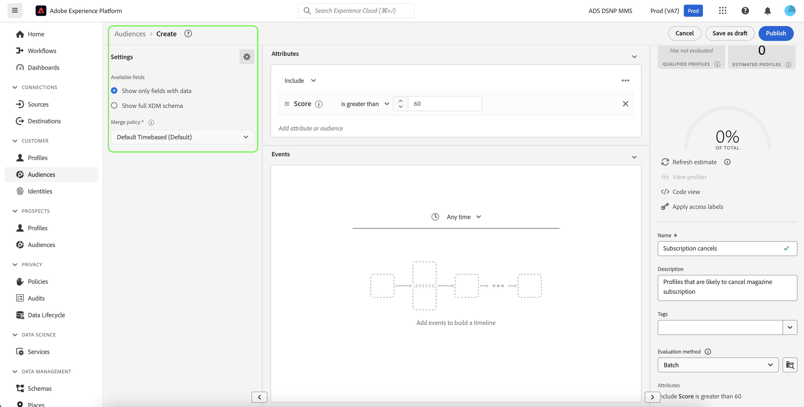

# 예측된 점수로 고객 세그먼트 생성

예측 실행이 완료되면 예측된 성향 점수가 프로필에서 자동으로 사용됩니다. 고객 AI 점수로 프로필을 보강하면 고객 세그먼트를 만들어 성향 점수에 따라 대상자를 찾을 수 있습니다. 이 섹션에서는 세그먼트 빌더를 사용하여 세그먼트를 만드는 단계를 설명합니다. 세그먼트 만들기에 대한 강력한 튜토리얼을 보려면 다음을 참조하십시오 [세그먼트 빌더 사용 안내서](../../../segmentation/ui/segment-builder.md).

>[!IMPORTANT]
>
>이 방법을 활용하려면 데이터 세트에 대해 실시간 고객 프로필 을 활성화해야 합니다.

플랫폼 UI에서 **[!UICONTROL 세그먼트]** 왼쪽 탐색에서 을 클릭한 다음 **[!UICONTROL 세그먼트 만들기]**.

다음 **세그먼트 빌더** 가 표시됩니다. 왼쪽에서 **[!UICONTROL 필드]** 열 및 아래 **[!UICONTROL 속성]** 탭에서 다음 폴더를 클릭합니다. **[!UICONTROL XDM 개별 프로필]** 그런 다음 조직의 네임스페이스가 있는 폴더를 클릭합니다. 폴더 이름: **[!UICONTROL 고객 AI]** 예측 실행의 결과를 포함하며, 점수가 속한 인스턴스의 이름을 따서 지정합니다. 원하는 인스턴스의 결과에 액세스하려면 인스턴스 폴더를 클릭합니다.

세그먼트 빌더의 중앙에 있으며 **[!UICONTROL 점수]** 속성에 속성 추가 *규칙 빌더 캔버스* 을 클릭하여 규칙을 정의합니다.

오른쪽 아래 *세그먼트 속성* 열에서 세그먼트 이름을 입력합니다.

왼쪽 위 *필드* 열을 클릭하고 **톱니바퀴** 아이콘 및 선택 *병합 정책* 드롭다운에서 을 클릭합니다. 클릭 **[!UICONTROL 저장]** 세그먼트 만들기.

## 다음 단계

이 자습서에 따라 세그먼트 빌더를 사용하여 성향 점수를 기반으로 대상자를 성공적으로 찾았습니다. 이제 대상을 대상으로 활성화하여 대상을 타기팅할 수 있습니다. 다음을 참조하십시오. [대상 개요](../../../destinations/home.md) 추가 정보.
