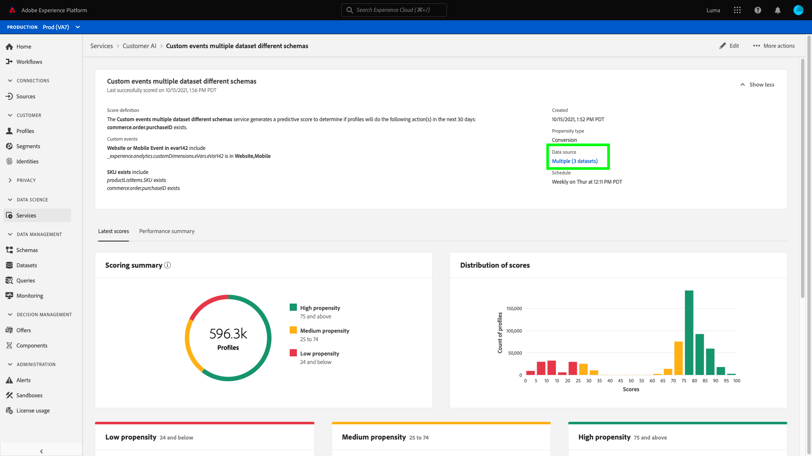

# 고객 AI로 통찰력 살펴보기

Intelligent Services의 일부인 고객 AI는 마케터에게 Adobe Sensei을 활용하여 고객이 다음에 취할 조치를 예측할 수 있는 권한을 제공합니다. 고객 AI는 규모에 따라 개별 프로필에 대한 이탈 및 전환과 같은 사용자 정의 성향 점수를 생성하는 데 사용됩니다. 비즈니스 요구 사항을 머신 러닝 문제로 변환하거나 알고리즘 선택, 교육 또는 배포를 수행하지 않아도 됩니다.

이 문서는 Intelligent Services Customer AI 사용자 인터페이스에서 서비스 인스턴스 인사이트와 상호 작용하기 위한 안내서 역할을 합니다.

## 시작하기

고객 AI에 대한 인사이트를 활용하려면 성공적인 실행 상태가 제공되는 서비스 인스턴스가 있어야 합니다. 새 서비스 인스턴스를 생성하려면 다음을 방문하십시오. [Customer AI 인스턴스 구성](./configure.md). 최근에 서비스 인스턴스를 만들었지만 아직 교육 및 채점 중인 경우 24시간 동안 실행을 완료할 수 있도록 허용하십시오.

## 서비스 인스턴스 개요

다음에서 [!DNL Adobe Experience Platform] UI, 선택 **[!UICONTROL 서비스]** 왼쪽 탐색. 다음 *서비스* 브라우저가 나타나고 사용 가능한 Intelligent Services가 표시됩니다. Customer AI용 컨테이너에서 을 선택합니다. **[!UICONTROL 열기]**.

Customer AI 서비스 페이지가 나타납니다. 이 페이지에는 고객 AI의 서비스 인스턴스가 나열되며 인스턴스 이름, 성향 유형, 인스턴스 실행 빈도, 마지막 업데이트 상태 등 고객 AI에 대한 정보가 표시됩니다.

>[!NOTE]
>
>채점 실행이 완료된 서비스 인스턴스에만 인사이트가 있습니다.

시작할 서비스 인스턴스 이름을 선택하십시오.

다음으로, 해당 서비스 인스턴스에 대한 인사이트 페이지에 선택 사항이 표시됩니다 **[!UICONTROL 최신 점수]** 또는 **[!UICONTROL 성능 요약]**. 기본 탭 **[!UICONTROL 최신 점수]** 는 데이터의 시각화를 제공합니다. 이 안내서 전체에서 시각화와 데이터로 수행할 수 있는 작업에 대해 자세히 설명합니다.

다음 **[!UICONTROL 성능 요약]** 탭에는 각 성향 버킷에 대한 실제 이탈률 또는 전환율이 표시됩니다. 자세한 내용은 의 섹션을 참조하십시오. [성능 요약 지표](#performance-metrics).

## 서비스 인스턴스 세부 정보

서비스 인스턴스 세부 사항을 보는 방법에는 대시보드에서 또는 서비스 인스턴스 내에서 두 가지가 있습니다.

### 서비스 인스턴스 대시보드

대시보드 내에서 서비스 인스턴스 세부 정보의 개요를 보려면 이름에 첨부된 하이퍼링크를 피하고 서비스 인스턴스 컨테이너를 선택합니다. 이렇게 하면 추가 세부 정보를 제공하는 오른쪽 레일이 열립니다. 컨트롤에는 다음 항목이 포함됩니다.

- **[!UICONTROL 편집]**: 선택 **[!UICONTROL 편집]** 기존 서비스 인스턴스를 수정할 수 있습니다. 인스턴스의 이름, 설명 및 채점 빈도를 편집할 수 있습니다.
- **[!UICONTROL 복제]**: 선택 **[!UICONTROL 복제]** 현재 선택한 서비스 인스턴스 설정을 복사합니다. 그런 다음 워크플로우를 수정하여 약간 수정하고 새 인스턴스로 이름을 바꿀 수 있습니다.
- **[!UICONTROL 삭제]**: 내역 실행을 포함하여 서비스 인스턴스를 삭제할 수 있습니다.
- **[!UICONTROL 데이터 소스]**: 이 인스턴스에서 사용하는 데이터 세트에 대한 링크입니다.
- **[!UICONTROL 실행 빈도]**: 채점 실행이 발생하는 빈도와 시기.
- **[!UICONTROL 점수 정의]**: 이 인스턴스에 대해 구성한 목표에 대한 빠른 개요입니다.

>[!NOTE]
>
>채점 실행이 실패할 경우 오류 메시지가 표시됩니다. 오류 메시지가 아래에 나열됩니다. **마지막 실행 세부 정보** 실패한 실행에만 표시되는 오른쪽 레일에 있습니다.

### 더 많은 인사이트 표시 드롭다운

서비스 인스턴스에 대한 추가 세부 정보를 보는 두 번째 방법은 Insights 페이지에 있습니다. 선택 **[!UICONTROL 더 보기]** 오른쪽 상단에서 드롭다운을 채웁니다. 점수 정의, 작성 시기, 성향 유형 및 사용된 데이터 세트와 같은 세부 정보가 나열됩니다. 나열된 속성에 대한 자세한 내용은 다음을 참조하십시오. [Customer AI 인스턴스 구성](./configure.md).

### Customer AI 데이터 세트 미리보기 팝오버

Customer AI에서 데이터 세트를 두 개 이상 사용하는 경우 하이퍼링크 레이블이 표시됩니다 **[!UICONTROL 복수]** 뒤에 대괄호로 묶인 데이터 세트의 수가 옵니다. `()` 이(가) 제공됩니다.

여러 데이터 세트 링크를 선택하면 Customer AI 데이터 세트 미리보기 팝오버가 열립니다. 미리보기의 각 색상은 데이터 세트 열의 왼쪽에 있는 색상 키로 표시되는 대로 데이터 세트를 나타냅니다. 이 예제에서는 해당 항목만 볼 수 있습니다 **데이터 세트 1** 다음을 포함: `PROP1` 열.

### 인스턴스 편집

인스턴스를 편집하려면 다음을 선택합니다 **[!UICONTROL 편집]** 을 클릭합니다.

인스턴스의 이름, 설명, 상태 및 채점 빈도를 편집할 수 있는 편집 대화 상자가 나타납니다. 변경 사항을 확인하고 대화 상자를 닫으려면 을 선택합니다. **[!UICONTROL 저장]** 오른쪽 하단에 있습니다.

### 추가 작업

다음 **[!UICONTROL 추가 작업]** 버튼은 다음 옆에 있는 오른쪽 상단 탐색에 있습니다 **[!UICONTROL 편집]**. 선택 **[!UICONTROL 추가 작업]** 다음 작업 중 하나를 선택할 수 있는 드롭다운을 엽니다.

- **[!UICONTROL 복제]**: 선택 **[!UICONTROL 복제]** 설정된 서비스 인스턴스를 복사합니다. 그런 다음 워크플로우를 수정하여 약간 수정하고 새 인스턴스로 이름을 바꿀 수 있습니다.
- **[!UICONTROL 삭제]**: 인스턴스를 삭제합니다.
- **[!UICONTROL 액세스 점수]**: 선택 **[!UICONTROL 액세스 점수]** 에 대한 링크를 제공하는 대화 상자를 엽니다. [고객 AI에 대한 점수 다운로드](./download-scores.md) 자습서에서는 API 호출에 필요한 데이터 세트 id도 제공합니다.
- **[!UICONTROL 실행 내역 보기]**: 서비스 인스턴스와 연결된 모든 채점 실행 목록이 포함된 대화 상자가 나타납니다.

## 채점 요약 {#scoring-summary}

채점 요약은 채점된 총 프로필 수를 표시하고 높은 성향, 중간 성향 및 낮은 성향을 포함하는 버킷으로 분류합니다. 성향 버킷은 점수 범위를 기반으로 결정되며, 낮음은 24 미만, 중간은 25~74, 높음은 74 이상입니다. 각 버킷에는 범례에 해당하는 색상이 있습니다.

>[!NOTE]
>
>전환성향 점수일 경우, 높은 점수는 녹색으로 낮은 점수는 빨간색으로 표시됩니다. 이탈 성향을 예측하는 경우 이것이 뒤집히면, 높은 점수는 빨간색이고 낮은 점수는 녹색이다. 중간 버킷은 선택한 성향 유형에 관계없이 노란색으로 유지됩니다.

링에 있는 임의의 색상을 마우스로 가리키면 버킷에 속한 프로필의 비율 및 총 수와 같은 추가 정보를 볼 수 있습니다.

## 점수 분포

다음 **[!UICONTROL 점수 분포]** 카드를 통해 점수를 기반으로 모집단의 시각적 요약을 볼 수 있습니다. 다음에 표시되는 색상 [!UICONTROL 점수 분포] 카드는 생성된 성향 점수의 유형을 나타냅니다. 채점 분포를 마우스로 가리키면 해당 분포에 속하는 정확한 수가 제공됩니다.

## 영향력 있는 요인

각 스코어 버킷에 대해 해당 버킷에 대해 가장 영향력 있는 상위 10개 요소를 표시하는 카드가 생성됩니다. 영향력 있는 요소는 고객이 다양한 스코어 버킷에 속하는 이유에 대한 추가 세부 정보를 제공합니다.

### 영향력 있는 요인 드릴다운

가장 영향력 있는 요인 중 하나에 마우스를 가져다 대면 데이터가 더욱 손상됩니다. 특정 프로필이 성향 버킷에 속하는 이유에 대한 개요가 제공됩니다. 요소에 따라 number, categorical 또는 boolean 값이 제공될 수 있습니다. 아래 예는 지역별 범주별 값을 표시합니다.

또한 드릴다운을 사용하면 분배 요소가 둘 이상의 성향 버킷에서 발생하는 경우 이를 비교하고 이러한 값으로 더 구체적인 세그먼트를 만들 수 있습니다. 다음 예제는 첫 번째 사용 사례를 보여줍니다.

전환 성향이 낮은 프로필이 adobe.com 웹 페이지를 최근에 방문했을 가능성이 더 낮다는 것을 알 수 있습니다. &quot;마지막 웹 방문 이후의 일수&quot; 요소는 중간 성향 프로필의 26%에 비해 8%만 해당됩니다. 이 숫자들을 사용하여 계수에 대한 각 버켓 내 분포를 비교할 수 있습니다. 이 정보는 웹 방문의 최근 상태가 중간 성향 버킷에서처럼 낮은 성향 버킷에 영향을 미치지 않음을 유추하는 데 사용할 수 있습니다.

### 세그먼트를 만듭니다

선택 **[!UICONTROL 세그먼트 만들기]** 낮은 성향, 중간 성향 및 높은 성향을 위한 버킷의 버튼이 세그먼트 빌더로 리디렉션됩니다.

>[!NOTE]
>
>다음 **[!UICONTROL 세그먼트 만들기]** 단추는 데이터 세트에 대해 실시간 고객 프로필이 활성화된 경우에만 사용할 수 있습니다. 실시간 고객 프로필을 활성화하는 방법에 대한 자세한 내용은 [실시간 고객 프로필 개요](../../../rtcdp/overview.md).

세그먼트 빌더는 세그먼트를 정의하는 데 사용됩니다. 선택 시 **[!UICONTROL 세그먼트 만들기]** Customer AI는 인사이트 페이지에서 선택한 버킷 정보를 세그먼트에 자동으로 추가합니다. 세그먼트 만들기를 완료하려면 **이름** 및 **설명** 세그먼트 빌더 사용자 인터페이스의 오른쪽 레일에 있는 컨테이너. 세그먼트에 이름과 설명을 지정하고 다음을 선택합니다. **[!UICONTROL 저장]** 오른쪽 상단에서

>[!NOTE]
>
>성향 점수는 개별 프로필에 작성되므로 다른 프로필 속성과 마찬가지로 세그먼트 빌더에서 사용할 수 있습니다. 세그먼트 빌더로 이동하여 새 세그먼트를 만들면 네임스페이스 Customer AI에서 다양한 성향 점수를 모두 볼 수 있습니다.

Platform UI에서 새 세그먼트를 보려면 **[!UICONTROL 세그먼트]** 왼쪽 탐색. 다음 **[!UICONTROL 찾아보기]** 페이지가 나타나고 사용 가능한 모든 세그먼트가 표시됩니다.

## 과거 성능 {#historical-performance}

다음 **[!UICONTROL 성능 요약]** 탭에는 고객 AI가 채점한 각 성향 버킷으로 구분된 실제 이탈률 또는 전환율이 표시됩니다.

처음에는 예상 비율(점선)만 표시됩니다. 채점 실행이 발생하지 않았고 데이터를 아직 사용할 수 없는 경우 예상 비율이 표시됩니다. 그러나 결과 창이 지나면 예상 비율이 실제 비율(실선)로 대체됩니다.

마우스로 라인을 가리키면 해당 버킷의 해당 날짜에 대한 날짜 및 실제/예상 요금이 표시됩니다.

표시되는 예상 및 실제 요금에 대한 시간대를 필터링할 수 있습니다. 다음 항목 선택 **달력 아이콘** 그런 다음 새 날짜 범위를 선택합니다. 각 버킷의 결과가 새 날짜 범위 내에 표시되도록 업데이트됩니다.

### 개별 채점 실행률

의 아래쪽 절반 **[!UICONTROL 성능 요약]** 탭에는 각 개별 채점 실행에 대한 결과가 표시됩니다. 다른 채점 실행에 대한 결과를 표시하려면 오른쪽 상단에서 드롭다운 날짜를 선택합니다.

이탈을 예측하는지 아니면 전환을 예측하는지에 따라 [!UICONTROL 점수 분포] 그래프는 각 증분마다 이탈/전환된 프로필과 이탈되지 않은 프로필의 분포를 표시합니다.

## 모델 평가 {#model-evaluation}

마케터는 과거 성과 탭에서 시간에 따른 예측 및 실제 결과를 추적할 수 있을 뿐만 아니라 모델 평가 탭을 사용하여 모델 품질에 대해 훨씬 더 투명합니다. 상승도 및 이득 차트를 사용하여 예측 모델 사용과 무작위 타깃팅의 차이점을 판단할 수 있습니다. 또한 각 점수 컷오프에서 얼마나 많은 긍정적인 결과가 캡처될지 결정할 수 있습니다. 이 기능은 세분화하고 마케팅 작업과 ROI를 연계하는 데 유용합니다.

### 상승도 차트

상승도 차트는 무작위 타기팅 대신 예측 모델을 사용하여 개선 사항을 측정합니다.

고품질 모델 지표는 다음과 같습니다.

- 처음 몇 십분위의 높은 상승도 값. 이는 모델이 관심 있는 행동을 취하는 성향이 가장 높은 사용자를 식별하는 데 뛰어나다는 것을 의미한다.
- 내림차순 상승도 값. 이는 점수가 높은 고객이 점수가 낮은 고객보다 관심 있는 행동을 할 가능성이 더 높다는 것을 의미합니다.

### 이익 차트

누적 이익 차트는 특정 임계값 이상의 점수를 타겟팅하여 캡처된 긍정적인 결과의 백분율을 측정합니다. 성향 점수에 따라 고객을 높은 점수에서 낮은 점수로 정렬한 후 모집단을 십분위수(10개의 동일한 크기 그룹)로 나눕니다. 완벽한 모델은 가장 높은 점수 십분위수에서 모든 긍정적인 결과를 포착할 것이다. 기본 무작위 타기팅 방법은 그룹의 크기에 비례하여 긍정적인 결과를 캡처합니다. 사용자의 30%를 타기팅하면 결과의 30%가 캡처됩니다.

고품질 모델 지표는 다음과 같습니다.

- 누적 이익은 100%에 빠르게 접근합니다.
- 모델에 대한 누적 이익 곡선은 차트의 왼쪽 상단 모서리에 더 가깝습니다.
- 누적 이익 차트는 세분화 및 타기팅에 대한 점수 컷오프를 결정하는 데 사용할 수 있습니다. 예를 들어 모델이 처음 2개의 점수 십분위수에서 긍정적인 결과의 70%를 캡처하는 경우 PercentileScore > 80이 넘는 사용자를 타겟팅하면 긍정적인 결과의 약 70%를 캡처할 것으로 예상됩니다.

### AUC(곡선 아래 면적)

AUC는 점수별 순위와 예측 목표 발생 간의 관계의 강도를 반영한다. An **AUC** 0.5는 모형이 무작위 추정치보다 좋지 않음을 의미한다. An **AUC** 의 1은 모델이 관련 조치를 취할 사람을 완벽하게 예측할 수 있음을 의미합니다.

## 다음 단계

이 문서에서는 고객 AI 서비스 인스턴스가 제공하는 통찰력에 대해 간략히 설명했습니다. 이제 의 자습서를 계속할 수 있습니다. [고객 AI에서 점수 다운로드](./download-scores.md) 또는 다른 항목 검색 [Adobe Intelligent Services](../../home.md) 제공되는 가이드.

## 추가 리소스

다음 비디오에서는 고객 AI를 사용하여 모델 및 영향력 있는 요소의 출력을 확인하는 방법에 대해 설명합니다.

>[!VIDEO](https://video.tv.adobe.com/v/32666?learn=on&quality=12)
