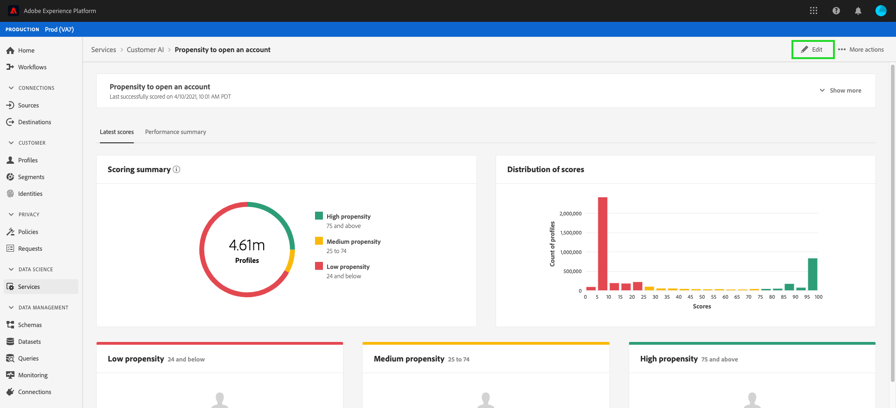

# 고객 AI를 통한 인사이트 검색

고객 AI는 인텔리전트 서비스의 일부로 마케터에게 Adobe Sensei을 활용하여 향후 고객의 행동을 예측할 수 있는 기능을 제공합니다. 고객 AI는 규모에 따라 개별 프로파일에 대한 이탈 및 전환과 같은 사용자 지정 성향 점수를 생성하는 데 사용됩니다. 이 작업은 알고리즘, 트레이닝 또는 배포를 선택하여 비즈니스 요구 사항을 머신 러닝 문제로 전환할 필요 없이 이루어집니다.

이 문서는 Intelligent Services 고객 AI 사용자 인터페이스에서 서비스 인스턴스 인사이트와 상호 작용하기 위한 가이드 역할을 합니다.

## 시작하기

고객 AI에 대한 인사이트를 활용하려면 성공적인 실행 상태의 서비스 인스턴스를 사용할 수 있어야 합니다. 새 서비스 인스턴스를 만들려면 고객 AI 인스턴스 [구성을 방문하십시오](./configure.md). 최근에 서비스 인스턴스를 만들었는데 여전히 트레이닝과 점수 지정 중이라면 24시간 후에 실행을 완료하십시오.

## 서비스 인스턴스 개요

UI [!DNL Adobe Experience Platform] 에서 왼쪽 탐색 **[!UICONTROL 영역에서 서비스]** 를 클릭합니다. 서비스 *브라우저가* 나타나고 사용 가능한 지능형 서비스가 표시됩니다. 고객 AI의 컨테이너에서 열기를 **[!UICONTROL 클릭합니다]**.

고객 AI 서비스 페이지가 나타납니다. 이 페이지에는 고객 AI의 서비스 인스턴스가 나열되며 인스턴스 이름, 성향 유형, 인스턴스 실행 빈도, 마지막 업데이트 상태 등 고객 AI에 대한 정보가 표시됩니다.

>[!NOTE]
>
>성공적인 점수 실행을 완료한 서비스 인스턴스에만 통찰력이 있습니다.

시작하려면 서비스 인스턴스 이름을 클릭합니다.

그런 다음 해당 서비스 인스턴스에 대한 인사이트 페이지가 나타나며 여기에서 데이터의 시각화가 제공됩니다. 시각화 및 데이터를 사용하여 수행할 수 있는 작업은 이 안내서 전반에서 자세히 설명합니다.

### 서비스 인스턴스 세부 정보

두 가지 방법으로 서비스 인스턴스 세부 사항을 볼 수 있으며, 첫 번째 방법은 대시보드에서, 두 번째 방법은 서비스 인스턴스 내에서 확인할 수 있습니다.

대시보드 내에서 세부 사항을 보려면 서비스 인스턴스 컨테이너를 클릭하여 이름에 연결된 하이퍼링크를 방지합니다. 설명, 점수 주기, 예측 목표 및 적격한 모집단과 같은 추가 세부 정보를 제공하는 오른쪽 레일이 열립니다. 또한 편집(Edit) **[!UICONTROL 또는 삭제(Delete)를 클릭하여 인스턴스를 편집하고 삭제하도록 선택할 수]** 있습니다 ****.

>[!NOTE]
>
>점수 실행이 실패하는 경우 오류 메시지가 표시됩니다. 오류 메시지가 오른쪽 레일의 *마지막 실행 세부* 사항 아래에 나열되며, 이 세부 사항은 실패한 실행에만 표시됩니다.

서비스 인스턴스에 대한 추가 세부 정보를 보는 두 번째 방법은 인사이트 페이지 내에 있습니다. 오른쪽 **[!UICONTROL 상단에 있는 자세히]** 표시를 클릭하여 드롭다운을 채울 수 있습니다. 점수 정의, 생성 시간, 성향 유형 등의 세부 사항이 나열됩니다. 나열된 속성에 대한 자세한 내용은 고객 AI 인스턴스 [구성을 참조하십시오](./configure.md).

### 인스턴스 편집

인스턴스를 편집하려면 오른쪽 **[!UICONTROL 상단]** 탐색에서 편집을 클릭합니다.

편집 대화 상자가 표시되어 인스턴스의 *설명* 및 *점수* 주기를 편집할 수 있습니다. 변경 사항을 확인하고 대화 상자를 닫으려면 오른쪽 **[!UICONTROL 아래 모서리에서 편집을]** 클릭합니다.

### 추가 작업

추가 **[!UICONTROL 작업]** 단추는 **[!UICONTROL 편집]**&#x200B;옆에 있는 오른쪽 위 탐색에 있습니다. 추가 작업 **[!UICONTROL 을]** 클릭하면 다음 작업 중 하나를 선택할 수 있는 드롭다운이 열립니다.

- **[!UICONTROL 삭제]**:인스턴스를 삭제합니다.
- **[!UICONTROL 액세스 점수]**:액세스 점수 *를* 클릭하면 고객 AI [자습서의](./download-scores.md) 다운로드 점수에 대한 링크를 제공하는 대화 상자가 열리고 API 호출을 수행하는 데 필요한 데이터 세트 ID도 대화 상자에 제공됩니다.
- **[!UICONTROL 실행 내역 보기]**:서비스 인스턴스와 연관된 모든 점수 실행 목록이 포함된 대화 상자가 나타납니다.

## 점수 요약 {#scoring-summary}

점수 요약은 채점된 총 프로필 수를 표시하고 이것을 높은 성향, 중간 성향 및 낮은 경향을 포함하는 버킷으로 분류합니다. 성향 버킷은 점수 범위를 기반으로 결정되며, 낮음은 24보다 작으며, 중간값은 25~74이고, 높음은 74를 넘습니다. 각 버킷에는 범례에 해당하는 색상이 있습니다.

>[!NOTE]
>
>전환 성향 점수인 경우 높은 점수가 녹색으로 표시되고 낮은 점수가 빨간색으로 표시됩니다. 이탈률 이탈을 예측할 경우 이를 뒤집으면 높은 점수가 빨간색으로 표시되고 낮은 점수가 녹색으로 표시됩니다. 중간 버킷은 선택한 성향 유형에 관계없이 노란색으로 유지됩니다.

## 스코어 배포

스코어 **[!UICONTROL 카드]** 분배는 점수를 기준으로 모집단의 시각적 요약을 제공합니다. 점수 ** 분포에 표시되는 색상은 생성된 성향 점수 유형을 나타냅니다.

## 영향력 있는 요인

각 점수 버킷에 대해 해당 버킷에 대해 상위 10개의 영향력 있는 요소를 보여주는 카드가 생성됩니다. 영향력 있는 요인으로 인해 고객이 다양한 점수 버킷에 속해 있는 이유에 대한 자세한 내용을 살펴볼 수 있습니다.

### 세그먼트 만들기

[ **[!UICONTROL 낮음], [중간] 및 [높음] 성향]** 버킷의 [세그먼트 만들기] 단추를 클릭하면 세그먼트 빌더로 리디렉션됩니다.

>[!NOTE]
>
>세그먼트 **[!UICONTROL 만들기]** 단추는 데이터 세트에 대해 실시간 고객 프로필을 활성화한 경우에만 사용할 수 있습니다. 실시간 고객 프로필을 활성화하는 방법에 대한 자세한 내용은 [실시간 고객 프로필 개요를 참조하십시오](../../../rtcdp/overview.md).

세그먼트 빌더는 세그먼트를 정의하는 데 사용됩니다. 인사이트 **[!UICONTROL 페이지에서]** 세그먼트 만들기를 선택하면 고객 AI가 선택한 버킷 정보를 세그먼트에 자동으로 추가합니다. 세그먼트 만들기를 완료하려면 세그먼트 빌더 사용자 인터페이스의 오른쪽 레일에 있는 *이름* 및 *설명* 컨테이너를간단히 채우십시오. 세그먼트에 이름과 설명을 지정한 후 오른쪽 **[!UICONTROL 상단에서 저장을]** 클릭합니다.

>[!NOTE]
>
>성향 점수는 개별 프로필에 작성되므로 다른 프로필 속성과 마찬가지로 세그먼트 빌더에서 사용할 수 있습니다. 세그먼트 빌더로 이동하여 새 세그먼트를 만들면 사용자의 네임스페이스 Customer AI에서 모든 다양한 성향 점수를 볼 수 있습니다.

플랫폼 UI에서 새 세그먼트를 보려면 왼쪽 탐색 **[!UICONTROL 에서]** 세그먼트를 클릭합니다. 검색 **[!UICONTROL 페이지가]** 나타나고 사용 가능한 모든 세그먼트가 표시됩니다.

## 다음 단계

이 문서에서는 고객 AI 서비스 인스턴스에서 제공하는 인사이트를 간략하게 설명합니다. 이제 고객 AI에서 스코어를 [다운로드하거나 제공되는 다른](./download-scores.md) Adobe 지능형 서비스 [가이드를](../../home.md) 찾아보는 방법을 튜토리얼로 계속 진행할 수 있습니다.

## Journey Orchestration용

다음 비디오에서는 고객 AI를 사용하여 모델과 영향력 있는 요소의 결과를 확인하는 방법을 설명합니다.

>[!VIDEO](https://video.tv.adobe.com/v/32666?learn=on&quality=12)