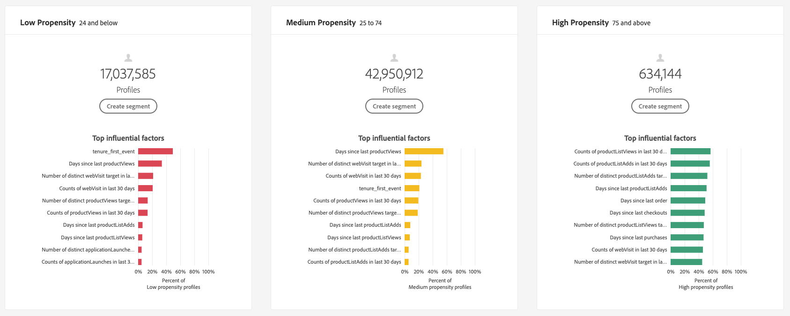

# 고객 AI를 통한 인사이트 확보

고객 AI는 지능형 서비스의 일부인 마케터에게 Adobe Sensei을 활용하여 향후 고객의 행동을 예측할 수 있는 기능을 제공합니다. 고객 AI는 규모에 따라 개별 프로필에 대한 이탈 및 전환과 같은 사용자 지정 성향 점수를 생성하는 데 사용됩니다. 머신 러닝 문제를 해결하고 알고리즘, 트레이닝 또는 배포를 선택하며 비즈니스 요구를 충족할 필요가 없습니다.

이 문서는 Intelligent Services 고객 AI 사용자 인터페이스에서 서비스 인스턴스 인사이트와 상호 작용하기 위한 가이드 역할을 합니다.

## 시작하기

고객 AI에 대한 통찰력을 활용하려면 성공적인 실행 상태의 서비스 인스턴스를 사용할 수 있어야 합니다. 새 서비스 인스턴스를 만들려면 [고객 AI 인스턴스 구성](./configure.md)을 방문하십시오. 최근에 서비스 인스턴스를 만들었는데 여전히 트레이닝과 점수 지정 중이라면 24시간 후에 실행을 완료하십시오.

## 서비스 인스턴스 개요

[!DNL Adobe Experience Platform] UI의 왼쪽 탐색 영역에서 **[!UICONTROL Services]**&#x200B;을 클릭합니다. *서비스* 브라우저가 나타나고 사용 가능한 Intelligent Services가 표시됩니다. 고객 AI의 컨테이너에서 **[!UICONTROL Open]**&#x200B;을 클릭합니다.

고객 AI 서비스 페이지가 나타납니다. 이 페이지에는 고객 AI의 서비스 인스턴스가 나열되며 인스턴스 이름, 성향 유형, 인스턴스 실행 빈도 및 마지막 업데이트 상태 등 고객 AI에 대한 정보가 표시됩니다.

>[!NOTE]
>
>성공적인 점수 실행을 완료한 서비스 인스턴스에만 통찰력이 있습니다.

시작할 서비스 인스턴스 이름을 선택합니다.

그런 다음 해당 서비스 인스턴스에 대한 인사이트 페이지가 **[!UICONTROL Latest scores]** 또는 **[!UICONTROL Performance summary]** 선택 옵션과 함께 나타납니다. 기본 탭 **[!UICONTROL Latest scores]**&#x200B;은 데이터의 시각화를 제공합니다. 시각화 및 데이터를 사용하여 수행할 수 있는 작업은 이 안내서 전반에서 자세히 설명합니다.

**[!UICONTROL Performance summary]** 탭에는 각 성향 버킷에 대한 실제 이탈 또는 전환율이 표시됩니다. 자세한 내용은 [성능 요약 지표](#performance-metrics)의 섹션을 참조하십시오.

### 서비스 인스턴스 세부 사항

서비스 인스턴스 세부 사항을 보는 방법에는 두 가지가 있습니다.대시보드나 서비스 인스턴스 내에서

대시보드 내의 서비스 인스턴스 세부 정보에 대한 개요를 보려면 서비스 인스턴스 컨테이너를 선택하고 이름에 첨부된 하이퍼링크를 피하십시오. 그러면 추가 세부 정보를 제공하는 오른쪽 레일이 열립니다. 컨트롤에는 다음이 포함됩니다.

- **[!UICONTROL Edit]**:을  **[!UICONTROL Edit]** 선택하면 기존 서비스 인스턴스를 수정할 수 있습니다. 인스턴스의 이름, 설명 및 점수 지정 빈도를 편집할 수 있습니다.
- **[!UICONTROL Clone]**:을  **[!UICONTROL Clone]** 선택하면 현재 선택한 서비스 인스턴스 설정이 복사됩니다. 그런 다음 워크플로우를 수정하여 일부를 수정하고 새 인스턴스로 이름을 변경할 수 있습니다.
- **[!UICONTROL Delete]**:모든 기록 실행을 포함하여 서비스 인스턴스를 삭제할 수 있습니다.
- **[!UICONTROL Data source]**:이 인스턴스에서 사용하는 데이터 세트에 대한 링크입니다.
- **[!UICONTROL Run Frequency]**:점수 매기는 빈도 및 시기.
- **[!UICONTROL Score definition]**:이 인스턴스에 대해 구성한 목표에 대한 빠른 개요입니다.

>[!NOTE]
>
>점수부여 실행에 실패하면 오류 메시지가 표시됩니다. 오류 메시지는 실패한 실행에만 표시되는 오른쪽 레일의 **마지막 실행 세부 사항** 아래에 나열됩니다.

서비스 인스턴스에 대한 추가 세부 정보를 보는 두 번째 방법은 인사이트 페이지 내에 있습니다. 오른쪽 상단에 있는 **[!UICONTROL Show more]**&#x200B;을 클릭하여 드롭다운을 채울 수 있습니다. 점수 정의, 생성된 시기 및 성향 유형과 같은 세부 사항이 나열됩니다. 나열된 속성에 대한 자세한 내용은 [고객 AI 인스턴스 구성](./configure.md)을 참조하십시오.

### 인스턴스 편집

인스턴스를 편집하려면 오른쪽 위 탐색 메뉴에서 **[!UICONTROL Edit]**&#x200B;을 클릭합니다.

인스턴스의 이름, 설명, 상태 및 점수 지정 빈도를 편집할 수 있는 편집 대화 상자가 나타납니다. 변경 내용을 확인하고 대화 상자를 닫으려면 오른쪽 하단 모서리에서 **[!UICONTROL Save]**&#x200B;을 선택합니다.

### 추가 작업

**[!UICONTROL More actions]** 단추는 **[!UICONTROL Edit]** 옆의 오른쪽 위 탐색에 있습니다. **[!UICONTROL More actions]**&#x200B;을 클릭하면 다음 작업 중 하나를 선택할 수 있는 드롭다운이 열립니다.

- **[!UICONTROL Clone]**:을  **[!UICONTROL Clone]** 선택하면 설정된 서비스 인스턴스가 복사됩니다. 그런 다음 워크플로우를 수정하여 일부를 수정하고 새 인스턴스로 이름을 변경할 수 있습니다.
- **[!UICONTROL Delete]**:인스턴스를 삭제합니다.
- **[!UICONTROL Access scores]**:고객  **[!UICONTROL Access scores]** AI 자습서의  [다운로드 점수에 대한 링크를 제공하는 대화 상자가 ](./download-scores.md) 열리면 이 대화 상자는 API 호출을 하는 데 필요한 데이터 세트 ID도 제공합니다.
- **[!UICONTROL View run history]**:서비스 인스턴스와 연관된 모든 점수 실행 목록이 포함된 대화 상자가 나타납니다.

## 점수 요약 {#scoring-summary}

채점 요약에 채점 완료된 프로필의 총 수가 표시되고, 점수를 높거나 중간 정도, 낮은 경향을 포함하는 버킷으로 분류합니다. 성향 버킷은 점수 범위를 기반으로 결정되며, 낮음은 24보다 작으며, 중간 버전은 25에서 74까지의 이상이고, 높음 범위는 74보다 높습니다. 각 버킷에는 범례에 해당하는 색상이 있습니다.

>[!NOTE]
>
>전환 성향 점수인 경우 높은 점수가 녹색으로 표시되고 낮은 점수가 빨간색으로 표시됩니다. 이탈률 이탈률을 예측하면 높은 점수가 빨간색이고 낮은 점수가 녹색입니다. 중간 버킷은 선택한 성향 유형에 관계없이 노란색으로 유지됩니다.

고리에서 색상을 마우스로 가리키면 버킷에 속하는 프로파일의 백분율과 총 수와 같은 추가 정보를 볼 수 있습니다.

## 스코어 배포

**[!UICONTROL Distribution of Scores]** 카드는 점수를 기준으로 모집단의 시각적 요약을 제공합니다. [!UICONTROL Distribution of Scores] 카드에 표시되는 색상은 생성된 성향 점수의 유형을 나타냅니다. 채점 분포에 마우스를 가져가면 해당 분포에 속하는 정확한 카운트가 제공됩니다.

## 영향력 있는 요인

각 점수 버킷에 대해 해당 버킷에 대해 상위 10개의 영향력 있는 요소를 보여주는 카드가 생성됩니다. 영향력 있는 요인으로 인해 고객이 다양한 점수 버킷에 속하는 이유에 대한 자세한 내용을 살펴볼 수 있습니다.

### 영향력 있는 요소 드릴다운

가장 영향력 있는 요인 중 하나를 마우스로 가리키면 데이터가 더욱 분해됩니다. 특정 프로필이 성향 버킷에 속하는 이유에 대한 개요를 제공합니다. 인자에 따라 숫자, 카테고리 또는 부울 값을 지정할 수 있습니다. 아래 예에는 지역별 카테고리 값이 표시됩니다.

또한 드릴다운 기능을 사용하여 둘 이상의 성향 버킷에서 발생하는 배포 요소를 비교하고 이러한 값을 사용하여 더 구체적인 세그먼트를 만들 수 있습니다. 다음 예제에서는 첫 번째 사용 사례를 보여 줍니다.

전환율이 낮은 프로필은 adobe.com 웹 페이지를 최근 방문할 가능성이 적은 것을 확인할 수 있습니다. &quot;마지막 webVisit 이후 일 수&quot; 요소는 중간 성향 프로필의 26%와 비교하여 8%만 범위를 갖습니다. 이 숫자를 사용하여 각 버킷 내의 분포를 요소에 대해 비교할 수 있습니다. 이 정보를 사용하여 중간 성향 버킷에서와 같이 웹 방문의 최근 빈도가 낮은 성향 버킷에서 영향력이 크지 않음을 추론할 수 있습니다.

### 세그먼트 만들기

낮음, 보통 및 높은 성향에 대한 버킷에서 **[!UICONTROL Create Segment]** 단추를 선택하면 세그먼트 빌더로 리디렉션됩니다.

>[!NOTE]
>
>**[!UICONTROL Create Segment]** 단추는 데이터 세트에 대해 실시간 고객 프로필을 사용하는 경우에만 사용할 수 있습니다. 실시간 고객 프로필을 활성화하는 방법에 대한 자세한 내용은 [실시간 고객 프로필 개요](../../../rtcdp/overview.md)를 참조하십시오.

세그먼트 빌더는 세그먼트를 정의하는 데 사용됩니다. 인사이트 페이지에서 **[!UICONTROL Create Segment]**&#x200B;을 선택하면 고객 AI가 선택한 버킷 정보를 세그먼트에 자동으로 추가합니다. 세그먼트 만들기를 완료하려면 세그먼트 빌더 사용자 인터페이스의 오른쪽 레일에 있는 *이름* 및 *설명* 컨테이너를 작성해 주십시오. 세그먼트에 이름과 설명을 지정한 후 오른쪽 상단에서 **[!UICONTROL Save]**&#x200B;을 클릭합니다.

>[!NOTE]
>
>성향 점수는 개별 프로필에 작성되므로 다른 프로필 속성과 마찬가지로 세그먼트 빌더에서 사용할 수 있습니다. 세그먼트 빌더로 이동하여 새 세그먼트를 만들면 네임스페이스 Customer AI 아래에 있는 모든 다양한 성향 점수를 볼 수 있습니다.

플랫폼 UI에서 새 세그먼트를 보려면 왼쪽 탐색 메뉴에서 **[!UICONTROL Segments]**&#x200B;을 클릭합니다. **[!UICONTROL Browse]** 페이지가 나타나고 사용 가능한 모든 세그먼트가 표시됩니다.

## 성과 요약 지표 {#performance-metrics}

**[!UICONTROL Performance summary]** 탭에는 고객 AI에서 획득한 각 성향 버킷으로 구분된 실제 이탈 또는 전환율이 표시됩니다.

처음에는 예상 비율(점선)만 표시됩니다. 점수 실행이 발생하지 않았으며 데이터를 아직 사용할 수 없을 때 예상 요금이 표시됩니다. 그러나 결과 창이 지나면 예상 비율이 실제 비율(실선)으로 대체됩니다.

라인 위로 마우스를 가져가면 해당 버킷의 해당 날짜에 대한 날짜 및 실제/예상 비율이 표시됩니다.

표시되는 예상 및 실제 비율에 대한 기간을 필터링할 수 있습니다. **달력 아이콘** 을 선택한 다음 새 날짜 범위를 선택합니다. 각 버킷의 결과는 새 날짜 범위 내에 표시되도록 업데이트됩니다.

### 개별 점수 실행 비율

**[!UICONTROL Performance summary]** 탭의 아래쪽 절반은 각 개별 점수 실행에 대한 결과를 표시합니다. 오른쪽 상단의 드롭다운 날짜를 선택하여 다른 점수 실행 결과를 표시합니다.

이탈 또는 전환을 예측하는 경우에 따라 [!UICONTROL Distribution of Scores] 그래프는 각 증분으로 변환되거나 변환되지 않은 프로파일 분포를 차례대로 표시합니다.

## 다음 단계

이 문서에서는 고객 AI 서비스 인스턴스에서 제공하는 인사이트를 간략하게 설명합니다. 이제 고객 AI](./download-scores.md)에서 스코어 다운로드에 대한 튜토리얼을 계속 진행하거나 제공된 다른 [Adobe 지능형 서비스](../../home.md) 가이드를 탐색할 수 있습니다.[

## 추가 리소스

다음 비디오에서는 고객 AI를 사용하여 모델과 영향력 있는 요소의 결과를 확인하는 방법을 설명합니다.

>[!VIDEO](https://video.tv.adobe.com/v/32666?learn=on&quality=12)
