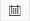
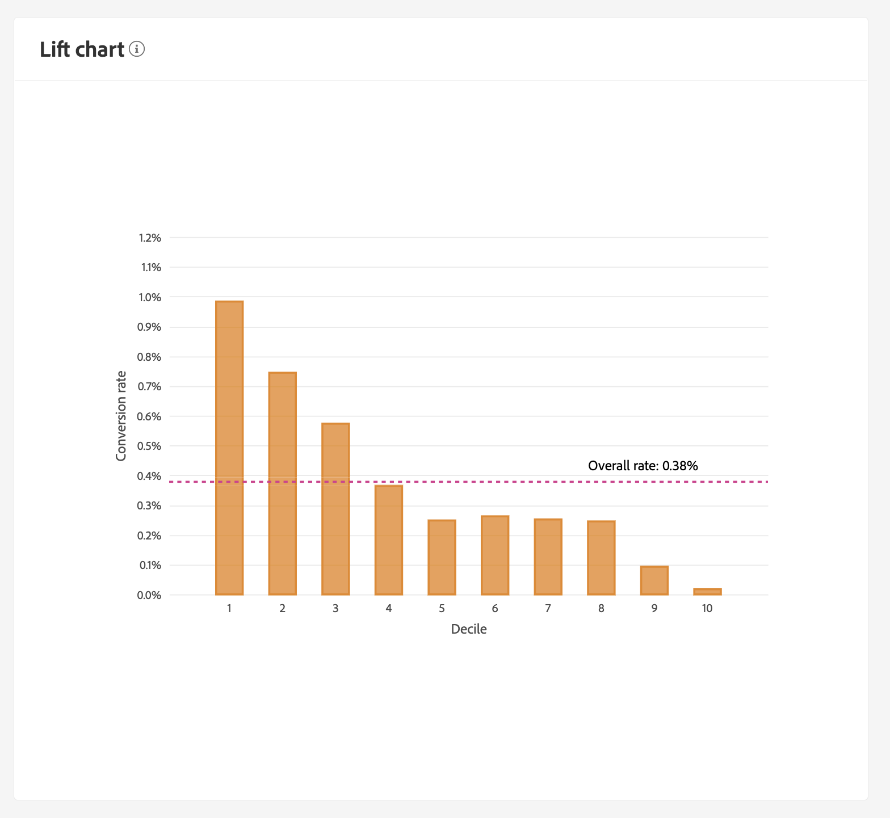

# Customer AI를 통해 인사이트 살펴보기

Customer AI 는 Intelligent Services의 일부로 마케터에게 Adobe Sensei을 활용하여 고객이 다음 조치를 취할 것을 예측할 수 있는 기능을 제공합니다. 고객 AI는 규모에 따라 개별 프로필에 대한 이탈 및 전환과 같은 사용자 정의 성향 점수를 생성하는 데 사용됩니다. 비즈니스 요구 사항을 머신 러닝 문제로 변환하거나 알고리즘을 선택하거나 교육 또는 배포하지 않아도 됩니다.

이 문서는 Intelligent Services Customer AI 사용자 인터페이스의 서비스 인스턴스 인사이트와 상호 작용하기 위한 안내서의 역할을 합니다.

## 시작하기

고객 AI에 대한 인사이트를 활용하려면 실행 상태가 성공적으로 설정된 서비스 인스턴스가 있어야 합니다. 새 서비스 인스턴스를 생성하려면 [고객 AI 인스턴스 구성](./configure.md). 최근에 서비스 인스턴스를 만들었지만 여전히 교육 및 점수 책정 중이라면 실행을 완료하려면 24시간을 허용하십시오.

## 서비스 인스턴스 개요

에서 [!DNL Adobe Experience Platform] UI, 선택 **[!UICONTROL 서비스]** 을 클릭합니다. 다음 *서비스* 브라우저가 나타나고 사용 가능한 Intelligent Services가 표시됩니다. Customer AI 컨테이너에서 를 선택합니다. **[!UICONTROL 열기]**.

고객 AI 서비스 페이지가 나타납니다. 이 페이지에는 고객 AI의 서비스 인스턴스가 나열되며 인스턴스 이름, 성향 유형, 인스턴스 실행 빈도 및 마지막 업데이트 상태 등 해당 인스턴스에 대한 정보가 표시됩니다.

>[!NOTE]
>
>성공적인 점수 실행을 완료한 서비스 인스턴스만 인사이트를 제공합니다.

시작할 서비스 인스턴스 이름을 선택합니다.

다음으로, 선택할 수 있는 옵션이 있는 해당 서비스 인스턴스에 대한 인사이트 페이지가 표시됩니다 **[!UICONTROL 최신 점수]** 또는 **[!UICONTROL 성능 요약]**. 기본 탭 **[!UICONTROL 최신 점수]** 는 데이터에 대한 시각화를 제공합니다. 시각화 및 데이터를 사용하여 수행할 수 있는 작업은 이 안내서 전체에서 자세히 설명합니다.

다음 **[!UICONTROL 성능 요약]** 탭에는 각 성향 버킷에 대한 실제 이탈 또는 전환율이 표시됩니다. 자세한 내용은 [성능 요약 지표](#performance-metrics).

## 서비스 인스턴스 세부 사항

서비스 인스턴스 세부 사항을 보는 방법에는 두 가지가 있습니다. 대시보드 또는 서비스 인스턴스 내에서 또는 삭제할 수 있습니다.

### 서비스 인스턴스 대시보드

대시보드 내의 서비스 인스턴스 세부 정보에 대한 개요를 보려면 이름에 첨부된 하이퍼링크를 제외하고 서비스 인스턴스 컨테이너를 선택합니다. 그러면 추가 세부 사항을 제공하는 오른쪽 레일이 열립니다. 컨트롤에는 다음이 포함되어 있습니다.

- **[!UICONTROL 편집]**: 선택 **[!UICONTROL 편집]** 기존 서비스 인스턴스를 수정할 수 있습니다. 인스턴스의 이름, 설명 및 점수 주기를 편집할 수 있습니다.
- **[!UICONTROL 복제]**: 선택 **[!UICONTROL 복제]** 현재 설정된 서비스 인스턴스를 복사합니다. 그런 다음 워크플로우를 수정하여 작은 수정 사항을 만들고 새 인스턴스로 이름을 변경할 수 있습니다.
- **[!UICONTROL 삭제]**: 과거 실행을 포함하여 서비스 인스턴스를 삭제할 수 있습니다.
- **[!UICONTROL 데이터 소스]**: 이 인스턴스에서 사용하는 데이터 세트에 대한 링크입니다.
- **[!UICONTROL 실행 빈도]**: 점수 매기가 얼마나 자주 그리고 언제 일어나는지.
- **[!UICONTROL 점수 정의]**: 이 인스턴스에 대해 구성한 목표에 대한 간단한 개요입니다.

>[!NOTE]
>
>점수부여 실행이 실패할 경우 오류 메시지가 표시됩니다. 오류 메시지는 아래에 나열됩니다 **마지막 실행 세부 사항** 오른쪽 레일에서 실패한 실행에만 표시됩니다.

### 추가 통찰력 드롭다운 표시

서비스 인스턴스에 대한 추가 세부 정보를 보는 두 번째 방법은 인사이트 페이지 내에 있습니다. 선택 **[!UICONTROL 자세히 보기]** 오른쪽 상단에서 드롭다운을 채웁니다. 점수 정의, 생성 시 성향 유형, 사용된 데이터 세트 등 세부 사항이 나열됩니다. 나열된 속성에 대한 자세한 내용은 [고객 AI 인스턴스 구성](./configure.md).

### 고객 AI 데이터 세트 미리 보기 팝업

Customer AI에서 데이터 세트를 두 개 이상 사용하는 경우 하이퍼링크에서 **[!UICONTROL 다중]** 뒤에 대괄호 안의 데이터 세트 수 `()` 가 제공됩니다.

여러 데이터 세트 링크를 선택하면 고객 AI 데이터 세트 미리 보기 팝오버가 열립니다. 미리 보기에 있는 각 색상은 데이터 세트 열 왼쪽에 있는 색상 키로 표시된 데이터 세트를 나타냅니다. 이 예제에서는 해당 항목만 볼 수 있습니다 **데이터 세트 1** 다음 포함 `PROP1` 열.

### 인스턴스 편집

인스턴스를 편집하려면 **[!UICONTROL 편집]** 을 클릭합니다.

인스턴스의 이름, 설명, 상태 및 점수부여 빈도를 편집할 수 있는 편집 대화 상자가 나타납니다. 변경 사항을 확인하고 대화 상자를 닫으려면 다음을 선택합니다 **[!UICONTROL 저장]** 오른쪽 아래 모서리에 있습니다.

### 추가 작업

다음 **[!UICONTROL 추가 작업]** 버튼은 옆에 있는 오른쪽 상단 탐색에 있습니다 **[!UICONTROL 편집]**. 선택 **[!UICONTROL 추가 작업]** 다음 작업 중 하나를 선택할 수 있는 드롭다운을 엽니다.

- **[!UICONTROL 복제]**: 선택 **[!UICONTROL 복제]** 설정된 서비스 인스턴스를 복사합니다. 그런 다음 워크플로우를 수정하여 작은 수정 사항을 만들고 새 인스턴스로 이름을 변경할 수 있습니다.
- **[!UICONTROL 삭제]**: 인스턴스를 삭제합니다.
- **[!UICONTROL 점수 책정 액세스]**: 선택 **[!UICONTROL 점수 책정 액세스]** 로 연결되는 링크를 제공하는 대화 상자를 엽니다. [고객 AI용 점수 다운로드](./download-scores.md) 자습서에서는 API 호출을 수행하는 데 필요한 데이터 세트 id도 대화 상자에 제공합니다.
- **[!UICONTROL 실행 기록 보기]**: 서비스 인스턴스와 연관된 모든 점수부여 실행 목록이 포함된 대화상자가 나타납니다.

## 점수 요약 {#scoring-summary}

점수 요약은 채점된 총 프로필 수를 표시하며 높은, 중간 및 낮은 성향 수를 포함하는 버킷으로 분류합니다. 성향 버킷은 점수 범위를 기반으로 결정되며, 낮음은 24보다 작고, 중간은 25에서 74까지, 높음은 74보다 높습니다. 각 버킷에는 범례에 해당하는 색상이 있습니다.

>[!NOTE]
>
>전환 성향 점수인 경우 높은 점수는 녹색 및 낮은 점수를 빨간색으로 표시합니다. 이탈 성향을 예측할 경우 이를 뒤집으면 높은 점수가 빨간색으로 표시되고 낮은 점수가 녹색입니다. 미디어 버킷은 선택한 성향 유형에 관계없이 노란색으로 유지됩니다.

고리의 색상을 마우스로 가리키면 버킷에 속하는 프로필의 백분율과 총 수와 같은 추가 정보를 볼 수 있습니다.

## 점수 분배

다음 **[!UICONTROL 점수 분배]** 카드를 통해 점수를 기반으로 모집단의 시각적 요약을 볼 수 있습니다. 에 표시되는 색상 [!UICONTROL 점수 분배] 카드는 생성된 성향 점수의 유형을 나타냅니다. 점수부여 분배를 마우스로 가리키면 해당 분배에 속하는 정확한 수가 제공됩니다.

## 영향력 있는 요소

각 점수 버킷에 대해 해당 버킷에 대해 상위 10개의 영향력 있는 요소를 보여주는 카드가 생성됩니다. 영향력 있는 요소는 고객이 다양한 점수 버킷에 속하는 이유에 대한 추가 세부 정보를 제공합니다.

### 영향력 있는 요소 드릴다운

마우스로 가장 영향력 있는 요소 중 하나를 가리키면 데이터가 더 손상됩니다. 특정 프로필이 성향 버킷에 속하는 이유에 대한 개요를 제공합니다. 인자에 따라 숫자, 카테고리 또는 부울 값이 제공될 수 있습니다. 아래 예에는 지역별 카테고리적 값이 표시됩니다.

또한 드릴다운을 사용하여 두 개 이상의 성향 버킷에서 발생하는 경우 분배 요소를 비교하고 이러한 값으로 더 구체적인 세그먼트를 만들 수 있습니다. 다음 예는 첫 번째 사용 사례를 보여줍니다.

전환율이 낮은 프로필은 adobe.com 웹 페이지를 최근 방문할 가능성이 적다는 것을 알 수 있습니다. &quot;마지막 webVisit 이후 일 수&quot; 인수에는 중간 성향 프로필의 26%와 비교하여 8% 범위만 있습니다. 이 숫자를 사용하여 계수에 대해 각 버킷 내의 분포를 비교할 수 있습니다. 이 정보를 사용하여 웹 방문의 최신성이 중간 성향 버킷에서와 마찬가지로 낮은 성향 버킷에서 영향을 주지 않음을 추론할 수 있습니다.

### 세그먼트를 만듭니다

선택 **[!UICONTROL 세그먼트 만들기]** 낮은, 중간 및 높은 성향 대상에 대한 버킷에서 세그먼트 빌더로 리디렉션합니다.

>[!NOTE]
>
>다음 **[!UICONTROL 세그먼트 만들기]** 버튼은 데이터 세트에 실시간 고객 프로필이 활성화되어 있을 경우에만 사용할 수 있습니다. 실시간 고객 프로필을 활성화하는 방법에 대한 자세한 내용은 [실시간 고객 프로필 개요](../../../rtcdp/overview.md).

세그먼트 빌더를 사용하여 세그먼트를 정의합니다. 선택 시 **[!UICONTROL 세그먼트 만들기]** 인사이트 페이지에서 고객 AI는 선택한 버킷 정보를 세그먼트에 자동으로 추가합니다. 세그먼트 만들기를 완료하려면 **이름** 및 **설명** 세그먼트 빌더 사용자 인터페이스의 오른쪽 레일에 있는 컨테이너입니다. 세그먼트에 이름과 설명을 지정한 후, 을 선택합니다 **[!UICONTROL 저장]** 오른쪽 위에 있습니다.

>[!NOTE]
>
>성향 점수는 개별 프로필에 작성되므로 다른 프로필 속성과 마찬가지로 세그먼트 빌더에서 사용할 수 있습니다. 세그먼트 빌더로 이동하여 새 세그먼트를 만들면 네임스페이스 Customer AI 아래에 모든 다양한 성향 점수를 볼 수 있습니다.

플랫폼 UI에서 새 세그먼트를 보려면 **[!UICONTROL 세그먼트]** 을 클릭합니다. 다음 **[!UICONTROL 찾아보기]** 페이지가 나타나고 사용 가능한 모든 세그먼트를 표시합니다.

## 과거 성능 {#historical-performance}

다음 **[!UICONTROL 성능 요약]** 탭에는 고객 AI에서 채점한 각 성향 버킷으로 구분된 실제 이탈 또는 전환율이 표시됩니다.

처음에는 예상 비율(점선)만 표시됩니다. 점수 실행이 발생하지 않았고 데이터를 아직 사용할 수 없는 경우 예상 요금이 표시됩니다. 그러나 결과 창이 지나면 예상 비율이 실제 비율(실선)로 대체됩니다.

마우스를 라인 위로 가져가면 해당 버킷의 해당 날짜에 대한 날짜 및 실제/예상 비율이 표시됩니다.

표시되는 예상 및 실제 비율에 대한 기간을 필터링할 수 있습니다. 을(를) 선택합니다 **달력 아이콘** 그런 다음 새 날짜 범위를 선택합니다. 각 버킷의 결과는 새 날짜 범위 내에 표시되도록 업데이트됩니다.

### 개별 점수 실행 비율

바닥의 절반 **[!UICONTROL 성능 요약]** 탭에는 개별 점수부여 실행의 결과가 표시됩니다. 오른쪽 상단의 드롭다운 날짜를 선택하여 다른 점수부여 실행에 대한 결과를 표시합니다.

이탈 또는 전환을 예상하는지에 따라 [!UICONTROL 점수 분배] 그래프에는 각 증분으로 조정되거나 변환되지 않은 프로필의 분배가 표시됩니다.

## 모델 평가 {#model-evaluation}

마케터는 내역 성능 탭에서 시간 경과에 따른 예측된 및 실제 결과를 추적하는 것 외에도 모델 평가 탭을 사용하여 모델 품질에 대한 투명도가 더 높습니다. 상승도 및 상승도 차트를 사용하여 예측 모델과 임의 타깃팅 사용의 차이점을 결정할 수 있습니다. 또한 각 점수 차단에 얼마나 많은 긍정적인 결과가 캡처되는지 확인할 수 있습니다. 이 기능은 세그멘테이션 및 마케팅 활동과 ROI를 연계하는 데 유용합니다.

### 상승도 차트

리프트 차트는 무작위 타깃팅 대신 예측 모델을 사용하는 개선 사항을 측정합니다.

고품질 모델 지표는 다음과 같습니다.

- 처음 몇 십 년 동안의 높은 상승도 값입니다. 즉, 모델은 관심 조치를 취할 성향이 가장 높은 사용자를 식별하는 데 유용합니다.
- 내림차순 상승도 값. 즉, 점수가 높은 고객은 점수가 낮은 사람들보다 더 중요한 작업을 수행할 가능성이 높습니다.

### 이익 차트

누적 게재 차트는 특정 임계값 이상의 점수를 타깃팅하여 캡처한 긍정적인 결과의 비율을 측정합니다. 성향 점수에서 높음으로 고객을 정렬한 후에는 모집단이 10개의 동일한 크기의 그룹으로 분할됩니다. 완벽한 모델은 가장 높은 점수 수준으로 긍정적인 결과를 모두 캡처합니다. 기준선 무작위 타깃팅 방법은 그룹 크기에 비례적으로 긍정적인 결과를 캡처합니다. 사용자의 30%를 타겟팅하면 결과의 30%가 캡처됩니다.

고품질 모델 지표는 다음과 같습니다.

- 누적 이득은 100%에 근접합니다.
- 모델에 대한 누적 증가 곡선이 차트의 왼쪽 위 모서리에 더 가깝습니다.
- 누적 이득차트는 세그멘테이션 및 타깃팅에 대한 점수 차단을 결정하는 데 사용할 수 있습니다. 예를 들어, 모델이 처음 2개 점수 십분위에서 양의 70%를 캡처하는 경우 PercentileScore가 80인 타깃팅 사용자는 긍정적인 결과의 약 70%를 캡처할 것으로 예상됩니다.

### AUC(커브 아래의 영역)

AUC는 점수별 순위와 예측된 목표의 발생 사이의 관계의 강도를 반영합니다. An **AUC** 0.5의 의미는 모델이 임의의 추측과 다를 바 없음을 의미합니다. An **AUC** 1은 모델이 누가 해당 조치를 취할 것인지를 완벽하게 예측할 수 있다는 것을 의미합니다.

## 다음 단계

이 문서에서는 고객 AI 서비스 인스턴스에서 제공하는 인사이트에 대해 간략하게 설명합니다. 이제 의 자습서를 계속 진행할 수 있습니다. [고객 AI에서 점수 다운로드](./download-scores.md) 또는 다른 항목을 찾아보거나 [Adobe Intelligent Services](../../home.md) 제공되는 가이드.

## 추가 리소스

다음 비디오에서는 Customer AI를 사용하여 모델과 영향력 있는 요소의 결과를 확인하는 방법을 간략하게 설명합니다.

>[!VIDEO](https://video.tv.adobe.com/v/32666?learn=on&quality=12)
