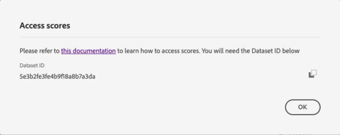

# Customer AI에서 점수 다운로드

이 문서는 고객 AI에 대한 점수를 다운로드하는 데 도움이 되는 안내서 역할을 합니다.

## 시작하기

고객 AI를 사용하면 Parquet 파일 형식으로 점수를 다운로드할 수 있습니다. 이 자습서에서는 의 고객 AI 스코어 다운로드 섹션을 읽고 완료해야 합니다. [시작하기](../getting-started.md) 가이드.

또한 고객 AI에 대한 점수에 액세스하려면 서비스 인스턴스가 성공적으로 실행될 수 있어야 합니다. 새 서비스 인스턴스를 생성하려면 다음을 방문하십시오. [Customer AI 인스턴스 구성](./configure.md). 최근에 서비스 인스턴스를 만들었지만 아직 교육 및 채점 중인 경우 24시간 동안 실행을 완료할 수 있도록 허용하십시오.

현재 고객 AI 점수를 다운로드하는 방법은 두 가지가 있습니다.

1. 개인 수준에서 점수를 다운로드하거나 실시간 고객 프로필이 활성화되지 않은 경우 다음으로 이동하여 시작하십시오. [데이터 세트 ID 찾기](#dataset-id).
2. 프로필이 활성화되고 Customer AI를 사용하여 구성한 세그먼트를 다운로드하려면 로 이동하십시오. [고객 AI로 구성된 세그먼트 다운로드](#segment).

## 데이터 세트 ID 찾기 {#dataset-id}

Customer AI 인사이트에 대한 서비스 인스턴스 내에서 *추가 작업* 오른쪽 상단 탐색의 드롭다운을 선택한 다음 을 선택합니다. **[!UICONTROL 액세스 점수]**.


점수 다운로드 설명서에 대한 링크와 현재 인스턴스의 데이터 세트 ID가 포함된 새 대화 상자가 나타납니다. 데이터 세트 ID를 클립보드에 복사하고 다음 단계로 진행합니다.



## 배치 ID 검색 {#retrieve-your-batch-id}

이전 단계의 데이터 세트 ID를 사용하여 일괄 처리 ID를 검색하려면 카탈로그 API를 호출해야 합니다. 조직에 속한 배치 목록 대신 최근에 성공한 배치를 반환하기 위해 이 API 호출에 추가 쿼리 매개 변수가 사용됩니다. 추가 배치를 반환하려면 한도 질의 매개변수에 대한 숫자를 반환하려는 원하는 수량만큼 늘립니다. 사용 가능한 쿼리 매개 변수 유형에 대한 자세한 내용은 [쿼리 매개 변수를 사용하여 카탈로그 데이터 필터링](../../../catalog/api/filter-data.md).

**API 형식**

```http
GET /batches?&dataSet={DATASET_ID}&createdClient=acp_foundation_push&status=success&orderBy=desc:created&limit=1
```

| 매개변수 | 설명 |
| --------- | ----------- |
| `{DATASET_ID}` | &quot;액세스 점수&quot; 대화 상자에서 사용할 수 있는 데이터 세트 ID입니다. |

**요청**

```shell
curl -X GET 'https://platform.adobe.io/data/foundation/catalog/batches?dataSet=5cd9146b31dae914b75f654f&createdClient=acp_foundation_push&status=success&orderBy=desc:created&limit=1' \
  -H 'Authorization: Bearer {ACCESS_TOKEN}' \
  -H 'x-api-key: {API_KEY}' \
  -H 'x-gw-ims-org-id: {ORG_ID}' \
  -H 'x-sandbox-name: {SANDBOX_NAME}'
```

**응답**

성공적인 응답은 배치 ID 개체가 포함된 페이로드를 반환합니다. 이 예제에서 반환되는 개체의 키 값은 배치 ID입니다 `01E5QSWCAASFQ054FNBKYV6TIQ`. 다음 API 호출에서 사용할 배치 ID를 복사합니다.

```json
{
    "01E5QSWCAASFQ054FNBKYV6TIQ": {
        "status": "success",
        "tags": {
            "Tags": [ ... ],
        },
        "relatedObjects": [
            {
                "type": "dataSet",
                "id": "5cd9146b31dae914b75f654f"
            }
        ],
        "id": "01E5QSWCAASFQ054FNBKYV6TIQ",
        "externalId": "01E5QSWCAASFQ054FNBKYV6TIQ",
        "replay": {
            "predecessors": [
                "01E5N7EDQQP4JHJ93M7C3WM5SP"
            ],
            "reason": "Replacing for 2020-04-09",
            "predecessorListingType": "IMMEDIATE"
        },
        "inputFormat": {
            "format": "parquet"
        },
        "imsOrg": "412657965Y566A4A0A495D4A@AdobeOrg",
        "started": 1586715571808,
        "metrics": {
            "partitionCount": 1,
            "outputByteSize": 2380339,
            "inputFileCount": -1,
            "inputByteSize": 2381007,
            "outputRecordCount": 24340,
            "outputFileCount": 1,
            "inputRecordCount": 24340
        },
        "completed": 1586715582735,
        "created": 1586715571217,
        "createdClient": "acp_foundation_push",
        "createdUser": "sensei_exp_attributionai@AdobeID",
        "updatedUser": "acp_foundation_dataTracker@AdobeID",
        "updated": 1586715583582,
        "version": "1.0.5"
    }
}
```

## 배치 ID로 다음 API 호출 검색 {#retrieve-the-next-api-call-with-your-batch-id}

배치 ID가 있으면 다음에 대한 새 GET 요청을 할 수 있습니다. `/batches`. 이 요청은 다음 API 요청으로 사용되는 링크를 반환합니다.

**API 형식**

```http
GET batches/{BATCH_ID}/files
```

| 매개변수 | 설명 |
| --------- | ----------- |
| `{BATCH_ID}` | 이전 단계에서 검색된 배치 ID [배치 ID 검색](#retrieve-your-batch-id). |

**요청**

자신의 배치 ID를 사용하여 다음 요청을 수행합니다.

```shell
curl -X GET 'https://platform.adobe.io/data/foundation/export/batches/035e2520-5e69-11ea-b624-51evfeba55d1/files' \
  -H 'Authorization: Bearer {ACCESS_TOKEN}' \
  -H 'x-api-key: {API_KEY}' \
  -H 'x-gw-ims-org-id: {ORG_ID}' \
  -H 'x-sandbox-name: {SANDBOX_NAME}'
```

**응답**

성공적인 응답은 다음을 포함하는 페이로드를 반환합니다. `_links` 개체. 다음 범위 내 `_links` 개체가 입니다. `href` (새 API 호출) 을 값으로 사용하여 생성합니다. 다음 단계로 진행하려면 이 값을 복사하십시오.

```json
{
    "data": [
        {
            "dataSetFileId": "035e2520-5e69-11ea-b624-51ecfeba55d0-1",
            "dataSetViewId": "5e3b2fe3fe4b9f18a8b7a3db",
            "version": "1.0.0",
            "created": "1583361894479",
            "updated": "1583361894479",
            "isValid": false,
            "_links": {
                "self": {
                    "href": "https://platform.adobe.io:443/data/foundation/export/files/035e2520-5e69-11ea-b624-51ecfeba55d0-1"
                }
            }
        }
    ],
    "_page": {
        "limit": 100,
        "count": 1
    }
}
```

## 파일 검색 {#retrieving-your-files}

사용 `href` 이전 단계에서 API 호출로 받은 값은 파일 디렉토리를 검색하도록 새 GET 요청을 만듭니다.

**API 형식**

```http
GET files/{DATASETFILE_ID}
```

| 매개변수 | 설명 |
| --------- | ----------- |
| `{DATASETFILE_ID}` | dataSetFile ID가 `href` 값: [이전 단계](#retrieve-the-next-api-call-with-your-batch-id). 에서 액세스할 수도 있습니다. `data` 객체 유형 아래에 있는 배열 `dataSetFileId`. |

**요청**

```shell
curl -X GET 'https://platform.adobe.io:443/data/foundation/export/files/035e2520-5e69-11ea-b624-51ecfeba55d0-1' \
  -H 'Authorization: Bearer {ACCESS_TOKEN}' \
  -H 'x-api-key: {API_KEY}' \
  -H 'x-gw-ims-org-id: {ORG_ID}' \
  -H 'x-sandbox-name: {SANDBOX_NAME}'
```

**응답**

응답에는 단일 항목이나 해당 디렉터리에 속한 파일 목록이 있는 데이터 배열이 포함됩니다. 아래 예에는 파일 목록이 포함되어 있으며 가독성을 위해 압축되었습니다. 이 시나리오에서는 파일에 액세스하려면 각 파일의 URL을 따라야 합니다.

```json
{
    "data": [
        {
            "name": "part-00000-tid-7597930103898538622-a25f1890-efa9-40eb-a2cb-1b378e93d582-528-1-c000.snappy.parquet",
            "length": "16214531",
            "_links": {
                "self": {
                    "href": "https://platform.adobe.io:443/data/foundation/export/files/035e2520-5e69-11ea-b624-51ecfeba55d0-1?path=part-00000-tid-7597930103898538622-a25f1890-efa9-40eb-a2cb-1b378e93d582-528-1-c000.snappy.parquet"
                }
            }
        },
        {
            "name": "...",
            "length": "16235375",
            "_links": {
                "self": {
                    "href": "..."
                }
            }
        }
    ],
    "_page": {
        "limit": 100,
        "count": 100
    },
    "_links": {
        "next": {
            "href": "..."
        },
        "page": {
            "href": "...",
            "templated": true
        }
    }
}
```

| 매개변수 | 설명 |
| --------- | ----------- |
| `_links.self.href` | 디렉터리에서 파일을 다운로드하는 데 사용되는 GET 요청 URL입니다. |


다음을 복사합니다. `href` 의 모든 파일 개체에 대한 값 `data` 배열하고 다음 단계로 진행합니다.

## 파일 데이터 다운로드

GET 파일 데이터를 다운로드하려면 `"href"` 이전 단계에서 복사한 값 [파일 검색 중](#retrieving-your-files).

>[!NOTE]
>
>명령줄에서 직접 이 요청을 하는 경우 요청 헤더 뒤에 출력을 추가하라는 메시지가 표시될 수 있습니다. 다음 요청 예제에서는 를 사용합니다 `--output {FILENAME.FILETYPE}`.

**API 형식**

```http
GET files/{DATASETFILE_ID}?path={FILE_NAME}
```

| 매개변수 | 설명 |
| --------- | ----------- |
| `{DATASETFILE_ID}` | dataSetFile ID가 `href` 값: [이전 단계](#retrieve-the-next-api-call-with-your-batch-id). |
| `{FILE_NAME}` | 파일 이름입니다. |

**요청**

```shell
curl -X GET 'https://platform.adobe.io:443/data/foundation/export/files/035e2520-5e69-11ea-b624-51ecfeba55d0-1?path=part-00000-tid-7597930103898538622-a25f1890-efa9-40eb-a2cb-1b378e93d582-528-1-c000.snappy.parquet' \
  -H 'Authorization: Bearer {ACCESS_TOKEN}' \
  -H 'x-api-key: {API_KEY}' \
  -H 'x-gw-ims-org-id: {ORG_ID}' \
  -H 'x-sandbox-name: {SANDBOX_NAME}' \
  -O 'filename.parquet'
```

>[!TIP]
>
>GET 요청을 수행하기 전에 파일을 저장할 올바른 디렉터리 또는 폴더에 있는지 확인하십시오.

**응답**

응답에서 요청한 파일을 현재 디렉토리에 다운로드합니다. 이 예에서 파일 이름은 &quot;filename.parquet&quot;입니다.


## Customer AI로 구성된 세그먼트 다운로드 {#segment}

점수 데이터를 다운로드하는 또 다른 방법은 대상자를 데이터 세트로 내보내는 것입니다. 세분화 작업이 성공적으로 완료된 후(값: `status` 속성은 &quot;SUCCEEDED&quot;)이며, 대상자를 액세스 및 작업이 가능한 데이터 세트로 내보낼 수 있습니다. 세그먼테이션에 대해 자세히 알아보려면 [세그먼테이션 개요](../../../segmentation/home.md).

>[!IMPORTANT]
>
>이 내보내기 방법을 활용하려면 데이터 세트에 대해 실시간 고객 프로필 을 활성화해야 합니다.

다음 [세그먼트 내보내기](../../../segmentation/tutorials/evaluate-a-segment.md) 세그먼트 평가 안내서의 섹션에서는 대상 데이터 세트를 내보내는 데 필요한 단계를 다룹니다. 이 안내서에서는 다음 사항에 대해 간략히 설명하고 예를 제공합니다.

- **대상 데이터 세트 만들기:** 대상 구성원을 보관할 데이터 세트를 만듭니다.
- **데이터 세트에서 대상 프로필 생성:** 세그먼트 작업의 결과를 기반으로 데이터 세트를 XDM 개별 프로필로 채웁니다.
- **내보내기 진행 상황 모니터링:** 내보내기 프로세스의 현재 진행 상황을 확인합니다.
- **대상 데이터 읽기:** 대상자의 구성원을 나타내는 결과 XDM 개별 프로필을 검색합니다.

## 다음 단계

이 문서에서는 고객 AI 점수를 다운로드하는 데 필요한 단계에 대해 간략히 설명했습니다. 이제 다른 항목을 계속 탐색할 수 있습니다 [인텔리전트 서비스](../../home.md) 제공되는 가이드.
