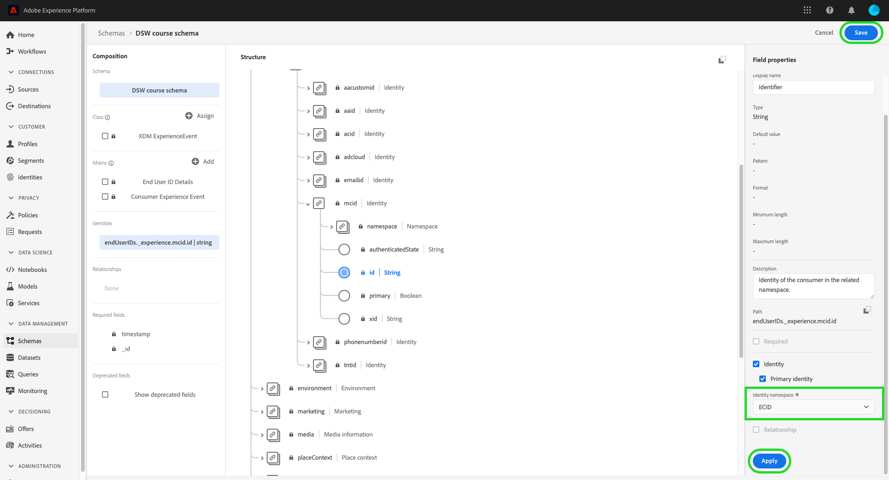

# [!DNL Intelligent Services]에서 사용할 데이터 준비

[!DNL Intelligent Services]이(가) 마케팅 이벤트 데이터에서 통찰력을 얻으려면 데이터가 세밀하게 농축되고 표준 구조로 유지되어야 합니다. [!DNL Intelligent Services] 이를 위해  [!DNL Experience Data Model] (XDM) 스키마를 활용합니다. 특히 [!DNL Intelligent Services]에서 사용되는 모든 데이터 집합은 CEE(Consumer ExperienceEvent) XDM 스키마를 따르거나 Adobe Analytics 커넥터를 사용해야 합니다. 또한 고객 AI는 Adobe Audience Manager 커넥터를 지원합니다.

이 문서는 여러 채널의 마케팅 이벤트 데이터를 CEE 스키마로 매핑하는 방법에 대한 일반적인 지침을 제공하며 스키마 내의 중요한 필드에 대한 정보를 요약하여 데이터를 해당 구조에 효과적으로 매핑하는 방법을 결정합니다. Adobe Analytics 데이터 사용을 계획하는 경우 [Adobe Analytics 데이터 준비](#analytics-data)에 대한 섹션을 참조하십시오. Adobe Audience Manager 데이터(고객 AI만 해당)를 사용할 계획인 경우 [Adobe 대상 관리자 데이터 준비](#AAM-data)에 대한 섹션을 참조하십시오.

## 워크플로우 요약

준비 프로세스는 데이터를 Adobe Experience Platform에 저장할지 외부적으로 저장하는지에 따라 달라집니다. 두 가지 시나리오가 있는 경우 이 섹션에서는 수행해야 하는 필요한 단계를 요약합니다.

### 외부 데이터 준비

데이터가 [!DNL Experience Platform] 외부에 저장되는 경우 아래 절차를 따르십시오.

1. 전용 Azure Blob 저장소 컨테이너에 대한 액세스 자격 증명을 요청하려면 Adobe 컨설팅 서비스에 문의하십시오.
1. 액세스 자격 증명을 사용하여 데이터를 Blob 컨테이너에 업로드합니다.
1. Adobe 컨설팅 서비스를 사용하여 데이터를 [Consumer ExperienceEvent 스키마](#cee-schema)에 매핑하고 [!DNL Intelligent Services]에 인제스트합니다.

### Adobe Analytics 데이터 준비 {#analytics-data}

고객 AI와 Attribution AI은 기본적으로 Adobe Analytics 데이터를 지원합니다. Adobe Analytics 데이터를 사용하려면 설명서에 설명된 단계에 따라 [Analytics 소스 커넥터](../sources/tutorials/ui/create/adobe-applications/analytics.md)를 설정합니다.

소스 커넥터가 데이터를 Experience Platform으로 스트리밍한 후 인스턴스 구성 중에 데이터 소스로 Adobe Analytics을 선택하고 데이터 세트를 선택할 수 있습니다. 연결을 설정하는 동안 모든 필수 스키마 필드 및 믹싱이 자동으로 생성됩니다. 데이터 세트를 CEE 형식으로 ETL(추출, 변환, 로드)할 필요가 없습니다.

>[!IMPORTANT]
>
>Adobe Analytics 커넥터는 데이터를 채우는 데 최대 4주가 소요됩니다. 최근 연결을 설정하는 경우 데이터 세트에 고객 또는 Attribution AI에 필요한 최소 데이터 길이가 있는지 확인해야 합니다. [고객 AI](./customer-ai/input-output.md#data-requirements) 또는 [Attribution AI](./attribution-ai/input-output.md#data-requirements)의 내역 데이터 섹션을 검토하고 예측 목표에 충분한 데이터가 있는지 확인하십시오.

### Adobe Audience Manager 데이터 준비(고객 AI에만 해당) {#AAM-data}

고객 AI는 기본적으로 Adobe Audience Manager 데이터를 지원합니다. Audience Manager 데이터를 사용하려면 설명서에 설명된 단계에 따라 [Audience Manager 소스 커넥터](../sources/tutorials/ui/create/adobe-applications/audience-manager.md)를 설정합니다.

소스 커넥터에서 데이터를 Experience Platform으로 스트리밍하면 고객 AI 구성 중에 데이터 소스로 Adobe Audience Manager을 선택하고 데이터 세트를 선택할 수 있습니다. 연결을 설정하는 동안 모든 필수 스키마 필드 및 믹싱이 자동으로 생성됩니다. 데이터 세트를 CEE 형식으로 ETL(추출, 변환, 로드)할 필요가 없습니다.

>[!IMPORTANT]
>
>최근에 커넥터를 설정하는 경우 데이터 세트에 필요한 최소 데이터 길이가 있는지 확인해야 합니다. 고객 AI용 [입력/출력 설명서](./customer-ai/input-output.md)의 내역 데이터 섹션을 검토하고 예측 목표에 충분한 데이터가 있는지 확인하십시오.

### [!DNL Experience Platform] 데이터 준비

데이터가 이미 [!DNL Platform]에 저장되고 Adobe Analytics 또는 Adobe Audience Manager(고객 AI만 해당) 소스 커넥터를 통해 스트리밍되지 않는 경우 아래 단계를 따르십시오. Customer AI와 함께 작업하려는 경우 CEE 스키마를 이해하는 것이 좋습니다.

1. [Consumer ExperienceEvent 스키마](#cee-schema)의 구조를 검토하고 데이터를 해당 필드에 매핑할 수 있는지 확인합니다.
2. 데이터를 스키마에 매핑하고 [!DNL Intelligent Services]에 인제스트하는 데 도움이 되도록 Adobe 컨설팅 서비스에 문의하거나, 직접 데이터를 매핑하려면 이 안내서](#mapping)의 단계를 따르십시오.[

## CEE 스키마 {#cee-schema} 이해

소비자 경험 이벤트 스키마는 디지털 마케팅 이벤트(웹 또는 모바일)뿐만 아니라 온라인 또는 오프라인 상거래 활동과 관련된 개인의 동작을 설명합니다. 이 스키마는 의미상 잘 정의된 필드(열) 때문에 [!DNL Intelligent Services]에 사용해야 하며, 그렇지 않으면 데이터를 더 이상 명확하게 하지 않을 알 수 없는 이름을 사용하지 않습니다.

모든 XDM ExperienceEvent 스키마와 마찬가지로 CEE 스키마는 이벤트(또는 이벤트 집합)가 발생한 시점에 해당하는 시스템의 시간 시리즈 기반 상태를 캡처합니다(관련 대상의 ID 포함). 경험 이벤트는 발생한 일에 대한 팩트 레코드이므로 변경할 수 없으며 집계 또는 해석 없이 발생한 사항을 나타냅니다.

[!DNL Intelligent Services] 이 스키마 내의 여러 주요 필드를 활용하여 마케팅 이벤트 데이터로부터 통찰력을 생성합니다. 이 모든 요소는 루트 수준에서 찾을 수 있으며 필요한 하위 필드를 표시하도록 확장됩니다.


모든 XDM 스키마와 마찬가지로 CEE 믹스도 확장할 수 있습니다. 즉, CEE 믹싱에 추가 필드를 추가할 수 있으며 필요한 경우 다양한 변형을 여러 스키마에 포함시킬 수 있습니다.

혼합의 전체 예는 [공개 XDM 리포지토리](https://github.com/adobe/xdm/blob/797cf4930d5a80799a095256302675b1362c9a15/docs/reference/context/experienceevent-consumer.schema.md)에서 찾을 수 있습니다. 또한 CEE 스키마를 준수하도록 데이터를 구조화할 수 있는 방법의 예를 보려면 다음 [JSON 파일](https://github.com/AdobeDocs/experience-platform.en/blob/master/help/intelligent-services/assets/CEE_XDM_sample_rows.json)을 보고 복사할 수 있습니다. 사용자 자신의 데이터를 스키마에 매핑할 수 있는 방법을 결정하려면 아래 섹션에 설명된 키 필드에 대해 알고 있는 이러한 두 예제를 참조하십시오.

## 키 필드

CEE 믹싱에는 유용한 인사이트를 생성하기 위해 [!DNL Intelligent Services]에 사용해야 하는 몇 가지 주요 필드가 있습니다. 이 섹션에서는 이러한 필드의 사용 사례와 예상 데이터에 대해 설명하고 추가 예제에 대한 참조 설명서에 대한 링크를 제공합니다.

### 필수 필드

모든 키 필드를 사용하는 것이 좋지만 [!DNL Intelligent Services]이(가) 작동하려면 **required**&#x200B;인 두 개의 필드가 있습니다.

* [기본 ID 필드](#identity)
* [xdm:timestamp](#timestamp)
* [xdm:channel](#channel) (Attribution AI에만 필수)

#### 기본 ID {#identity}

스키마의 필드 중 하나를 기본 ID 필드로 설정해야 합니다. 이 필드를 사용하면 [!DNL Intelligent Services]이 시간 시리즈 데이터의 각 인스턴스를 개별 사용자에게 연결할 수 있습니다.

데이터의 소스와 특성을 기반으로 기본 ID로 사용할 최상의 필드를 결정해야 합니다. ID 필드에는 필드에 값으로 예상하는 ID 데이터의 유형을 나타내는 **ID 네임스페이스**&#x200B;가 포함되어야 합니다. 일부 유효한 네임스페이스 값은 다음과 같습니다.

* &quot;이메일&quot;
* &quot;phone&quot;
* &quot;mcid&quot;(Adobe Audience Manager ID의 경우)
* &quot;aid&quot;(Adobe Analytics ID용)

기본 ID로 사용해야 하는 필드를 잘 모르는 경우 Adobe 컨설팅 서비스에 문의하여 최상의 해결 방법을 확인하십시오. 기본 ID가 설정되지 않은 경우 Intelligent Service 응용 프로그램은 다음 기본 동작을 사용합니다.

| 기본값 | Attribution AI | 고객 AI |
| --- | --- | --- |
| ID 열 | `endUserIDs._experience.aaid.id` | `endUserIDs._experience.mcid.id` |
| 네임스페이스 | AAID | ECID |

기본 ID를 설정하려면 **[!UICONTROL Schemas]** 탭에서 스키마로 이동하고 스키마 이름 하이퍼링크를 선택하여 **[!DNL Schema Editor]**&#x200B;을(를) 엽니다.


그런 다음 기본 ID로 사용할 필드로 이동하여 선택합니다. 해당 필드에 대해 **[!UICONTROL Field properties]** 메뉴가 열립니다.


**[!UICONTROL Field properties]** 메뉴에서 **[!UICONTROL Identity]** 확인란을 찾을 때까지 아래로 스크롤합니다. 확인란을 선택하면 선택한 ID를 **[!UICONTROL Primary identity]**&#x200B;으로 설정하는 옵션이 표시됩니다. 이 상자도 선택하십시오.


다음으로 드롭다운에 있는 사전 정의된 네임스페이스 목록에서 **[!UICONTROL Identity namespace]**&#x200B;을 제공해야 합니다. 이 예에서는 Adobe Audience Manager ID `mcid.id`을(를) 사용하고 있으므로 ECID 이름이 선택됩니다. 업데이트를 확인하려면 **[!UICONTROL Apply]**&#x200B;을 선택하고 오른쪽 위 모서리에서 **[!UICONTROL Save]**&#x200B;을 선택하여 스키마에 대한 변경 내용을 저장합니다.



#### xdm:timestamp {#timestamp}

이 필드는 이벤트가 발생한 날짜/시간을 나타냅니다. ISO 8601 표준에 따라 이 값을 문자열로 제공해야 합니다.

#### xdm:channel {#channel}

>[!NOTE]
>
>이 필드는 Attribution AI을 사용할 때만 필수 필드입니다.

이 필드는 ExperienceEvent와 관련된 마케팅 채널을 나타냅니다. 이 필드에는 채널 유형, 미디어 유형 및 위치 유형에 대한 정보가 포함되어 있습니다.


**스키마 예**

```json
{
  "@id": "https://ns.adobe.com/xdm/channels/facebook-feed",
  "@type": "https://ns.adobe.com/xdm/channel-types/social",
  "xdm:mediaType": "earned",
  "xdm:mediaAction": "clicks"
}
```

`xdm:channel`에 필요한 각 하위 필드에 대한 자세한 내용은 [경험 채널 스키마](https://github.com/adobe/xdm/blob/797cf4930d5a80799a095256302675b1362c9a15/docs/reference/channels/channel.schema.md) 사양을 참조하십시오. 일부 예제 매핑은 [표 아래](#example-channels)를 참조하십시오.

#### 채널 매핑 예 {#example-channels}

다음 표에서는 `xdm:channel` 스키마에 매핑된 마케팅 채널의 몇 가지 예를 제공합니다.

| Channel | `@type` | `mediaType` | `mediaAction` |
| --- | --- | --- | --- |
| 유료 검색 | https:/<span>/ns.adobe.com/xdm/channel-types/search | paid | 클릭 수 |
| 소셜 - 마케팅 | https:/<span>/ns.adobe.com/xdm/channel-types/social | even | 클릭 수 |
| 표시 | https:/<span>/ns.adobe.com/xdm/channel-types/display | paid | 클릭 수 |
| 이메일 | https:/<span>/ns.adobe.com/xdm/channel-types/email | paid | 클릭 수 |
| 내부 레퍼러 | https:/<span>/ns.adobe.com/xdm/channel-types/direct | 소유 | 클릭 수 |
| 뷰스루 표시 | https:/<span>/ns.adobe.com/xdm/channel-types/display | paid | 노출 횟수 |
| QR 코드 리디렉션 | https:/<span>/ns.adobe.com/xdm/channel-types/direct | 소유 | 클릭 수 |
| 모바일 | https:/<span>/ns.adobe.com/xdm/channel-types/mobile | 소유 | 클릭 수 |

### 권장 필드

키 필드의 나머지 부분은 이 섹션에 요약되어 있습니다. 이러한 필드를 반드시 [!DNL Intelligent Services]에 사용할 필요는 없지만, 보다 풍부한 통찰력을 얻기 위해 가능한 한 많은 필드를 사용하는 것이 좋습니다.

#### xdm:productListItems

이 필드는 제품 SKU, 이름, 가격 및 수량을 포함하여 고객이 선택한 제품을 나타내는 항목 배열입니다.


**스키마 예**

```json
[
  {
    "xdm:SKU": "1002352692",
    "xdm:name": "24-Watt 8-Light Chrome Integrated LED Bath Light",
    "xdm:currencyCode": "USD",
    "xdm:quantity": 1,
    "xdm:priceTotal": 159.45
  },
  {
    "xdm:SKU": "3398033623",
    "xdm:name": "16ft RGB LED Strips",
    "xdm:currencyCode": "USD",
    "xdm:quantity": 1,
    "xdm:priceTotal": 79.99
  }
]
```

`xdm:productListItems`에 필요한 각 하위 필드에 대한 자세한 내용은 [상거래 세부 정보 스키마](https://github.com/adobe/xdm/blob/797cf4930d5a80799a095256302675b1362c9a15/docs/reference/context/experienceevent-commerce.schema.md) 사양을 참조하십시오.

#### xdm:commerce

이 필드에는 구매 발주 번호 및 지불 정보를 비롯하여 ExperienceEvent에 대한 상거래 관련 정보가 포함되어 있습니다.


**스키마 예**

```json
{
    "xdm:order": {
      "xdm:purchaseID": "a8g784hjq1mnp3",
      "xdm:purchaseOrderNumber": "123456",
      "xdm:payments": [
        {
          "xdm:transactionID": "transactid-a111",
          "xdm:paymentAmount": 59,
          "xdm:paymentType": "credit_card",
          "xdm:currencyCode": "USD"
        },
        {
          "xdm:transactionId": "transactid-a222",
          "xdm:paymentAmount": 100,
          "xdm:paymentType": "gift_card",
          "xdm:currencyCode": "USD"
        }
      ],
      "xdm:currencyCode": "USD",
      "xdm:priceTotal": 159
    },
    "xdm:purchases": {
      "xdm:value": 1
    }
  }
```

`xdm:commerce`에 필요한 각 하위 필드에 대한 자세한 내용은 [상거래 세부 정보 스키마](https://github.com/adobe/xdm/blob/797cf4930d5a80799a095256302675b1362c9a15/docs/reference/context/experienceevent-commerce.schema.md) 사양을 참조하십시오.

#### xdm:웹

이 필드는 상호 작용, 페이지 세부 사항 및 레퍼러 등 ExperienceEvent와 관련된 웹 세부 사항을 나타냅니다.


**스키마 예**

```json
{
  "xdm:webPageDetails": {
    "xdm:siteSection": "Shopping Cart",
    "xdm:server": "example.com",
    "xdm:name": "Purchase Confirmation",
    "xdm:URL": "https://www.example.com/orderConf",
    "xdm:errorPage": false,
    "xdm:homePage": false,
    "xdm:pageViews": {
      "xdm:value": 1
    }
  },
  "xdm:webReferrer": {
    "xdm:URL": "https://www.example.com/checkout",
    "xdm:referrerType": "internal"
  }
}
```

`xdm:productListItems`에 필요한 각 하위 필드에 대한 자세한 내용은 [ExperienceEvent 웹 세부 정보 스키마](https://github.com/adobe/xdm/blob/797cf4930d5a80799a095256302675b1362c9a15/docs/reference/context/experienceevent-web.schema.md) 사양을 참조하십시오.

#### xdm:마케팅

이 필드에는 접점에서 활성 상태인 마케팅 활동과 관련된 정보가 있습니다.


**스키마 예**

```json
{
  "xdm:trackingCode": "marketingcampaign111",
  "xdm:campaignGroup": "50%_DISCOUNT",
  "xdm:campaignName": "50%_DISCOUNT_USA"
}
```

`xdm:productListItems`에 필요한 각 하위 필드에 대한 자세한 내용은 [marketing sechma](https://github.com/adobe/xdm/blob/797cf4930d5a80799a095256302675b1362c9a15/docs/reference/context/marketing.schema.md) 사양을 참조하십시오.

## 데이터 매핑 및 인제스트 {#mapping}

마케팅 이벤트 데이터를 CEE 스키마에 매핑할 수 있는지 여부를 확인한 후, 다음 단계는 [!DNL Intelligent Services]에 가져올 데이터를 결정하는 것입니다. [!DNL Intelligent Services]에 사용된 모든 내역 데이터는 최소 4개월 데이터 기간 내에, 룩백 기간으로 의도한 일 수를 포함해야 합니다.

전송할 데이터의 범위를 결정한 후 Adobe 컨설팅 서비스에 문의하여 데이터를 스키마에 매핑하고 서비스에 인제스트할 수 있습니다.

[!DNL Adobe Experience Platform] 구독이 있고 직접 데이터를 매핑하고 인제스트하려면 아래 섹션에 설명된 절차를 따르십시오.

### Adobe Experience Platform 사용

>[!NOTE]
>
>아래 단계는 Experience Platform에 가입해야 합니다. 플랫폼에 대한 액세스 권한이 없는 경우 [다음 단계](#next-steps) 섹션으로 건너뛸 수 있습니다.

이 섹션에서는 자세한 단계를 위한 튜토리얼로의 링크를 포함하여 [!DNL Intelligent Services]에서 사용할 수 있도록 데이터를 Experience Platform에 매핑하고 인제스트하는 작업 과정을 간략하게 설명합니다.

#### CEE 스키마 및 데이터 세트 만들기

데이터 수집에 대한 준비를 시작할 준비가 되면 첫 번째 단계는 CEE 믹싱을 사용하는 새 XDM 스키마를 만드는 것입니다. 다음 자습서에서는 UI 또는 API에서 새 스키마를 만드는 프로세스를 안내합니다.

* [UI에서 스키마 만들기](../xdm/tutorials/create-schema-ui.md)
* [API에서 스키마 만들기](../xdm/tutorials/create-schema-api.md)

>[!IMPORTANT]
>
>위의 자습서는 스키마를 만들기 위한 일반 작업 과정을 따릅니다. 스키마에 대한 클래스를 선택할 때는 **XDM ExperienceEvent 클래스**&#x200B;를 사용해야 합니다. 이 클래스를 선택한 후 CEE 믹싱을 스키마에 추가할 수 있습니다.

스키마에 CEE 믹싱을 추가한 후 데이터 내의 추가 필드에 대해 필요에 따라 다른 믹스를 추가할 수 있습니다.

스키마를 만들고 저장하면 해당 스키마를 기반으로 새 데이터 세트를 만들 수 있습니다. 다음 자습서에서는 UI 또는 API에서 새 데이터 세트를 만드는 프로세스를 안내합니다.

* [UI에서 데이터 집합](../catalog/datasets/user-guide.md#create)  만들기(기존 스키마 사용 워크플로에 따라)
* [API에서 데이터 세트 만들기](../catalog/datasets/create.md)

데이터 세트가 만들어지면 **[!UICONTROL Datasets]** 작업 공간 내의 플랫폼 UI에서 이를 찾을 수 있습니다.


#### 데이터 세트에 ID 필드 추가

[!DNL Adobe Audience Manager], [!DNL Adobe Analytics] 또는 다른 외부 소스에서 데이터를 가져오는 경우 스키마 필드를 ID 필드로 설정하는 옵션이 있습니다. 스키마 필드를 ID 필드로 설정하려면 스키마 생성을 위한 [UI 자습서](../xdm/tutorials/create-schema-ui.md#identity-field) 또는 [API 자습서](../xdm/tutorials/create-schema-api.md#define-an-identity-descriptor)에서 ID 필드 설정 섹션을 봅니다.

로컬 CSV 파일의 데이터를 인제스트하는 경우 [데이터 매핑 및 인제스트](#ingest)의 다음 섹션으로 건너뛸 수 있습니다.

#### 데이터 매핑 및 인제스트 {#ingest}

CEE 스키마 및 데이터 세트를 만든 후 데이터 테이블을 스키마에 매핑하고 해당 데이터를 플랫폼에 인제스트할 수 있습니다. UI에서 CSV를 수행하는 방법에 대한 자세한 내용은 [CSV 파일을 XDM 스키마](../ingestion/tutorials/map-a-csv-file.md)에 매핑하는 자습서를 참조하십시오. 자신의 데이터를 사용하기 전에 다음 [샘플 JSON 파일](https://github.com/AdobeDocs/experience-platform.en/blob/master/help/intelligent-services/assets/CEE_XDM_sample_rows.json)을 사용하여 통합 프로세스를 테스트할 수 있습니다.

데이터 세트를 채운 후에는 동일한 데이터 세트를 사용하여 추가 데이터 파일을 인제스트할 수 있습니다.

데이터가 지원되는 타사 응용 프로그램에 저장되어 있는 경우 실시간으로 마케팅 이벤트 데이터를 [!DNL Platform]에 인제스트할 수 있도록 [소스 커넥터](../sources/home.md)을(를) 만들도록 선택할 수도 있습니다.

## 다음 단계 {#next-steps}

이 문서에서는 [!DNL Intelligent Services]에서 사용할 데이터를 준비하는 방법에 대한 일반적인 지침을 제공합니다. 사용 사례에 따라 추가 컨설팅을 필요로 하는 경우 Adobe 컨설팅 지원에 문의하십시오.

데이터 세트에 고객 경험 데이터를 성공적으로 채운 경우 [!DNL Intelligent Services]을(를) 사용하여 통찰력을 생성할 수 있습니다. 시작하려면 다음 문서를 참조하십시오.

* [Attribution AI 개요](./attribution-ai/overview.md)
* [Customer AI 개요](./customer-ai/overview.md)
