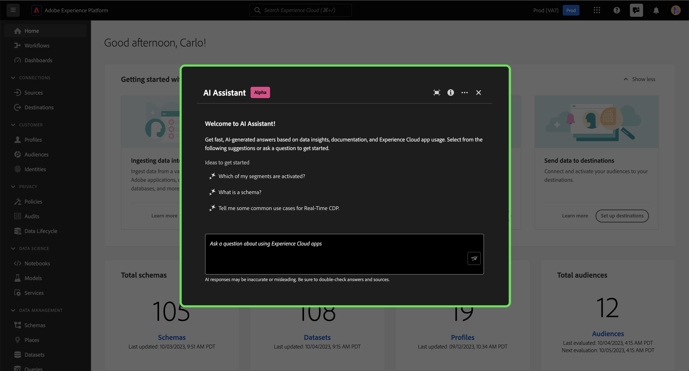
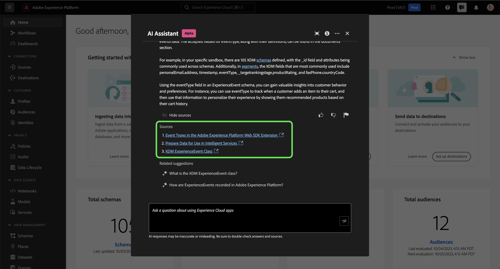
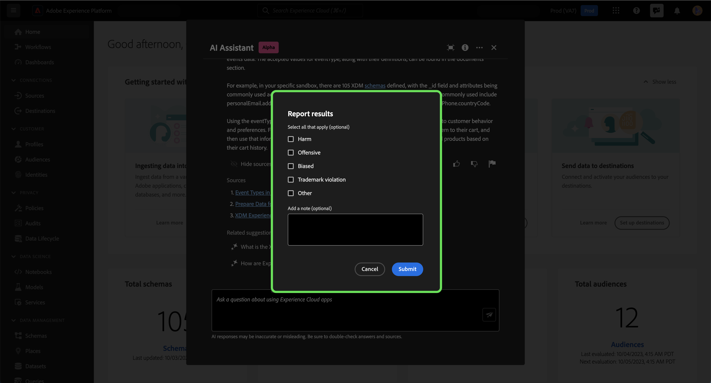

# Adobe Experience Platform 지원

>[!NOTE]
>
>Adobe Experience Platform용 도우미는 현재 Alpha 중입니다. 기능 및 설명서는 변경될 수 있습니다.

Adobe Experience Platform용 도우미는 Experience Platform 및 Real-time Customer Data Platform 개념과 개체에 대한 사용 정보를 탐색하고 이해하는 데 사용할 수 있는 UI 기능입니다.

Assistant에서 다음과 같은 정보를 쿼리할 수 있습니다.

* 데이터 및 대상과 관련된 작업을 수행하는 방법에 대한 지침입니다.
* 조직 내 기존 데이터 객체의 상태 및 지표.
* 속성, 데이터 세트, 대상, 스키마, 세그먼트 및 소스를 비롯한 데이터 개체를 더 잘 이해하려면 사례 예제와 뉘앙스를 사용하십시오.

이 문서에서는 Assistant에 액세스하고 이를 사용하여 Experience Platform 및 Real-Time CDP 개념에 대한 질문을 하고 답변을 받는 방법에 대해 설명합니다.

>[!BEGINSHADEBOX]

**비서는 어떻게 작동합니까?**

Assistant는 데이터베이스를 쿼리한 다음 데이터베이스의 데이터를 사람이 읽을 수 있는 답변으로 변환하여 제출된 질문에 응답합니다.

기본 데이터에 대한 이러한 내부 표현은 지식 그래프라고도 하며, 지정된 질문에 대한 개념, 데이터 및 메타데이터의 포괄적인 웹입니다.

지식 그래프는 쿼리가 제출될 때마다 참조되는 하위 그래프로 구성됩니다.

* 고객 사용 데이터.
* 다양한 메타 스토어에서 고객 사용 데이터.
* Experience League 설명서입니다.

Assistant를 쿼리하기 전에 고려해야 할 두 가지 질문 클래스가 있습니다.

* **개념 질문**: 개념 질문은 데이터 또는 대상과 관련된 Adobe 개념에 대한 것입니다. 개념 질문의 몇 가지 예는 다음과 같습니다.
   * 일괄 처리와 스트리밍 세분화 간의 차이점은 무엇입니까?
   * 업계 데이터 모델이 있습니까? 그리고 어떻게 사용해야 합니까?
   * Real-Time CDP의 가장 좋은 용도는 무엇입니까?
* **사용 질문**: 사용 질문은 조직 내의 데이터 개체에 대한 것입니다. 사용 관련 질문의 몇 가지 예는 다음과 같습니다.
   * 보유한 데이터 세트는 몇 개입니까?
   * 사용된 적이 없는 스키마 속성 수는 몇 개입니까?
   * 활성화된 세그먼트

>[!ENDSHADEBOX]

## UI의 Experience Platform을 위한 액세스 지원

Experience Platform UI의 헤더 탐색에서 도우미에 액세스할 수 있습니다.

다음 항목 선택 **[!UICONTROL Assistant 아이콘]** 헤더에서 [길잡이] 패널로 이동합니다.

+++몰입형 모드 사용

사용 [!DNL Immersive mode] 길잡이의 헤더 탐색에서 포커스 아이콘을 선택합니다.

Assistant의 전용 팝업 인터페이스가 화면 중앙에 나타납니다.

+++

여기에서 텍스트 상자에 질문을 입력하고 데이터 또는 대상과 관련된 개념에 대해 쿼리 도우미를 사용할 수 있습니다. 각 사용 사례에서 데이터 개체를 사용하는 방법을 더 잘 이해하기 위해 데이터 개체에 대한 질문을 할 수도 있습니다.

### 예제 사용 사례: 스키마 생성 프로세스를 간소화하기 위해 Assistant 사용

>[!NOTE]
>
>다음 예제 워크플로에서는 ExperienceEvent 스키마 생성 프로세스를 사용하여 Experience Platform UI 사용 시 도우미를 사용하는 방법을 보여 줍니다.

를 만드는 사용 사례를 고려하십시오. **이벤트 스키마의 디바이스 거래**. ExperienceEvent 스키마 생성 프로세스 중에 `eventType` 필드. 이 시점에서 워크플로우를 종료하고 의 설명서를 참조할 수 있습니다. [스키마 컴포지션 기본 사항](../xdm/schema/composition.md)또는 Assistant를 사용하여 질문에 대한 즉각적인 답변을 검색할 수 있습니다.

시작하려면 제공된 텍스트 상자에 질문을 입력합니다. 아래 예제에서 도우미에게 &quot; 라는 질문이 제공됩니다.**ExperienceEvent 스키마의 eventType 필드는 무엇입니까?**&quot;

그런 다음 Assistant는 기술 자료를 쿼리하고 답을 계산합니다. 잠시 후 도우미는 후속 프롬프트로 사용할 수 있는 답변 및 관련 제안을 반환합니다.

지정된 답변은 참조된 엔티티에 대한 하이퍼링크를 제공합니다. 아래 예에서 **[!UICONTROL 스키마]** 참조된 스키마 목록을 보려면 **[!UICONTROL 세그먼트]** 참조된 세그먼트 목록을 봅니다.

Assistant는 해당 소스를 보고 대답을 확인할 수 있는 방법을 제공합니다. 개념 질문에는 설명서 링크가 제공되며, 답변이 계산된 방식을 보여 주는 SQL 쿼리를 통해 데이터 사용 질문을 확인할 수 있습니다.

#### 관련 제안

Assistant에서 제공하는 관련 제안 중 하나를 선택하여 쿼리의 주제에 대해 자세히 살펴볼 수도 있습니다.

#### 후속 질문

후속 질문을 통해 특정 주제에 대해 자세히 알아볼 수 있습니다. 다음 예제에서는 eventType 을 세그먼테이션에서 사용하는 방법에 대해 도우미에게 묻습니다.

#### 데이터 사용 질문

데이터 사용과 관련하여 길잡이에게 질문할 수도 있습니다. 데이터 사용에 대해 문의할 때 도우미가 질문에 답변하려면 활성 샌드박스에 있어야 합니다.

## 범위

도우미는 Real-Time CDP 및 Experience Platform 개념뿐만 아니라 사용자 계정과 관련된 데이터 사용에 대한 질문에 답변할 수 있습니다. 도우미는 현재 있는 UI 페이지를 기반으로 컨텍스트를 유추할 수도 있습니다. 다음을 식별할 수 있습니다.

* 사용 중인 사용자 계정입니다.
* 귀하가 속한 조직입니다.
* 화면에 표시되는 페이지입니다.
* 화면에 표시되는 리소스(유형 및 ID 포함)입니다.
* 특정 Experience Platform 또는 Real-Time CDP 워크플로 진행 중이라면 도우미가 사용자의 의도를 추론할 수 있습니다.

### 설명서

현재 설명서 색인은 Adobe Experience Platform(Real-Time CDP 및 대상)를 포함합니다. 색인은 정기적으로 업데이트됩니다.

설명서 검색 모델은 Experience Platform(Real-Time CDP 및 대상)에 대해 교육됩니다. Adobe Target 및 Creative Cloud 세트와 같은 Adobe Experience PlatformAdobe 의 범위를 벗어난 질문에 대해서는 답변할 수 없습니다.

### 데이터 사용

다음 도메인에서 데이터 사용에 대해 길잡이에게 질문할 수도 있습니다.

* 속성
* 데이터 세트
* 대상 _(계정에 대한 질문과 데이터 흐름에 대한 일부 질문은 현재 답변할 수 없습니다.)_
* 스키마 _(필드 그룹에 대한 질문에 지금은 답변할 수 없습니다.)_
* 세그먼트
* 소스 _(현재 계정에 대한 질문에 답변할 수 없습니다.)_

사용 데이터 쿼리의 경우, 답변이 UI의 현재 상태를 반영하지 않을 수 있습니다. 이러한 질문에 대한 데이터는 24시간마다 한 번씩 업데이트됩니다. 예를 들어 사용자가 낮에 Real-Time CDP에서 수행하는 변경 사항은 밤에 데이터 스토어와 동기화된 다음 아침에 사용자 질문에 대해 사용할 수 있게 됩니다. 질문의 서식을 다음과 같이 지정해야 할 수 있습니다. &quot;제목이 있는 세그먼트는 언제입니까? {TITLE} 생성됨?&quot; 대신, &quot;언제 {TITLE} 세그먼트를 만들었습니까?&quot;

스키마, 데이터 세트, 속성, 대상 및 세그먼트와 같은 객체와 관련된 특정 데이터를 조회하려면 샌드박스에 로그인해야 합니다.

### 데이터 사용 질문 예

+++예제 데이터 사용 질문 목록을 보려면 선택

| 질문 유형 | 설명 | 예시 |
| --- | --- | --- | 
| 데이터 계보 | 다른 Experience Platform 오브젝트에서 하나 이상의 오브젝트 사용 추적 | <ul><li>사용 데이터 세트 {SCHEMA_NAME} 스키마?</li><li>동일한 스키마를 사용하여 수집된 데이터 세트 수는 얼마입니까?</li><li>활성화된 세그먼트에서 사용된 데이터 세트</li><li>활성화된 세그먼트에 사용된 속성이 있는 스키마를 나열합니다.</li><li>활성화된 세그먼트 표시 {DESTINATION_ACCOUNT_NAME} 와 에는 1000개 이상의 프로필이 있습니다.</li><li>2023년 1월 이후에 수정된 활성화된 세그먼트에 사용되는 속성을 표시합니다.</li><li>활성화된 세그먼트와 관련되고 지난 1년 동안 생성된 스키마를 나열합니다.</li></ul> |
| 배포 및 집계 | Experience Platform 개체 사용에 대한 요약 기반 질문 | <ul><li>활성화된 세그먼트의 비율은 얼마입니까?</li><li>세분화에는 몇 개의 필드가 사용됩니까?</li><li>가장 많은 대상에 활성화된 세그먼트는 무엇입니까?</li><li>중복 세그먼트를 나열합니다.</li><li>활성화된 세그먼트 표시 {DESTINATION_ACCOUNT_NAME} 프로필 크기별로 등급을 매깁니다.</li><li>활성화되지 않았지만 프로필이 100개를 초과하는 세그먼트의 백분율입니다. 그들의 이름을 보여줘</li><li>발생에 따라 활성화된 세그먼트에 사용된 상위 5개 속성을 나열합니다.</li></ul> |
| 오브젝트 조회 | Experience Platform 개체 또는 해당 속성을 검색하거나 액세스합니다. | <ul><li>연관된 스키마가 없는 데이터 세트</li><li>에 사용된 속성 나열 {SEGMENT_NAME}?</li><li>프로필이 활성화되었지만 생성 이후 수정되지 않은 스키마 목록을 제공합니다.</li><li>지난 주에 수정된 세그먼트는 무엇입니까?</li><li>세그먼트 정의가 같은 세그먼트를 만든 날짜와 함께 나열합니다.</li><li>프로필이 활성화된 데이터 세트이며 각 데이터 세트에서 생성된 세그먼트 수를 포함합니다.</li><li>다음의 세그먼트 정의 및 수정 날짜 표시 {SEGMENT_NAME}.</li></ul> |

+++

## 응답 확인

다양한 방법을 사용하여 길잡이가 반환하는 응답을 확인할 수 있습니다.

### 설명서 인용

모든 응답과 함께 도우미는 확인 또는 더 많은 정보를 위해 참조할 수 있는 인용구를 제공합니다.

선택 **[!UICONTROL 소스 표시]** 길잡이가 응답을 계산하기 위해 참조하는 설명서 링크 목록.

데이터 사용 정보가 포함된 응답의 경우 도우미에서 해당 엔터티에 대한 링크를 제공합니다. 또한 Assistant는 해당 답을 계산하는 방법에 대한 설명을 제공합니다.

## 피드백 제공

>[!BEGINSHADEBOX]

**피드백이 요청되었습니다.**

이 Alpha 단계에서 도우미로부터 받은 응답에 대한 피드백을 제공할 수 있습니다. 모든 응답 및 제출된 피드백을 검토하여 어시스턴트 경험을 지속적으로 개선합니다.

피드백을 제공하려면 도우미의 응답을 받은 후 엄지손가락을 위로 또는 아래로 선택한 다음 제공된 텍스트 상자에 피드백을 입력합니다. 그런 다음 을 선택합니다. **[!UICONTROL 피드백 제출]** 제출합니다.

>[!ENDSHADEBOX]

+++피드백 제공

>[!BEGINTABS]

>[!TAB 엄지 손가락 위로]

썸네일 위로 아이콘을 선택하여 어시스턴트와 함께 경험한 것에 대한 피드백을 제공합니다.

>[!TAB 엄지 손가락 아래로]

썸네일 아래쪽 아이콘을 선택하여 도우미와의 사용 경험을 기반으로 개선될 수 있는 사항에 대한 피드백을 제공합니다. 이 단계에서 경험에 대한 특정 설명을 제공할 수도 있습니다. 의견에 제공된 피드백은 매일 검토됩니다.

>[!TAB 플래그]

플래그 아이콘을 선택하여 도우미를 사용한 경험에 대한 추가 보고서를 제공합니다.

>[!ENDTABS]

+++

## 추가 정보

Experience Platform 도우미에 대한 자세한 내용은 이 섹션 을 참조하십시오.

### 주의 사항 및 제한 사항

다음 섹션에서는 Assistant 사용 시 고려해야 할 현재 주의 사항 및 제한 사항에 대해 간략히 설명합니다.

#### 대화 경험

도우미를 쿼리할 때 대화 경험과 관련된 몇 가지 뉘앙스를 고려해야 합니다.

>[!NOTE]
>
>이러한 제한 사항은 일시적이며 알파 과정 전체에서 개선되고 있습니다.

>[!BEGINTABS]

>[!TAB 이전 토론에서 컨텍스트를 유추할 수 없음]

현재 도우미는 주어진 질문에 대한 컨텍스트로 이전 토론을 참조할 수 없습니다. 예제는 아래 표를 참조하십시오.

| 애매한 질문 | 질문 지우기 | 참고 |
| --- | --- | --- |
| <ul><li>첫 번째 질문: &quot;세그먼트란 무엇입니까?&quot;</li><li>후속 질문: &quot;다른 유형이 있습니까?&quot;</li></ul> | <ul><li>첫 번째 질문: &quot;세그먼트란 무엇입니까?&quot;</li><li>후속 질문: &quot;다른 유형이 있습니까? **세그먼트**?&quot;</li></ul> | 도우미는 &quot;그들&quot;이 무엇을 의미하는지 추론할 수 없다. |
| <ul><li>첫 번째 질문: &quot;세그먼트란 무엇입니까?&quot;</li><li>다음 질문: &quot;더 자세히 설명할 수 있습니까?&quot;</li></ul> | <ul><li>첫 번째 질문: &quot;세그먼트란 무엇입니까?&quot;</li><li>추가 질문: &quot;세그먼트에 대한 세부 사항 설명&quot;</li></ul> | Assistant는 &quot;자세히&quot;에 따라 설명서를 지능적으로 참조할 수 없습니다. |
| <ul><li>첫 번째 질문: &quot;세그먼트란 무엇입니까?&quot;</li><li>다음 질문: &quot;예를 하나 들어주시겠어요?&quot;</li></ul> | <ul><li>첫 번째 질문: &quot;세그먼트란 무엇입니까?&quot;</li><li>후속 질문: &quot;세그먼트에 대한 예를 제공할 수 있습니까?&quot;</li></ul> | Assistant는 귀하가 예를 나타낼 내용을 유추할 수 없습니다. |
| <ul><li>첫 번째 질문: &quot;일괄 처리 세그먼트란 무엇입니까?&quot;</li><li>후속 질문: &quot;스트리밍 세그먼트와 어떻게 비교됩니까?&quot;</li></ul> | <ul><li>첫 번째 질문: &quot;일괄 처리 세그먼트란 무엇입니까?&quot;</li><li>후속 질문: &quot;스트리밍 세그먼트를 배치 세그먼트와 비교할 수 있습니까?&quot;</li></ul> | 도우미는 &quot;그것&quot;이 무엇을 지칭하는지 유추할 수 없으므로 스트리밍 세그먼트를 비교할 수 없습니다. |
| <ul><li>첫 번째 질문: &quot;나에게 세그먼트가 몇 개 있습니까?&quot;</li><li>후속 질문: &quot;이들 중 몇 명이 대상으로 Facebook을 사용합니까?&quot;</li></ul> | <ul><li>첫 번째 질문: &quot;나에게 세그먼트가 몇 개 있습니까?&quot;</li><li>후속 질문: &quot;내가 대상으로 Facebook을 사용하고 있는 세그먼트 중 몇 개나?&quot;</li></ul> | Assistant는 &quot;그들&quot;이 무엇을 가리키는지 유추할 수 없습니다. |

{style="table-layout:auto"}

>[!TAB 페이지에서 컨텍스트를 유추할 수 없음]

도우미에게 현재 진행 중인 Experience Platform UI 페이지의 특정 요소에 대해 질문할 때는 질문 내에 특정 요소를 명확히 정의해야 합니다.

| 애매한 질문 | 질문 지우기 | 참고 |
| --- | --- | --- |
| &quot;이 기능은 무엇입니까?&quot; | &quot;역할 {PAGE_NAME} 할 수 있습니까? | 도우미는 &quot;이&quot;가 무엇을 가리키는지 유추할 수 없습니다. 쿼리하는 특정 페이지 요소를 제공해야 합니다. |
| &quot;왜 구하지 않는 거죠?&quot; | &quot;라는 새 샌드박스를 저장할 수 없는 이유 {NAME}?&quot; | Assistant는 &quot;그것&quot;이 무엇을 지칭하는지 유추할 수 없으며 엔티티에 문제가 있다는 것을 알 수 없습니다. |

{style="table-layout:auto"}

또한 오류가 Experience League에 문서화되어 있는 경우 도우미는 오류 메시지와 관련된 질문에만 답변할 수 있습니다.

>[!TAB 모호성]

Assistant는 현재 질문을 명확히 구분할 수 없으므로 질문을 명확히 표시하고 제품, 애플리케이션 또는 도메인 내에서 질문을 범위로 지정해야 합니다.

| 애매한 질문 | 질문 지우기 | 참고 |
| --- | --- | --- |
| &quot;필터를 만들려면 어떻게 해야 합니까? | 프로필 쿼리 언어로 필터를 만드는 방법 | 다양한 Experience Platform 기능이 필터링을 지원하므로 필터링할 기능을 지정해야 합니다. |
| &quot;어떻게 시작합니까? | 대상 사용을 시작하려면 어떻게 해야 합니까? | 지나치게 넓은 개념은 포괄적이거나 불필요하게 구체적인 답변을 도출해낼 수 있기 때문에 목표 및 사용 사례에 대한 명확성을 제공해야 합니다. |

{style="table-layout:auto"}

>[!ENDTABS]

#### 제한된 잡담

Assistant와 소규모 대화를 나눌 수 있지만 이 용량은 현재 제한적입니다.

#### 기능 질문

보조자는 자신이 할 수 있는 일에 대해 부정확한 인상을 줄 수 있다. 다음 유형의 질문에 잘못 답변할 수 있습니다.

| 예제 질문 | 참고 |
| --- | --- |
| &quot;다음 질문에 답변할 수 있습니까? {ENTITY}?&quot; | 도우미가 색인에서 지정된 엔티티를 참조하는 단일 페이지를 찾을 수 있는 한 예 로 응답합니다. |
| &quot;혹시... **x** 언어?&quot; | Assistant는 현재 영어만 지원하지만 기본 모델이 지원할 수 있으므로 &quot;예&quot;라고 답할 수 있습니다. |
| &quot;할 수 있어?&quot; | Assistant는 Yes라고 대답할 수 없지만, Yes라고 대답할 수 있습니다. |

### 팁

다음 섹션에서는 Assistant 사용 시 고려해야 할 몇 가지 팁과 해결 방법에 대해 간략히 소개합니다.

#### 잘못된 정보 출처로 질문에 대한 응답이 있을 수 있습니다

사용 데이터에 대한 질문이 설명서를 기반으로 답변을 도출하는 경우가 있습니다. 이는 도우미가 질문을 잘못된 정보 소스로 잘못 라우팅할 수 있기 때문입니다. 다음을 수행하여 이를 방지할 수 있습니다.

* 더 많은 SQL 유사 언어를 사용하도록 질문 구문 변경
* 사용할 정보 소스를 명시적으로 호출합니다.

예를 보려면 아래 표를 참조하십시오.

| 나쁜 질문 | 좋은 질문 | 참고 |
| --- | --- | --- |
| 가장 큰 세그먼트는 무엇입니까? | 가장 큰 세그먼트는 무엇입니까? 데이터 사용. | 답변이 데이터를 기반으로 하도록 도우미에게 명시적으로 지시합니다. |
| 가장 큰 세그먼트는 무엇입니까? | 내 가장 큰 세그먼트를 나열합니다. | &quot;...&quot;라는 질문이 문서 기반 질문으로 오인될 수 있는 경우가 있습니다. &quot;list&quot;와 같은 명령을 사용하는 것은 컨텍스트에 있는 데이터로 질문을 하는 것이 더 강력합니다. |
| 보유한 데이터 세트는 몇 개입니까? | 내 데이터 세트를 카운트합니다. | 원래 질문은 세그먼트에 대해 작동하지만 데이터 세트에서는 작동하지 않을 수 있습니다. |
