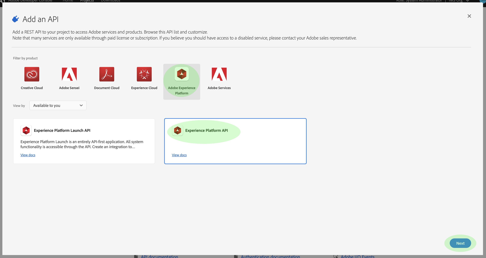

# 인증 및 [!DNL Experience Platform] API 액세스

이 문서에서는 [!DNL Experience Platform] API를 호출하기 위해 Adobe Experience Platform 개발자 계정에 액세스할 수 있는 단계별 자습서를 제공합니다.

## 인증을 통해 API 호출

응용 프로그램 및 사용자의 보안을 유지하려면 OAuth 및 JWT(JSON 웹 토큰)와 같은 표준을 사용하여 Adobe I/O API에 대한 모든 요청을 인증하고 인증해야 합니다. 그러면 JWT가 클라이언트별 정보와 함께 사용되어 개인 액세스 토큰을 생성합니다.

이 자습서에서는 다음 순서도에 설명된 액세스 토큰 작성을 통한 인증 단계를 설명합니다.


## 전제 조건

[!DNL Experience Platform] API를 성공적으로 호출하려면 다음을 수행해야 합니다.

* Adobe Experience Platform 액세스 권한이 있는 IMS 조직
* 등록된 Adobe ID 계정
* 제품에 대해 **developer** 및 **사용자**&#x200B;로 사용자를 추가할 Admin Console 관리자.

다음 섹션에서는 Adobe ID을 만들고 조직의 개발자 및 사용자가 되는 단계를 안내합니다.

### Adobe ID 만들기

Adobe ID이 없는 경우 다음 단계를 사용하여를 만들 수 있습니다.

1. [Adobe 개발자 콘솔](https://console.adobe.io)로 이동
2. **[!UICONTROL 새 계정 만들기]**
3. 등록 프로세스 완료

## 조직의 [!DNL Experience Platform]에 대한 개발자 및 사용자 되기

Adobe I/O에 통합을 생성하기 전에 계정에 IMS 조직의 제품에 대한 개발자 권한이 있어야 합니다. Admin Console의 개발자 계정에 대한 자세한 내용은 개발자를 관리하기 위한 [지원 문서](https://helpx.adobe.com/kr/enterprise/using/manage-developers.html)에서 확인할 수 있습니다.

**개발자 액세스 권한 얻기**

[[!DNL Admin Console]](https://adminconsole.adobe.com/)을(를) 사용하여 조직의 제품 중 하나에 대한 개발자로 사용자를 추가하려면 조직의 [!DNL Admin Console] 관리자에게 문의하십시오.


계속하려면 관리자가 개발자로 사용자를 할당해야 합니다.


개발자로 지정되면 [Adobe I/O](https://www.adobe.com/go/devs_console_ui)에 통합을 만들 수 있는 액세스 권한이 있습니다. 이러한 통합은 외부 앱 및 서비스에서 Adobe API로 연결되는 파이프라인입니다.

**사용자 액세스 권한 얻기**

[!DNL Admin Console] 관리자도 사용자를 사용자로 제품에 추가해야 합니다.


개발자를 추가하는 프로세스와 유사하게, 계속하려면 관리자가 하나 이상의 제품 프로필에 사용자를 할당해야 합니다.


## Adobe 개발자 콘솔에서 액세스 자격 증명 생성

>[!NOTE]
>
>[Privacy Service 개발자 안내서](../privacy-service/api/getting-started.md)에서 이 문서를 팔로우하는 경우 이제 해당 안내서로 돌아가 [!DNL Privacy Service]에 고유한 액세스 자격 증명을 생성할 수 있습니다.

Adobe 개발자 콘솔을 사용하여 다음 3개의 액세스 자격 증명을 생성해야 합니다.

* `{IMS_ORG}`
* `{API_KEY}`
* `{ACCESS_TOKEN}`

`{IMS_ORG}` 및 `{API_KEY}`은 한 번만 생성되어야 하며 나중에 [!DNL Platform] API 호출에서 다시 사용할 수 있습니다. 그러나 `{ACCESS_TOKEN}`은(는) 일시적이며 24시간마다 다시 생성해야 합니다.

이러한 단계는 아래에 자세히 설명되어 있습니다.

### 일회성 설정

[Adobe 개발자 콘솔](https://www.adobe.com/go/devs_console_ui)로 이동하여 Adobe ID으로 로그인합니다. 그런 다음 Adobe 개발자 콘솔 문서에서 [빈 프로젝트](https://www.adobe.io/apis/experienceplatform/console/docs.html#!AdobeDocs/adobeio-console/master/projects-empty.md)를 만드는 자습서에 설명된 단계를 따릅니다.

새 프로젝트를 만들었으면 **프로젝트 개요** 화면에서 **[!UICONTROL API]** 추가를 선택합니다.


**API 추가** 화면이 나타납니다. Adobe Experience Platform의 제품 아이콘을 선택한 다음 **[!UICONTROL 다음]**&#x200B;을 선택하기 전에 **[!UICONTROL Experience Platform API]**&#x200B;을 선택합니다.



[!DNL Experience Platform]을(를) 프로젝트에 추가할 API로 선택한 경우 서비스 계정(JWT)](https://www.adobe.io/apis/experienceplatform/console/docs.html#!AdobeDocs/adobeio-console/master/services-add-api-jwt.md)(&quot;API 구성&quot; 단계에서 시작)을 사용하여 프로젝트에 API를 추가하는 튜토리얼에 설명된 단계를 따라 프로세스를 완료합니다.[

API가 프로젝트에 추가되면 **프로젝트 개요** 페이지에는 [!DNL Experience Platform] API에 대한 모든 호출에 필요한 다음 자격 증명이 표시됩니다.

* `{API_KEY}` (클라이언트 ID)
* `{IMS_ORG}` (조직 ID)


### 각 세션의 인증

수집해야 하는 최종 필수 자격 증명이 `{ACCESS_TOKEN}`입니다. `{API_KEY}` 및 `{IMS_ORG}`에 대한 값과 달리 [!DNL Platform] API를 계속 사용하려면 24시간마다 새 토큰을 생성해야 합니다.

새 `{ACCESS_TOKEN}`을(를) 생성하려면 개발자 콘솔 자격 증명 안내서의 [JWT 토큰](https://www.adobe.io/apis/experienceplatform/console/docs.html#!AdobeDocs/adobeio-console/master/credentials.md)을 생성하는 단계를 수행합니다.

## 액세스 자격 증명 테스트

3개의 필수 자격 증명을 모두 수집했으면 다음 API 호출을 시도할 수 있습니다. 이 호출은 스키마 레지스트리의 `global` 컨테이너 내에 모든 [!DNL Experience Data Model](XDM) 클래스를 나열합니다.

**API 형식**

```http
GET /global/classes
```

**요청**

```SHELL
curl -X GET https://platform.adobe.io/data/foundation/schemaregistry/global/classes \
  -H 'Accept: application/vnd.adobe.xed-id+json' \
  -H 'Authorization: Bearer {ACCESS_TOKEN}' \
  -H 'x-api-key: {API_KEY}' \
  -H 'x-gw-ims-org-id: {IMS_ORG}'
```

**응답**

응답이 아래에 표시된 것과 유사한 경우 자격 증명이 유효하고 작동합니다. 이 응답은 공간에 대해 잘렸습니다.

```JSON
{
  "results": [
    {
        "title": "XDM ExperienceEvent",
        "$id": "https://ns.adobe.com/xdm/context/experienceevent",
        "meta:altId": "_xdm.context.experienceevent",
        "version": "1"
    },
    {
        "title": "XDM Individual Profile",
        "$id": "https://ns.adobe.com/xdm/context/profile",
        "meta:altId": "_xdm.context.profile",
        "version": "1"
    }
  ]
}
```

## JWT 인증 및 API 호출에 Postman 사용

[Postmanis](https://www.postman.com/) 는 RESTful API를 사용하여 작업하는 데 널리 사용되는 도구입니다. 이 [중간 게시물](https://medium.com/adobetech/using-postman-for-jwt-authentication-on-adobe-i-o-7573428ffe7f)에서는 JWT 인증을 자동으로 수행하고 이를 사용하여 Adobe Experience Platform API를 사용하는 방법을 설명합니다.

## 다음 단계

이 문서를 읽으면 [!DNL Platform] API에 대한 액세스 자격 증명을 수집하여 테스트했습니다. 이제 플랫폼 API](api-guide.md)에 대한 시작 안내서에 제공된 예제를 따라 할 수 있습니다. [ 이 안내서에는 각 플랫폼 서비스에 대한 API 안내서에 대한 링크가 포함되어 있으며 추가 정보를 제공합니다. 오류, 포스트맨 및 JSON에 대해 설명합니다.

이 튜토리얼에서 수집한 인증 값 외에도 많은 [!DNL Platform] API는 유효한 `{SANDBOX_NAME}`을 헤더로 제공해야 합니다. 자세한 내용은 [샌드박스 개요](../sandboxes/home.md)를 참조하십시오.