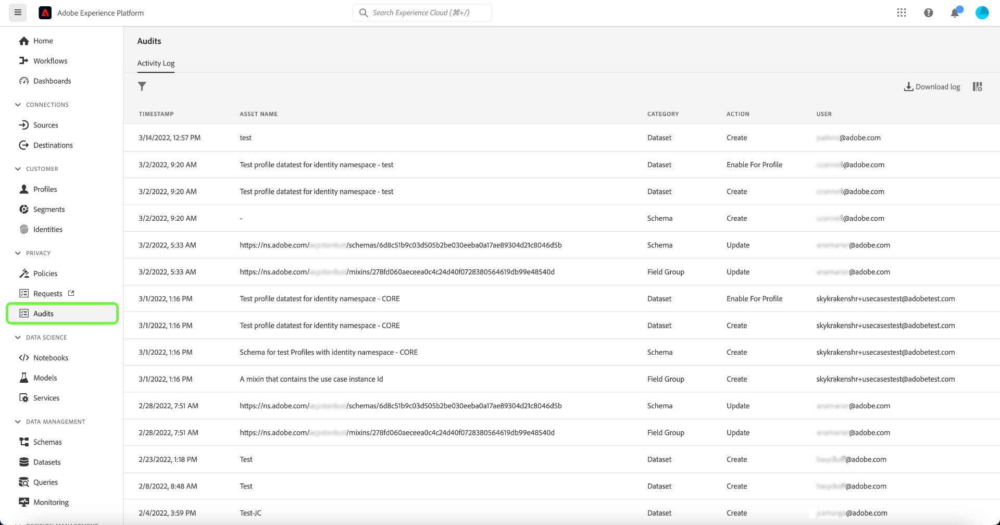

# 감사 로그 {#audit-logs}

>[!CONTEXTUALHELP]
>id="platform_audits_privacyconsole_actions"
>title="상위 액션"
>abstract="이 위젯은 선택한 기간 내에 Experience Platform에서 수행된 상위 액션을 보여 줍니다. Platform에서 기록된 작업의 전체 목록을 보려면 왼쪽 탐색에서 **감사**&#x200B;를 선택합니다."

>[!CONTEXTUALHELP]
>id="platform_audits_privacyconsole_users"
>title="상위 사용자"
>abstract="이 위젯은 선택한 기간 내에 Experience Platform에서 가장 많은 작업을 수행한 사용자를 보여 줍니다. Platform에서 기록된 작업의 전체 목록을 보려면 왼쪽 탐색에서 **감사**&#x200B;를 선택합니다."

>[!CONTEXTUALHELP]
>id="platform_privacyConsole_audits_description"
>title="Platform에서 사용자 활동 모니터링"
>abstract="<h2>설명</h2>
“감사 로그” 형식으로 다양한 Platform 서비스 및 기능에 대한 사용자 활동을 모니터링할 수 있습니다. 이들 로그는 <b>누가</b> <b>언제</b> <b>어떤</b> 작업을 수행했는지 기록하는 감사 추적을 형성합니다. 이들 로그는 Platform의 문제 해결에 도움이 되며 기업 데이터 관리 정책 및 규제 요구 사항을 효과적으로 준수하는 데 도움이 됩니다.
"

Adobe Experience Platform에서는 시스템에서 수행되는 활동의 투명성과 가시성을 높이기 위해 &quot;감사 로그&quot; 형식으로 다양한 서비스 및 기능에 대한 사용자 활동을 감사할 수 있습니다. 이러한 로그는 플랫폼의 문제 해결에 도움이 될 수 있는 감사 추적을 형성하며, 기업이 기업 데이터 관리 정책 및 규제 요구 사항을 효과적으로 준수하는 데 도움이 됩니다.

기본적으로 감사 로그는 **누가**&#x200B;이(가) **무엇을** 작업하고 **언제**&#x200B;했는지 알려 줍니다. 로그에 기록된 각 작업에는 작업 유형, 날짜 및 시간, 작업을 수행한 사용자의 이메일 ID 및 작업 유형과 관련된 추가 속성을 나타내는 메타데이터가 포함됩니다.

이 문서에서는 UI 또는 API에서 보고 관리하는 방법을 포함하여 플랫폼의 감사 로그를 다룹니다.

## 감사 로그로 캡처된 이벤트 유형 {#category}

다음 표에서는 감사 로그에서 리소스를 기록하는 작업을 설명합니다.

| 리소스 | 작업 |
| --- | --- |
| [액세스 제어 정책(특성 기반 액세스 제어)](../../../access-control/home.md) | <ul><li>만들기</li><li>업데이트</li><li>삭제</li></ul> |
| [계정(Adobe)](../../../sources/connectors/tutorials/ui/../../../tutorials/ui/update.md) | <ul><li>만들기</li><li>업데이트</li><li>삭제</li></ul> |
| [Attribution AI 인스턴스](../../../intelligent-services/attribution-ai/overview.md) | <ul><li>만들기</li><li>업데이트</li><li>삭제</li><li>활성화</li><li>비활성화</li></ul> |
| [감사 로그](../../../landing/governance-privacy-security/audit-logs/overview.md) | <ul><li>내보내기</li></ul> |
| [클래스](../../../xdm/schema/composition.md#class) | <ul><li>만들기</li><li>업데이트</li><li>삭제</li></ul> |
| 계산된 속성 | <ul><li>만들기</li><li>업데이트</li><li>삭제</li></ul> |
| [고객 AI 인스턴스](../../../intelligent-services/customer-ai/overview.md) | <ul><li>만들기</li><li>업데이트</li><li>삭제</li><li>활성화</li><li>비활성화</li></ul> |
| [데이터 집합](../../../catalog/datasets/overview.md) | <ul><li>만들기</li><li>업데이트</li><li>삭제</li><li>[실시간 고객 프로필](../../../profile/home.md)에 대해 활성화</li><li>프로필 비활성화</li><li>데이터 추가</li><li>일괄 처리 삭제</li></ul> |
| [데이터스트림](../../../datastreams/overview.md) | <ul><li>만들기</li><li>업데이트</li><li>삭제</li><li>활성화</li><li>비활성화</li><li>[매핑 편집](../../../datastreams/data-prep.md)</li></ul> |
| [데이터 유형](../../../xdm/schema/composition.md#data-type) | <ul><li>만들기</li><li>업데이트</li><li>삭제</li></ul> |
| [대상](../../../destinations/home.md) | <ul><li>만들기</li><li>업데이트</li><li>삭제</li><li>활성화</li><li>비활성화</li><li>데이터 세트 활성화</li><li>데이터 세트 제거</li><li>프로필 활성화</li><li>프로필 제거</li></ul> |
| [필드 그룹](../../../xdm/schema/composition.md#field-group) | <ul><li>만들기</li><li>업데이트</li><li>삭제</li></ul> |
| [ID 그래프](../../../identity-service/features/identity-graph-viewer.md) | <ul><li>보기</li></ul> |
| [ID 네임스페이스](../../../identity-service/features/namespaces.md) | <ul><li>만들기</li><li>업데이트</li></ul> |
| [병합 정책](../../../profile/merge-policies/overview.md) | <ul><li>만들기</li><li>업데이트</li><li>삭제</li></ul> |
| [제품 프로필](../../../access-control/home.md) | <ul><li>만들기</li><li>업데이트</li><li>삭제</li></ul> |
| [쿼리](../../../query-service/ui/overview.md) | <ul><li>실행</li></ul> |
| [쿼리 템플릿](../../../query-service/ui/overview.md) | <ul><li>만들기</li><li>업데이트</li><li>삭제</li></ul> |
| [역할(특성 기반 액세스 제어)](../../../access-control/home.md) | <ul><li>만들기</li><li>업데이트</li><li>삭제</li><li>사용자 추가</li><li>사용자 제거</li></ul> |
| [샌드박스](../../../sandboxes/home.md) | <ul><li>만들기</li><li>업데이트</li><li>재설정</li><li>삭제</li></ul> |
| [예약된 쿼리](../../../query-service/ui/overview.md) | <ul><li>만들기</li><li>업데이트</li><li>삭제</li></ul> |
| [스키마](../../../xdm/schema/composition.md) | <ul><li>만들기</li><li>업데이트</li><li>삭제</li><li>프로필을 위해 활성화</li></ul> |
| [세그먼트](../../../segmentation/home.md) | <ul><li>만들기</li><li>삭제</li><li>세그먼트 활성화</li><li>세그먼트 제거</li></ul> |
| [Source 데이터 흐름](../../../sources/connectors/tutorials/ui/../../../tutorials/ui/update.md) | <ul><li>만들기</li><li>업데이트</li><li>삭제</li><li>활성화</li><li>비활성화</li><li>데이터 세트 활성화</li><li>데이터 세트 제거</li><li>프로필 활성화</li><li>프로필 제거</li></ul> |
| [작업 순서](../../../hygiene/home.md) | <ul><li>만들기</li></ul> |

## 감사 로그 액세스

조직에서 이 기능을 활성화하면 활동이 발생할 때 감사 로그가 자동으로 수집됩니다. 로그 수집을 수동으로 활성화할 필요가 없습니다.

감사 로그를 보고 내보내려면 **[!UICONTROL 사용자 활동 로그 보기]** 액세스 제어 권한이 부여되어야 합니다([!UICONTROL 데이터 거버넌스] 범주 아래에 있음). Platform 기능에 대한 개별 권한을 관리하는 방법을 알아보려면 [액세스 제어 설명서](../../../access-control/home.md)를 참조하십시오.

## UI에서 감사 로그 관리 {#managing-audit-logs-in-the-ui}

>[!CONTEXTUALHELP]
>id="platform_privacyConsole_audits_instructions"
>title="지침"
>abstract="<ul><li>왼쪽 탐색 영역에서 <b>감사</b>를 선택합니다. 감사 작업 영역에는 기록된 로그 목록이 기본적으로 가장 최근 항목 순으로 정렬되어 표시됩니다.</li>   <li> 참고: 감사 로그는 365일 동안 유지되며 그 후에는 시스템에서 삭제됩니다. 따라서 최대 365일 동안만 돌아갈 수 있습니다. 365일 이상 지난 데이터를 다시 확인해야 하는 경우 내부 정책 요구 사항을 충족하도록 정기적으로 로그를 내보내야 합니다. </li><li>오른쪽 레일에서 세부 정보를 보려면 목록에서 이벤트를 선택하십시오. </li><li>깔때기 아이콘을 선택하여 필터 컨트롤 목록을 표시하면 결과 범위를 좁힐 수 있습니다. 선택한 필터에 관계없이 마지막 1000개의 레코드만 표시됩니다. </li><li>현재 감사 로그 목록을 내보내려면 **로그 다운로드**&#x200B;를 선택합니다.</li><li>이 기능에 대한 자세한 내용은 Experience League의 <a href="https://experienceleague.adobe.com/docs/experience-platform/landing/governance-privacy-security/audit-logs/overview.html?lang=ko">감사 로그 개요</a>를 참조하십시오.</li></ul>"

Platform UI의 **[!UICONTROL 감사]** 작업 영역에서 다양한 Experience Platform 기능에 대한 감사 로그를 볼 수 있습니다. 작업 공간에는 기본적으로 가장 최근에서 가장 최근으로 정렬된 기록된 로그 목록이 표시됩니다.

감사 로그는 365일 동안 유지되며 그 후에는 시스템에서 삭제됩니다. 따라서 최대 365일 동안만 돌아갈 수 있습니다. 365일 이상의 데이터가 필요한 경우 내부 정책 요구 사항을 충족하도록 정기적으로 로그를 내보내야 합니다.

오른쪽 레일에서 세부 정보를 보려면 목록에서 이벤트를 선택하십시오.

### 감사 로그 필터링

>[!NOTE]
>
>이 새로운 기능 때문에 표시되는 데이터는 2022년 3월까지만 유지됩니다. 선택한 리소스에 따라 2022년 1월부터 이전 데이터를 사용할 수 있습니다.

단계 아이콘()을 선택하여 결과를 좁히는 데 도움이 되는 필터 컨트롤 목록을 표시합니다. 선택한 다양한 필터에 관계없이 마지막 1000개의 레코드만 표시됩니다.

UI의 감사 이벤트에 사용할 수 있는 필터는 다음과 같습니다.

| 필터 | 설명 |
| --- | --- |
| [!UICONTROL 범주] | 드롭다운 메뉴를 사용하여 표시된 결과를 [범주](#category)(으)로 필터링합니다. |
| [!UICONTROL 작업] | 액션으로 필터링합니다. 각 서비스에 대해 사용할 수 있는 작업은 위의 리소스 테이블에서 확인할 수 있습니다. |
| [!UICONTROL 사용자] | 사용자별로 필터링할 전체 사용자 ID(예: `johndoe@acme.com`)를 입력하십시오. |
| [!UICONTROL 상태] | [액세스 제어](../../../access-control/home.md) 권한이 없어 작업이 허용(완료)되었는지 또는 거부되었는지 여부를 기준으로 필터링합니다. |
| [!UICONTROL 날짜] | 시작 날짜 및/또는 종료 날짜를 선택하여 결과를 필터링할 날짜 범위를 정의합니다. 데이터는 90일 전환 확인 기간(예: 2021-12-15에서 2022-03-15)을 사용하여 내보낼 수 있습니다. 이는 이벤트 유형별로 다를 수 있습니다. |

필터를 제거하려면 해당 필터의 알약 아이콘에서 &quot;X&quot;를 선택하거나 **[!UICONTROL 모두 지우기]**&#x200B;를 선택하여 모든 필터를 제거합니다.

반환된 감사 로그 데이터에는 선택한 필터 기준을 충족하는 모든 쿼리에 대한 다음 정보가 포함됩니다.

| 열 이름 | 설명 |
|---|---|
| [!UICONTROL 타임스탬프] | `month/day/year hour:minute AM/PM` 형식으로 수행된 작업의 정확한 날짜 및 시간입니다. |
| [!UICONTROL 자산 이름] | [!UICONTROL 자산 이름] 필드의 값은 필터로 선택한 범주에 따라 다릅니다. |
| [!UICONTROL 범주] | 이 필드는 필터 드롭다운에서 선택한 범주와 일치합니다. |
| [!UICONTROL 작업] | 사용 가능한 작업은 필터로 선택한 범주에 따라 다릅니다. |
| [!UICONTROL 사용자] | 이 필드는 쿼리를 실행한 사용자 ID를 제공합니다. |

### 감사 로그 내보내기

현재 감사 로그 목록을 내보내려면 **[!UICONTROL 로그 다운로드]**&#x200B;를 선택합니다.

![다운로드 로그]가 강조 표시된 감사 대시보드입니다.](../../images/audit-logs/download.png)[!UICONTROL 

표시되는 대화 상자에서 원하는 형식(**[!UICONTROL CSV]** 또는 **[!UICONTROL JSON]**)을 선택한 다음 **[!UICONTROL 다운로드]**&#x200B;를 선택합니다. 브라우저가 생성된 파일을 다운로드하여 시스템에 저장합니다.

![강조 표시된 [!UICONTROL 다운로드]의 파일 형식 선택 대화 상자.](../../images/audit-logs/select-download-format.png)

## 경고 활성화 {#enable-alerts}

감사 경고를 활성화하여 다음 규칙에 대한 알림을 받을 수 있습니다.

* 대상자 만들기
* 대상자 업데이트
* 대상자 삭제
* 데이터 세트 만들기
* 데이터 세트 업데이트
* 데이터 세트 삭제
* 스키마 만들기
* 스키마 업데이트
* 스키마 삭제

목록에서 원하는 경고를 선택하여 알림을 수신합니다. 경고에 대한 자세한 내용은 [UI를 사용하여 경고 구독](../../../observability/alerts/ui.md)에 대한 안내서를 참조하십시오.

## API에서 감사 로그 관리

UI에서 수행할 수 있는 모든 작업은 API 호출을 사용하여 수행할 수도 있습니다. 자세한 내용은 [API 참조 문서](https://www.adobe.io/experience-platform-apis/references/audit-query/)를 참조하십시오.

## Adobe Admin Console에 대한 감사 로그 관리

Adobe Admin Console의 활동에 대한 감사 로그를 관리하는 방법에 대해 알아보려면 다음 [문서](https://helpx.adobe.com/enterprise/using/audit-logs.html)를 참조하세요.

## 다음 단계 및 추가 리소스

이 안내서에서는 Experience Platform에서 감사 로그를 관리하는 방법을 다룹니다. 플랫폼 활동을 모니터링하는 방법에 대한 자세한 내용은 [Observability Insights](../../../observability/home.md) 및 [데이터 수집 모니터링](../../../ingestion/quality/monitor-data-ingestion.md)에 대한 설명서를 참조하십시오.

Experience Platform의 감사 로그에 대한 이해를 강화하려면 다음 비디오를 시청하십시오.

>[!VIDEO](https://video.tv.adobe.com/v/341450?quality=12&learn=on)
