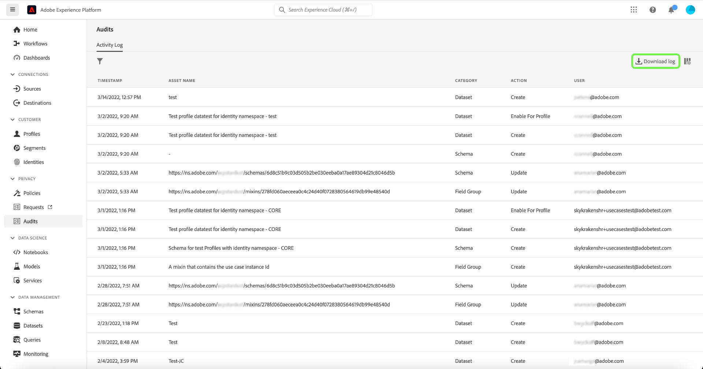

# 감사 로그 {#audit-logs}

>[!CONTEXTUALHELP]
>id="platform_audits_privacyconsole_actions"
>title="상위 작업"
>abstract="이 위젯은 선택한 기간 내에 Experience Platform에서 수행한 상위 종류의 작업을 표시합니다. 플랫폼에서 기록된 작업의 전체 목록을 보려면 다음을 선택합니다. **감사** 왼쪽 탐색."

>[!CONTEXTUALHELP]
>id="platform_audits_privacyconsole_users"
>title="상위 사용자"
>abstract="이 위젯은 선택한 기간 내에 Experience Platform에서 가장 많은 작업을 실행한 사용자를 표시합니다. 플랫폼에서 기록된 작업의 전체 목록을 보려면 다음을 선택합니다. **감사** 왼쪽 탐색."

>[!CONTEXTUALHELP]
>id="platform_privacyConsole_audits_description"
>title="설명"
>abstract=""

Adobe Experience Platform에서는 시스템에서 수행되는 활동의 투명성과 가시성을 높이기 위해 &quot;감사 로그&quot; 형식으로 다양한 서비스 및 기능에 대한 사용자 활동을 감사할 수 있습니다. 이러한 로그는 플랫폼의 문제 해결에 도움이 될 수 있는 감사 추적을 형성하며, 기업이 기업 데이터 관리 정책 및 규제 요구 사항을 효과적으로 준수하는 데 도움이 됩니다.

기본적으로 감사 로그는 **어떤 사람**&#x200B;이 **어떤** 작업을 **언제** 수행했는지 알려 줍니다. 로그에 기록된 각 작업에는 작업 유형, 날짜 및 시간, 작업을 수행한 사용자의 이메일 ID 및 작업 유형과 관련된 추가 속성을 나타내는 메타데이터가 포함됩니다.

이 문서에서는 UI 또는 API에서 보고 관리하는 방법을 포함하여 플랫폼의 감사 로그를 다룹니다.

## 감사 로그로 캡처된 이벤트 유형 {#category}

다음 표에서는 감사 로그에서 리소스를 기록하는 작업을 설명합니다:

| 리소스 | 작업 |
| --- | --- |
| [액세스 제어 정책(속성 기반 액세스 제어)](../../../access-control/home.md) | <ul><li>만들기</li><li>업데이트</li><li>삭제</li></ul> |
| [계정(Adobe)](../../../sources/connectors/tutorials/ui/../../../tutorials/ui/update.md) | <ul><li>만들기</li><li>업데이트</li><li>삭제</li></ul> |
| [Attribution AI 인스턴스](../../../intelligent-services/attribution-ai/overview.md) | <ul><li>만들기</li><li>업데이트</li><li>삭제</li><li>활성화</li><li>비활성화</li></ul> |
| [감사 로그](../../../landing/governance-privacy-security/audit-logs/overview.md) | <ul><li>내보내기</li></ul> |
| [클래스](../../../xdm/schema/composition.md#class) | <ul><li>만들기</li><li>업데이트</li><li>삭제</li></ul> |
| [계산된 속성](../../../profile/computed-attributes/overview.md) | <ul><li>만들기</li><li>업데이트</li><li>삭제</li></ul> |
| [고객 AI 인스턴스](../../../intelligent-services/customer-ai/overview.md) | <ul><li>만들기</li><li>업데이트</li><li>삭제</li><li>활성화</li><li>비활성화</li></ul> |
| [데이터 세트](../../../catalog/datasets/overview.md) | <ul><li>만들기</li><li>업데이트</li><li>삭제</li><li>다음에 대해 활성화: [실시간 고객 프로필](../../../profile/home.md)</li><li>프로필 비활성화</li><li>데이터 추가</li><li>일괄 처리 삭제</li></ul> |
| [데이터스트림](../../../edge/datastreams/overview.md) | <ul><li>만들기</li><li>업데이트</li><li>삭제</li><li>활성화</li><li>비활성화</li><li>[매핑 편집](../../../edge/datastreams/data-prep.md)</li></ul> |
| [데이터 유형](../../../xdm/schema/composition.md#data-type) | <ul><li>만들기</li><li>업데이트</li><li>삭제</li></ul> |
| [대상](../../../destinations/home.md) | <ul><li>만들기</li><li>업데이트</li><li>삭제</li><li>활성화</li><li>비활성화</li><li>데이터 세트 활성화</li><li>데이터 세트 제거</li><li>프로필 활성화</li><li>프로필 제거</li></ul> |
| [필드 그룹](../../../xdm/schema/composition.md#field-group) | <ul><li>만들기</li><li>업데이트</li><li>삭제</li></ul> |
| [ID 그래프](../../../identity-service/ui/identity-graph-viewer.md) | <ul><li>보기</li></ul> |
| [ID 네임스페이스](../../../identity-service/ui/identity-graph-viewer.md) | <ul><li>만들기</li><li>업데이트</li></ul> |
| [병합 정책](../../../profile/merge-policies/overview.md) | <ul><li>만들기</li><li>업데이트</li><li>삭제</li></ul> |
| [제품 프로필](../../../access-control/home.md) | <ul><li>만들기</li><li>업데이트</li><li>삭제</li></ul> |
| [쿼리](../../../query-service/ui/overview.md) | <ul><li>실행</li></ul> |
| [쿼리 템플릿](../../../query-service/ui/overview.md) | <ul><li>만들기</li><li>업데이트</li><li>삭제</li></ul> |
| [역할(속성 기반 액세스 제어)](../../../access-control/home.md) | <ul><li>만들기</li><li>업데이트</li><li>삭제</li><li>사용자 추가</li><li>사용자 제거</li></ul> |
| [샌드박스](../../../sandboxes/home.md) | <ul><li>만들기</li><li>업데이트</li><li>재설정</li><li>삭제</li></ul> |
| [예약된 쿼리](../../../query-service/ui/overview.md) | <ul><li>만들기</li><li>업데이트</li><li>삭제</li></ul> |
| [스키마](../../../xdm/schema/composition.md) | <ul><li>만들기</li><li>업데이트</li><li>삭제</li><li>프로필 활성화</li></ul> |
| [세그먼트](../../../segmentation/home.md) | <ul><li>만들기</li><li>삭제</li><li>세그먼트 활성화</li><li>세그먼트 제거</li></ul> |
| [소스 데이터 흐름](../../../sources/connectors/tutorials/ui/../../../tutorials/ui/update.md) | <ul><li>만들기</li><li>업데이트</li><li>삭제</li><li>활성화</li><li>비활성화</li><li>데이터 세트 활성화</li><li>데이터 세트 제거</li><li>프로필 활성화</li><li>프로필 제거</li></ul> |
| [작업 순서](../../../hygiene/home.md) | <ul><li>만들기</li></ul> |

## 감사 로그 액세스

조직에서 이 기능을 활성화하면 활동이 발생할 때 감사 로그가 자동으로 수집됩니다. 로그 수집을 수동으로 활성화할 필요가 없습니다.

감사 로그를 보고 내보내려면 **[!UICONTROL 사용자 활동 로그 보기]** 부여된 액세스 제어 권한(아래에 있음) [!UICONTROL 데이터 거버넌스] 카테고리). Platform 기능에 대한 개별 권한을 관리하는 방법은 다음을 참조하십시오. [액세스 제어 설명서](../../../access-control/home.md).

## UI에서 감사 로그 관리 {#managing-audit-logs-in-the-ui}

>[!CONTEXTUALHELP]
>id="platform_privacyConsole_audits_instructions"
>title="지침"
>abstract=""

내에서 다양한 Experience Platform 기능에 대한 감사 로그를 볼 수 있습니다. **[!UICONTROL 감사]** Platform UI의 작업 공간 작업 공간에는 기본적으로 가장 최근에서 가장 최근으로 정렬된 기록된 로그 목록이 표시됩니다.

감사 로그는 365일 동안 유지되며 그 후에는 시스템에서 삭제됩니다. 따라서 최대 365일 동안만 되돌릴 수 있습니다. 365일 이상의 데이터가 필요한 경우 내부 정책 요구 사항을 충족하도록 정기적으로 로그를 내보내야 합니다.

목록에서 이벤트를 선택하여 오른쪽 레일에서 세부 정보를 확인합니다.

### 감사 로그 필터링

>[!NOTE]
>
>이 새로운 기능 때문에 표시되는 데이터는 2022년 3월까지만 유지됩니다. 선택한 리소스에 따라 2022년 1월부터 이전 데이터를 사용할 수 있습니다.

단계 아이콘() 필터 컨트롤 목록을 표시하여 결과의 범위를 좁힐 수 있습니다. 선택한 다양한 필터에 관계없이 마지막 1000개의 레코드만 표시됩니다.

UI의 감사 이벤트에 사용할 수 있는 필터는 다음과 같습니다.

| 필터 | 설명 |
| --- | --- |
| [!UICONTROL 범주] | 드롭다운 메뉴를 사용하여 표시된 결과 필터링 기준 [범주](#category). |
| [!UICONTROL 작업] | 액션으로 필터링합니다. 현재는 [!UICONTROL 만들기] 및 [!UICONTROL 삭제] 작업을 필터링할 수 있습니다. |
| [!UICONTROL 사용자] | 전체 사용자 ID를 입력합니다(예: `johndoe@acme.com`)을 클릭하여 사용자별로 필터링할 수 있습니다. |
| [!UICONTROL 상태] | 작업이 허용되었는지(완료되었는지) 또는 (이)가 없어 거부되었는지 여부에 따라 필터링합니다. [액세스 제어](../../../access-control/home.md) 사용 권한. |
| [!UICONTROL 날짜] | 시작 날짜 및/또는 종료 날짜를 선택하여 결과를 필터링할 날짜 범위를 정의합니다. 데이터는 90일 전환 확인 기간(예: 2021-12-15에서 2022-03-15)을 사용하여 내보낼 수 있습니다. 이는 이벤트 유형별로 다를 수 있습니다. |

필터를 제거하려면 해당 필터의 알약 아이콘에서 &quot;X&quot;를 선택하거나 을 선택합니다 **[!UICONTROL 모두 지우기]** 모든 필터를 제거합니다.

### 감사 로그 내보내기

현재 감사 로그 목록을 내보내려면 **[!UICONTROL 로그 다운로드]**.

표시되는 대화 상자에서 원하는 형식(또는 **[!UICONTROL CSV]** 또는 **[!UICONTROL JSON]**)을 선택한 다음 를 선택합니다 **[!UICONTROL 다운로드]**. 브라우저가 생성된 파일을 다운로드하여 시스템에 저장합니다.

## API에서 감사 로그 관리

UI에서 수행할 수 있는 모든 작업은 API 호출을 사용하여 수행할 수도 있습니다. 자세한 내용은 [ API 참조 문서](https://www.adobe.io/experience-platform-apis/references/audit-query/)를 참조하십시오.

## Adobe Admin Console에 대한 감사 로그 관리

Adobe Admin Console의 활동에 대한 감사 로그를 관리하는 방법은 다음을 참조하십시오 [문서](https://helpx.adobe.com/enterprise/using/audit-logs.html).

## 다음 단계 및 추가 리소스

이 안내서에서는 Experience Platform에서 감사 로그를 관리하는 방법을 다룹니다. Platform 활동을 모니터링하는 방법에 대한 자세한 내용은 [가시성 통찰력](../../../observability/home.md) 및 [데이터 수집 모니터링](../../../ingestion/quality/monitor-data-ingestion.md).

Experience Platform의 감사 로그에 대한 이해를 강화하려면 다음 비디오를 시청하십시오.

>[!VIDEO](https://video.tv.adobe.com/v/341450?quality=12&learn=on)
