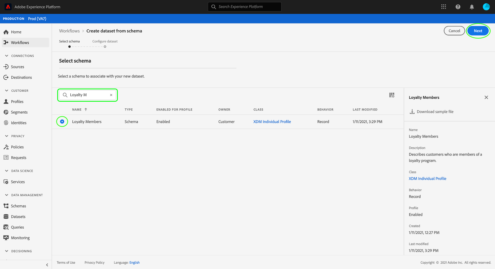

# 동의 및 환경 설정 데이터를 캡처하도록 데이터 세트 구성

Adobe Experience Platform에서 고객 동의/환경 설정 데이터를 처리하려면 스키마에 동의 및 기타 권한과 관련된 필드가 포함된 데이터 세트로 해당 데이터를 보내야 합니다. 특히 이 데이터 집합은 [!DNL XDM Individual Profile] 클래스를 기반으로 해야 하며 [!DNL Real-Time Customer Profile]에서 사용할 수 있도록 설정되어 있습니다.

이 문서에서는 Experience Platform에서 동의 데이터를 처리하도록 데이터 세트를 구성하는 단계를 제공합니다. 플랫폼에서 동의/환경 설정 데이터를 처리하는 전체 워크플로에 대한 개요는 [동의 처리 개요](./overview.md)를 참조하십시오.

>[!IMPORTANT]
>
>이 안내서의 예제에서는 표준화된 필드 집합을 사용하여 [[!UICONTROL 동의 및 환경 설정 세부 정보] 스키마 필드 그룹](../../../../xdm/field-groups/profile/consents.md)에 정의된 대로 고객 동의 값을 표시합니다. 이러한 필드의 구조는 많은 공통 동의 수집 사용 사례를 다룰 수 있는 효율적인 데이터 모델을 제공하기 위한 것입니다.
>
>그러나 고유한 데이터 모델에 따라 동의를 나타내는 고유한 필드 그룹을 정의할 수도 있습니다. 다음 옵션에 따라 비즈니스 요구 사항에 맞는 동의 데이터 모델에 대한 승인을 받으려면 법무팀에 문의하십시오.
>
>* 표준화된 동의 필드 그룹
>* 조직에서 만든 사용자 정의 동의 필드 그룹
>* 표준화된 동의 필드 그룹과 사용자 정의 동의 필드 그룹에서 제공하는 추가 필드의 조합

## 전제 조건

이 자습서에서는 Adobe Experience Platform의 다음 구성 요소를 이해하고 있어야 합니다.

* [XDM(경험 데이터 모델)](../../../../xdm/home.md): [!DNL Experience Platform]에서 고객 경험 데이터를 구성하는 표준화된 프레임워크입니다.
   * [스키마 컴포지션의 기본 사항](../../../../xdm/schema/composition.md): XDM 스키마의 기본 구성 요소에 대해 알아봅니다.
* [실시간 고객 프로필](../../../../profile/home.md): 서로 다른 소스의 고객 데이터를 전체 통합 보기로 통합하면서 모든 고객 상호 작용에 대해 실행 가능한 타임스탬프가 지정된 계정을 제공합니다.

>[!IMPORTANT]
>
>이 자습서에서는 사용자 특성 정보를 캡처하는 데 사용할 플랫폼의 [!DNL Profile] 스키마를 알고 있다고 가정합니다. 동의 데이터를 수집하는 데 사용하는 방법에 관계없이 이 스키마는 실시간 고객 프로필에 대해 [활성화됨](../../../../xdm/ui/resources/schemas.md#profile)이어야 합니다. 또한 스키마의 기본 ID는 이메일 주소와 같이 관심 기반 광고에서 사용할 수 없는 직접 식별 가능한 필드일 수 없습니다. 제한된 필드가 확실하지 않은 경우 법률 자문을 구하십시오.

## [!UICONTROL 동의 및 환경 설정 세부 정보] 필드 그룹 구조 {#structure}

[!UICONTROL 동의 및 환경 설정 세부 정보] 필드 그룹은 스키마에 표준화된 동의 필드를 제공합니다. 현재 이 필드 그룹은 [!DNL XDM Individual Profile] 클래스를 기반으로 하는 스키마와만 호환됩니다.

필드 그룹은 하위 속성이 표준화된 동의 필드 집합을 캡처하는 단일 개체 유형 필드 `consents`을(를) 제공합니다. 다음 JSON은 데이터 수집 시 `consents`에서 예상하는 데이터 종류의 예입니다.

```json
{
  "consents": {
    "collect": {
      "val": "y",
    },
    "share": {
      "val": "y",
    },
    "personalize": {
      "content": {
        "val": "y"
      }
    },
    "marketing": {
      "preferred": "email",
      "any": {
        "val": "y"
      },
      "push": {
        "val": "n",
        "reason": "Too Frequent",
        "time": "2019-01-01T15:52:25+00:00"
      }
    },
    "idSpecific": {
      "email": {
        "jdoe@example.com": {
          "marketing": {
            "email": {
              "val": "n"
            }
          }
        }
      }
    }
  },
  "metadata": {
    "time": "2019-01-01T15:52:25+00:00"
  }
}
```

>[!NOTE]
>
>`consents`의 하위 속성의 구조와 의미에 대한 자세한 내용은 [[!UICONTROL 동의 및 환경 설정 세부 정보] 필드 그룹](../../../../xdm/field-groups/profile/consents.md)의 개요를 참조하십시오.

## [!DNL Profile] 스키마에 필수 필드 그룹 추가 {#add-field-group}

Adobe 표준을 사용하여 동의 데이터를 수집하려면 다음 두 필드 그룹을 포함하는 프로필 활성화 스키마가 있어야 합니다.

* [[!UICONTROL 동의 및 환경 설정 세부 정보]](../../../../xdm/field-groups/profile/consents.md)
* [[!UICONTROL IdentityMap]](../../../../xdm/field-groups/profile/identitymap.md)(Platform 웹 또는 Mobile SDK를 사용하여 동의 신호를 보내는 경우 필요)

Platform UI의 왼쪽 탐색에서 **[!UICONTROL 스키마]**&#x200B;를 선택한 다음 **[!UICONTROL 찾아보기]** 탭을 선택하여 기존 스키마 목록을 표시합니다. 여기에서 동의 필드를 추가할 [!DNL Profile] 사용 스키마의 이름을 선택합니다. 이 섹션의 스크린샷은 [스키마 만들기 자습서](../../../../xdm/tutorials/create-schema-ui.md)에서 빌드된 &quot;충성도 멤버&quot; 스키마를 예로 사용합니다.


>[!TIP]
>
>작업 영역의 검색 및 필터링 기능을 사용하여 스키마를 보다 쉽게 찾을 수 있습니다. 자세한 내용은 [XDM 리소스 탐색](../../../../xdm/ui/explore.md)에 대한 안내서를 참조하십시오.

캔버스에서 스키마 구조를 보여 주는 [!DNL Schema Editor]이(가) 나타납니다. 캔버스의 왼쪽에서는 **[!UICONTROL 필드 그룹]** 섹션에서 **[!UICONTROL 추가]**&#x200B;를 선택합니다.


**[!UICONTROL 필드 그룹 추가]** 대화 상자가 나타납니다. 목록에서 **[!UICONTROL 동의 및 환경 설정 세부 정보]**&#x200B;를 선택하십시오. 선택적으로 검색 창을 사용하여 결과 범위를 좁혀 필드 그룹을 더 쉽게 찾을 수 있습니다.


그런 다음 목록에서 **[!UICONTROL IdentityMap]** 필드 그룹을 찾아 선택합니다. 두 필드 그룹이 오른쪽 레일에 나열되면 **[!UICONTROL 필드 그룹 추가]**&#x200B;를 선택합니다.


`consents` 및 `identityMap` 필드가 스키마 구조에 추가되었음을 보여주는 캔버스가 다시 나타납니다. 표준 필드 그룹에서 캡처하지 않은 추가 동의 및 환경 설정 필드가 필요한 경우 [스키마에 사용자 지정 동의 및 환경 설정 필드 추가](#custom-consent)에 대한 부록 섹션을 참조하십시오. 그렇지 않으면 **[!UICONTROL 저장]**&#x200B;을 선택하여 스키마에 대한 변경 내용을 완료합니다.


>[!IMPORTANT]
>
>새 스키마를 만들거나 프로필에 대해 활성화되지 않은 기존 스키마를 편집하는 경우 저장하기 전에 [프로필에 대해 스키마를 활성화](../../../../xdm/ui/resources/schemas.md#profile)해야 합니다.

편집한 스키마를 Platform Web SDK 데이터스트림에 지정된 [!UICONTROL 프로필 데이터 세트]에서 사용하는 경우 해당 데이터 세트에 새 동의 필드가 포함됩니다. 이제 [동의 처리 가이드](./overview.md#merge-policies)(으)로 돌아가서 동의 데이터를 처리하도록 Experience Platform을 구성하는 프로세스를 계속할 수 있습니다. 이 스키마에 대한 데이터 세트를 만들지 않은 경우 다음 섹션의 단계를 따릅니다.

## 동의 스키마를 기반으로 데이터 세트 만들기 {#dataset}

동의 필드가 있는 스키마를 만든 후에는 궁극적으로 고객의 동의 데이터를 수집하는 데이터 세트를 만들어야 합니다. [!DNL Real-Time Customer Profile]에 대해 이 데이터 세트를 사용하도록 설정해야 합니다.

시작하려면 왼쪽 탐색에서 **[!UICONTROL 데이터 세트]**&#x200B;를 선택한 다음 오른쪽 상단 모서리에서 **[!UICONTROL 데이터 세트 만들기]**&#x200B;를 선택하십시오.


다음 페이지에서 **[!UICONTROL 스키마에서 데이터 집합 만들기]**&#x200B;를 선택합니다.


**[!UICONTROL 스키마 선택]** 단계부터 **[!UICONTROL 스키마에서 데이터 집합 만들기]** 워크플로가 나타납니다. 제공된 목록에서 이전에 생성한 동의 스키마 중 하나를 찾습니다. 선택적으로 검색 창을 사용하여 결과의 범위를 좁히고 스키마를 더 쉽게 찾을 수 있습니다. 원하는 스키마 옆에 있는 라디오 단추를 선택한 후 **[!UICONTROL 다음]**&#x200B;을 선택하여 계속합니다.



**[!UICONTROL 데이터 집합 구성]** 단계가 나타납니다. **[!UICONTROL 완료]**&#x200B;를 선택하기 전에 데이터 집합에 대해 쉽게 식별할 수 있는 고유한 이름과 설명을 제공하십시오.


새로 생성된 데이터 세트에 대한 세부 정보 페이지가 나타납니다. 데이터 세트가 시계열 스키마를 기반으로 하는 경우 프로세스가 완료됩니다. 데이터 집합이 레코드 스키마를 기반으로 하는 경우 프로세스의 마지막 단계는 [!DNL Real-Time Customer Profile]에서 사용할 데이터 집합을 활성화하는 것입니다.

오른쪽 레일에서 **[!UICONTROL 프로필]** 전환을 선택합니다.


마지막으로 확인 팝오버에서 **[!UICONTROL 활성화]**&#x200B;를 선택하여 [!DNL Profile]에 대한 스키마를 활성화합니다.


이제 데이터 세트가 저장되고 [!DNL Profile]에서 사용할 수 있습니다. Platform Web SDK를 사용하여 프로필에 동의 데이터를 전송하려는 경우 [데이터스트림](../../../../datastreams/overview.md)을 설정할 때 이 데이터 세트를 [!UICONTROL 프로필 데이터 세트](으)로 선택해야 합니다.

## 다음 단계

이 자습서에 따라 Platform Web SDK 또는 직접 XDM 수집을 사용하여 동의 데이터를 수집하는 데 사용할 데이터 세트를 가진 [!DNL Profile] 사용 스키마에 동의 필드를 추가했습니다.

이제 [동의 처리 개요](./overview.md#merge-policies)(으)로 돌아가서 동의 데이터를 처리할 Experience Platform 구성을 계속할 수 있습니다.

## 부록

다음 섹션에는 고객 동의 및 환경 설정 데이터를 수집하기 위한 데이터 세트를 만드는 방법에 대한 추가 정보가 포함되어 있습니다.

### 사용자 정의 동의 및 환경 설정 필드를 스키마에 추가 {#custom-consent}

표준 [!UICONTROL 동의 및 환경 설정 세부 정보] 필드 그룹이 나타내는 신호 외에 추가 동의 신호를 캡처해야 하는 경우 사용자 지정 XDM 구성 요소를 사용하여 특정 비즈니스 요구 사항에 맞게 동의 스키마를 향상시킬 수 있습니다. 이 섹션에서는 이러한 신호를 프로필로 수집하기 위해 동의 스키마를 사용자 정의하는 방법에 대한 기본 원칙을 간략하게 설명합니다.

>[!IMPORTANT]
>
>Platform Web 및 Mobile SDK는 동의 변경 명령의 사용자 지정 필드를 지원하지 않습니다. 현재 사용자 지정 동의 필드를 프로필로 수집하는 유일한 방법은 [일괄 처리 수집](../../../../ingestion/batch-ingestion/overview.md) 또는 [소스 연결](../../../../sources/home.md)을 통해서입니다.

전체 구조를 처음부터 만드는 대신 [!UICONTROL 동의 및 환경 설정 세부 정보] 필드 그룹을 동의 데이터 구조의 기준으로 사용하고 필요에 따라 필드를 추가하는 것이 좋습니다.

표준 필드 그룹의 구조에 사용자 정의 필드를 추가하려면 먼저 사용자 정의 필드 그룹을 만들어야 합니다. [!UICONTROL 동의 및 환경 설정 세부 정보] 필드 그룹을 스키마에 추가한 후 **[!UICONTROL 필드 그룹]** 섹션에서 **더하기(+)** 아이콘을 선택한 다음 **[!UICONTROL 새 필드 그룹 만들기]**&#x200B;를 선택합니다. 필드 그룹의 이름과 선택적 설명을 입력한 다음 **[!UICONTROL 필드 그룹 추가]**&#x200B;를 선택하십시오.


왼쪽 레일에서 새 사용자 지정 필드 그룹이 선택된 상태로 [!DNL Schema Editor]이(가) 다시 나타납니다. 캔버스에 사용자 지정 필드를 스키마 구조에 추가할 수 있는 컨트롤이 나타납니다. 새 동의 또는 환경 설정 필드를 추가하려면 `consents` 개체 옆에 있는 **더하기(+)** 아이콘을 선택하십시오.


`consents` 개체 내에 새 필드가 나타납니다. 표준 XDM 개체에 사용자 지정 필드를 추가하므로 새 필드는 테넌트 ID에 네임스페이스가 지정된 개체에 만들어집니다.


**[!UICONTROL 필드 속성]** 아래의 오른쪽 레일에서 필드의 이름과 설명을 입력하십시오. 필드의 **[!UICONTROL 형식]**&#x200B;을(를) 선택할 때 사용자 지정 동의 또는 환경 설정 필드에 적절한 표준 데이터 형식을 사용해야 합니다.

* [[!UICONTROL 일반 동의 필드]](../../../../xdm/data-types/consent-field.md)
* [[!UICONTROL 일반 마케팅 환경 설정 필드]](../../../../xdm/data-types/marketing-field.md)
* [[!UICONTROL 구독이 있는 일반 마케팅 환경 설정 필드]](../../../../xdm/data-types/marketing-field-subscriptions.md)
* [[!UICONTROL 일반 Personalization 환경 설정 필드]](../../../../xdm/data-types/personalization-field.md)

완료되면 **[!UICONTROL 적용]**&#x200B;을 선택합니다.


동의 또는 환경 설정 필드가 스키마 구조에 추가됩니다. 오른쪽 레일에 표시된 [!UICONTROL 경로]에는 `_tenantId` 네임스페이스가 있습니다. 데이터 작업에서 이 필드에 대한 경로를 참조할 때마다 이 네임스페이스를 포함해야 합니다.


위의 단계에 따라 필요한 동의 및 환경 설정 필드를 계속 추가합니다. 완료되면 **[!UICONTROL 저장]**&#x200B;을 선택하여 변경 내용을 확인합니다.

이 스키마에 대한 데이터 집합을 만들지 않은 경우 [데이터 집합 만들기](#dataset)의 섹션으로 계속하십시오.
