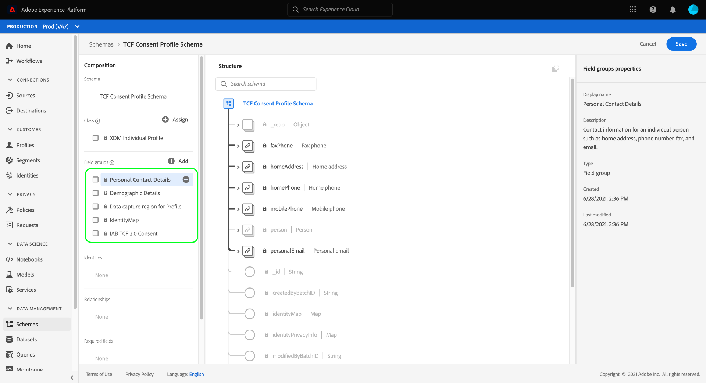

# IAB TCF 2.0 동의 데이터를 캡처하기 위한 데이터 집합 만들기

Adobe Experience Platform이 IAB [!DNL Transparency & Consent Framework](TCF) 2.0에 따라 고객 동의 데이터를 처리하려면 스키마에 TCF 2.0 동의 필드가 포함된 데이터 세트로 해당 데이터를 보내야 합니다.

특히 TCF 2.0 동의 데이터를 캡처하는 데 두 개의 데이터 세트가 필요합니다.

* [!DNL Real-time Customer Profile]에서 사용할 수 있는 [!DNL XDM Individual Profile] 클래스를 기반으로 하는 데이터 집합입니다.
* [!DNL XDM ExperienceEvent] 클래스를 기반으로 하는 데이터 집합입니다.

이 문서에서는 IAB TCF 2.0 동의 데이터를 수집하기 위해 이 두 데이터 세트를 설정하는 절차를 제공합니다. TCF 2.0에 대한 플랫폼 데이터 작업을 구성하는 전체 작업 과정에 대한 개요는 [IAB TCF 2.0 준수 개요](./overview.md)를 참조하십시오.

## 전제 조건

이 자습서에서는 Adobe Experience Platform의 다음 구성 요소에 대해 작업해야 합니다.

* [경험 데이터 모델(XDM)](../../../../xdm/home.md):고객 경험 데이터를  [!DNL Experience Platform] 구성하는 표준화된 프레임워크
   * [스키마 컴포지션의 기본 사항](../../../../xdm/schema/composition.md):XDM 스키마의 기본 구성 요소에 대해 알아봅니다.
* [Adobe Experience Platform ID 서비스](../../../../identity-service/home.md):다양한 디바이스와 시스템에서 서로 다른 데이터 소스로부터 고객 ID를 연계할 수 있습니다.
   * [ID 네임스페이스](../../../../identity-service/namespaces.md):고객 ID 데이터는 ID 서비스에서 인식한 특정 ID 네임스페이스로 제공해야 합니다.
* [실시간 고객 프로필](../../../../profile/home.md):데이터 세트 [!DNL Identity Service] 에서 실시간으로 상세한 고객 프로파일을 만들 수 있습니다. [!DNL Real-time Customer Profile] 데이터 레이크에서 데이터를 가져와 별도의 데이터 저장소에 있는 고객 프로파일을 유지합니다.

## [!UICONTROL Privacy Details] 필드 그룹 구조  {#structure}

[!UICONTROL Privacy Details] 스키마 필드 그룹은 TCF 2.0 지원에 필요한 고객 동의 필드를 제공합니다. 이 필드 그룹에는 두 가지 버전이 있습니다.하나는 [!DNL XDM Individual Profile] 클래스와 호환되고 다른 하나는 [!DNL XDM ExperienceEvent] 클래스와 호환됩니다.

아래 섹션에서는 섭취 중에 예상하는 데이터를 비롯하여 이러한 각 필드 그룹의 구조에 대해 설명합니다.

### 프로필 필드 그룹 {#profile-field-group}

[!DNL XDM Individual Profile]을 기반으로 하는 스키마의 경우, [!UICONTROL Privacy Details] 필드 그룹은 고객 ID를 TCF 동의 환경 설정에 매핑하는 단일 맵 유형 필드 `xdm:identityPrivacyInfo`를 제공합니다. 다음 JSON은 데이터 수집에 대해 `xdm:identityPrivacyInfo`이 예상하는 데이터 종류의 예입니다.

```json
{
  "xdm:identityPrivacyInfo": {
      "ECID": {
        "13782522493631189": {
          "xdm:identityIABConsent": {
            "xdm:consentTimestamp": "2020-04-11T05:05:05Z",
            "xdm:consentString": {
              "xdm:consentStandard": "IAB TCF",
              "xdm:consentStandardVersion": "2.0",
              "xdm:consentStringValue": "BObdrPUOevsguAfDqFENCNAAAAAmeAAA.PVAfDObdrA.DqFENCAmeAENCDA",
              "xdm:gdprApplies": true,
              "xdm:containsPersonalData": false
            }
          }
        }
      }
    }
}
```

예제와 같이 `xdm:identityPrivacyInfo`의 각 루트 수준 키는 ID 서비스에서 인식한 ID 네임스페이스와 일치합니다. 따라서 각 네임스페이스 속성에는 해당 네임스페이스에 대한 고객의 해당 ID 값과 키가 일치하는 하위 속성이 하나 이상 있어야 합니다. 이 예에서 고객은 `13782522493631189`의 Experience Cloud ID(`ECID`) 값으로 식별됩니다.

>[!NOTE]
>
>위의 예제에서는 단일 네임스페이스/값 쌍을 사용하여 고객의 ID를 표시하지만 다른 네임스페이스에 대한 키를 더 추가할 수 있으며 각 네임스페이스에는 각각 고유한 TCF 동의 환경 설정이 지정된 여러 ID 값이 있을 수 있습니다.

ID 값 개체 내에 단일 필드인 `xdm:identityIABConsent`이(가) 있습니다. 이 개체는 지정된 ID 네임스페이스 및 값에 대한 고객의 TCF 동의 값을 캡처합니다. 이 필드에 포함된 하위 속성은 다음과 같습니다.

| 속성 | 설명 |
| --- | --- |
| `xdm:consentTimestamp` | TCF 동의 값이 변경된 시점의 [ISO 8601](https://www.ietf.org/rfc/rfc3339.txt) 타임스탬프 |
| `xdm:consentString` | 고객의 업데이트된 동의 데이터와 기타 컨텍스트 정보가 포함된 객체입니다. 이 개체의 필수 하위 속성에 대해 알려면 [동의 문자열 속성](#consent-string)의 섹션을 참조하십시오. |

### 이벤트 필드 그룹 {#event-field-group}

[!DNL XDM ExperienceEvent]을 기반으로 하는 스키마의 경우 [!UICONTROL Privacy Details] 필드 그룹은 단일 배열 유형 필드를 제공합니다.`xdm:consentStrings`. 이 배열의 각 항목은 프로필 필드 그룹의 `xdm:consentString` 필드와 마찬가지로 TCF 동의 문자열에 필요한 속성이 포함된 객체여야 합니다. 이러한 하위 속성에 대한 자세한 내용은 [다음 섹션](#consent-string)을 참조하십시오.

```json
{
  "xdm:consentStrings": [
    {
      "xdm:consentStandard": "IAB TCF",
      "xdm:consentStandardVersion": "2.0",
      "xdm:consentStringValue": "BObdrPUOevsguAfDqFENCNAAAAAmeAAA.PVAfDObdrA.DqFENCAmeAENCDA",
      "xdm:gdprApplies": true,
      "xdm:containsPersonalData": false
    }
  ]
}
```

### 동의 문자열 속성 {#consent-string}

[!UICONTROL Privacy Details] 필드 그룹의 두 버전 모두 고객의 TCF 동의 문자열을 설명하는 필수 필드를 캡처하는 객체를 하나 이상 필요로 합니다. 이러한 속성에 대해서는 아래에 설명되어 있습니다.

| 속성 | 설명 |
| --- | --- |
| `xdm:consentStandard` | 데이터가 적용되는 동의 프레임워크입니다. TCF 준수 시 값은 `IAB TCF`이어야 합니다. |
| `xdm:consentStandardVersion` | `xdm:consentStandard`으로 표시된 동의 프레임워크의 버전 번호입니다. TCF 2.0 준수 시 값은 `2.0`이어야 합니다. |
| `xdm:consentStringValue` | 고객의 선택된 설정을 기반으로 CMP(동의 관리 플랫폼)에서 생성된 동의 문자열. |
| `xdm:gdprApplies` | GDPR이 고객에게 적용되는지 여부를 나타내는 부울 값입니다. TCF 2.0 실행이 발생하려면 값을 `true`으로 설정해야 합니다. 포함되지 않은 경우 기본값은 `true`입니다. |
| `xdm:containsPersonalData` | 동의 업데이트에 개인 데이터가 포함되어 있는지 여부를 나타내는 부울 값 포함되지 않은 경우 기본값은 `false`입니다. |

## 고객 동의 스키마 만들기 {#create-schemas}

동의 데이터를 캡처하는 데이터 세트를 만들려면 먼저 해당 데이터 세트를 기준으로 XDM 스키마를 만들어야 합니다.

플랫폼 UI의 왼쪽 탐색 영역에서 **[!UICONTROL Schemas]**&#x200B;을 선택하여 [!UICONTROL Schemas] 작업 영역을 엽니다. 여기에서 아래 섹션의 단계를 따라 필요한 각 스키마를 만듭니다.

>[!NOTE]
>
>동의 데이터를 대신 캡처하는 데 사용하려는 기존 XDM 스키마가 있는 경우 새 스키마를 만드는 대신 해당 스키마를 편집할 수 있습니다. 그러나 기존 스키마가 실시간 고객 프로파일에서 사용하도록 설정된 경우 기본 ID는 이메일 주소와 같은 관심 기반 광고에 사용할 수 없는 직접 식별 가능 필드가 될 수 없습니다. 어떤 분야가 제한되어 있는지 잘 모르는 경우 법률 자문을 구할 수 있습니다.
>
>또한 기존 스키마를 편집할 때 추가(줄바꿈하지 않음) 변경 사항만 수행할 수 있습니다. 자세한 내용은 스키마 진행](../../../../xdm/schema/composition.md#evolution)의 [원칙 섹션을 참조하십시오.

### 레코드 기반 동의 스키마 만들기 {#profile-schema}

**[!UICONTROL Schemas]** 작업 영역에서 **[!UICONTROL Create schema]**&#x200B;을 선택한 다음 드롭다운에서 **[!UICONTROL XDM Individual Profile]**&#x200B;를 선택합니다.


캔버스에서 스키마의 구조를 표시하는 [!DNL Schema Editor]이 나타납니다. 오른쪽 레일을 사용하여 스키마의 이름과 설명을 입력한 다음 캔버스 왼쪽의 **[!UICONTROL Field groups]** 섹션에서 **[!UICONTROL Add]**&#x200B;을 선택합니다.


**[!UICONTROL Add field groups]** 대화 상자가 나타납니다. 여기서 목록에서 **[!UICONTROL Privacy Details]**&#x200B;을 선택합니다. 선택적으로 검색 막대를 사용하여 검색 결과의 범위를 좁혀 필드 그룹을 더 쉽게 찾을 수 있습니다. 필드 그룹을 선택한 후 **[!UICONTROL Add field groups]**&#x200B;을 선택합니다.


`identityPrivacyInfo` 필드가 스키마 구조에 추가되었음을 보여 주는 캔버스가 다시 나타납니다.


여기에서 위의 단계를 반복하여 스키마에 다음과 같은 추가 필드 그룹을 추가합니다.

* [!UICONTROL IdentityMap]
* [!UICONTROL Data capture region for Profile]
* [!UICONTROL Demographic Details]
* [!UICONTROL Personal Contact Details]



[!DNL Real-time Customer Profile]에서 이미 사용할 수 있도록 활성화된 기존 스키마를 편집하는 경우 **[!UICONTROL Save]**&#x200B;을 선택하여 [의 섹션에 앞서 자신의 동의 스키마](#dataset)에 따라 데이터 세트를 만들기 전에 변경 내용을 확인합니다. 새 스키마를 생성하는 경우에는 아래 하위 섹션에 설명된 단계를 계속 따르십시오.

#### [!DNL Real-time Customer Profile]에서 사용할 스키마 활성화

플랫폼이 수신한 동의 데이터를 특정 고객 프로파일에 연결하려면 동의 스키마가 [!DNL Real-time Customer Profile]에서 사용되도록 활성화되어 있어야 합니다.

>[!NOTE]
>
>이 섹션에 표시된 예제 스키마는 해당 `identityMap` 필드를 기본 ID로 사용합니다. 다른 필드를 기본 ID로 설정하려면, 쿠키 ID와 같은 간접 식별자를 사용하고 이메일 주소와 같은 관심 기반 광고에 사용할 수 없는 직접 식별 가능 필드가 아닌지 확인하십시오. 어떤 분야가 제한되어 있는지 잘 모르는 경우 법률 자문을 구할 수 있습니다.
>
>스키마에 대한 기본 ID 필드를 설정하는 방법은 [스키마 만들기 자습서](../../../../xdm/tutorials/create-schema-ui.md#identity-field)에서 확인할 수 있습니다.

[!DNL Profile]에 대한 스키마를 활성화하려면 왼쪽 레일에서 스키마 이름을 선택하여 오른쪽 레일에서 **[!UICONTROL Schema properties]** 대화 상자를 엽니다. 여기서 **[!UICONTROL Profile]** 전환 단추를 선택합니다.


누락된 기본 ID를 나타내는 팝업 창이 나타납니다. 기본 ID가 `identityMap` 필드에 포함되므로 대체 기본 ID를 사용하기 위한 확인란을 선택합니다.


마지막으로 **[!UICONTROL Save]**&#x200B;을 선택하여 변경 내용을 확인합니다.


### 시간 시리즈 기반 동의 스키마 만들기 {#event-schema}

**[!UICONTROL Schemas]** 작업 영역에서 **[!UICONTROL Create schema]**&#x200B;을 선택한 다음 드롭다운에서 **[!UICONTROL XDM ExperienceEvent]**&#x200B;를 선택합니다.


캔버스에서 스키마의 구조를 표시하는 [!DNL Schema Editor]이 나타납니다. 오른쪽 레일을 사용하여 스키마의 이름과 설명을 입력한 다음 캔버스 왼쪽의 **[!UICONTROL Field groups]** 섹션에서 **[!UICONTROL Add]**&#x200B;을 선택합니다.


**[!UICONTROL Add field groups]** 대화 상자가 나타납니다. 여기서 목록에서 **[!UICONTROL Privacy Details]**&#x200B;을 선택합니다. 선택적으로 검색 막대를 사용하여 검색 결과의 범위를 좁혀 필드 그룹을 더 쉽게 찾을 수 있습니다. 필드 그룹을 선택한 후 **[!UICONTROL Add field groups]**&#x200B;을 선택합니다.


`consentStrings` 배열이 스키마 구조에 추가되었음을 보여 주는 캔버스가 다시 나타납니다.


여기에서 위의 단계를 반복하여 스키마에 다음과 같은 추가 필드 그룹을 추가합니다.

* [!UICONTROL IdentityMap]
* [!UICONTROL Environment Details]
* [!UICONTROL Web Details]
* [!UICONTROL Implementation Details]

필드 그룹이 추가되면 **[!UICONTROL Save]**&#x200B;을 선택하여 마칩니다.


## 동의 스키마 {#datasets}를 기반으로 데이터 집합 만들기

위에 설명된 각 필수 스키마에 대해 고객의 동의 데이터를 최종적으로 수집하는 데이터 세트를 만들어야 합니다. 레코드 스키마를 기반으로 하는 데이터 집합은 [!DNL Real-time Customer Profile]에 대해 활성화되어야 하며, 시간 시리즈 스키마 **에 기반한 데이터 집합은**&#x200B;가 [!DNL Profile]-enabled가 되어서는 안됩니다.

시작하려면 왼쪽 탐색 메뉴에서 **[!UICONTROL Datasets]**&#x200B;을 선택하고 오른쪽 위 모서리에서 **[!UICONTROL Create dataset]**&#x200B;을 선택합니다.


다음 페이지에서 **[!UICONTROL Create dataset from schema]**&#x200B;을 선택합니다.


**[!UICONTROL Select schema]** 단계부터 **[!UICONTROL Create dataset from schema]** 워크플로우가 나타납니다. 제공된 목록에서 이전에 만든 동의 스키마 중 하나를 찾습니다. 검색 막대를 사용하여 검색 결과의 범위를 좁히고 스키마를 더 쉽게 찾을 수도 있습니다. 원하는 스키마 옆의 라디오 단추를 선택한 다음 **[!UICONTROL Next]**&#x200B;을 선택하여 계속합니다.


**[!UICONTROL Configure dataset]** 단계가 나타납니다. **[!UICONTROL Finish]**&#x200B;을 선택하기 전에 데이터 세트에 대한 고유하고 쉽게 식별할 수 있는 이름 및 설명을 제공합니다.


새로 만든 데이터 세트에 대한 세부 사항 페이지가 나타납니다. 데이터 세트가 시간 시리즈 스키마를 기반으로 하는 경우 프로세스가 완료됩니다. 데이터 세트가 레코드 스키마를 기반으로 하는 경우, 마지막 단계는 데이터 세트를 [!DNL Real-time Customer Profile]에서 사용하도록 설정하는 것입니다.

오른쪽 레일에서 **[!UICONTROL Profile]** 토글을 선택한 다음 확인 팝업에서 **[!UICONTROL Enable]**&#x200B;을 선택하여 [!DNL Profile]에 대한 스키마를 활성화합니다.


위 단계를 다시 수행하여 TCF 2.0 규정 준수에 필요한 다른 데이터 세트를 만듭니다.

## 다음 단계

이 튜토리얼을 따라 2개의 데이터 세트를 만들어 고객 동의 데이터를 수집할 수 있습니다.

* 실시간 고객 프로필에서 사용할 수 있는 기록 기반 데이터 집합입니다.
* [!DNL Profile]에 대해 활성화되지 않은 시간 시리즈 기반 데이터 집합입니다.

이제 [IAB TCF 2.0 개요](./overview.md#merge-policies)로 돌아가 TCF 2.0 준수를 위해 플랫폼을 구성하는 프로세스를 계속할 수 있습니다.
