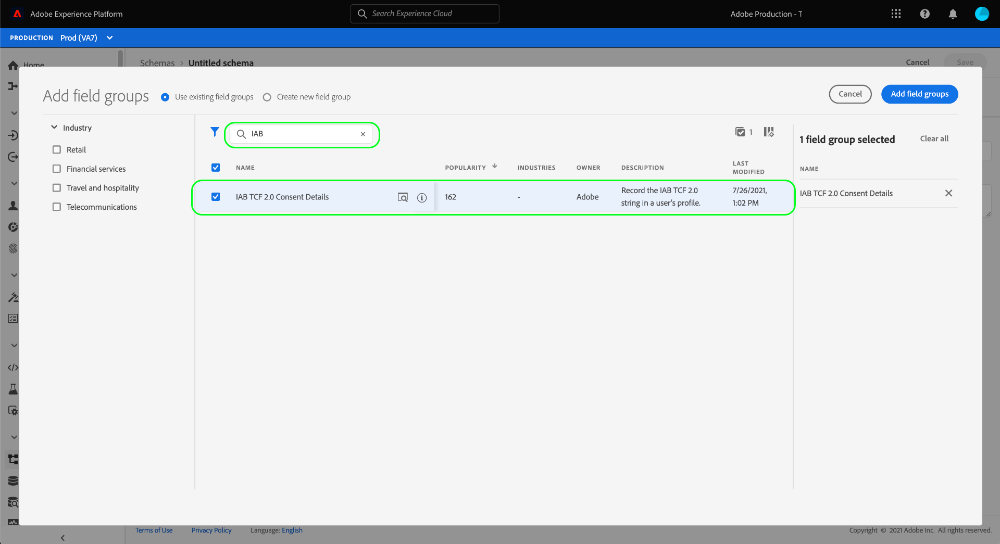
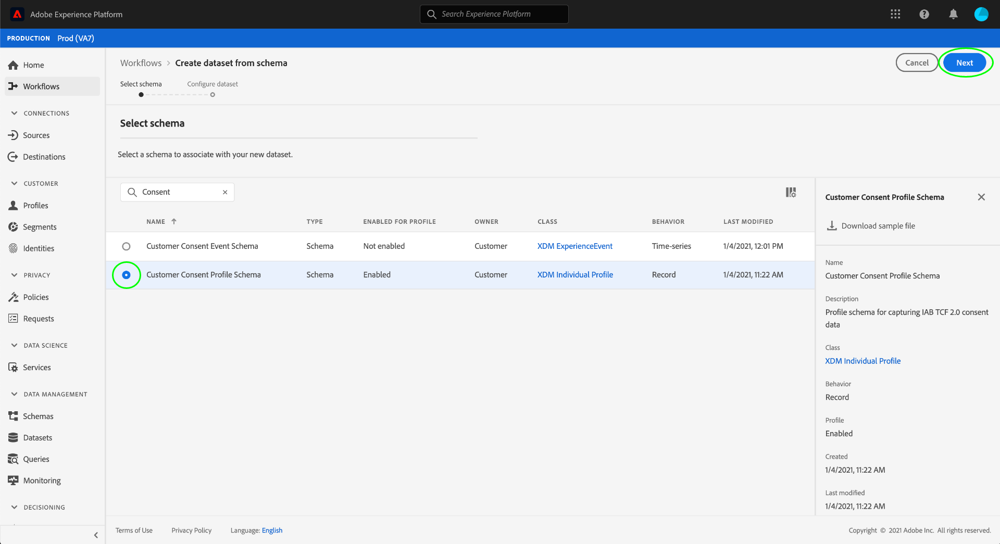

# IAB TCF 2.0 동의 데이터를 캡처하기 위한 데이터 세트 만들기

Adobe Experience Platform에서 IAB에 따라 고객 동의 데이터를 처리하려면 [!DNL Transparency & Consent Framework] (TCF) 2.0 - 스키마에 TCF 2.0 동의 필드가 포함된 데이터 세트로 데이터를 전송해야 합니다.

특히 TCF 2.0 동의 데이터를 캡처하려면 다음 두 데이터 세트가 필요합니다.

* 다음을 기반으로 하는 데이터 세트 [!DNL XDM Individual Profile] 클래스, 다음에 사용 가능 [!DNL Real-Time Customer Profile].
* 다음을 기반으로 하는 데이터 세트 [!DNL XDM ExperienceEvent] 클래스.

>[!IMPORTANT]
>
>Platform은 개별 프로필 데이터 세트에 수집된 TCF 문자열만 적용합니다. 이 워크플로우의 일부로 데이터 스트림을 만드는 데 ExperienceEvent 데이터 세트가 여전히 필요하지만, 데이터를 프로필 데이터 세트로 수집하기만 하면 됩니다. 시간이 지남에 따라 동의 변경 이벤트를 추적하려는 경우에도 ExperienceEvent 데이터 세트를 사용할 수 있지만, 이러한 값은 세그먼트 활성화를 적용할 때에서 사용되지 않습니다.

이 문서에서는 이러한 두 데이터 세트를 설정하는 단계를 제공합니다. TCF 2.0용 플랫폼 데이터 작업을 구성하는 전체 워크플로에 대한 개요는 다음을 참조하십시오. [IAB TCF 2.0 규정 준수 개요](./overview.md).

## 사전 요구 사항

이 자습서에서는 Adobe Experience Platform의 다음 구성 요소를 이해하고 있어야 합니다.

* [경험 데이터 모델(XDM)](../../../../xdm/home.md): 표준화된 프레임워크 [!DNL Experience Platform] 고객 경험 데이터를 구성합니다.
   * [스키마 컴포지션 기본 사항](../../../../xdm/schema/composition.md): XDM 스키마의 기본 구성 요소에 대해 알아봅니다.
* [Adobe Experience Platform ID 서비스](../../../../identity-service/home.md): 장치 및 시스템 간에 서로 다른 데이터 소스에서 고객 ID를 연결할 수 있습니다.
   * [ID 네임스페이스](../../../../identity-service/namespaces.md): 고객 ID 데이터는 ID 서비스에서 인식하는 특정 ID 네임스페이스에 따라 제공되어야 합니다.
* [실시간 고객 프로필](../../../../profile/home.md): 활용 [!DNL Identity Service] 을(를) 사용하면 데이터 세트에서 실시간으로 세부 고객 프로필을 만들 수 있습니다. [!DNL Real-Time Customer Profile] 는 데이터 레이크에서 데이터를 가져오고 고객 프로필을 별도의 데이터 저장소에 유지합니다.

## TCF 2.0 필드 그룹 {#field-groups}

다음 [!UICONTROL IAB TCF 2.0 동의 세부 정보] 스키마 필드 그룹은 TCF 2.0 지원에 필요한 고객 동의 필드를 제공합니다. 이 필드 그룹에는 두 가지 버전이 있습니다. 하나는 [!DNL XDM Individual Profile] 클래스 및 을 사용하는 다른 클래스 [!DNL XDM ExperienceEvent] 클래스.

아래 섹션에서는 수집 중에 예상되는 데이터를 포함하여 이러한 각 필드 그룹의 구조를 설명합니다.

### 프로필 필드 그룹 {#profile-field-group}

를 기반으로 하는 스키마의 경우 [!DNL XDM Individual Profile], [!UICONTROL IAB TCF 2.0 동의 세부 정보] 필드 그룹은 단일 맵 유형 필드를 제공합니다. `identityPrivacyInfo`고객 ID를 TCF 동의 환경 설정에 매핑합니다. 자동 시행을 수행하려면 실시간 고객 프로필에 대해 활성화된 레코드 기반 스키마에 이 필드 그룹이 포함되어야 합니다.

다음을 참조하십시오. [참조 안내서](../../../../xdm/field-groups/profile/iab.md) 을(를) 통해 해당 구조 및 사용 사례에 대해 자세히 알아보십시오.

### 이벤트 필드 그룹 {#event-field-group}

시간에 따른 동의 변경 이벤트를 추적하려면 다음을 추가할 수 있습니다. [!UICONTROL IAB TCF 2.0 동의 세부 정보] 에 대한 필드 그룹 [!UICONTROL XDM ExperienceEvent] 스키마.

시간 경과에 따른 동의 변경 이벤트를 추적할 계획이 없는 경우 이벤트 스키마에 이 필드 그룹을 포함할 필요가 없습니다. TCF 동의 값을 자동으로 적용할 때 Experience Platform은에 수집된 최신 동의 정보만 사용합니다. [프로필 필드 그룹](#profile-field-group). 이벤트에 의해 캡처된 동의 값은 자동 시행 워크플로우에 참여하지 않습니다.

다음을 참조하십시오. [참조 안내서](../../../../xdm/field-groups/event/iab.md) 구조 및 사용 사례에 대한 자세한 내용은 이 필드 그룹을 참조하십시오.

## 고객 동의 스키마 만들기 {#create-schemas}

동의 데이터를 캡처하는 데이터 세트를 만들려면 먼저 해당 데이터 세트를 기반으로 XDM 스키마를 만들어야 합니다.

이전 섹션에서 언급했듯이 [!UICONTROL XDM 개별 프로필] 다운스트림 플랫폼 워크플로우에서 동의를 적용하려면 클래스가 필요합니다. 을 기반으로 별도의 스키마를 선택적으로 만들 수도 있습니다. [!UICONTROL XDM ExperienceEvent] 시간 경과에 따른 동의 변경을 추적하려는 경우. 두 스키마에 다음 항목이 포함되어야 합니다. `identityMap` 필드 및 적절한 TCF 2.0 필드 그룹.

Platform UI에서 를 선택합니다. **[!UICONTROL 스키마]** 을(를) 왼쪽 탐색에서 [!UICONTROL 스키마] 작업 영역. 여기에서 아래 섹션의 단계에 따라 각 필수 스키마를 만듭니다.

>[!NOTE]
>
>동의 데이터를 대신 캡처하는 데 사용할 기존 XDM 스키마가 있는 경우 새 스키마를 만드는 대신 해당 스키마를 편집할 수 있습니다. 그러나 기존 스키마가 실시간 고객 프로필에서 사용할 수 있도록 설정된 경우 기본 ID는 이메일 주소와 같이 관심 기반 광고에서 사용할 수 없는 직접 식별 가능한 필드일 수 없습니다. 제한된 필드가 확실하지 않은 경우 법률 자문을 구하십시오.
>
>또한 기존 스키마를 편집할 때는 추가(끊김 없이)만 변경할 수 있습니다. 다음에서 섹션을 참조하십시오. [스키마 진화의 원칙](../../../../xdm/schema/composition.md#evolution) 추가 정보.

### 프로필 동의 스키마 만들기 {#profile-schema}

선택 **[!UICONTROL 스키마 만들기]**&#x200B;을 선택한 다음 을 선택합니다. **[!UICONTROL XDM 개별 프로필]** 드롭다운 메뉴를 통해 액세스합니다.

다음 **[!UICONTROL 필드 그룹 추가]** 스키마에 필드 그룹을 바로 추가할 수 있는 대화 상자가 나타납니다. 여기에서 다음을 선택합니다. **[!UICONTROL IAB TCF 2.0 동의 세부 정보]** 목록에서 삭제할 수 있습니다. 선택적으로 검색 창을 사용하여 결과 범위를 좁혀 필드 그룹을 더 쉽게 찾을 수 있습니다.

그런 다음 **[!UICONTROL IdentityMap]** 목록에서 필드 그룹을 선택한 다음 선택합니다. 두 필드 그룹이 오른쪽 레일에 나열되면 **[!UICONTROL 필드 그룹 추가]**.

캔버스가 다시 표시되어 `identityPrivacyInfo` 및 `identityMap` 스키마 구조에 필드가 추가되었습니다.

스키마에 필드를 추가하기 전에 표시할 루트 필드를 선택하십시오. **[!UICONTROL 스키마 속성]** 오른쪽 레일에서 스키마의 이름과 설명을 제공할 수 있습니다.

이름과 설명을 제공한 후 을 선택하여 선택적으로 스키마에 필드를 추가할 수 있습니다. **[!UICONTROL 추가]** 다음 아래에 **[!UICONTROL 필드 그룹]** 캔버스 왼쪽에 있는 섹션입니다.

에서 사용할 수 있도록 이미 활성화된 기존 스키마를 편집하는 경우 [!DNL Real-Time Customer Profile], 선택 **[!UICONTROL 저장]** 의 섹션으로 이동하기 전에 변경 사항을 확인하려면 다음을 수행하십시오. [동의 스키마를 기반으로 데이터 세트 만들기](#dataset). 새 스키마를 만드는 경우 아래 하위 섹션에 설명된 단계를 계속 수행합니다.

#### 에서 사용할 스키마 활성화 [!DNL Real-Time Customer Profile]

플랫폼에서 수신하는 동의 데이터를 특정 고객 프로필에 연결하려면 다음에서 사용할 수 있도록 동의 스키마를 활성화해야 합니다. [!DNL Real-Time Customer Profile].

>[!NOTE]
>
>이 섹션에 표시된 예제 스키마는 `identityMap` 필드를 기본 ID로 사용합니다. 다른 필드를 기본 ID로 설정하려면 이메일 주소와 같이 관심 기반 광고에서 사용할 수 없는 직접 식별 가능한 필드가 아니라 쿠키 ID와 같은 간접 식별자를 사용해야 합니다. 제한된 필드가 확실하지 않은 경우 법률 자문을 구하십시오.
>
>스키마에 대한 기본 ID 필드를 설정하는 방법은 [[!UICONTROL 스키마] UI 안내서](../../../../xdm/ui/fields/identity.md).

에 대한 스키마를 활성화하려면 [!DNL Profile]를 클릭하고 왼쪽 레일에서 스키마 이름을 선택하여 **[!UICONTROL 스키마 속성]** 섹션. 여기에서 **[!UICONTROL 프로필]** 토글 단추.

기본 ID가 누락되었음을 나타내는 팝오버가 나타납니다. 기본 ID가 다음에 포함되므로 대체 기본 ID를 사용하기 위한 확인란을 선택합니다. `identityMap` 필드.

마지막으로 다음을 선택합니다. **[!UICONTROL 저장]** 을 클릭하여 변경 내용을 확인합니다.

### 이벤트 동의 스키마 만들기 {#event-schema}

>[!NOTE]
>
>이벤트 동의 스키마는 시간 경과에 따른 동의 변경 이벤트를 추적하는 데만 사용되며 다운스트림 시행 워크플로우에는 참여하지 않습니다. 시간 경과에 따른 동의 변경을 추적하지 않으려면에 대한 다음 섹션으로 건너뛸 수 있습니다. [동의 데이터 세트 만들기](#datasets).

다음에서 **[!UICONTROL 스키마]** 작업 영역, 선택 **[!UICONTROL 스키마 만들기]**&#x200B;을 선택한 다음 을 선택합니다. **[!UICONTROL XDM ExperienceEvent]** 드롭다운에서 을 클릭합니다.

다음 **[!UICONTROL 필드 그룹 추가]** 대화 상자가 나타납니다. 여기에서 다음을 선택합니다. **[!UICONTROL IAB TCF 2.0 동의 세부 정보]** 목록에서 삭제할 수 있습니다. 선택적으로 검색 창을 사용하여 결과 범위를 좁혀 필드 그룹을 더 쉽게 찾을 수 있습니다.

그런 다음 **[!UICONTROL IdentityMap]** 목록에서 필드 그룹을 선택한 다음 선택합니다. 두 필드 그룹이 오른쪽 레일에 나열되면 **[!UICONTROL 필드 그룹 추가]**.

캔버스가 다시 표시되어 `consentStrings` 및 `identityMap` 스키마 구조에 필드가 추가되었습니다.

스키마에 필드를 추가하기 전에 표시할 루트 필드를 선택하십시오. **[!UICONTROL 스키마 속성]** 오른쪽 레일에서 스키마의 이름과 설명을 제공할 수 있습니다.

이름과 설명을 제공한 후 을 선택하여 선택적으로 스키마에 필드를 추가할 수 있습니다. **[!UICONTROL 추가]** 다음 아래에 **[!UICONTROL 필드 그룹]** 캔버스 왼쪽에 있는 섹션입니다.

필요한 필드 그룹이 추가되었으면 을 선택하여 완료합니다. **[!UICONTROL 저장]**.

## 동의 스키마를 기반으로 데이터 세트 만들기 {#datasets}

위에서 설명한 각 필수 스키마에 대해 궁극적으로 고객의 동의 데이터를 수집하는 데이터 세트를 만들어야 합니다. 레코드 스키마를 기반으로 하는 데이터 세트를에 대해 활성화해야 합니다. [!DNL Real-Time Customer Profile], 시계열 스키마를 기반으로 하는 데이터 세트 **하지 말아야 함** be [!DNL Profile]-enabled.

시작하려면 다음을 선택합니다. **[!UICONTROL 데이터 세트]** 왼쪽 탐색에서 을(를) 선택합니다. **[!UICONTROL 데이터 세트 만들기]** 오른쪽 상단 모서리입니다.

다음 페이지에서 를 선택합니다. **[!UICONTROL 스키마에서 데이터 세트 만들기]**.

다음 **[!UICONTROL 스키마에서 데이터 세트 만들기]** 워크플로가 다음 위치에서 시작됩니다. **[!UICONTROL 스키마 선택]** 단계. 제공된 목록에서 이전에 생성한 동의 스키마 중 하나를 찾습니다. 선택적으로 검색 창을 사용하여 결과의 범위를 좁히고 스키마를 더 쉽게 찾을 수 있습니다. 원하는 스키마 옆에 있는 라디오 버튼을 선택한 다음 를 선택합니다 **[!UICONTROL 다음]** 계속합니다.

다음 **[!UICONTROL 데이터 세트 구성]** 단계가 나타납니다. 선택하기 전에 데이터 세트에 대해 쉽게 식별할 수 있는 고유한 이름 및 설명을 제공합니다. **[!UICONTROL 완료]**.

새로 생성된 데이터 세트에 대한 세부 정보 페이지가 나타납니다. 데이터 세트가 시계열 스키마를 기반으로 하는 경우 프로세스가 완료됩니다. 데이터 세트가 레코드 스키마를 기반으로 하는 경우 프로세스의 마지막 단계는에서 사용할 데이터 세트를 활성화하는 것입니다. [!DNL Real-Time Customer Profile].

오른쪽 레일에서 **[!UICONTROL 프로필]** 전환 후 선택 **[!UICONTROL 사용]** 확인 팝오버에서 에 대한 스키마 활성화 [!DNL Profile].

스키마를 만든 경우 위의 단계에 따라 이벤트 기반 데이터 세트를 다시 만드십시오.

## 다음 단계

이 자습서에 따라 이제 고객 동의 데이터를 수집하는 데 사용할 수 있는 데이터 세트를 하나 이상 만들었습니다.

* 실시간 고객 프로필에서 사용할 수 있도록 설정된 레코드 기반 데이터 세트입니다. **(필수 여부)**
* 활성화되지 않은 시계열 기반 데이터 세트 [!DNL Profile]. (선택 사항)

이제 다음으로 돌아갈 수 있습니다. [IAB TCF 2.0 개요](./overview.md#merge-policies) tcf 2.0 규정 준수를 위해 플랫폼을 구성하는 프로세스를 계속합니다.
