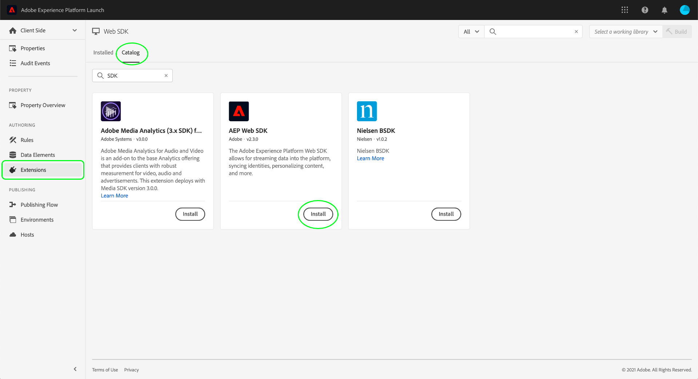

# Platform Web SDK를 통합하여 고객 동의 데이터를 처리합니다

Adobe Experience Platform Web SDK를 사용하면 CMP(동의 관리 플랫폼)에서 생성한 고객 동의 신호를 검색하고 동의 변경 이벤트가 발생할 때마다 Adobe Experience Platform으로 보낼 수 있습니다.

**SDK는 즉시 사용 가능한 CMP와 인터페이싱하지 않습니다**. SDK를 웹 사이트에 통합하고 CMP에서 동의 변경 사항을 수신하고 적절한 명령을 호출하는 방법은 사용자가 결정합니다. 이 문서에서는 CMP를 Platform Web SDK와 통합하는 방법에 대한 일반적인 지침을 제공합니다.

## 사전 요구 사항 {#prerequisites}

이 자습서에서는 사용자가 CMP 내에서 동의 데이터를 생성하는 방법을 이미 결정했으며, Adobe 표준 또는 IAB TCF(Transparency and Consent Framework) 2.0 표준을 준수하는 동의 필드가 포함된 데이터 집합을 만들었다고 가정합니다. 이 데이터 세트를 아직 만들지 않은 경우 이 안내서로 돌아가기 전에 다음 자습서를 참조하십시오.

* [Adobe 표준을 사용하여 데이터 세트 만들기](./adobe/dataset.md)
* [TCF 2.0 표준을 사용하여 데이터 세트 만들기](./iab/dataset.md)

이 안내서는 UI에서 태그 확장을 사용하여 SDK를 설정하는 워크플로우를 따릅니다. 확장을 사용하지 않고 사이트에 독립형 버전의 SDK를 직접 포함하려는 경우 이 안내서 대신 다음 문서를 참조하십시오.

* [데이터스트림 구성](../../../edge/datastreams/overview.md)
* [SDK 설치](../../../edge/fundamentals/installing-the-sdk.md)
* [동의 명령에 대한 SDK 구성](../../../edge/consent/supporting-consent.md)

이 안내서의 설치 단계에는 태그 확장 및 웹 애플리케이션에 어떻게 설치되는지를 제대로 이해할 필요가 있습니다. 자세한 내용은 다음 설명서를 참조하십시오.

* [태그 개요](../../../tags/home.md)
* [빠른 시작 안내서](../../../tags/quick-start/quick-start.md)
* [게시 개요](../../../tags/ui/publishing/overview.md)

## 데이터스트림 설정

SDK에서 Experience Platform으로 데이터를 전송하려면 먼저 데이터 스트림을 구성해야 합니다. 데이터 수집 UI 또는 Experience Platform UI에서 **[!UICONTROL 데이터 스트림]** 을 클릭합니다.

새 데이터 스트림을 만들거나 편집할 기존 데이터 스트림을 선택한 후 옆에 있는 전환 단추를 선택합니다 **[!UICONTROL Adobe Experience Platform]**. 그런 다음 아래 나열된 값을 사용하여 양식을 완료합니다.


| 데이터 스트림 필드 | 값 |
| --- | --- |
| [!UICONTROL 샌드박스] | 플랫폼 이름 [샌드박스](../../../sandboxes/home.md) 여기에는 데이터 스트림을 설정하는 데 필요한 스트리밍 연결 및 데이터 세트가 포함되어 있습니다. |
| [!UICONTROL 이벤트 데이터 세트] | An [!DNL XDM ExperienceEvent] SDK를 사용하여에 이벤트 데이터를 전송할 계획인 데이터 집합입니다. Platform 데이터 스트림을 만들려면 이벤트 데이터 세트를 제공해야 하지만, 이벤트를 통해 전송된 동의 데이터는 다운스트림 적용 워크플로우에서 적용되지 않습니다. |
| [!UICONTROL 프로필 데이터 세트] | 다음 [!DNL Profile]생성된 고객 동의 필드가 있는 -활성화된 데이터 세트 [이전](#prerequisites). |

완료되면 을 선택합니다 **[!UICONTROL 저장]** 화면 하단에서 계속해서 구성을 완료하라는 추가 메시지를 따릅니다.

## Platform Web SDK 설치 및 구성

이전 섹션에 설명된 대로 데이터 스트림을 만든 후에는 최종적으로 사이트에 배포할 Platform Web SDK 확장을 구성해야 합니다. 태그 속성에 SDK 확장이 설치되어 있지 않은 경우 을 선택합니다. **[!UICONTROL 확장]** 왼쪽 탐색에서 를 차례로 클릭하거나 **[!UICONTROL 카탈로그]** 탭. 그런 다음 **[!UICONTROL 설치]** 사용 가능한 확장 목록 내의 Platform SDK 확장 아래에 그룹화됩니다.



SDK를 구성할 때 **[!UICONTROL 에지 구성]**&#x200B;이전 단계에서 만든 데이터 스트림을 선택합니다.


선택 **[!UICONTROL 저장]** 확장을 설치하려면 다음을 수행하십시오.

### 기본 동의를 설정할 데이터 요소 만들기

SDK 확장이 설치되어 있으면 기본 데이터 수집 동의 값(`collect.val`) 내의 아무 곳에나 삽입할 수 있습니다. 이 기능은 다음과 같이 사용자에 따라 다른 기본값을 갖도록 하려는 경우 유용합니다. `pending` 유럽 연합 사용자 및 `in` 북미 사용자용.

이 사용 사례에서는 다음을 구현하여 사용자의 지역에 따라 기본 동의를 설정할 수 있습니다.

1. 웹 서버에서 사용자의 지역을 결정합니다.
1. 이전 `script` 태그(포함 코드)를 웹 페이지에 지정한 후 별도의 `script` 태그 내에 있는 `adobeDefaultConsent` 변수를 채우는 방법을 설명합니다.
1. 를 사용하는 데이터 요소를 설정합니다. `adobeDefaultConsent` JavaScript 변수를 사용하고, 이 데이터 요소를 사용자의 기본 동의 값으로 사용하십시오.

사용자의 영역이 CMP로 결정된 경우, 대신 다음 단계를 사용할 수 있습니다.

1. 페이지에서 &quot;CMP loaded&quot; 이벤트를 처리합니다.
1. 이벤트 처리기에서 `adobeDefaultConsent` 변수를 채우는 방법을 설명합니다.
1. 를 사용하는 데이터 요소를 설정합니다. `adobeDefaultConsent` JavaScript 변수를 사용하고, 이 데이터 요소를 사용자의 기본 동의 값으로 사용하십시오.

UI에서 데이터 요소를 만들려면 **[!UICONTROL 데이터 요소]** 왼쪽 탐색에서 를 선택하고 **[!UICONTROL 데이터 요소 추가]** 데이터 요소 만들기 대화 상자로 이동합니다.

여기에서 [!UICONTROL JavaScript 변수] 데이터 요소 기반 `adobeDefaultConsent`. 선택 **[!UICONTROL 저장]** 완료됨.


데이터 요소가 만들어지면 웹 SDK 확장 구성 페이지로 돌아갑니다. 아래에 [!UICONTROL 개인 정보 보호] 섹션, **[!UICONTROL 데이터 요소에서 제공]**, 그리고 제공된 대화 상자를 사용하여 이전에 만든 기본 동의 데이터 요소를 선택합니다.


### 웹 사이트에 확장 배포

확장 구성을 마치면 웹 사이트에 통합할 수 있습니다. 자세한 내용은 [게시 안내서](../../../tags/ui/publishing/overview.md) 를 참조하십시오.

## 동의 변경 명령 {#commands}

웹 사이트에 SDK 확장을 통합하면 Platform Web SDK 사용을 시작할 수 있습니다 `setConsent` Platform으로 동의 데이터를 전송하는 명령.

다음 `setConsent` 명령은 두 가지 작업을 수행합니다.

1. 프로필 저장소에서 직접 사용자의 프로필 속성을 업데이트합니다. 이렇게 해도 data lake에는 데이터가 전송되지 않습니다.
1. 만들기 [경험 이벤트](../../../xdm/classes/experienceevent.md) 은 동의 변경 이벤트의 타임스탬프가 지정된 계정을 기록합니다. 이 데이터는 데이터 레이크로 직접 전송되며 시간이 지남에 따라 동의 기본 설정 변경을 추적하는 데 사용할 수 있습니다.

### 호출 시기 `setConsent`

다음과 같은 두 가지 시나리오가 있습니다. `setConsent` 는 사이트에서 호출해야 합니다.

1. 페이지에서 동의가 로드될 때(즉, 페이지 로드 시마다)
1. 동의 설정의 변경 사항을 감지하는 CMP 후크 또는 이벤트 리스너의 일부로

### `setConsent` 구문

>[!NOTE]
>
>Platform SDK 명령의 일반적인 구문에 대한 소개는 다음 문서를 참조하십시오 [명령 실행](../../../edge/fundamentals/executing-commands.md).

다음 `setConsent` command에는 두 개의 인수가 필요합니다.

1. 명령 유형을 나타내는 문자열(이 경우 `"setConsent"`)
1. 단일 배열 형식 속성을 포함하는 페이로드 개체입니다. `consent`. 다음 `consent` 배열에는 Adobe 표준에 대한 필수 동의 필드를 제공하는 개체가 하나 이상 있어야 합니다.

다음 예에는 Adobe 표준에 대한 필수 동의 필드가 표시됩니다 `setConsent` 호출:

```js
alloy("setConsent", {
  consent: [{
    standard: "Adobe",
    version: "2.0",
    value: {
      collect: {
        val: "y"
      },
      share: {
        val: "y"
      },
      personalize: {
        content: {
          val: "y"
        }
      },
      metadata: {
        time: "2020-10-12T15:52:25+00:00"
      }
    }
  }]
});
```

| 페이로드 속성 | 설명 |
| --- | --- |
| `standard` | 사용 중인 동의 표준입니다. Adobe 표준의 경우 이 값을 `Adobe`. |
| `version` | 아래에 표시된 동의 표준의 버전 번호 `standard`. 이 값은 로 설정해야 합니다. `2.0` Adobe 표준 동의 처리용. |
| `value` | 고객이 프로필 사용 데이터 집합의 동의 필드의 구조를 준수하는 XDM 개체로 제공하는 고객의 업데이트된 동의 정보입니다. |

>[!NOTE]
>
>다른 동의 표준을 `Adobe` (예: `IAB TCF`)를 클릭하여 개체를 추가할 수 있습니다 `consent` 배열합니다. 각 객체에는 `standard`, `version`, 및 `value` 동의 표준에 대해서는 이 규칙이 나타냅니다.

다음 JavaScript는 이벤트 리스너 또는 CMP 후크에서 콜백으로 사용할 수 있는 웹 사이트의 동의 기본 설정 변경을 처리하는 함수의 예를 제공합니다.

```js
var setConsent = function () {

  // Retrieve the current consent data.
  var categories = getConsentData();

  // If the script is running on a consent change, generate a new timestamp.
  // If the script is running on page load, set the timestamp to when the consent values last changed.
  var now = new Date();
  var collectedAt = consentChanged ? now.toISOString() : categories.collectedAt;

  //  Map the consent values and timestamp to XDM
  var consentXDM = {
    collect: {
      val: categories.collect !== -1 ? "y" : "n"
    },
    personalize: {
      content: {
        val: categories.personalizeContent !== -1 ? "y" : "n"
      }
    },
    share: {
      val: categories.share !== -1 ? "y" : "n"
    },
    metadata: {
      time: collectedAt
    }
  };

  // Pass the XDM object to the Platform Web SDK
  alloy("setConsent", {
    consent: [{
      standard: "Adobe",
      version: "2.0",
      value: consentXDM
    }]
  });
});
```

## SDK 응답 처리

모두 [!DNL Platform SDK] 명령은 호출 성공 또는 실패 여부를 나타내는 약속을 반환합니다. 그런 다음 이러한 응답을 사용하여 고객에게 확인 메시지 표시와 같은 추가 논리를 사용할 수 있습니다. 의 섹션을 참조하십시오. [성공 또는 실패 처리](../../../edge/fundamentals/executing-commands.md#handling-success-or-failure) 를 참조하십시오.

성공했으면 `setConsent` sdk를 사용하여 호출하면 플랫폼 UI의 프로필 뷰어를 사용하여 데이터가 프로필 저장소에 랜딩되는지 확인할 수 있습니다. 의 섹션을 참조하십시오. [id별 프로필 검색](../../../profile/ui/user-guide.md#browse-identity) 추가 정보.

## 다음 단계

이 안내서를 따르면 Experience Platform에 동의 데이터를 보내도록 Platform Web SDK 확장을 구성했습니다. 구현 테스트에 대한 지침은 구현하고 있는 동의 표준에 대한 설명서를 참조하십시오.

* [Adobe 표준](./adobe/overview.md#test)
* [TCF 2.0 표준](./iab/overview.md#test)
