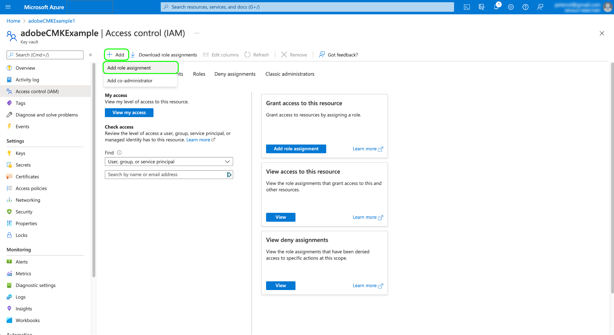

# Adobe Experience Platform의 고객 관리 키

Adobe Experience Platform에 저장된 데이터는 시스템 수준 키를 사용하여 사용하지 않을 때 암호화됩니다. 플랫폼 위에 구축된 애플리케이션을 사용하는 경우 자체 암호화 키를 대신 사용하도록 선택할 수 있으므로 데이터 보안을 보다 세밀하게 제어할 수 있습니다.

>[!NOTE]
>
>Adobe Experience Platform 데이터 레이크 및 프로필 저장소의 데이터는 CMK를 사용하여 암호화됩니다. 이는 기본 데이터 저장소로 간주됩니다.

이 문서에서는 Platform에서 CMK(고객 관리 키) 기능을 활성화하는 프로세스에 대해 설명합니다.

## 전제 조건

CMK를 활성화하려면 [!DNL Azure] Key Vault는 다음 설정으로 구성해야 합니다.

* [제거 보호 활성화](https://learn.microsoft.com/en-us/azure/key-vault/general/soft-delete-overview#purge-protection)
* [일시 삭제 활성화](https://learn.microsoft.com/en-us/azure/key-vault/general/soft-delete-overview)
* [다음을 사용하여 액세스 구성 [!DNL Azure] 역할 기반 액세스 제어](https://learn.microsoft.com/en-us/azure/role-based-access-control/)

## 프로세스 요약

CMK는 Adobe의 Healthcare Shield 및 Privacy and Security Shield 오퍼링에 포함되어 있습니다. 조직에서 이러한 서비스 중 하나에 대한 라이선스를 구입한 후 해당 기능을 설정하는 프로세스를 한 번 시작할 수 있습니다.

>[!WARNING]
>
>CMK를 설정한 후에는 시스템 관리 키로 되돌릴 수 없습니다. 키를 안전하게 관리하고 내에서 Key Vault, Key 및 CMK 앱에 대한 액세스 권한을 제공해야 합니다. [!DNL Azure] 데이터에 대한 액세스 권한을 잃지 않도록 합니다.

프로세스는 다음과 같습니다.

1. [구성 [!DNL Azure] 주요 자격 증명 모음](#create-key-vault) 조직의 정책을 기반으로 다음을 수행합니다. [암호화 키 생성](#generate-a-key) 궁극적으로 Adobe과 공유됩니다.
1. 에 API 호출 사용 [cmk 앱 설정](#register-app) (으)로 [!DNL Azure] 테넌트.
1. 에 API 호출 사용 [Adobe에게 암호화 키 ID 보내기](#send-to-adobe) 기능에 대한 지원 프로세스를 시작하십시오.
1. [구성 상태 확인](#check-status) cmk가 활성화되었는지 확인합니다.

설정 프로세스가 완료되면 모든 샌드박스에서 Platform에 온보딩된 모든 데이터는 [!DNL Azure] 키 설정. CMK를 사용하려면 [!DNL Microsoft Azure] 해당 기능에 속할 수 있는 기능 [공개 미리 보기 프로그램](https://azure.microsoft.com/en-ca/support/legal/preview-supplemental-terms/).

## 구성 [!DNL Azure] 주요 자격 증명 모음 {#create-key-vault}

CMK는 [!DNL Microsoft Azure] 키 보관소. 시작하려면 다음을 사용하여 작업해야 합니다. [!DNL Azure] 새 enterprise 계정을 만들거나 기존 enterprise 계정을 사용하고 아래 단계에 따라 Key Vault를 만듭니다.

>[!IMPORTANT]
>
>에 대한 Premium 및 표준 서비스 계층만 [!DNL Azure] Key Vault가 지원됩니다. [!DNL Azure Managed HSM], [!DNL Azure Dedicated HSM] 및 [!DNL Azure Payments HSM] 은(는) 지원되지 않습니다. 다음을 참조하십시오. [[!DNL Azure] 설명서](https://learn.microsoft.com/en-us/azure/security/fundamentals/key-management#azure-key-management-services) 제공되는 주요 관리 서비스에 대한 자세한 정보.

>[!NOTE]
>
>아래 설명서에서는 주요 자격 증명 모음을 만드는 기본 단계만 다룹니다. 이 지침 외에 조직의 정책에 따라 Key Vault를 구성해야 합니다.

에 로그인합니다 [!DNL Azure] 포털 및 검색 창에서 찾기 **[!DNL Key vaults]** 서비스 목록 아래에.


다음 **[!DNL Key vaults]** 서비스를 선택하면 페이지가 나타납니다. 여기에서 다음을 선택합니다. **[!DNL Create]**.


제공된 양식을 사용하여 이름 및 할당된 리소스 그룹을 포함하여 주요 자격 증명 모음의 기본 세부 정보를 입력합니다.

>[!WARNING]
>
>대부분의 옵션은 기본값으로 둘 수 있지만 **일시 삭제 및 제거 보호 옵션을 활성화했는지 확인합니다.**. 이러한 기능을 켜지 않으면 주요 자격 증명 모음이 삭제될 경우 데이터에 대한 액세스 권한이 손실될 수 있습니다.
>
>

여기에서 계속해서 주요 자격 증명 모음 만들기 워크플로우를 진행하고 조직의 정책에 따라 다양한 옵션을 구성합니다.

다음에 도착하면 **[!DNL Review + create]** 단계에서는 유효성 검사를 진행하는 동안 key vault의 세부 사항을 검토할 수 있습니다. 유효성 검사가 성공하면 다음을 선택합니다. **[!DNL Create]** 을 클릭하여 프로세스를 완료합니다.


### 네트워킹 옵션 구성

특정 가상 네트워크에 대한 공개 액세스를 제한하거나 공개 액세스를 완전히 비활성화하도록 키 저장소가 구성된 경우 Microsoft에 방화벽 예외를 부여해야 합니다.

선택 **[!DNL Networking]** 왼쪽 탐색. 아래 **[!DNL Firewalls and virtual networks]**, 확인란을 선택합니다. **[!DNL Allow trusted Microsoft services to bypass this firewall]**&#x200B;을 선택한 다음 을 선택합니다. **[!DNL Apply]**.


### 키 생성 {#generate-a-key}

키 저장소를 작성하면 새 키를 생성할 수 있습니다. 다음 위치로 이동 **[!DNL Keys]** 탭하고 선택 **[!DNL Generate/Import]**.


제공된 양식을 사용하여 키의 이름을 입력한 다음 을 선택합니다 **RSA** 키 유형. 최소한, **[!DNL RSA key size]** 은(는) 이상이어야 합니다. **3072** 다음에 필요한 비트 수 [!DNL Cosmos DB]. [!DNL Azure Data Lake Storage] 는 RSA 3027과도 호환됩니다.

>[!NOTE]
>
>키를 지정하는 이름은 다음 단계에서 사용됩니다. [Adobe에 키 보내기](#send-to-adobe).

나머지 컨트롤을 사용하여 생성하거나 가져올 키를 원하는 대로 구성합니다. 완료되면 다음을 선택합니다. **[!DNL Create]**.


구성된 키가 자격 증명 모음의 키 목록에 나타납니다.


## CMK 앱 설정 {#register-app}

Key Vault를 구성한 후 다음 단계는 CMK 애플리케이션에 등록하는 것입니다. [!DNL Azure] 테넌트.

### 시작하기

CMK 앱을 등록하려면 Platform API를 호출해야 합니다. 이러한 호출을 수행하는 데 필요한 인증 헤더를 수집하는 방법에 대한 자세한 내용은 다음을 참조하십시오. [Platform API 인증 안내서](../../landing/api-authentication.md).

반면에 인증 안내서에서는 필요한 항목에 대해 고유한 값을 생성하는 방법에 대한 지침을 제공합니다 `x-api-key` 요청 헤더, 이 안내서의 모든 API 작업은 정적 값을 사용합니다. `acp_provisioning` 대신, 에 대한 고유한 값을 제공해야 합니다. `{ACCESS_TOKEN}` 및 `{ORG_ID}`, 그러나 .

이 안내서에 표시된 모든 API 호출에서 `platform.adobe.io` 는 루트 경로로 사용되며 기본값은 VA7 영역입니다. 조직에서 다른 지역을 사용하는 경우 `platform` 뒤에 대시 및 조직에 지정된 지역 코드가 있어야 합니다. `nld2` NLD2 또는 `aus5` AUS5의 경우(예: `platform-aus5.adobe.io`). 조직의 지역을 모르는 경우 시스템 관리자에게 문의하십시오.

### 인증 URL 가져오기

등록 프로세스를 시작하려면 앱 등록 끝점에 조직의 필수 인증 URL을 가져오도록 GET 요청을 만듭니다.

**요청**

```shell
curl -X GET \
  https://platform.adobe.io/data/infrastructure/manager/byok/app-registration \ 
  -H 'Authorization: Bearer {ACCESS_TOKEN}' \
  -H 'x-api-key: acp_provisioning' \
  -H 'x-gw-ims-org-id: {ORG_ID}'
```

**응답**

성공적인 응답은 다음을 반환합니다. `applicationRedirectUrl` 속성, 인증 URL 포함.

```json
{
    "id": "byok",
    "name": "acpebae9422Caepcmkmultitenantapp",
    "applicationUri": "https://adobe.com/acpebae9422Caepcmkmultitenantapp",
    "applicationId": "e463a445-c6ac-4ca2-b36a-b5146fcf6a52",
    "applicationRedirectUrl": "https://login.microsoftonline.com/common/oauth2/authorize?response_type=code&client_id=e463a445-c6ac-4ca2-b36a-b5146fcf6a52&redirect_uri=https://adobe.com/acpebae9422Caepcmkmultitenantapp&scope=user.read"
}
```

복사 및 붙여넣기 `applicationRedirectUrl` 를 브라우저에 입력하여 인증 대화 상자를 엽니다. 선택 **[!DNL Accept]** cmk 앱 서비스 주체를 [!DNL Azure] 테넌트.


### CMK 앱을 역할에 지정 {#assign-to-role}

인증 프로세스를 완료한 후 다음으로 돌아가기 [!DNL Azure] 키 저장소 및 선택 **[!DNL Access control]** 왼쪽 탐색. 여기에서 다음을 선택합니다. **[!DNL Add]** 뒤에 오는 **[!DNL Add role assignment]**.



다음 화면에서는 이 할당에 대한 역할을 선택하라는 메시지가 표시됩니다. 선택 **[!DNL Key Vault Crypto Service Encryption User]** 선택하기 전 **[!DNL Next]** 계속합니다.


다음 화면에서 다음을 선택합니다. **[!DNL Select members]** 오른쪽 레일에서 대화 상자를 엽니다. 검색 창을 사용하여 CMK 응용 프로그램에 대한 서비스 주체를 찾아 목록에서 선택합니다. 완료되면 다음을 선택합니다. **[!DNL Save]**.

>[!NOTE]
>
>목록에서 애플리케이션을 찾을 수 없는 경우 서비스 주체가 테넌트에 승인되지 않았습니다. 다음으로 작업하십시오. [!DNL Azure] 관리자 또는 담당자에게 문의하여 올바른 권한을 얻는지 확인하십시오.

## Experience Platform 시 암호화 키 구성 활성화 {#send-to-adobe}

에 CMK 앱을 설치한 후 [!DNL Azure], 암호화 키 식별자를 Adobe에 보낼 수 있습니다. 선택 **[!DNL Keys]** 왼쪽 탐색에서 을 클릭하고 전송할 키의 이름을 입력합니다.


최신 버전의 키를 선택하면 해당 세부 정보 페이지가 나타납니다. 여기에서 키에 대해 허용되는 작업을 선택적으로 구성할 수 있습니다. 최소한 키를 부여해야 합니다. **[!DNL Wrap Key]** 및 **[!DNL Unwrap Key]** 사용 권한.

다음 **[!UICONTROL 키 식별자]** 필드에는 키의 URI 식별자가 표시됩니다. 다음 단계에서 사용할 이 URI 값을 복사합니다.


Key Vault URI를 얻으면 CMK 구성 엔드포인트에 대한 POST 요청을 사용하여 URI를 전송할 수 있습니다.

>[!NOTE]
>
>키 저장소와 키 이름만 Adobe과 함께 저장되고 키 버전은 저장되지 않습니다.

**요청**

```shell
curl -X POST \
  https://platform.adobe.io/data/infrastructure/manager/customer/config \ 
  -H 'Authorization: Bearer {ACCESS_TOKEN}' \
  -H 'x-api-key: acp_provisioning' \
  -H 'x-gw-ims-org-id: {ORG_ID}' \
  -d '{
        "name": "Config1",
        "type": "BYOK_CONFIG",
        "imsOrgId": "{ORG_ID}",
        "configData": {
          "providerType": "AZURE_KEYVAULT",
          "keyVaultKeyIdentifier": "https://adobecmkexample.vault.azure.net/keys/adobeCMK-key/7c1d50lo28234cc895534c00d7eb4eb4"
        }
      }'
```

| 속성 | 설명 |
| --- | --- |
| `name` | 구성의 이름입니다. 다음에서 구성 상태를 확인해야 하므로 이 값을 기억해야 합니다. [이후 단계](#check-status). 값은 대/소문자를 구분합니다. |
| `type` | 구성 유형. 을(를) (으)로 설정해야 합니다. `BYOK_CONFIG`. |
| `imsOrgId` | 자신의 조직 ID. 이 값은 아래에 제공된 값과 동일해야 합니다. `x-gw-ims-org-id` 머리글입니다. |
| `configData` | 구성에 대한 다음 세부 정보가 포함되어 있습니다.<ul><li>`providerType`: 다음으로 설정되어야 합니다. `AZURE_KEYVAULT`.</li><li>`keyVaultKeyIdentifier`: 복사한 주요 자격 증명 모음 URI [이전](#send-to-adobe).</li></ul> |

**응답**

성공한 응답은 구성 작업의 세부 정보를 반환합니다.

```json
{
  "id": "4df7886b-a122-4391-880b-47888d5c5b92",
  "config": {
    "configData": {
      "keyVaultUri": "https://adobecmkexample.vault.azure.net",
      "keyVaultKeyIdentifier": "https://adobecmkexample.vault.azure.net/keys/adobeCMK-key/7c1d50lo28234cc895534c00d7eb4eb4",
      "keyVersion": "7c1d50lo28234cc895534c00d7eb4eb4",
      "keyName": "Config1",
      "providerType": "AZURE_KEYVAULT"
    },
    "name": "acpcf978863Aaepcmkmultitenantapp",
    "type": "BYOK_CONFIG",
    "imsOrgId": "{IMS_ORG}",
    "status": "NEW"
  },
  "status": "CREATED"
}
```

작업은 몇 분 안에 처리를 완료해야 합니다.

## 구성 상태 확인 {#check-status}

구성 요청의 상태를 확인하려면 GET 요청을 수행하면 됩니다.

**요청**

다음을 추가해야 합니다. `name` 경로( )에 체크 인하려는 구성`config1` 아래 예에서) 및에 `configType` 쿼리 매개 변수가 로 설정됨 `BYOK_CONFIG`.

```shell
curl -X GET \
  https://platform.adobe.io/data/infrastructure/manager/customer/config/config1?configType=BYOK_CONFIG \ 
  -H 'Authorization: Bearer {ACCESS_TOKEN}' \
  -H 'x-api-key: acp_provisioning' \
  -H 'x-gw-ims-org-id: {ORG_ID}'
```

**응답**

성공적인 응답은 작업의 상태를 반환합니다.

```json
{
  "name": "acpcf978863Aaepcmkmultitenantapp",
  "type": "BYOK_CONFIG",
  "status": "COMPLETED",
  "configData": {
    "keyVaultUri": "https://adobecmkexample.vault.azure.net",
    "keyVaultKeyIdentifier": "https://adobecmkexample.vault.azure.net/keys/adobeCMK-key/7c1d50lo28234cc895534c00d7eb4eb4",
    "keyVersion": "7c1d50lo28234cc895534c00d7eb4eb4",
    "keyName": "Config1",
    "providerType": "AZURE_KEYVAULT"
  },
  "imsOrgId": "{IMS_ORG}",
  "subscriptionId": "cf978863-7325-47b1-8fd9-554b9fdb6c36",
  "id": "4df7886b-a122-4391-880b-47888d5c5b92",
  "rowType": "BYOK_KEY"
}
```

다음 `status` 속성은 다음 의미를 갖는 네 개의 값 중 하나를 가질 수 있습니다.

1. `RUNNING`: 플랫폼에서 키 및 키 저장소에 액세스할 수 있는지 확인합니다.
1. `UPDATE_EXISTING_RESOURCES`: 시스템에서 조직의 모든 샌드박스에 있는 데이터 저장소에 키 저장소 및 키 이름을 추가하고 있습니다.
1. `COMPLETED`: 주요 자격 증명 모음 및 키 이름이 데이터 저장소에 추가되었습니다.
1. `FAILED`: 주로 키, 키 보관소 또는 다중 테넌트 앱 설정과 관련된 문제가 발생했습니다.

## 액세스 취소 {#revoke-access}

데이터에 대한 Platform 액세스를 취소하려는 경우 내의 키 저장소에서 애플리케이션과 연결된 사용자 역할을 제거할 수 있습니다 [!DNL Azure].

>[!WARNING]
>
>Key Vault, Key 또는 CMK 앱을 비활성화하면 변경 사항이 중단될 수 있습니다. Key Vault, Key 또는 CMK 앱이 비활성화되고 Platform에서 더 이상 데이터에 액세스할 수 없게 되면 해당 데이터와 관련된 모든 다운스트림 작업은 더 이상 수행할 수 없습니다. 구성을 변경하기 전에 키에 대한 플랫폼 액세스 취소의 다운스트림에 대한 영향을 이해해야 합니다.

키 액세스 제거 또는 키에서 비활성화/삭제 후 [!DNL Azure] 주요 자격 증명 모음: 이 구성이 기본 데이터 저장소로 전파되는 데 몇 분에서 24시간 정도 소요될 수 있습니다. 또한 Platform 워크플로에는 성능 및 핵심 애플리케이션 기능에 필요한 캐시된 임시 데이터 저장소가 포함되어 있습니다. 이러한 캐시된 임시 저장소를 통한 CMK 취소의 전파는 데이터 처리 워크플로우에 의해 결정된 대로 최대 7일이 소요될 수 있다. 예를 들어 프로필 대시보드는 캐시 데이터 저장소에서 데이터를 유지 및 표시하고 새로 고침 주기의 일부로 캐시 데이터 저장소에 보관된 데이터를 만료하는 데 7일이 소요됩니다. 애플리케이션에 대한 액세스를 다시 활성화할 때 데이터를 다시 사용할 수 있도록 동일한 시간 지연이 적용됩니다.

>[!NOTE]
>
>기본이 아닌(캐시된/임시) 데이터에 대한 7일 데이터 세트 만료에 대한 두 가지 사용 사례별 예외가 있습니다. 이러한 기능에 대한 자세한 내용은 해당 설명서 를 참조하십시오.<ul><li>[Adobe Journey Optimizer URL 단축기](https://experienceleague.adobe.com/docs/journey-optimizer/using/sms/sms-configuration.html?lang=ko-KR#message-preset-sms)</li><li>[가장자리 투영](https://experienceleague.adobe.com/docs/experience-platform/profile/home.html#edge-projections)</li></ul>

## 다음 단계

위의 단계를 완료하면 조직에 대해 CMK를 성공적으로 사용할 수 있게 됩니다. 기본 데이터 저장소에 수집된 데이터는 이제 의 키를 사용하여 암호화 및 암호 해독 됩니다. [!DNL Azure] 키 보관소.

