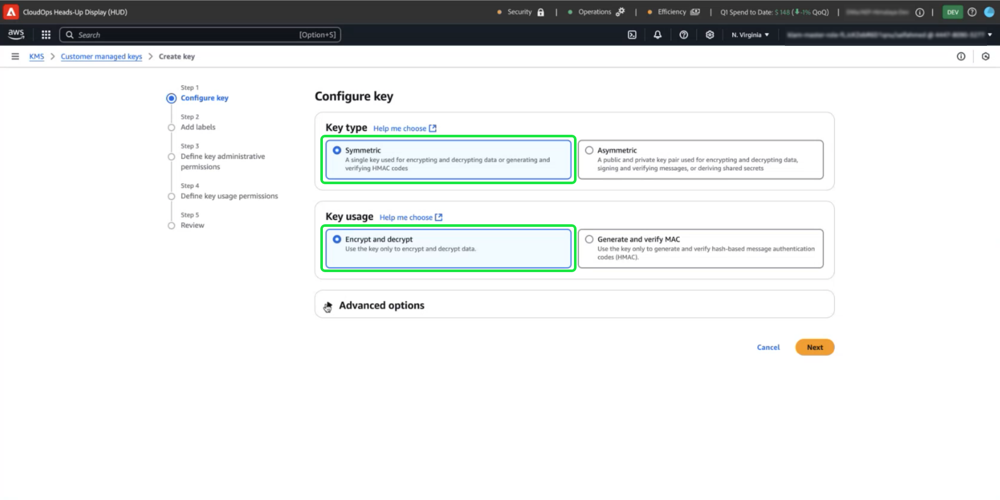

# Adobe Experience Platform 데이터 암호화에 Amazon Web Services 키 관리 서비스를 사용하는 방법

>[!AVAILABILITY]
>
>이 문서는 Amazon Web Services(AWS)에서 실행되는 Experience Platform 구현에 적용됩니다. 현재 AWS에서 실행 중인 Experience Platform은 제한된 수의 고객이 사용할 수 있습니다. 지원되는 Experience Platform 인프라에 대한 자세한 내용은 [Experience Platform 멀티 클라우드 개요](https://experienceleague.adobe.com/en/docs/experience-platform/landing/multi-cloud)를 참조하세요.
>
>AWS의 [고객 관리 키](../customer-managed-keys/overview.md)(CMK)는 Privacy 및 Security Shield에서 지원되지만 Healthcare Shield에서는 사용할 수 없습니다. Azure의 CMK는 Healthcare Shield뿐만 아니라 Privacy 및 Security Shield 모두에서 지원됩니다.

이 안내서를 사용하여 Adobe Experience Platform에 대한 암호화 키를 생성, 관리 및 제어하여 Amazon Web Services(AWS) KMS(키 관리 서비스)로 데이터를 보호합니다. 이러한 통합을 통해 규정 준수를 간소화하고 자동화를 통해 운영을 간소화하며 자체 주요 관리 인프라를 유지 관리할 필요가 없어집니다.

Customer Journey Analytics 관련 지침은 [Customer Journey Analytics CMK 설명서](https://experienceleague.adobe.com/en/docs/analytics-platform/using/cja-privacy/cmk)를 참조하세요.

>[!IMPORTANT]
>
>Adobe Experience Platform은 시스템 관리 키를 사용하여 기본적으로 사용하지 않는 데이터를 암호화합니다. CMK(Customer Managed Keys)를 활성화하면 데이터 보안을 완전히 제어할 수 있습니다. 그러나 CMK가 활성화되면 이 변경 사항은 되돌릴 수 없습니다. 시스템 관리 키로 되돌릴 수 없습니다. 데이터에 중단 없이 액세스하고 잠재적인 액세스 가능성을 방지하기 위해 키를 안전하게 관리할 책임이 있습니다.

이 안내서에서는 AWS KMS에서 암호화 키를 만들고 관리하여 Experience Platform에서 데이터를 보호하는 프로세스에 대해 자세히 설명합니다.

## 전제 조건 {#prerequisites}

이 문서를 계속하기 전에 다음 주요 개념 및 기능을 잘 이해해야 합니다.

- **AWS KMS(키 관리 서비스)**: 암호화 키를 만들고, 관리하고, 회전하는 방법을 포함하여 AWS KMS의 기본 사항을 이해합니다. 자세한 내용은 [공식 KMS 설명서](https://docs.aws.amazon.com/kms/)를 참조하세요.
- **AWS의 IAM(Identity and Access Management) 정책**: IAM은 AWS 서비스 및 리소스에 대한 액세스를 안전하게 관리할 수 있는 서비스입니다. IAM을 사용하여 다음과 같은 작업을 수행할 수 있습니다.
   - 특정 리소스에 액세스할 수 있는 사용자, 그룹 및 역할을 정의합니다.
   - 사용자가 수행할 수 있는 작업 또는 수행할 수 없는 작업을 지정합니다.
   - IAM 정책을 사용하여 권한을 할당하여 세분화된 액세스 제어를 구현합니다.
자세한 내용은 [AWS KMS용 IAM 정책 공식 설명서](https://docs.aws.amazon.com/kms/latest/developerguide/iam-policies.html)를 참조하십시오.
- **Experience Platform의 데이터 보안**: Platform이 데이터 보안을 보장하고 암호화를 위해 AWS KMS와 같은 외부 서비스와 통합하는 방법에 대해 알아봅니다. 플랫폼은 전송, 사용 중인 클라우드 공급자 암호화, 격리된 스토리지, 사용자 지정 가능한 인증 및 암호화 옵션에 대해 HTTPS TLS v1.2로 데이터를 보호합니다. 데이터를 안전하게 유지하는 방법에 대한 자세한 내용은 [거버넌스, 개인 정보 및 보안 개요](../overview.md) 또는 [플랫폼의 데이터 암호화](../encryption.md)에 대한 문서를 참조하십시오.
- **AWS 관리 콘솔**: 하나의 웹 기반 응용 프로그램에서 모든 AWS 서비스에 액세스하고 관리할 수 있는 중앙 허브입니다. 검색 창을 사용하여 도구를 빠르게 찾고, 알림을 확인하고, 계정 및 결제를 관리하고, 설정을 사용자 지정할 수 있습니다. 자세한 내용은 [공식 AWS 관리 콘솔 설명서](https://docs.aws.amazon.com/awsconsolehelpdocs/latest/gsg/what-is.html)를 참조하십시오.

## 시작하기 {#get-started}

이 안내서를 사용하려면 이미 Amazon Web Services 계정에 액세스하고 관리 콘솔에 액세스할 수 있어야 합니다. 시작하려면 아래 단계를 따르십시오.

1. **권한 확인**: KMS 내에서 암호화 키를 만들고 관리하고 사용하는 데 필요한 AWS ID 및 IAM(액세스 관리) 권한이 있는지 확인하십시오. 사용 권한을 확인하려면:
   1. [IAM 정책 시뮬레이터](https://policysim.aws.amazon.com/)에 액세스합니다.
   1. 사용자 계정 또는 역할을 선택합니다.
   1. `kms:CreateKey` 또는 `kms:Encrypt`과(와) 같은 KMS 작업을 시뮬레이트합니다.
시뮬레이션에서 오류가 반환되거나 사용 권한에 대해 잘 모르는 경우 AWS 관리자에게 지원을 요청하십시오.

1. **AWS 계정 구성을 확인하십시오**: AWS 계정이 AWS KMS 서비스를 사용하도록 설정되어 있는지 확인하십시오. 대부분의 계정에 기본적으로 KMS 액세스가 활성화되어 있지만 [AWS 관리 콘솔](https://aws.amazon.com/console/)을 방문하여 계정 설정을 검토할 수 있습니다. 자세한 내용은 [AWS 키 관리 서비스 개발자 안내서](https://docs.aws.amazon.com/kms/latest/developerguide/overview.html)를 참조하십시오.

1. **지원되는 지역을 선택하십시오**: 특정 지역에서 AWS KMS를 사용할 수 있습니다. KMS가 지원되는 지역에서 작동하고 있는지 확인하십시오. [AWS KMS 끝점 및 할당량 목록](https://aws.amazon.com/about-aws/global-infrastructure/regional-product-services/)에서 지원되는 영역의 전체 목록을 볼 수 있습니다.

### AWS KMS로 이동하여 키 설정 시작

>[!IMPORTANT]
>
>암호화 키의 안전한 저장, 액세스 및 가용성을 보장합니다. 키를 관리하고 플랫폼 운영에 대한 중단을 방지할 책임이 있습니다.

암호화 키 설정 및 관리를 시작하려면 AWS 계정에 로그인하고 AWS KMS(키 관리 서비스)로 이동합니다. AWS 관리 콘솔에서 서비스 메뉴에서 **KMS(키 관리 서비스)**&#x200B;을(를) 선택합니다.


## 새 키 만들기 {#create-a-key}

[!DNL Key Management Service (KMS)] 작업 영역이 나타납니다. **[!DNL Create a key]**&#x200B;를 선택합니다.


## 키 설정 구성 {#configure-key}

[!DNL Configure Key] 워크플로가 나타납니다. 기본적으로 키 유형은 **[!DNL Symmetric]**(으)로 설정되고 키 사용은 **[!DNL Encrypt and Decrypt]**(으)로 설정됩니다. 계속 진행하기 전에 이러한 옵션이 선택되어 있는지 확인하십시오.



**[!DNL Advanced options]** 드롭다운 메뉴를 확장합니다. AWS에서 주요 자료를 만들고 관리할 수 있는 **[!DNL KMS]** 옵션을 사용하는 것이 좋습니다. 기본적으로 **[!DNL KMS]** 옵션이 선택되어 있습니다.

>[!NOTE]
>
>기존 키가 이미 있는 경우 외부 키 자료를 가져오거나 AWS [!DNL CloudHSM] 키 저장소를 사용할 수 있습니다. 이 문서의 범위에서는 이러한 옵션에 대해 다루지 않습니다.

그런 다음 키의 영역 범위를 지정하는 [!DNL Regionality] 설정을 선택합니다. **[!DNL Single-Region key]**&#x200B;을(를) 선택한 후 **[!DNL Next]**&#x200B;을(를) 선택하여 2단계로 진행합니다.

>[!IMPORTANT]
>
>AWS에서는 KMS 키에 대해 지역 제한을 적용합니다. 이 지역 제한은 키가 Adobe 계정과 동일한 지역에 있어야 함을 의미합니다. Adobe은 계정의 지역 내에 있는 KMS 키에만 액세스할 수 있습니다. 선택한 지역이 Adobe 단일 테넌트 계정의 지역과 일치하는지 확인합니다.


## 키에 레이블 지정 및 태그 지정 {#add-labels-and-tags-to-key}

워크플로우의 두 번째 [!DNL Add labels] 단계가 나타납니다. 여기에서 [!DNL Alias] 및 [!DNL Tags] 필드를 구성하여 AWS KMS 콘솔에서 암호화 키를 관리하고 찾을 수 있습니다.

**[!DNL Alias]** 입력 필드에 키에 대한 설명 레이블을 입력합니다. 별칭은 사용자에게 친숙한 식별자 역할을 하며 AWS KMS 콘솔의 검색 창을 사용하여 키를 빠르게 찾습니다. 혼동을 방지하기 위해 &quot;Adobe-플랫폼-키&quot; 또는 &quot;고객-암호화-키&quot;와 같이 키의 목적을 반영하는 의미 있는 이름을 선택합니다. 키 별칭이 해당 용도를 설명하기에 충분하지 않은 경우 키에 대한 설명을 포함할 수도 있습니다.

마지막으로 [!DNL Tags] 섹션에서 키-값 쌍을 추가하여 키에 메타데이터를 할당합니다. 이 단계는 선택 사항이지만, 보다 쉬운 관리를 위해 AWS 리소스를 범주화하고 필터링할 태그를 추가해야 합니다. 예를 들어 조직에서 여러 Adobe 관련 리소스를 사용하는 경우 &quot;Adobe&quot; 또는 &quot;Experience-Platform&quot;으로 태그를 지정할 수 있습니다. 이 추가 단계를 사용하면 AWS Management Console에서 연결된 모든 리소스를 쉽게 검색하고 관리할 수 있습니다. 프로세스를 시작하려면 **[!DNL Add tag]**&#x200B;을(를) 선택하십시오.

<!-- I do not have an AWS account with which to document the Add tag process as yet. -->

설정에 만족하면 **[!DNL Next]**&#x200B;을(를) 선택하여 워크플로우를 계속합니다.


## 주요 관리 권한 정의 {#define-key-admins}

키 만들기 워크플로의 3단계가 나타납니다. 안전하고 통제된 액세스를 보장하기 위해 IAM 사용자와 역할 중 키를 관리할 수 있는 사용자를 선택할 수 있습니다. 이 단계에는 [!DNL Key administrators]과(와) [!DNL Key deletion]의 두 가지 옵션이 있습니다. **[!DNL Key administrators]** 섹션에서 이 키에 대한 관리자 권한을 부여할 사용자 또는 역할의 이름 옆에 있는 확인란을 한 개 이상 선택합니다.

>[!NOTE]
>
>워크플로의 이 단계에서는 관리자를 만들 수 없습니다.

**[!DNL Key deletion]** 섹션에서 확인란을 활성화하여 키 관리자가 이 키를 삭제할 수 있는 권한을 허용합니다. 확인란을 선택하지 않으면 관리 사용자가 해당 작업을 수행할 수 없습니다.

워크플로우를 계속하려면 **[!DNL Next]**&#x200B;을(를) 선택하십시오.


## 주요 사용자에게 액세스 권한 부여 {#assign-key-users}

워크플로의 4단계에서 [!DNL Define key usage permissions]할 수 있습니다. **[!DNL Key users]** 목록에서 이 키를 사용할 권한을 가질 모든 IAM 사용자 및 역할에 대한 확인란을 선택합니다.

이 보기에서 [!DNL Add another AWS account]할 수도 있습니다. 그러나 다른 AWS 계정을 추가하는 것은 권장되지 않습니다. 다른 계정을 추가하면 위험이 발생하고 암호화 및 암호 해독 작업에 대한 권한 관리가 복잡해질 수 있습니다. Adobe은 단일 AWS 계정과 연결된 키를 유지함으로써 AWS KMS와의 안전한 통합을 보장하며 위험을 최소화하고 안정적인 운영을 보장합니다.

워크플로우를 계속하려면 **[!DNL Next]**&#x200B;을(를) 선택하십시오.


## 키 구성 검토 {#review}

주요 구성의 검토 단계가 나타납니다. [!DNL Key configuration] 및 [!DNL Alias and description] 섹션에서 키 세부 정보를 확인하십시오.

>[!NOTE]
>
>키 영역이 AWS 계정과 동일한지 확인합니다.


### 키를 Experience Platform과 통합하도록 키 정책 업데이트

그런 다음 **[!DNL Key Policy]** 섹션에서 JSON을 편집하여 키를 Experience Platform과 통합합니다. 기본 키 정책은 아래 JSON과 유사합니다.

<!-- The AWS ID below is fake. Q) Can I refer to it simply as AWS_ACCOUNT_ID ? Is that suitable? -->

```JSON
{
  "Id": "key-consolepolicy-3",
  "Version": "2012-10-17",
  "Statement": [
    {
      "Sid": "Enable IAM User Permissions",
      "Effect": "Allow",
      "Principal": {
        "AWS": "arn:aws:iam::123464903283:root" // this is a mock AWS Principal ID, your ID will differ
      },
      "Action": "kms:*",
      "Resource": "*"
    }
  ]
}
```

위의 예에서 동일한 계정(`Principal.AWS`)의 모든 리소스(`"Resource": "*"`)가 이 키에 액세스할 수 있습니다. 이 정책을 사용하면 동일한 계정의 다른 서비스가 키를 사용하여 암호화 및 암호 해독을 수행할 수 있습니다. 서비스에는 이 계정에 대한 권한만 있습니다.

그런 다음 이 정책에 새 문을 추가하여 이 키에 대한 Platform 단일 테넌트 계정 액세스 권한을 부여합니다. Platform UI에서 JSON 정책을 가져와 AWS KMS 키에 적용하여 플랫폼에 안전하게 연결할 수 있습니다.

Platform UI로 이동합니다. 왼쪽 탐색 레일의 **[!UICONTROL 관리]** 섹션에서 **[!UICONTROL 암호화]**&#x200B;를 선택합니다. [!UICONTROL 암호화 구성] 작업 영역이 나타납니다. 그런 다음 [!UICONTROL 고객 관리 키] 카드에서 **[!UICONTROL 구성]**&#x200B;을 선택합니다.


[!UICONTROL 고객 관리 키 구성]이 나타납니다. 복사 아이콘()을(를) 클릭하여 CMK KMS 정책을 클립보드에 복사합니다. 녹색 팝업 알림은 정책이 복사되었음을 확인합니다.


<!-- This part of the workflow was in contention at the time of the demo.  -->

그런 다음 AWS KMS 작업 영역으로 돌아가 아래에 표시된 키 정책을 업데이트합니다.

![업데이트된 정책과 [마침]이 강조 표시된 워크플로의 검토 단계입니다.](../../images/governance-privacy-security/key-management-service/updated-cmk-policy.png)

아래 표시된 대로 [!UICONTROL 플랫폼 암호화 구성] 작업 영역에서 다음 네 개의 문을 기본 정책에 추가합니다. `Enable IAM User Permissions`, `CJA Flow IAM User Permissions`, `CJA Integrity IAM User Permissions`, `CJA Oberon IAM User Permissions`.

```json
{
    "Version": "2012-10-17",
    "Id": "key-consolepolicy",
    "Statement": [
        {
            "Sid": "Enable IAM User Permissions",
            "Effect": "Allow",
            "Principal": {
                "AWS": "arn:aws:iam::975049898882:root" // this is a mock AWS Principal ID, your ID will differ
            },
            "Action": [
                "kms:Decrypt",
                "kms:Encrypt",
                "kms:ReEncrypt*",
                "kms:GenerateDataKey*",
                "kms:DescribeKey",
                "kms:CreateGrant"
            ],
            "Resource": "*",
            "Condition": {
                "StringEquals": {
                    "aws:PrincipalAccount": "975049898882" // this is a mock AWS Principal ID, your ID will differ
                }
            }
        },
        {
            "Sid": "CJA Flow IAM User Permissions",
            "Effect": "Allow",
            "Principal": {
                "AWS": "arn:aws:iam::767397686373:root"
            },
            "Action": [
                "kms:Decrypt",
                "kms:Encrypt",
                "kms:ReEncrypt*",
                "kms:GenerateDataKey*",
                "kms:DescribeKey",
                "kms:CreateGrant"
            ],
            "Resource": "*",
            "Condition": {
                "StringEquals": {
                    "aws:PrincipalAccount": "767397686373"
                }
            }
        },
        {
            "Sid": "CJA Integrity IAM User Permissions",
            "Effect": "Allow",
            "Principal": {
                "AWS": "arn:aws:iam::730335345392:root"
            },
            "Action": [
                "kms:Decrypt",
                "kms:Encrypt",
                "kms:ReEncrypt*",
                "kms:GenerateDataKey*",
                "kms:DescribeKey",
                "kms:CreateGrant"
            ],
            "Resource": "*",
            "Condition": {
                "StringEquals": {
                    "aws:PrincipalAccount": "730335345392"
                }
            }
        },
        {
            "Sid": "CJA Oberon IAM User Permissions",
            "Effect": "Allow",
            "Principal": {
                "AWS": "arn:aws:iam::891377157113:root"
            },
            "Action": [
                "kms:Decrypt",
                "kms:Encrypt",
                "kms:ReEncrypt*",
                "kms:GenerateDataKey*",
                "kms:DescribeKey",
                "kms:CreateGrant"
            ],
            "Resource": "*",
            "Condition": {
                "StringEquals": {
                    "aws:PrincipalAccount": "891377157113"
                }
            }
        }
    ]
}
```


**[!DNL Finish]**&#x200B;을(를) 선택하여 업데이트된 정책으로 키 세부 사항을 확인하고 키를 만듭니다. 이제 AWS 계정이 Experience Platform 계정과 통신할 수 있도록 총 5개의 문으로 키 및 정책을 구성했습니다. 효과는 즉시 나타납니다.

AWS [!DNL Key Management Service]의 업데이트된 [!DNL Customer managed keys] 작업 영역이 나타납니다.

### Platform에 AWS 암호화 키 세부 정보 추가

그런 다음 암호화를 사용하려면 키의 ARN(Amazon 리소스 이름)을 Platform [!UICONTROL 고객 관리 키 구성]에 추가하십시오. AWS의 [!DNL Customer Managed Keys] 섹션에서 [!DNL Key Management Service]의 목록에서 새 키의 별칭을 선택합니다.


키의 세부 정보가 표시됩니다. AWS의 모든 항목에는 Amazon 리소스 이름(ARN)이 있으며,
는 AWS 서비스 전반에 걸쳐 리소스를 지정하는 데 사용되는 고유 식별자입니다. 표준화된 형식 `arn:partition:service:region:account-id:resource`을(를) 따릅니다.

복사 아이콘을 선택하여 ARN을 복사합니다. 확인 대화 상자가 나타납니다.


이제 플랫폼 [!UICONTROL 고객 관리 키 구성] UI로 다시 이동합니다. **[!UICONTROL AWS 암호화 키 세부 정보 추가]** 섹션에서 AWS UI에서 복사한 **[!UICONTROL 구성 이름]** 및 **[!UICONTROL KMS 키 ARN]**&#x200B;을(를) 추가합니다.


그런 다음 **[!UICONTROL 저장]**&#x200B;을 선택하여 구성 이름, KMS 키 ARN을 제출하고 키 유효성 검사를 시작합니다.


[!UICONTROL 암호화 구성] 작업 영역으로 돌아갑니다. 암호화 구성의 상태가 **[!UICONTROL 고객 관리 키]** 카드 하단에 표시됩니다.


키를 확인하면 모든 샌드박스에 대한 Data Lake 및 프로필 데이터 저장소에 Key Vault 식별자가 추가됩니다.

>[!NOTE]
>
>프로세스 기간은 데이터 크기에 따라 다릅니다. 일반적으로 프로세스는 24시간 이내에 완료됩니다. 각 샌드박스는 일반적으로 2~3분 후에 업데이트됩니다.

## 키 해지 {#key-revocation}

>[!IMPORTANT]
>
>액세스를 취소하기 전에 다운스트림 애플리케이션에 미치는 키 취소의 영향을 이해합니다.

다음은 키 취소에 대한 주요 고려 사항입니다.

- 키를 취소하거나 비활성화하면 Platform 데이터에 액세스할 수 없게 됩니다. 이 작업은 취소할 수 없으며 주의하여 수행해야 합니다.
- 암호화 키에 대한 액세스가 해지된 경우 전파 타임라인을 고려하십시오. 몇 분에서 24시간 내에 운영 데이터 저장소에 액세스할 수 없게 됩니다. 캐시되거나 일시적인 데이터 저장소는 7일 이내에 액세스할 수 없게 됩니다.

키를 취소하려면 AWS KMS 작업 영역으로 이동합니다. **[!DNL Customer managed keys]** 섹션에는 AWS 계정에 사용할 수 있는 모든 키가 표시됩니다. 목록에서 키의 별칭을 선택합니다.


키의 세부 정보가 표시됩니다. 키를 비활성화하려면 **[!DNL Key actions]**&#x200B;을(를) 선택한 다음 드롭다운 메뉴에서 **[!DNL Disable]**&#x200B;을(를) 선택합니다.


확인 대화 상자가 나타납니다. **[!DNL Disable key]**&#x200B;을(를) 선택하여 선택을 확인합니다. 키 비활성화의 영향은 약 5분 내에 Platform 애플리케이션과 UI에 반영되어야 합니다.

>[!NOTE]
>
>키를 비활성화한 후에는 필요에 따라 위에서 설명한 것과 동일한 방법을 사용하여 키를 다시 활성화할 수 있습니다. 이 옵션은 **[!DNL Key actions]** 드롭다운에서 사용할 수 있습니다.


또는 키가 다른 서비스에서 사용되는 경우 키 정책에서 직접 Experience Platform에 대한 액세스를 제거할 수 있습니다. **[!DNL Key Policy]** 섹션에서 **[!UICONTROL 편집]**&#x200B;을(를) 선택합니다.


**[!DNL Edit key policy]** 페이지가 나타납니다. Platform UI에서 복사된 정책 문을 강조 표시하고 삭제하여 고객 관리 키 앱에 대한 권한을 제거합니다. 그런 다음 **[!DNL Save changes]**&#x200B;을(를) 선택하여 프로세스를 완료합니다.


## 키 회전 {#key-rotation}

AWS은 자동 및 온디맨드 키 순환을 제공합니다. 키 손상 위험을 줄이거나 보안 규정 준수 요구 사항을 충족하기 위해 필요에 따라 또는 정기적으로 새 암호화 키를 자동으로 생성할 수 있습니다. 자동 키 회전을 예약하여 키의 수명을 제한하고, 키가 손상된 경우 회전 후 사용할 수 없게 됩니다. 최신 암호화 알고리즘의 보안성은 매우 높지만, 키 회전은 중요한 보안 규정 준수 조치이며 보안 모범 사례를 준수하는 것을 보여 줍니다.

### 자동 키 회전 {#automatic-key-rotation}

자동 키 회전은 기본적으로 비활성화되어 있습니다. KMS 작업 영역에서 자동 키 순환을 예약하려면 **[!DNL Key rotation]** 탭을 선택한 다음 **[!DNL Automatic key rotation section]**&#x200B;에서 **[!DNL Edit]**&#x200B;을(를) 선택합니다.


**[!DNL Edit automatic key rotation]** 작업 영역이 나타납니다. 여기에서 라디오 단추를 선택하여 자동 키 회전을 활성화하거나 비활성화합니다. 그런 다음 텍스트 입력 필드 또는 드롭다운 메뉴를 사용하여 키 순환의 기간을 선택합니다. **[!DNL Save]**&#x200B;을(를) 선택하여 설정을 확인하고 주요 세부 정보 작업 영역으로 돌아갑니다.

>[!NOTE]
>
>최소 키 회전 기간은 90일이며, 최대는 2560일입니다.

![순환 기간과 [저장]이 강조 표시된 자동 키 순환 작업 영역 편집](../../images/governance-privacy-security/key-management-service/automatic-key-rotation.png)

### 온디맨드 키 회전 {#on-demand-key-rotation}

현재 키가 손상된 경우 **[!DNL Rotate Now]**&#x200B;을(를) 선택하여 즉시 회전합니다. AWS은 10개의 온디맨드 순환만 허용합니다. 보안이 이미 손상되지 않은 경우 예약된 키 순환을 사용합니다.


## 다음 단계

이 문서를 읽고 나면 Adobe Experience Platform에서 사용할 AWS KMS의 암호화 키를 만들고, 구성하고, 관리하는 방법에 대해 알아보았습니다. 그 다음 단계로, 예약된 키 순환 및 안전한 키 저장과 같은 적절한 키 관리 작업을 보장하기 위해 조직의 보안 및 규정 준수 정책을 검토하는 것이 좋습니다.
