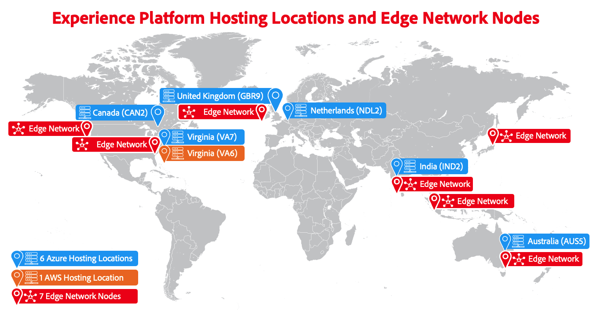

# Adobe Experience Platform multi-cloud 개요

Adobe Experience Platform은 다중 클라우드 제품이므로 [[!DNL Microsoft Azure]](https://azure.microsoft.com/en-us)에서 실행되거나 [[!DNL Amazon Web Services (AWS)]](https://aws.amazon.com/)에서 실행될 수 있습니다. 이러한 유연성으로 비즈니스 및 기술 요구 사항에 가장 적합한 옵션을 선택할 수 있습니다.

>[!AVAILABILITY]
>
>Amazon Web Services(AWS)에서 실행되는 Adobe Experience Platform은 현재 제한된 수의 고객이 사용할 수 있습니다. AWS에서의 Experience Platform에 대한 자세한 내용은 Adobe 계정 팀에 문의하십시오.

이 페이지에서는 사용 가능한 두 클라우드 인프라에 대한 높은 수준의 개요를 제공하며 비즈니스에 적합한 클라우드 인프라를 선택하는 방법에 대한 지침을 포함합니다.

## 나에게 적합한 클라우드 구현은 무엇입니까? {#which-cloud-is-right}

Azure나 AWS의 Experience Platform 선택은 비즈니스와 관련된 몇 가지 요인에 따라 다릅니다.

* **비즈니스 및 기술 요구 사항**: 조직의 요구 사항 및 장기 클라우드 전략을 평가합니다.
* **기존 인프라**: 현재 클라우드 인프라 및 통합 요구 사항을 고려하십시오.
* **클라우드 기술 신뢰**: 귀사에서 Microsoft 기술에 크게 의존하는 경우 Azure가 더 적합할 수 있습니다. Amazon 서비스에 더 많이 의존한다면 AWS이 더 나은 옵션이 될 수 있습니다.
* **데이터 상주 고려 사항**: 조직의 데이터 상주 요구 사항을 평가하고 선택한 클라우드 플랫폼이 이러한 규정을 준수하는 지역을 제공하는지 확인합니다.

위의 요소를 고려하여 간소화된 이 의사 결정 트리를 사용하여 비즈니스 요구 사항에 적합한 클라우드 구현을 결정하는 데 도움이 됩니다.

{align="center" zoomable="yes"}

## 호스팅 위치 {#available-cloud-regions}

적합한 클라우드 영역을 선택하는 것은 데이터 상주 요구 사항을 충족하고 최적의 성능을 보장하는 데 매우 중요합니다.

{align="center" zoomable="yes"}

Experience Platform은 6개의 Microsoft Azure 호스팅 위치와 1개의 Amazon Web Services(AWS) 호스팅 위치에서 사용할 수 있으며 전 세계에 배포된 7개의 [Edge Network 노드](../collection/home.md#edge)를 통해 데이터를 Adobe 서비스로 라우팅합니다.

### Microsoft Azure 지역 {#azure-regions}

아래 표는 Experience Platform이 호스팅되는 Microsoft Azure 지역을 나타냅니다.

| 국가 | 지역 코드 | 위치 |
|---------|-------------|----------|
| 미국 | VA7 | 버지니아 |
| 영국 | GBR9 | 런던 |
| 네덜란드 | NDL2 | 암스테르담 |
| 캐나다 | CAN2 | 토론토 |
| 인도 | IND2 | 마하라슈트라 |
| 오스트레일리아 | AUS5 | 뉴사우스웨일스 |

{style="table-layout:auto"}

### Amazon Web Services(AWS) 지역 {#aws-regions}

아래 표는 Experience Platform이 호스팅되는 AWS 지역을 나타냅니다. 추가 위치가 추가되었는지 정기적으로 다시 확인하십시오.

| 국가 | 지역 코드 | 위치 |
|---------|-------------|----------|
| 미국 | VA6 | 버지니아 |

{style="table-layout:auto"}

## 기능 패리티 {#feature-parity}

Adobe은 다음과 같이 Experience Platform에서 실행되는 모든 애플리케이션에 대해 클라우드 플랫폼 간에 기능 패리티를 제공하기 위해 노력합니다.

* [Real-Time Customer Data Platform](../rtcdp/home.md)
* [Adobe Journey Optimizer](https://experienceleague.adobe.com/ko/docs/journey-optimizer/using/ajo-home)
* [Customer Journey Analytics](https://experienceleague.adobe.com/en/docs/analytics-platform/using/cja-landing)

그러나 Azure와 AWS 구현에는 일부 기능이 다를 수 있습니다. 이러한 차이점은 아래 섹션과 해당되는 경우 제품 설명서의 다른 부분에 요약되어 있습니다.

### Microsoft Azure에서 실행 중인 Experience Platform과 AWS의 차이점 {#azure-aws-differences}

아래 표에는 Microsoft Azure에서 실행 중인 Experience Platform과 AWS 간의 주요 차이점이 나와 있습니다.

| 기능 | Microsoft Azure | Amazon Web Services |
| --- | --- | --- |
| [HIPAA 준수](https://www.adobe.com/trust/compliance/hipaa-ready.html) | 지원됨 | 지원되지 않음 |
| [소스 커넥터 카탈로그](/help/sources/home.md) | 소스 카탈로그의 모든 커넥터가 지원됩니다 | 제한된 수의 소스 커넥터를 사용할 수 있습니다. AWS 구현에 사용할 수 있는 모든 소스 커넥터는 해당 설명서 페이지의 페이지 상단 노트에서 호출됩니다. |

{style="table-layout:auto"}

<!-- To be determined if we need to add this part about the AI Assistant 

| [Experience Platform AI Assistant](/help/ai-assistant/home.md) | Supported | Not supported |

-->

## 결론 {#conclusion}

Experience Platform은 Microsoft Azure 또는 Amazon Web Services에서 실행할 수 있는 옵션을 제공하여 유연성과 선택 기능을 제공합니다. 비즈니스 요구 사항 및 기존 인프라를 평가하여 사용할 클라우드 플랫폼에 대한 올바른 결정을 내립니다.
