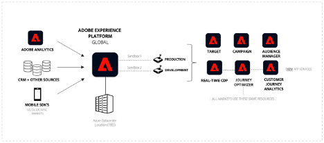
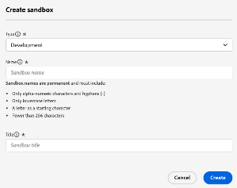
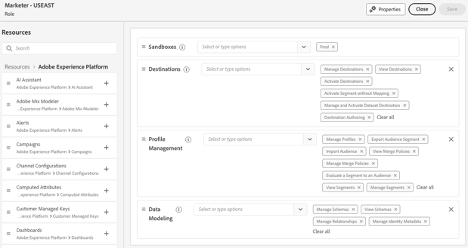

# 다중 지역, 다중 브랜드 기업을 위한 Adobe Experience Platform

## 소개

Adobe Experience Platform은 혁신적인 솔루션의 선두에 있으며, 고객 데이터와 콘텐츠의 잠재력을 최대한 활용할 수 있도록 해 줍니다. Experience Platform을 사용하면 다양한 시스템의 데이터를 중앙 집중화 및 표준화하고 데이터 과학 및 머신 러닝의 기능을 적용할 수 있습니다. 그 결과 소비자와 공감하는 개인화된 경험의 생성 및 전달이 향상됩니다.

Experience Platform은 구조를 나타내고 확장 가능하고 유연한 구현을 위해 비즈니스 데이터를 제어할 수 있는 기능을 제공합니다. Platform 애플리케이션을 구현하는 것은 전략적 계획과 신중한 고려 사항이 필요한 중요한 여정으로, 특히 글로벌, 지역 및 브랜드별 도메인 또는 이러한 모든 측면의 조합을 대상으로 작업하는 경우 그러합니다.

이 백서는 제품 관점과 일련의 지침을 제공하는 참조 역할을 합니다. 주요 목표는 사용자와 구현 팀이 Experience Platform의 복잡성을 효과적으로 탐색하는 데 필요한 도구와 통찰력을 얻을 수 있도록 하는 것입니다. 특정 요구 사항, 고려 사항 및 실제 사용 사례를 평가하기 위한 구조화된 프레임워크를 제공함으로써 Experience Platform 및 플랫폼 기반 애플리케이션의 잠재력을 최대한 활용하는 데 필요한 지식을 갖추게 됩니다. 다음 섹션을 살펴보면 구현 프로세스를 간소화하고 개인정보 보호 및 규정 준수를 유지하기 위한 거버넌스 및 제어 기능을 제공하는 동시에 고객에게 탁월한 경험을 제공할 수 있는 조직의 기능을 향상시키는 귀중한 통찰력과 권장 사항을 찾을 수 있습니다.


## 다중 브랜드, 다중 지역 엔터프라이즈 이해

다중 브랜드, 다중 지역 기업을 운영하는 경우 Experience Platform에 대한 고유한 데이터 관리 요구 사항이 있을 수 있습니다. 고유한 요구 사항을 이해하는 것은 특정 요구 사항에 가장 적합하게 Experience Platform 구현을 조정하는 데 중요합니다.

배포 옵션을 살펴볼 때 Experience Platform 및 플랫폼 기반 애플리케이션과 상호 작용할 담당자를 이해하고 고려해야 합니다. 역할과 관심사를 기반으로 경험을 설계하면 성공적인 구현이 보장됩니다. 옵션을 탐색할 때 고려해야 하는 세 가지 주요 담당자는 다음과 같습니다.

**Mary, 마케터:**
- 포커스: 고객 확보 및 규모에 맞는 경험 개인화입니다.
- 목표: 포괄적인 프로필 만들기, 미디어 효율성 향상.

**Ted, 기술 전문가**
- 포커스: 조직 데이터 관리.
- 목표: 규정 준수 보장, 데이터 사일로 관리, 다양한 비즈니스 라인 서비스

**Dan, 데이터 설계자**
- 초점: 데이터 정확성 및 품질.
- 목표: 데이터 개인정보 보호 및 신뢰 보장, 스키마 및 데이터 모델 디자인, 데이터 소스 관리

### &#x200B;1. 데이터 격리가 제한된 기업

Experience Platform의 주요 아키텍처 원칙은 거버넌스 정책 및 요구 사항에 따라 고객 데이터가 특정 프로덕션 샌드박스로 제한되는 것입니다.

조직에서 마케팅 경험을 대규모로 운영하기 위해 단일 데이터 환경이 필요한 경우 최소한의 데이터 격리 요구 사항으로 모든 데이터를 단일 Experience Platform 샌드박스로 통합하는 것이 좋습니다. 이 설정 내에서 데이터는 샌드박스로 수집되며 모든 관련 ID는 익명 또는 알려진 ID로 식별되는 단일 통합 프로필로 표시됩니다. 즉, 마케터는 엔터프라이즈 전체에서 Experience Platform 내의 모든 프로필 속성 및 경험 이벤트 데이터에 액세스할 수 있습니다. 마케팅 담당자는 브랜드 또는 지역에 상관없이 마케터가 모든 데이터를 사용하지 못하도록 제한할 필요를 최소화하면서 플랫폼 기반 애플리케이션과 함께 이 데이터를 사용하여 대상과 여정을 만들 수 있습니다. 이 접근 방식을 사용하면 Experience Platform 애플리케이션에서 지원하는 대상으로 원활하게 세분화하고 대상을 활성화할 수 있습니다. 이 전략은 지역 또는 브랜드별 차이에 관계없이 전체 고객 기반을 활용하여 통합적이고 일관된 마케팅 활동을 하려는 경우에 적합합니다.



#### 작동 방식

구현을 계획하고 최상위 환경을 구성하는 것부터 시작하겠습니다. 다음으로 기업에 가장 적합한 Experience Platform 및 플랫폼 기반 애플리케이션을 운영하는 데 필요한 샌드박스, 역할 및 권한의 수를 결정합니다.

##### 구현에 대한 일반 설정

- 통합 고객 프로필을 구축할 수 있도록 샌드박스를 구성합니다.
- 역할과 액세스 제어를 설정하여 각 담당자의 샌드박스를 관리하고 기능에 액세스합니다.
- 개발 샌드박스 및 샌드박스 도구를 사용하여 개발 라이프사이클을 관리합니다.

**샌드박스**

샌드박스는 단일 Experience Platform 인스턴스 내의 가상 파티션으로, 디지털 경험 애플리케이션의 개발 프로세스와 매끄럽게 통합할 수 있습니다. 샌드박스 내에서 수행되는 모든 콘텐츠 및 작업은 해당 샌드박스로 제한되며 데이터 및 데이터 액세스 등 다른 샌드박스에는 영향을 주지 않습니다. Experience Platform에서 지원되는 샌드박스는 두 종류입니다.

- **프로덕션 샌드박스**: 프로덕션 샌드박스는 프로덕션 환경의 프로필과 함께 사용됩니다. Experience Platform을 사용하면 운영 격리를 유지하면서 적절한 데이터 기능을 제공하기 위해 여러 프로덕션 샌드박스를 만들 수 있습니다.

- **개발 샌드박스**: 개발 샌드박스는 비프로덕션 프로필로 개발 및 테스트용으로만 사용할 수 있습니다.

모든 유형의 샌드박스를 여러 개 생성할 수 있으며, 이 유형의 엔터프라이즈의 경우 한 개의 프로덕션 및 한 개의 개발 샌드박스를 사용하여 이 유형의 엔터프라이즈를 실행하고 작동하는 방법을 보여 줍니다.



프로덕션 샌드박스에서 프로덕션 프로필 및 경험 이벤트 데이터를 수집하여 마케팅 활동에 대한 통합 프로필을 빌드합니다. 여러 엔터프라이즈 소스로부터의 알려진 데이터와 익명 데이터를 결합하여 모든 채널 및 장치에서 실시간으로 개인화된 고객 경험을 제공하는 데 사용할 수 있는 고객 프로필을 만드는 방법에 대한 자세한 내용은 [Adobe Real-Time Customer Data Platform 설명서](https://experienceleague.adobe.com/ko/docs/experience-platform/rtcdp/home)를 참조하세요.

**액세스 제어**

역할과 권한을 사용하여 액세스 제어를 정의하여 사용자 및 필요한 기능에 따라 애플리케이션 리소스에 대한 액세스를 제어할 수 있습니다. 또한 프로필 데이터의 특정 필드에 대한 액세스를 제한하는 옵션이 있습니다. 이 단계를 통해 Experience Platform, 플랫폼 기반 애플리케이션 및 고객 데이터의 사용을 더 잘 관리해야 합니다.

모든 Experience Platform 및 플랫폼 기반 애플리케이션 기능에 액세스할 필요가 없는 데이터 엔지니어를 생각해 보십시오. 일반적으로 데이터 정의(스키마) 생성, 데이터를 수집하도록 데이터 소스 구성 및 데이터 세트 생성을 담당합니다. 그러나 개인화된 고객 경험에 대한 대상을 만들고 활성화하는 성향과 동일하지 않을 수 있습니다. 이 담당자의 경우 역할을 만들고 적절한 권한을 추가한 다음 필요한 기능에 대한 액세스 권한만 부여합니다. 반면 마케터는 스키마를 만들고 데이터를 수집하는 것이 아니라 개인화된 고객 경험을 활성화하기 위한 대상을 만들고 활성화하는 데 중점을 둡니다.

원할 경우 속성 기반 액세스 제어/필드 수준 액세스 제어 기능을 사용하여 통합 고객 프로필의 특정 필드에 대한 액세스를 제한하기 위해 세분화된 액세스 제어를 추가하는 것이 좋습니다. 사전 정의된 레이블을 기반으로 데이터 속성에 대한 액세스를 제한할 수 있는 Experience Platform의 거버넌스 메커니즘입니다. 필드 수준 액세스 제어를 사용하면 개인 식별 데이터를 관리할 수 있으며 모든 Experience Platform 및 애플리케이션 워크플로우에서 액세스가 제한됩니다. 액세스 제어 기능에 대한 자세한 내용은 [액세스 제어 설명서](https://experienceleague.adobe.com/en/docs/experience-platform/access-control/home)를 참조하세요.



**개발 샌드박스를 사용한 개발 라이프사이클**

개발 샌드박스는 모든 기능 측면에서 프로덕션 샌드박스와 동일한 방식으로 작동합니다. 라이선스 제한 범위 내에서 유지할 수 있는 몇 가지 계약 보호 기능이 있다는 점에서 다릅니다. 비프로덕션 프로필을 사용하는 개발 및 테스트용으로 독점적으로 설계되어 라이선스 프로필 약정의 최대 10%를 지원합니다(모든 승인된 개발 샌드박스에서 누적적으로 측정). 자세한 내용 및 보호 기능은 [샌드박스 개요 설명서](https://experienceleague.adobe.com/ko/docs/experience-platform/sandbox/home) 및 [제품 설명 페이지](https://helpx.adobe.com/legal/product-descriptions.html)에서 사용 권한 정보를 참조하십시오.

개발 및 테스트 라이프사이클에 여러 개발 샌드박스(하나의 프로덕션 샌드박스를 사용하고 있으므로 이 엔터프라이즈 예에서는 최대 4개)를 사용할 수 있습니다.

**샌드박스 도구를 사용하여 패키지 내보내기 및 가져오기**

샌드박스 도구 기능을 사용하면 적절한 권한이 있는 사용자가 개발 샌드박스에서 작업을 패키징하여 저장소로 내보낼 수 있습니다. 이 저장소는 이러한 패키지를 지정된 샌드박스로 가져올 수 있는 다른 사용자가 액세스할 수 있습니다. 이 기능은 샌드박스 전체에서 일관된 구성을 보장하여 원활한 내보내기 및 가져오기 프로세스를 용이하게 합니다.

샌드박스 도구를 사용하면 구성 정확도가 크게 향상되고 구현에 필요한 시간이 단축됩니다. 이를 통해 다양한 샌드박스 간에 성공적인 구성을 효율적으로 이동할 수 있습니다.

샌드박스 도구 기능을 사용하여 다양한 개체를 선택하고 패키지로 내보낼 수 있습니다. 패키지에는 단일 개체 또는 여러 개체가 포함될 수 있지만 모든 개체는 동일한 샌드박스에서 가져와야 합니다.

**API를 통한 샌드박스 자동화**

Experience Platform API를 사용하여 샌드박스 배포 및 구성 작업을 자동화할 수 있습니다. API를 사용하면 샌드박스 구성 내보내기, 가져오기 또는 수정과 같은 반복적인 작업에 대해 프로그래밍 가능한 제어를 수행할 수 있으므로 자동화된 워크플로우를 선호하는 경우 유연성을 제공합니다.

샌드박스 툴링에 대한 자세한 내용은 [샌드박스 툴 설명서](https://experienceleague.adobe.com/en/docs/experience-platform/sandbox/ui/sandbox-tooling)를 참조하세요.

|  |  |
| --- | --- |

### &#x200B;2. 지역 또는 브랜드별 데이터 격리

완전히 격리해야 하는 경우(예: 지역 또는 브랜드 기반), 엄격한 데이터 액세스 정책이나 법적 요구 사항에 따라 브랜드 팀이 해당 지역 또는 브랜드와 관련된 데이터에 액세스하지 못하도록 제한할 수 있습니다. 지역 또는 브랜드별 데이터를 기반으로 액세스 패턴을 정의하여 내부, 규정 및 데이터 거버넌스 프로토콜을 준수할 수 있습니다. 이 접근 방식은 규제가 높은 산업(예: PII 데이터 처리)에서 운영하거나 서로 다른 지리적 지역 또는 브랜드 정체성에 대해 개별적이고 세그먼트화된 데이터를 유지해야 하는 경우 매우 중요합니다.


#### 작동 방식

먼저 구현을 계획하고, 최상위 환경을 구성하고, Experience Platform 및 플랫폼 기반 애플리케이션을 엔터프라이즈에 가장 적합하게 운영하는 데 필요한 샌드박스, 역할 및 권한의 수를 결정하겠습니다.

##### 다중 샌드박스 구현에 대한 일반 설정

- 각 샌드박스에서 통합 고객 프로필을 구축할 수 있도록 여러 프로덕션 샌드박스를 구성합니다.

- 역할과 액세스 제어를 설정하여 각 담당자의 샌드박스를 관리하고 기능에 액세스합니다.

- 샌드박스 툴을 사용하여 개발 라이프사이클을 관리합니다.

- 글로벌 보고 및 활성화(Customer Journey Analytics을 통한 조직 간 통찰력을 위해 여러 샌드박스에서 데이터 집계).

**샌드박스**

단일 프로덕션 샌드박스를 사용하는 설정과 달리 데이터 및 워크플로를 완전히 격리해야 하는 경우 더 복잡한 접근 방식이 필요할 수 있습니다. 여기에서 각 프로덕션 샌드박스가 사용자의 특정 요구에 맞는 격리 단위를 나타내는 여러 프로덕션 샌드박스가 활성화됩니다.

앞서 언급했듯이 각 샌드박스는 단일 플랫폼 인스턴스 내의 가상 파티션입니다. 이러한 샌드박스를 사용하면 다른 샌드박스를 방해하지 않는 통제된 환경에서 데이터, 워크플로우 및 프로세스를 관리할 수 있습니다. 개발 샌드박스가 비프로덕션 프로필을 사용하는 테스트 및 개발 활동을 위한 것이지만, 프로덕션 샌드박스는 라이브 작업의 중추로서 실제 마케팅 활동을 위한 실제 프로덕션 데이터의 수집을 지원합니다.

프로덕션 샌드박스에서 깔끔하게 격리할 수 있는 주요 이점:

1. **데이터 거버넌스 및 규정 준수:** 엄격한 데이터 개인 정보 보호법이 있는 규제 대상 산업 또는 지역에서 운영하는 경우 한 지역 또는 브랜드의 데이터가 격리되어 있는지 확인해야 합니다. 여러 프로덕션 샌드박스를 사용하면 적절한 샌드박스 내에서만 데이터에 액세스할 수 있도록 하여 거버넌스 요구 사항 또는 산업별 표준을 준수할 수 있습니다.

2. **운영 효율성:** 데이터와 워크플로를 격리하면 작업을 보다 효율적으로 관리할 수 있습니다. 서로 다른 지역 또는 브랜드를 담당하는 팀은 우발적인 데이터 유출이나 무단 액세스에 대한 걱정 없이 전용 샌드박스 내에서 독립적으로 작업할 수 있습니다.

3. **사용자 지정된 워크플로:** 각 프로덕션 샌드박스를 해당 지역의 특정 요구 사항이나 브랜드에 맞게 조정할 수 있습니다. 이렇게 하면 해당 세그먼트에 최적화된 사용자 지정 워크플로우, 데이터 모델 및 마케팅 전략을 구현할 수 있습니다.

4. **확장성:** 확장되면 새로운 지역 또는 브랜드를 수용할 수 있도록 추가 프로덕션 샌드박스를 쉽게 만들 수 있습니다. 이러한 확장성을 통해 데이터 무결성이나 성능을 손상시키지 않으면서 플랫폼이 진화하는 요구 사항에 적응할 수 있습니다.

5. **향상된 제어:** 여러 프로덕션 샌드박스를 사용하면 관리자가 액세스 권한, 데이터 수집 및 워크플로우 실행을 세부적으로 제어할 수 있습니다. 이를 통해 글로벌 기업에서 보다 안전하고 조직적인 방식으로 복잡한 작업을 관리할 수 있습니다.

**액세스 제어**

여러 프로덕션 샌드박스에서 액세스 제어는 Experience Platform 내의 데이터 및 워크플로우 관리에 있어 중요한 구성 요소로 남아 있습니다. 그러나 관리자가 여러 지역에 걸쳐 있는 마케팅 팀이나 글로벌 데이터 수집 및 데이터 모델링을 담당하는 데이터 엔지니어와 같이 필요한 사용자에게 샌드박스 간 작업을 여전히 활성화하면서 사용자가 자신의 역할과 관련된 샌드박스에만 액세스할 수 있도록 해야 하므로 복잡성이 증가합니다.

**샌드박스 간 역할 및 권한 정의:**

단일 프로덕션 샌드박스 시나리오와 마찬가지로 다양한 담당자의 요구 사항에 맞게 역할 및 권한으로 액세스 제어 정책을 정의할 수 있습니다. 그러나 이러한 역할이 다중 샌드박스 환경에서 서로 다른 샌드박스 간에 어떻게 확장되는지 고려해야 합니다.

예:

- **지역 마케터:** 마케터가 여러 지역에서 작동하는 경우 두 개 이상의 샌드박스에 걸쳐 역할을 수행해야 할 수 있습니다. 액세스 권한이 각 샌드박스 내의 적절한 데이터 및 워크플로우에 국한되도록 하면서도 여러 샌드박스의 리소스에 액세스하는 데 필요한 권한을 부여할 수 있습니다.

- **데이터 엔지니어:** 데이터 모델을 만들고, 스키마를 정의하고, 데이터 수집을 관리하는 데이터 엔지니어는 모든 샌드박스에 액세스해야 할 수 있습니다. 작업과 관련된 기능 및 데이터로만 액세스를 제한하면서 플랫폼 전체에서 작동할 수 있도록 역할을 디자인할 수 있습니다. 예를 들어, 유럽과 북미용 데이터 모델에서 작업 중인 데이터 엔지니어는 스키마를 수정하고 데이터를 수집할 수 있는 권한을 가지고 이러한 지역의 프로덕션 샌드박스에 액세스할 수 있습니다. 하지만 대상자를 만들고 활성화하는 등의 마케팅 기능에 액세스할 수는 없습니다.

**세분화된 액세스 제어 고려 사항:**

다중 샌드박스 환경에서는 세분화된 액세스 제어가 더욱 중요해집니다. 속성 기반 액세스 제어(필드 수준 액세스 제어/개체 수준 액세스 제어)를 사용하면 프로필 또는 특정 대상 내의 특정 데이터 필드에 대한 액세스를 추가로 제한할 수 있으므로 민감한 또는 개인 식별 정보(PII)가 모든 샌드박스에서 보호되도록 할 수 있습니다. 예:

- 샌드박스 내의 특정 데이터 필드에 대한 액세스를 해당 지역 내의 사용자로만 제한할 수 있습니다. 이렇게 하면 개인 정보 보호 규정 및 내부 거버넌스 정책에 따라 PII 또는 중요한 데이터를 필요한 사용자만 볼 수 있습니다.

- 샌드박스 간 액세스 권한이 있는 사용자의 경우 속성 기반 액세스 제어를 통해 여러 샌드박스에 액세스할 수 있더라도 중요한 데이터에 대한 가시성이 역할 및 아는 기준에 따라 제한됩니다.

역할 기반 및 속성 기반 액세스 제어의 이점:

1. 역할 및 속성에 따라 액세스를 제어함으로써 권한 없는 데이터 액세스 위험을 크게 줄일 수 있으므로 적절한 권한이 있는 사용자만 중요한 정보를 보거나 조작할 수 있습니다.

2. 명확하고 잘 정의된 역할과 권한을 통해 각 담당자는 불필요한 혼란이나 위험 없이 필요한 기능 및 데이터에 액세스할 수 있으므로 운영을 간소화할 수 있습니다. 이러한 명확성은 효율적인 워크플로를 지원하고 마찰을 줄입니다.

3. 기업이 성장하고 발전함에 따라 새로운 지역, 브랜드 또는 역할에 맞게 액세스 제어를 조정할 수 있습니다. 기존 워크플로를 중단하지 않고 액세스를 수정할 수 있는 유연성은 작업 확장에 매우 중요합니다.

4. 관리자는 모든 샌드박스에 대한 중앙 집중식 제어를 유지 관리하여, 기업 전반에 걸쳐 액세스 제어가 적용되는 방식의 일관성을 보장하고 다양한 지역 또는 브랜드에 대한 맞춤화를 허용할 수 있습니다.

**개발 샌드박스를 사용한 개발 라이프사이클**

Experience Platform 내의 여러 지역과 브랜드에서 개발 라이프사이클을 관리하려면 일관성, 효율성 및 확장성을 보장하는 강력한 접근 방식이 필요합니다. 개발 샌드박스는 수많은 프로덕션 샌드박스가 있는 복잡한 환경에서 개발 라이프사이클을 지원합니다. 샌드박스 도구 기능을 통해 향상되어 다양한 환경에서 원활한 구성 공유 및 배포가 가능합니다.

개발 샌드박스는 개발 라이프사이클에서 중요한 역할을 합니다. 이러한 샌드박스는 개발자와 데이터 엔지니어가 프로덕션 데이터에 영향을 주지 않고 구성을 빌드, 테스트 및 반복할 수 있는 격리된 환경을 제공합니다. 프로덕션 샌드박스와 기능적으로 유사하지만 개발 샌드박스는 비프로덕션 프로필로 테스트하기 위한 것이며 모든 승인된 개발 샌드박스에서 라이선스 프로필 약정의 최대 10%를 지원하는 것과 같은 계약상 제한이 적용되기 때문에 다릅니다.

여러 개발 샌드박스를 만들어 다양한 팀이나 지역을 지원할 수 있습니다. 이를 통해 각 팀은 지역 또는 브랜드에 맞는 워크플로우를 실험하여 개발 중에 프로덕션 환경을 안정적이고 안전하게 유지할 수 있습니다. 프로덕션 샌드박스가 많은 경우 개발 샌드박스 풀을 사용하여 여러 지역/브랜드를 지원하는 것이 좋습니다.

**샌드박스 도구를 사용하여 패키지 내보내기 및 가져오기**

샌드박스 도구 기능은 여러 샌드박스를 관리하는 경우 강력한 도구입니다. 개발자, 데이터 엔지니어 및 마케터는 스키마, 데이터 모델 및 기타 구성을 포함한 개발 샌드박스에서 작업을 패키징한 다음 저장소로 내보낼 수 있습니다. 여기에서 다른 사용자가 이러한 패키지에 액세스하고 지정된 샌드박스로 가져올 수 있으므로 비즈니스 전반에 걸쳐 성공적인 구성을 원활하게 공유하고 배포할 수 있습니다.

예를 들어, 북미 지역에 대한 개발 샌드박스에서 작업 중인 데이터 엔지니어는 스키마를 만들고 모든 해당 종속성이 포함된 스키마를 패키징할 수 있습니다. 유럽과 같은 다른 지역의 다른 데이터 엔지니어는 이 패키지에 액세스하여 해당 지역 샌드박스로 가져올 수 있습니다. 이 프로세스는 전사적으로 데이터 모델링 및 구성에 일관성을 보장하여 오류 위험을 줄이고 운영 효율성을 향상시킵니다.

다중 샌드박스 환경에서 샌드박스 툴의 이점:

1. 샌드박스 툴은 여러 샌드박스 간에 성공적인 구성을 쉽게 공유할 수 있도록 하여 개발 라이프사이클을 간소화합니다. 이렇게 하면 작업의 중복이 줄어들고 모든 지역 또는 브랜드에서 모범 사례가 일관되게 구현됩니다.

2. 다양한 샌드박스에서 패키지를 내보내고 가져올 수 있으므로 기업 내 상호 운용성이 향상됩니다. 서로 다른 지역의 팀들은 더 효과적으로 공동 작업을 수행할 수 있으므로, 각 지역의 요구 사항이나 브랜드의 요구 사항을 충족하면서 전반적인 엔터프라이즈 목표에 맞게 구성이 가능합니다.

3. 기업이 성장하고 새로운 지역 또는 브랜드를 수용하기 위해 더 많은 샌드박스를 추가함에 따라 샌드박스 툴은 이러한 환경을 효율적으로 관리하는 데 필요한 확장성을 제공합니다. 새로운 샌드박스는 기존 패키지를 사용하여 빠르게 구성할 수 있으므로 온보딩 프로세스를 가속화하고 라이브에 필요한 시간을 줄일 수 있습니다.

4. 기업은 개발 샌드박스에 구성 및 종속성을 패키징한 다음 프로덕션 샌드박스에 배포하여 구성이 정확하고 일관되도록 할 수 있습니다. 이를 통해 오류 가능성을 줄이고 플랫폼의 전반적인 신뢰성을 높일 수 있습니다.

5. 샌드박스 도구를 사용하면 개발에서 프로덕션으로 원활하게 전환되고 제어할 수 있습니다. 개발 샌드박스에서 구성을 테스트하고 유효성을 검사한 후에는 예상대로 수행할 것임을 확신하고 구성을 프로덕션 샌드박스로 내보내고 가져올 수 있습니다.

**전역 보고 및 활성화**

여기에는 여러 샌드박스에서 데이터를 집계하여 조직 간 통찰력을 제공하는 작업이 포함되며, 이러한 작업에는 Customer Journey Analytics과의 통합을 위한 전용 보고 샌드박스가 필요한 경우가 많습니다.

다중 프로덕션 샌드박스 접근 방식은 지역 및 브랜드별 운영에 대한 분리 이점을 명확하게 제공하는 반면, 창의적인 솔루션이 필요한 과제도 소개합니다. 주요 문제는 글로벌 보고 및 글로벌 캠페인 목적을 위해 샌드박스 간에 데이터를 분석하는 기능입니다. 기업은 여러 샌드박스의 데이터를 통합하고 샌드박스 간 마케팅 활동을 가능하게 하는 등 글로벌 수준에서 고객 여정을 이해해야 하는 경우가 많습니다. 아래에서는 이러한 문제를 해결하기 위한 접근 방식에 대해 간략히 설명합니다.

**샌드박스 간 전역 보고**

기업이 지역 또는 브랜드를 나타내는 여러 프로덕션 샌드박스로 작동하는 경우 모든 샌드박스의 고객 데이터를 분석하는 작업은 복잡해집니다. 예를 들어 여러 브랜드 간에 고객 여정에 대한 통합 보기를 만들려면 이러한 격리된 환경에서 데이터를 통합해야 합니다.

**전용 글로벌 샌드박스**


이 샌드박스는 개별 지역 또는 브랜드별 샌드박스의 데이터가 통합되는 중앙 저장소 역할을 합니다. 일반적인 솔루션은 각 샌드박스 내에서 쿼리 서비스 를 사용하여 관련 고객 데이터를 추출하는 것입니다. 여기에는 다른 지역 또는 브랜드에서 분석해야 하는 프로필 및 경험 이벤트가 포함될 수 있습니다. 각 샌드박스에서 데이터가 준비되면 분석 및 대상 생성을 위해 글로벌 보고 샌드박스로 수집됩니다.

Customer Journey Analytics을 사용하여 글로벌 샌드박스의 집계된 데이터에 대해 교차 시장 및 교차 브랜드 분석을 수행하여 모든 브랜드 및 지역에서 고객 상호 작용을 종합적으로 볼 수 있습니다. 이를 통해 여러 브랜드와 관계를 맺고 크로스 브랜드 또는 크로스 지역 대상을 만드는 고객을 식별하는 것과 같은 중요한 통찰력을 생성할 수 있습니다. 이러한 통찰력은 마케팅 전략 활성화, 고객 경험 개인화, 기업 성장 촉진 등 다양한 목적으로 사용될 수 있습니다.

**대상 공유**

또한 글로벌 샌드박스는 글로벌 마케팅 팀이 보다 광범위한 규모로 대상을 정의하고 관리할 수 있도록 해줍니다. 샌드박스 도구를 사용하여 이러한 글로벌 대상(데이터는 아니지만 정의만 해당)을 글로벌 샌드박스에서 개별 브랜드 또는 지역 샌드박스로 내보낼 수 있으므로 로컬 마케팅 팀이 각 시장에서 이를 평가하고 활성화할 수 있습니다.

또한 다른 조직 단위 또는 비즈니스 엔티티 간에 샌드박스 세그먼트(적격 대상)를 공유할 수 있도록 하는 Platform의 기능인 Experience Platform 세그먼트 일치 를 활용할 수 있습니다.

이 세그먼트 공유 서비스를 사용하면 두 명 이상의 사용자가 안전하고 관리되며 개인 정보 보호 친화적인 방식으로 세그먼트 데이터를 교환할 수 있습니다.

세그먼트 일치 기능에 대한 자세한 내용은 [세그먼트 일치 설명서](https://experienceleague.adobe.com/en/docs/experience-platform/segmentation/ui/segment-match/overview)를 참조하세요.

### 3. 글로벌 운영, 지역 및 브랜드별 접근 방식의 혼합

많은 멀티 브랜드 기업이 전 세계적으로 사업을 운영하고 있으며, 따라서 통합 및 고립된 데이터 관리 방식을 혼용하고 있는 경우가 많습니다. 이 시나리오에서는 여러 지역 또는 국가에 대한 데이터를 분리하려고 합니다. 조직 내의 브랜드는 지역 또는 국가의 동일한 데이터 경계 내에서 특정 브랜드와 연관된 데이터에만 독점적으로 작동할 것으로 예상할 수 있습니다. 이 접근 방식을 사용하면 중앙 집중식 지역 또는 국가 데이터 관리를 허용하면서도 브랜드별 마케팅 및 데이터 운영을 여전히 용이하게 할 수 있습니다. 통합 데이터 관리의 장점과 브랜드 및 지역별 격리의 필요성을 결합한 모델입니다.

이러한 다양한 요구 사항을 고려하여 Experience Platform은 적응력이 뛰어나고 유연한 데이터 관리 솔루션을 제공하도록 구성할 수 있으므로 다중 브랜드, 다중 지역 엔터프라이즈가 플랫폼 내에서 비즈니스를 효과적으로 대표할 수 있도록 합니다. Experience Platform은 집단 고객 데이터를 극대화하거나, 엄격한 데이터 격리를 유지하거나, 둘 사이의 균형을 이루는 것이 목표이든 간에 기업의 다양한 요구 사항을 충족하도록 장착되어 있습니다.


#### 작동 방식

먼저 구현을 계획하고, 최상위 환경을 구성하고, 이 엔터프라이즈에 가장 적합한 Experience Platform 및 플랫폼 기반 애플리케이션을 운영하는 데 필요한 샌드박스, 역할 및 권한의 수를 결정하겠습니다.

##### 이 엔터프라이즈의 일반 설정

- 통합 고객 프로필을 구축할 수 있도록 여러 프로덕션 샌드박스를 구성합니다.

- 역할과 액세스 제어를 설정하여 각 담당자의 샌드박스를 관리하고 기능에 액세스합니다.

- 속성 기반 액세스 제어 설정: 프로필 속성 및 대상에 대한 세분화된 제어를 위한 필드 수준 액세스 제어/객체 수준 액세스 제어.

- 개발 샌드박스 및 샌드박스 도구를 사용하여 개발 라이프사이클을 관리합니다.

- 글로벌 보고.

**샌드박스**

브랜드/지역별로 샌드박스를 설정합니다. 여러 프로덕션 샌드박스를 만들려면 위의 섹션을 참조하십시오.

**액세스 제어**

역할 및 사용자 권한:

- 역할 &quot;**마케터—전역**&quot;을(를) 만들고 대상을 만들고 보고 관리할 수 있는 권한을 부여합니다. 또한 이 역할에는 모든 고객 데이터를 볼 수 있는 권한이 부여됩니다.

- 역할을 만들고 올바른 담당자의 특정 기능에 대한 액세스 권한만 부여합니다. 예를 들어 사용자 역할 &quot;**마케터—독일**&quot; 및 &quot;**마케터—프랑스**&quot;은(는) 필드 수준 액세스 제어, 개체 수준 액세스 제어 및 기본 대상의 조합으로 활성화된 국가 데이터에 대한 대상을 만들고, 보고, 관리할 수 있는 권한만 받습니다.

- &quot;**기술자—전역**&quot; 역할을 만들고 스키마, 데이터 세트, 정책, 소스 등을 만들고 관리할 수 있는 올바른 권한을 부여합니다. 이 역할은 필요한 모든 관리 및 구성을 담당합니다.

###### 스키마 디자인 및 속성 기반 액세스 제어: 필드 수준 액세스 제어

**경험 데이터 모델(XDM)**

모든 플랫폼 기반 애플리케이션에서 일관된 데이터 구조 및 상호 운용성을 보장하는 Experience Platform의 표준화된 데이터 스키마입니다.

**특성 기반 액세스 제어: 필드 수준 액세스 제어 및 데이터 모델링 옵션:**

- 각 국가에 대해 제한해야 하는 테넌트 특정 XDM 필드(PII)를 포함하도록 데이터 모델을 만듭니다.

- 국가 레이블을 만들고 XDM 필드에 적용합니다. 레이블 = 독일, 프랑스, 아일랜드, 네덜란드 등

- 적절한 역할에 레이블을 추가합니다. 예를 들어 레이블 Germany를 &quot;Marketer—Germany&quot; 역할에 추가합니다.

XDM 개별 프로필 스키마:

```
\- PII
\- Germany
	\- name --> Label: "Germany"
	\- email --> Label: "Germany"
	\- birthdate --> Label: "Germany"

\- France
	\- name --> Label: "France"
	\- email --> Label: "France"
	\- birthdate --> Label: "France"

\- Netherland
	\- name --> Label: "Netherland", "Germany"
	\- email --> Label: "Netherland", "Germany"
	\- birthdate --> Label: "Netherland", "Germany"

\- Loyalty
	\- member
	\- registrationDate
```

###### 대상: 속성 기반 액세스 제어: 개체 수준 액세스 제어를 사용하여 브랜드/국가별 대상에 대한 액세스를 제어합니다

**특성 기반 액세스 제어: 대상에 대한 개체 수준 액세스 제어:**

- 대상자를 만들고 이러한 대상자를 볼 수 있는 사용자를 제어합니다.

- 국가 레이블을 만들고 대상에 적용합니다. 레이블 = 독일, 프랑스, 아일랜드, 네덜란드 등입니다.

- 적절한 역할에 레이블을 추가합니다. 예를 들어 &quot;Marketer—Germany&quot; 역할에 &quot;Germany&quot; 레이블을 추가합니다.


###### 브랜드/국가별 대상을 만들 때 기본 대상을 포함합니다

**기본 대상: 행 수준 액세스 컨트롤의 대체 요소:**

- 현재 대상 빌더를 사용하면 대상 만들기 프로세스에서 기존 대상을 기본 요소로 포함할 수 있습니다.

- 결과는 대상자 뒤에 특성 및 이벤트가 옵니다.

- 작성 시 하나 이상의 대상을 자동으로 추가하는 메커니즘이 없습니다.


###### 활성화 및 브랜드/국가 수준 프로필 필터링

**사용자 지정 동의 정책 옵션:**

이렇게 하면 활성화 시 프로필을 제어하거나 필터링할 수 있습니다.

- 마케팅 액션 만들기

- 대상을 만들고 마케팅 작업을 연결합니다.

- 사용자 지정 동의 정책을 만듭니다.

>[!NOTE]
>
> 동의 정책을 만들려면 Privacy and Security Shield SKU가 필요합니다.


다중 브랜드 활성화 및 동의 정책의 복잡성:

여러 브랜드 간의 대상 활성화를 관리하려면 동의 정책에 대한 자세한 거버넌스가 필요하며 각 브랜드의 고유한 요구 사항이 충족되도록 해야 합니다. 또한 Adobe 개인 정보 보호 및 보안 실드(데이터 보호 정책을 시행하고 다양한 활성화 채널 간에 규정 정렬을 보장하는 Experience Platform의 준수 기능)에는 여러 활성화 채널 간에 동의 정책이 적용되는 방식에 대한 특정 제한이 있을 수 있습니다. 이러한 고려 사항을 신중하게 평가하고 거버넌스 프레임워크를 구현하여 규정 준수 및 운영 효율성을 유지해야 합니다.

또한 동의 정책 구성 및 채널별 활성화와 관련된 복잡성을 주의 깊게 탐색해야 합니다. 각 지역 또는 브랜드에 대한 동의 정책을 명시적으로 정의하고 이러한 구성을 일관되게 관리하는 것은 규정 준수 및 운영 효율성에 매우 중요합니다.

## 일반 고려 사항

일부 시나리오에서는 샌드박스가 많은 단일 조직 ID를 사용하는 대신 여러 조직 ID에 Experience Platform 및 플랫폼 기반 애플리케이션을 배포하도록 선택할 수 있습니다. 이러한 접근 방식은 데이터 상주, 보안 및 관리 측면에서 이점을 제공할 수 있지만 복잡성도 제공합니다. 다음은 언제 다조직 접근법이 적절할 수 있는지를 결정하기 위한 주요 고려 사항이다.

### 조직 ID란?

- 조직 ID는 Adobe의 Federated ID 및 OAuth 2.0 프로토콜 구현입니다.

- 조직 ID는 Adobe 계약 조건에 따라 조직이 권한을 가지는 모든 애플리케이션, 사용자 및 권한의 컬렉션입니다.

- 사용자 계정 및 권한은 각 조직의 Admin Console을 통해 관리됩니다.

- 조직 ID는 Adobe 솔루션이 서로 상호 작용하는 방법을 제어합니다. 동일한 조직 내의 솔루션은 상호 운용성을 가질 수 있습니다.

- 일반적으로 조직 ID는 단일 지리적 영역에 배포됩니다.


**여러 조직 ID: 이점 및 고려 &#x200B; 사항**

| 이점 | 고려 사항 |
| -------- | -------------- |
| 다음은 여러 조직 ID가 있을 때의 이점 목록입니다. <ul><li>특정 전역 영역에 데이터를 저장할 수 있는 유연성.</li><li>인스턴스별&#x200B;으로 사용자 로그인 - 즉, Wholefoods가 Audible에 로그인할 수 없습니다&#x200B;.</li><li>각 시장/BU에 필요한 경우 자체 환경에 사용자 지정 연결을 구축할 수 있는 기능을 제공하는 전용 API 엔드포인트입니다&#x200B;.</li><li>각 사업부마다 고유한 고객 관리 키가 있습니다&#x200B;.</li><li>GDPR 요청은 비즈니스 단위별로 수행할 수 있습니다&#x200B;.</li><li>비즈니스 부서 간에 완벽하게 격리된 스토리지 및 컴퓨팅 &#x200B;.</li><li>일부 조직 수준의 성능 보호/제한을 완화합니다&#x200B;.</li><li>비즈니스 단위 간에 SKU를 프로비저닝하고 혼합할 수 있어 유연성이 향상됩니다. 예를 들어 한 조직은 다른 조직과 Adobe Journey Optimizer의 다른 SKU를 가질 수 있습니다.</li></ul> | 다음은 여러 조직 ID가 있을 때 고려해야 할 사항입니다. <ul><li>관리할 여러 조직 ID와 &#x200B; 하나</li><li>관리할 여러 개의 별도 인스턴스/환경(통합, 데이터 로드 등).</li><li>ECID&#x200B;은 조직별로 고유하므로 비즈니스 단위 간에 데이터를 일치시키기 어렵습니다&#x200B;.</li><li>조직별로 Analytics 및 Target을 마이그레이션/재구현해야 하므로 글로벌 롤업이 손실됩니다(현재 사용 중인 경우)&#x200B;.</li><li>여러 사업부에서 GDPR 요청을 수행하는 데 더 많은 오케스트레이션이 필요합니다&#x200B;.</li><li>일부 Experience Platform 기반 애플리케이션 통합은 조직 수준에서 메타데이터를 저장합니다. 모든 것이 샌드박스로 &quot;샌드박스&quot;되는 것은 아닙니다&#x200B;.</li><li>조직 ID가 영역에 고정되어 있습니다. Adobe AWS 호스팅 위치는 현재 미국에만 있습니다. Adobe은 한 호스팅 영역에서 다른 호스팅 영역으로 마이그레이션하는 기능을 지원하지 않습니다&#x200B;.</li><li>Edge은 샌드박스를 인식하지 못합니다(이벤트 전달용).</li></ul> |

**단일 조직 ID: 이점 및 고려 사항**


| 이점 | 고려 사항 |
| -------- | -------------- |
| 다음은 단일 조직 ID가 있는 경우의 이점 목록입니다. <ul><li>개별 샌드박스를 프로비저닝하여 배포된 지역 내 비즈니스 단위 간에 논리적 분리 생성</li><li>사용자, 프로비저닝 등을 위해 관리할 IT 조직의 단일 ID.</li><li>동일한 조직 ID에 있는 경우 Adobe 태그, Target, Analytics 등의 마이그레이션이 없습니다.</li><li>기존 ECID에 재설정이 필요하지 않으므로 Adobe Analytics 데이터에서 &quot;클리핑&quot;이 발생하지 않습니다.</li><li>글로벌 마케팅 리소스를 위한 단일 로그인.</li><li>적절한 수준의 역할 기반 액세스 제어를 통해 샌드박스에 대한 액세스 권한을 누구에게 부여할지 제어할 수 있는 사용자 액세스 권한.</li><li>Global Analytics 및 Target 인스턴스와 보고서 세트 데이터를 활용합니다.</li></ul> | 다음은 단일 조직 ID가 있을 때 고려해야 할 사항입니다. <ul><li>데이터는 단일 영역에 저장됩니다.</li><li>데이터를 단일 조직 ID로 통합해야 할 가능성이 있습니다.</li><li>모든 사업부가 애플리케이션(핵심 Experience Platform, Real-Time CDP, Adobe Journey Optimizer, Customer Journey Analytics) 간에 동일한 인프라를 공유하게 됩니다.</li><li>보호 기능: 일부는 1.5k RPS인 스트리밍 세그먼테이션과 같이 조직당 전역적입니다.</li><li>GDPR 요청은 조직 수준에서 작동하며 특정 샌드박스를 타깃팅할 수 없습니다.</li><li>고객 관리 키는 조직 ID 수준에서 설정되며, 모든 비즈니스 단위 샌드박스는 이 접근 방식으로 동일한 암호화 키를 공유합니다.</li><li>애플리케이션이 올바른 조직 ID로 프로비저닝되도록 하려면 DX 및 CC 전반에 걸친 엔터프라이즈 라이센스에 대한 명확한 설명이 필요합니다.</ul></li> |

**이점 및 고려 사항**

여러 조직 ID는 샌드박스 수준에서 제어하는 단일 조직 ID와 비교하여 조직 수준에서 사용자 액세스, 자격 및 데이터 분리를 제어합니다.

| 시나리오/요구 사항 | 여러 조직 ID | 여러 샌드박스(단일 조직 ID) |
| ----------------------------------- | --------------------------------------------------- | ----------------------------------------------- |
| 데이터 상주 | 전체 격리 및 지역별 조직 ID | 단일 지역 배포 |
| 데이터 거버넌스 및 격리 | 완전 분리 및 격리 | 운영 격리, 공유 조직 ID |
| 규정 준수 관리(예: GDPR) | 조직 ID당 개별 요청 | 샌드박스 전체에 단일 요청 적용 |
| 인프라 비용 및 라이선스 | 설정이 중복되어 잠재적으로 높음 | 일반적으로 중앙 집중식 관리를 통해 낮음 |
| 글로벌 보고 및 활성화 | 고립된 환경으로 인해 어려움 | 더욱 간편한 교차 영역 보고 및 활성화 |
| 관리 복잡성 | 여러 개의 분리된 조직 ID로 인해 높음 | 중앙 집중식 관리 감소 |

## 요약 결론

Experience Platform은 여러 브랜드의 멀티리전 비즈니스 모델 전반에 걸쳐 고객 데이터를 중앙 집중화, 관리 및 활성화할 수 있는 강력한 프레임워크를 기업에 제공합니다. 이 백서에서는 다양한 데이터 격리 및 운영 요구 사항을 가진 조직을 위해 Experience Platform 구현을 최적화하는 주요 배포 전략, 거버넌스 모델 및 모범 사례를 살펴보았습니다.

## 주요 개선 사항

1. **유연한 배포 모델**

   - 기업은 운영, 규정 준수 및 거버넌스 요구 사항에 따라 **단일 샌드박스, 다중 샌드박스 또는 하이브리드 접근 방식** 중에서 선택할 수 있습니다.

   - **글로벌 조직**&#x200B;에서는 운영 효율성을 유지하면서 거버넌스 요구 사항을 준수하기 위해 여러 프로덕션 샌드박스가 필요할 수 있습니다.

2. **데이터 거버넌스 및 액세스 제어**

   - **특성 기반 액세스 제어, 필드 수준 액세스 제어 및 개체 수준 액세스 제어**&#x200B;를 통해 데이터 액세스를 정확하게 관리할 수 있습니다.

   - 적절한 데이터 사용을 위해 다양한 담당자(예: 마케터, 데이터 설계자, IT 팀)에 대해 **명확한 역할 및 권한**&#x200B;을 정의해야 합니다.

3. **샌드박스 도구 및 자동화**

   - **샌드박스 도구**&#x200B;를 사용하면 구성 관리가 간소화되어 팀이 설정을 효율적으로 내보내고 가져올 수 있습니다.

   - **API 기반 자동화**&#x200B;는 대규모로 샌드박스 배포 및 거버넌스를 간소화하려는 기업에 사용할 수 있는 옵션입니다.

4. **글로벌 보고 및 활성화 전략**

   - **Customer Journey Analytics**&#x200B;을(를) 활용하는 기업은 글로벌 보고를 통합할 때 데이터 동기화 및 상업적 영향을 고려해야 합니다.

   - **세그먼트 일치**&#x200B;는 샌드박스 간 대상 공유를 위한 개인 정보 보호 준수 메커니즘을 제공하여 원활한 마케팅 활성화를 보장합니다.

5. **다중 조직 ID와 다중 샌드박스 고려 사항**

   - 데이터 상주, 규정 준수 및 운영 요구 사항에 따라 **여러 조직 ID 또는 여러 샌드박스**&#x200B;를 배포할지 여부를 신중하게 평가해야 합니다.

   - **조직 ID**&#x200B;은(는) 전체 격리를 제공하며** 다중 샌드박스 설정은 공유 거버넌스 프레임워크 내에서 유연하게 작업할 수 **.

## 마지막 생각

기업이 디지털 경험 기능을 확장함에 따라 Experience Platform은 데이터 기반 마케팅, 고객 인텔리전스 및 크로스 채널 활성화를 추진하는 기본 플랫폼 역할을 합니다. 성공적인 구현을 위해서는 장기적인 효율성과 확장성을 보장하기 위해 **샌드박스 거버넌스, 규정 준수 정책 및 운영 워크플로**&#x200B;를 신중하게 계획해야 합니다.

이 백서에 요약된 모범 사례를 활용함으로써 **다중 브랜드 및 다중 지역 운영을 위해 Experience Platform을 최적화**&#x200B;하여 원활한 데이터 관리, 규정 준수 및 규모에 맞는 개인화된 고객 경험을 보장할 수 있습니다.

## 승인

이 백서는 다양한 팀의 주제 전문가로부터 통찰력과 피드백을 받아 개발되었으며, 정확성, 명확성 및 실용적인 지침을 보장합니다. 소중한 의견을 제시해 주신 모든 동료분들께 감사드립니다. 전문 지식은 이 문서를 세분화하여 다중 브랜드, 다중 지역 환경에서 Adobe Experience Platform을 구현하는 기업에 더 나은 서비스를 제공하는 데 도움이 되었습니다.
