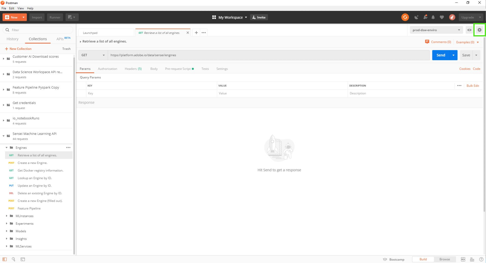

# Adobe Experience Platform의 포스트맨

Postman은 사전 설정된 변수를 사용하여 환경을 설정하고, API 컬렉션을 공유하고, CRUD 요청을 간소화하는 등의 작업을 수행할 수 있는 API 개발을 위한 협업 플랫폼입니다. 대부분의 Platform API 서비스에는 API 호출을 수행하는 데 도움이 되는 Postman 컬렉션이 있습니다.

## Experience Platform을 위한 Postman 환경을 설정하는 방법

다음 비디오 안내서에서는 Postman 환경을 만들고 설정하는 방법을 간략하게 설명합니다. Postman 환경에는 아래에 제공된 다양한 컬렉션에 대해 API를 호출하는 데 필요한 모든 필수 헤더가 포함되어 있습니다. 설정되면 값이 만료될 때마다(예: `ACCESS_TOKEN`) 환경에서 현재 값을 업데이트할 수 있으며, 이 새 값은 모든 컬렉션에서 사용됩니다.

>[!VIDEO](https://video.tv.adobe.com/v/28832)

## 포스트맨 컬렉션 {#collections}

사용 가능한 모든 Postman 컬렉션이 들어 있는 폴더는 [Experience Platform Postman 샘플 GitHub 리포지토리](https://github.com/adobe/experience-platform-postman-samples/tree/master/apis/experience-platform)에서 찾을 수 있습니다. 또는 Adobe I/O의 [API 참조 설명서](https://www.adobe.com/go/platform-api-reference-en)의 각 개별 스웨거 파일에서 Postman 수집 링크를 찾을 수 있습니다.

Postman 컬렉션을 다운로드하려면 GitHub 페이지에서 **[!DNL Raw]** 을 선택하여 새 탭에서 원시 JSON 파일을 로드합니다. 그런 다음 마우스 오른쪽 단추를 클릭하고 **[!DNL Save as]** 을 선택하여 파일을 원하는 로컬 대상에 저장합니다.

## Postman 컬렉션 가져오기 {#import}

[Postman collection](#collections)을 활용하려면 환경을 설정해야 합니다. 환경 설정을 완료했으면 오른쪽 상단 모서리에서 **[!DNL Manage Environments]** 선택기를 선택합니다.

팝오버가 나타나고 현재 모든 환경을 표시합니다. 컬렉션을 가져오려면 **[!DNL import]** 을 선택합니다.

가져올 파일을 선택하라는 메시지가 표시됩니다. 가져올 Postman 컬렉션 파일을 선택합니다. 선택하면 컬렉션이 컬렉션 탭 아래의 왼쪽 레일에 채워집니다.

각 컬렉션에는 성공적인 CRUD 작업을 수행하는 데 필요한 다양한 키-값 쌍이 있습니다. 서비스의 [API 개발자 안내서](api-guide.md#api-guides)를 검토하여 필요한 값, 팁에 대해 알아보고 예를 참조하십시오.

Postman UI 및 사용 가능한 기능에 대한 자세한 내용은 [Postman 설명서](https://learning.postman.com/docs/getting-started/navigating-postman/)를 참조하십시오.

### 비프로덕션 사용을 위해 Postman을 사용하여 액세스 토큰 생성

>[!WARNING]
>
>Adobe I/O 액세스 토큰 생성 Postman 컬렉션에 설명된 대로, 표현된 생성 메서드는 **비프로덕션 사용**&#x200B;에 적합합니다. 로컬 서명은 타사 호스트에서 JavaScript 라이브러리를 로드하고 원격 서명은 개인 키를 Adobe이 소유하고 운영하는 웹 서비스로 보냅니다. Adobe은 이 개인 키를 저장하지 않지만 프로덕션 키는 다른 사람과 공유해서는 안 됩니다.

아래 비디오에서는 공개 GitHub 리포지토리에서 다운로드할 수 있는 [Adobe I/O 액세스 토큰 생성 컬렉션](https://github.com/adobe/experience-platform-postman-samples/blob/master/apis/ims/Adobe%20IO%20Access%20Token%20Generation.postman_collection.json)을 사용합니다.

>[!VIDEO](https://video.tv.adobe.com/v/29698/?quality=12&learn=on)

## 다음 단계

이 문서에서는 Postman 환경, 컬렉션 및 컬렉션을 가져오는 방법을 도입했습니다. 이제 Postman을 사용할 수 있으므로 각 Platform 서비스에 사용할 수 있는 필수 헤더, 예 및 [API 안내서](api-guide.md#api-guides) 목록을 보려면 [플랫폼 시작 안내서](api-guide.md)를 방문하십시오.
