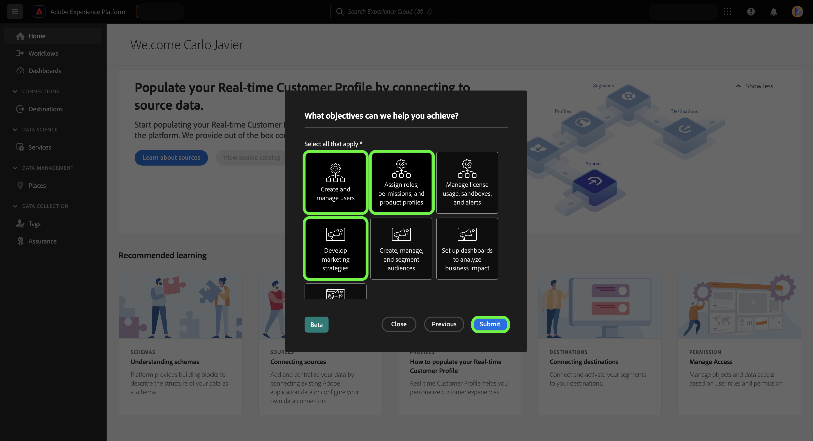

# 자체 식별 설문 조사를 사용하여 Experience Platform 개인 프로필 구축

>[!NOTE]
>
>그 자기 식별 조사는 베타에 있다. 기능 및 설명서는 변경될 수 있습니다.

자가 식별 설문 조사는 Adobe Experience Platform UI 홈 페이지에 표시되는 짧은 설문지입니다. 설문지를 작성하시면 직무에 대한 정보와 일반적인 목표를 알 수 있습니다. 그런 다음 이 정보를 사용하여 제품 내 안내서를 보다 효과적으로 조정하고 궁극적으로 목표에 더 적합한 콘텐츠를 제공합니다.

이 문서에서는 Platform UI의 자체 식별 설문 조사를 사용하여 목표 및 작업에 따라 관련 콘텐츠를 수신하는 방법과 UI를 사용하여 개인 프로필 속성을 재구성하는 방법에 대한 정보를 제공합니다.

Adobe Experience Platform에 대해 자세히 알아보려면 [Experience Platform 개요](home.md).

## 플랫폼 UI의 자체 식별 설문 조사

로그인 시 Platform UI 홈 페이지의 오른쪽 하단에 본인 확인 설문 조사 프롬프트가 표시됩니다.

설문 조사를 시작하려면 다음을 선택합니다. **[!UICONTROL 시작]**.

첫 번째 설문 조사 질문에 자신의 작품을 가장 잘 설명하는 함수를 선택합니다.

사용 가능한 옵션은 다음과 같습니다.

* 관리
* 엔지니어링
* 개인정보 보호 및 거버넌스
* 마케팅
* 기타

>[!NOTE]
>
>옵션 목록에서 두 개 이상의 함수를 선택할 수 있습니다. 다음을 선택하는 경우 [!UICONTROL 기타]목표에 대한 세부 정보를 입력하라는 메시지가 표시됩니다.

계속하려면 현재 작업을 가장 잘 설명하는 함수를 선택한 다음 을 선택합니다 **[!UICONTROL 다음]**.

그런 다음 작업에 가장 잘 적용되는 특정 목표를 선택합니다.

사용 가능한 목표 목록은 다음과 같습니다.

* 사용자 만들기 및 관리
* 역할, 권한 및 제품 프로필 할당
* 라이선스 사용, 샌드박스 및 경고 관리
* 데이터 수집을 위한 시스템 구성
* 내 조직의 데이터 구조 모델링
* 통찰력을 생성하기 위해 데이터 쿼리, 필터링 및 최적화
* 동의 및 데이터 정책 구성
* 데이터 거버넌스 및 개인정보 보호 규정 준수
* 마케팅 전략 개발
* 대상자 만들기, 관리 및 분류
* 비즈니스 영향 분석을 위한 대시보드 설정
* 다운스트림 타겟팅을 위해 데이터를 대상으로 활성화

완료되면 다음을 선택합니다. **[!UICONTROL 제출]**.

자체 식별 설문 조사를 완료한 후 다음을 선택합니다. **[!UICONTROL 완료]**.

>[!NOTE]
>
>목표 및 권장 사항(있는 경우)은 선택한 Job 기능에 따라 변경됩니다.

## 설문 조사 응답 업데이트

Experience Cloud 기본 설정 메뉴를 사용하여 작업 기능 및 객체를 갱신합니다. 환경 설정 메뉴에 액세스하려면 맨 위의 탐색에서 프로필 아이콘을 선택한 다음 을 선택합니다. **[!UICONTROL 환경 설정]**.

다음, [!UICONTROL 일반] 프로필 환경 설정 메뉴의 섹션에서 다음을 선택합니다. **[!UICONTROL 직무 기능 및 목표 업데이트]**.

자체 식별 설문 조사가 표시되어 응답을 다시 구성하고 프로필을 업데이트할 수 있습니다.

## 다음 단계

이 문서를 읽은 후에는 Platform UI 사용 시 더 연관성 있는 콘텐츠를 수신하기 위해 Job 기능 및 목표에 대한 정보를 제출하고 업데이트했습니다. Platform UI에 대한 자세한 내용은 [Experience Platform 개요](home.md).
