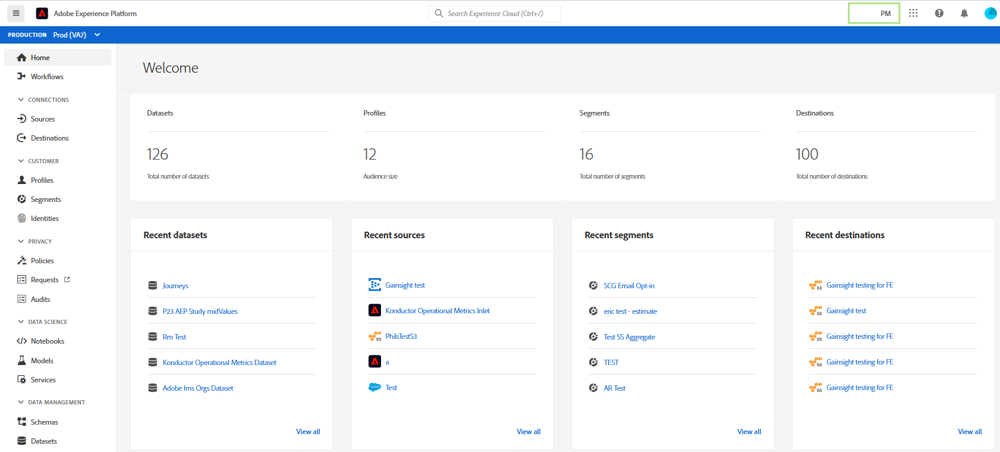

# Adobe Experience Platform UI 안내서

이 안내서는 Adobe Experience Platform UI(사용자 인터페이스)를 사용하는 방법에 대한 소개로, 다양한 구성 요소가 사용되는 방식을 설명하고 자세한 정보를 보려면 추가 설명서에 대한 링크를 제공합니다.

Adobe Experience Platform에 대한 자세한 내용은 [Experience Platform 개요](home.md).

## 홈 화면

Adobe Experience Platform에 로그인하면 [!UICONTROL 홈] 페이지, [지표 대시보드](#metrics), [최근 데이터](#recent-data), 및 [권장 학습](#recommended-learning) 섹션에 자세히 설명되어 있습니다.

### 지표

지표 대시보드는 조직 내의 데이터 세트, 프로필, 세그먼트 및 대상에 대한 정보를 제공하는 카드를 제공합니다.

다음 **[!UICONTROL 데이터 세트]** 섹션에는 조직 내의 데이터 세트 수가 표시됩니다. 이 번호는 새 데이터 세트가 만들어지면 업데이트됩니다. 데이터 세트에 대한 자세한 내용은 [데이터 세트 개요](../catalog/datasets/overview.md).

다음 **[!UICONTROL 프로필]** 섹션에는 프로필 조각을 제외하고 조직 내에 프로필이 있는 총 사람 수가 표시됩니다. 이 총 사람 수는 총 대응 가능 대상을 나타내며 24시간마다 한 번 업데이트됩니다. 프로필에 대한 자세한 내용은 [실시간 고객 프로필 개요](../profile/home.md).

다음 **[!UICONTROL 세그먼트]** 섹션에는 조직 내에서 생성된 총 세그먼트 수가 표시됩니다. 이 번호는 새 세그먼트가 만들어지면 업데이트됩니다. 세그먼트에 대한 자세한 내용은 [세그먼테이션 서비스 개요](../segmentation/home.md).

다음 **[!UICONTROL 대상]** 섹션에 조직에 대해 생성된 총 대상 수가 표시됩니다. 이 번호는 새 대상을 만들 때 업데이트됩니다. 대상에 대한 자세한 내용은 [대상 개요](../destinations/home.md).

### 최근 데이터

최근 데이터 대시보드는 최근에 만든 데이터 세트, 소스, 세그먼트 및 대상에 대한 정보를 제공합니다.

다음 **[!UICONTROL 최근 데이터 세트]** 섹션에는 조직 내에서 가장 최근에 만든 데이터 세트 5개가 나열됩니다. 이 목록은 새 데이터 세트를 만들 때마다 업데이트됩니다. 목록에서 데이터 세트를 선택하여 지정된 데이터 세트에 대한 자세한 정보를 보거나 선택할 수 있습니다 **[!UICONTROL 모두 보기]** 를 클릭하여 생성된 모든 데이터 세트 목록을 확인합니다. 데이터 세트에 대한 자세한 내용은 [데이터 세트 개요](../catalog/datasets/overview.md).

다음 **[!UICONTROL 최근 소스]** 섹션에는 조직 내에서 가장 최근에 생성된 소스 커넥터 5개가 나열됩니다. 이 목록은 새 소스 커넥터를 만들 때마다 업데이트됩니다. 목록에서 소스 연결을 선택하여 지정된 커넥터에 대한 자세한 정보를 보거나 선택할 수 있습니다 **[!UICONTROL 모두 보기]** 생성된 모든 소스 연결 목록을 보려면 다음을 수행하십시오. 소스에 대한 자세한 내용은 [소스 개요](../sources/home.md).

다음 **[!UICONTROL 최근 세그먼트]** 섹션에는 조직 내에서 가장 최근에 만든 세그먼트 정의 5개가 나열됩니다. 이 목록은 새 세그먼트 정의가 생성될 때마다 업데이트됩니다. 목록에서 세그먼트 정의를 선택하여 지정된 세그먼트 정의에 대한 자세한 정보를 보거나 선택할 수 있습니다 **[!UICONTROL 모두 보기]** 생성된 모든 세그먼트 정의 목록을 보려면 . 세그먼트에 대한 자세한 내용은 [세그먼테이션 서비스 개요](../segmentation/home.md).

다음 **[!UICONTROL 최근 대상]** 섹션에는 조직 내에서 가장 최근에 생성된 5개의 대상 목록이 있습니다. 이 목록은 새 대상을 만들 때마다 업데이트됩니다. 목록에서 대상을 선택하여 지정된 대상에 대한 자세한 정보를 보거나 선택할 수 있습니다 **[!UICONTROL 모두 보기]** 생성된 모든 대상 목록을 보려면 . 대상에 대한 자세한 내용은 [대상 개요](../destinations/home.md).

### 권장 학습

다음 **[!UICONTROL 권장 학습]** 이 섹션에서는 Adobe Experience Platform을 시작하기 위한 유용한 설명서에 대한 링크를 제공합니다.

## 위쪽 탐색 모음

플랫폼 UI의 위쪽 탐색 모음에는 현재 로그인한 조직이 표시되며 몇 가지 중요한 컨트롤이 제공됩니다.

탐색 막대의 왼쪽에 Adobe Experience Platform 로고가 있습니다. 언제든지 이 로고를 선택하면 Platform UI 홈 화면으로 돌아갑니다.

### 조직 전환기

맨 위 탐색 막대의 오른쪽에 있는 첫 번째 항목은 **조직 전환기**.

사용 가능한 경우, 전환기를 선택하면 액세스 권한이 있는 조직의 드롭다운 메뉴가 열립니다. 다른 조직으로 전환하려면 나열된 옵션을 선택합니다.

### 애플리케이션 전환

위쪽 탐색의 오른쪽에 있는 다음 항목은 **애플리케이션 전환기**&#x200B;으로 표시됨  아이콘. 이 아이콘을 선택하면 Experience Platform, Analytics, Assets 등과 같이 조직에서 액세스할 수 있는 Adobe 애플리케이션 간을 전환할 수 있습니다.

### 도움말

애플리케이션 전환기의 오른쪽에는 **도움말 및 지원 메뉴**&#x200B;으로 표시되며,  아이콘. 이 아이콘을 선택하면 여러 도움말 및 지원 리소스가 포함된 팝업 메뉴가 나타납니다. 다음 **[!UICONTROL 도움말]** 탭에는 현재 있는 페이지에 대한 관련 설명서 목록이 표시됩니다. 다음 **[!UICONTROL 지원]** 탭에서는 Adobe 지원 팀과 함께 지원 티켓을 만들 수 있습니다. 다음 **[!UICONTROL 피드백]** Adobe 탭에서는 플랫폼에 대한 피드백을에 제출할 수 있습니다.

### 알림 및 공지

에서 **알림 섹션**&#x200B;으로 표시되며,  아이콘. 다음 **[!UICONTROL 알림 을 참조하십시오]** 탭에는 제품 및 기타 관련 업데이트에 대한 중요한 정보가, **[!UICONTROL 공지]** 탭에는 서비스 유지 관리에 대한 정보가 표시됩니다.

### 사용자 프로필

맨 위 탐색 막대의 최종 항목은 **사용자 설정**&#x200B;으로 표시됨  아이콘. 이 아이콘을 선택하여 기본 설정을 편집하거나 로그아웃합니다.

이름과 전자 메일 바로 아래에 있는 스위치를 사용하여 플랫폼 인터페이스의 밝은 테마와 어두운 테마 간을 전환할 수 있습니다. 원하는 테마를 선택합니다.

### 샌드박스

상단 탐색 막대 바로 아래에 샌드박스 막대가 있습니다. 이 표시줄에는 현재 Platform에 사용하고 있는 샌드박스가 표시됩니다. 샌드박스에 대한 자세한 내용은 [샌드박스 개요](../sandboxes/home.md).

## 왼쪽 탐색 {#left-nav}

화면 왼쪽에 있는 탐색 창에 Platform UI에서 지원되는 모든 다양한 서비스가 나열됩니다.

메뉴 아이콘을 클릭하여 왼쪽 탐색 패널을 표시하거나 숨깁니다.

패널을 표시한 후 다시 클릭하여 열려 있는 위치에서 탐색을 잠글 수 있습니다.

>[!IMPORTANT]
>
>왼쪽 탐색 모음에는 액세스할 수 있는 기능만 표시됩니다. 이전 버전의 Adobe Experience Platform에서는 사용할 수 없는 항목이 비활성화되었습니다. 나타나지 않는 섹션에 액세스할 수 있어야 하는 경우에는 시스템 관리자에게 문의하십시오.

다음 **[!UICONTROL 홈]** 섹션을 통해 Platform UI 홈 페이지로 돌아갈 수 있습니다.

다음 **[!UICONTROL 워크플로우]** 섹션에는 플랫폼 내에서 작업을 수행하는 여러 단계 워크플로우 목록이 표시됩니다. 워크플로우에 대한 자세한 내용은 [워크플로우 개요](./workflows.md).

### [!UICONTROL 연결]

다음 **[!UICONTROL 소스]** 섹션에서 소스 연결을 만들고, 업데이트하고, 삭제할 수 있으므로 외부 소스의 데이터를 플랫폼으로 수집할 수 있습니다. 소스에 대한 자세한 내용은 [소스 개요](../sources/home.md).

다음 **[!UICONTROL 대상]** 섹션에서 대상을 만들고, 업데이트하고, 삭제할 수 있으므로, Platform에서 많은 외부 대상으로 데이터를 내보낼 수 있습니다. 대상에 대한 자세한 내용은 [대상 개요](../destinations/home.md).

### [!UICONTROL 고객]

다음 **[!UICONTROL 프로필]** 섹션을 통해 고객 프로필을 찾아보고, 프로필 지표를 보고, 병합 정책을 만들고 관리하며, 결합 스키마를 볼 수 있습니다. 를 사용하는 방법에 대해 자세히 알아보려면 [!UICONTROL 프로필] 섹션, [[!DNL Profile] 사용 안내서](../profile/ui/user-guide.md). 실시간 고객 프로필에 대한 자세한 내용은 [실시간 고객 프로필 개요](../profile/home.md).

다음 **[!UICONTROL 세그먼트]** 섹션에서 세그먼트 정의를 만들고 관리할 수 있습니다. 를 사용하는 방법에 대해 자세히 알아보려면 [!UICONTROL 세그먼트] 섹션, [세분화 사용 안내서](../segmentation/ui/overview.md). 세분화 서비스에 대한 자세한 내용은 [세그먼테이션 서비스 개요](../segmentation/home.md).

다음 **[!UICONTROL ID]** 섹션에서 ID 네임스페이스를 만들고 관리할 수 있습니다. 에 대한 자세한 정보 [!UICONTROL ID] ID 네임스페이스와 Platform UI에서 ID를 사용하는 방법에 대한 정보가 포함된 섹션을 참조하십시오. [id 네임스페이스 개요](../identity-service/namespaces.md).

### [!UICONTROL 개인정보 보호]

다음 **[!UICONTROL 정책]** 섹션에서 데이터 사용 정책을 만들고 관리할 수 있습니다. 정책 섹션을 사용하는 방법에 대한 자세한 내용은 [데이터 사용 정책 사용 안내서](../data-governance/policies/user-guide.md). 데이터 사용 정책에 대한 자세한 내용은 [데이터 사용 정책 개요](../data-governance/policies/overview.md).

다음 **[!UICONTROL 요청]** 섹션에서 개인 정보 요청을 만들고 관리할 수 있습니다. Privacy Service UI에 액세스하려면 허용 목록에추가된여야 합니다. 요청 섹션 사용에 대한 자세한 내용은 [Privacy Service 사용 안내서](../privacy-service/ui/user-guide.md). Privacy Service에 대한 자세한 내용은 [Privacy Service 개요](../privacy-service/home.md).

### [!UICONTROL Data Science]

다음 **[!UICONTROL 노트북]** 섹션에서 데이터를 탐색, 분석 및 모델링할 수 있는 대화형 개발 환경인 JupiterLab에 대한 액세스를 제공합니다. 전자 필기장 섹션을 사용하는 방법에 대한 자세한 내용은 [JupiterLab 사용 안내서](../data-science-workspace/jupyterlab/overview.md). 데이터 과학 작업 공간에 대한 자세한 내용은 [Data Science Workspace 개요](../data-science-workspace/home.md)

다음 **[!UICONTROL 모델]** 섹션에서 기계 학습 및 인공 지능을 사용하여 모델을 생성, 개발, 교육 및 튜닝하여 예측을 수행할 수 있습니다. 모델 섹션에 대한 자세한 내용은 [모델 교육 및 평가](../data-science-workspace/models-recipes/train-evaluate-model-ui.md).

다음 **[!UICONTROL 서비스]** 섹션에서 예약된 교육 및 점수를 위해 게시된 모델을 관리하거나, 개인화된 실시간 고객 경험을 제공하는 AI 서비스 세트인 Adobe의 Intelligent Services를 사용할 수 있습니다. 서비스 섹션에 대한 자세한 내용은 [모델을 서비스로 게시 자습서](../data-science-workspace/models-recipes/publish-model-service-ui.md).

### [!UICONTROL 데이터 관리]

다음 **[!UICONTROL 스키마]** 섹션에서 XDM(Experience Data Model) 스키마를 만들고 관리할 수 있습니다. 스키마에 대한 자세한 내용은 [스키마 만들기](../xdm/tutorials/create-schema-ui.md). XDM에 대한 자세한 내용은 [XDM 시스템 개요](../xdm/home.md).

다음 **[!UICONTROL 데이터 세트]** 섹션에서 데이터 세트를 만들고 관리할 수 있습니다. 데이터 세트에 대한 자세한 내용은 [데이터 세트 사용 안내서](../catalog/datasets/user-guide.md).

다음 **[!UICONTROL 쿼리]** 섹션을 통해 쿼리를 만들고 관리하고 Adobe Experience Platform Query Service에서 만든 SQL 쿼리를 기록하고 [!DNL PostgreSQL] 자격 증명. 쿼리에 대한 자세한 내용은 [Query Service 사용 안내서](../query-service/ui/overview.md).

다음 **[!UICONTROL 모니터링]** 섹션에서 일괄 처리 및 스트리밍 수집을 모니터링할 수 있습니다. 모니터링에 대한 자세한 내용은 [데이터 수집 모니터링 사용 안내서](../ingestion/quality/monitor-data-ingestion.md).

### [!UICONTROL 의사결정]

Adobe Journey Optimizer 는 Experience Platform 위에 구축된 애플리케이션 서비스입니다. 강력한 의사 결정 기술을 사용하여 모든 터치 포인트에서 고객에게 최상의 오퍼와 경험을 적시에 제공할 수 있습니다. 작업 등 Journey Optimizer에 대해 자세히 알아보려면 [!UICONTROL 오퍼] 및 [!UICONTROL 활동] 방문 [Journey Optimizer 설명서](https://experienceleague.adobe.com/docs/journey-optimizer.html?lang=ko).

### [!UICONTROL 관리]

플랫폼 사용자 인터페이스(UI)는 일일 스냅샷 중에 캡처된 대로 조직의 라이선스 사용에 대한 중요한 정보를 볼 수 있는 대시보드를 제공합니다. 이 대시보드에 액세스하려면 **[!UICONTROL 라이선스 사용]** 를 클릭합니다. 라이선스 사용 대시보드에 대한 자세한 내용은 [라이선스 사용 대시보드 안내서](./license-usage-and-guardrails/license-usage-dashboard.md).

>[!IMPORTANT]
>
>라이선스 사용 대시보드 기능은 현재 알파 상태이며 모든 사용자가 사용할 수 없습니다. 설명서 및 기능은 변경될 수 있습니다.

## 다음 단계

이 안내서를 읽어 이제 Platform UI의 홈 페이지 및 주요 탐색 요소에 대해 소개되었습니다. 사용자 인터페이스에서 작업에 대한 자세한 내용은 각 개별 플랫폼 서비스에 대한 설명서를 참조하십시오. 이 설명서에 대한 링크는 [왼쪽 탐색](#left-nav) 이 문서의 앞부분에서 발견된 섹션을 참조하십시오.
