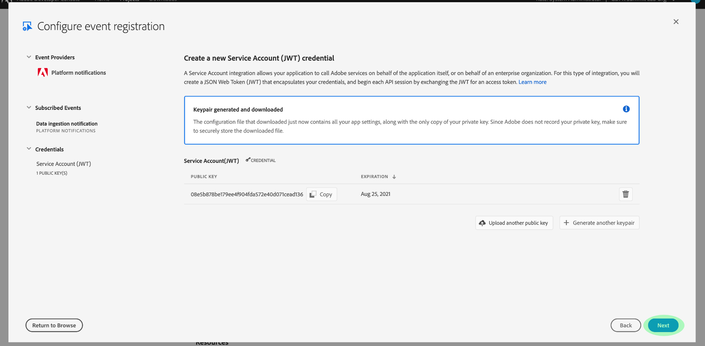

# Adobe I/O 이벤트 알림 구독

[!DNL Observability Insights] Adobe Experience Platform 활동에 대한 Adobe I/O 이벤트 알림에 가입할 수 있습니다. 이러한 이벤트는 작업 모니터링을 효율적으로 자동화할 수 있도록 구성된 웹 후크로 전송됩니다.

이 문서에서는 Adobe Experience Platform 서비스에 대한 Adobe I/O 이벤트 알림을 구독하는 방법에 대해 설명합니다. 사용 가능한 이벤트 유형에 대한 참조 정보도 제공되며, 해당 이벤트 유형에 대해 반환된 이벤트 데이터를 해석하는 방법에 대한 추가 설명서에 대한 링크도 제공됩니다 [!DNL Platform] 서비스.

## 시작하기

이 문서를 사용하려면 웹 후크를 이해하고 한 응용 프로그램에서 다른 응용 프로그램으로 웹 후크를 연결하는 방법을 알고 있어야 합니다. 자세한 내용은 [[!DNL I/O Events] 설명서](https://www.adobe.io/apis/experienceplatform/events/docs.html#!adobedocs/adobeio-events/master/intro/webhook_docs_intro.md) webhooks를 소개합니다.

## 웹 후크 만들기

수신하려면 [!DNL I/O Event] 알림은 고유한 웹 후크 URL을 이벤트 등록 세부 사항의 일부로 지정하여 웹 후크를 등록해야 합니다.

원하는 클라이언트를 사용하여 웹 후크를 구성할 수 있습니다. 이 자습서의 일부로 사용할 임시 웹 후크 주소를 확인하려면 을(를) 방문하십시오. [Webhook.site](https://webhook.site/) 제공된 고유 URL을 복사합니다.

초기 검증 프로세스 동안 [!DNL I/O Events] 전송 `challenge` 웹 후크에 대한 GET 요청의 쿼리 매개 변수. 응답 페이로드에서 이 매개 변수의 값을 반환하도록 웹 후크를 구성해야 합니다. Webhook.site를 사용하는 경우 **[!DNL Edit]** 오른쪽 상단 모서리에서 을(를) 입력한 다음 `$request.query.challenge$` 아래에 **[!DNL Response body]** 선택하기 전에 **[!DNL Save]**.

## Adobe Developer 콘솔에서 새 프로젝트 만들기

이동 [Adobe Developer 콘솔](https://www.adobe.com/go/devs_console_ui) Adobe ID으로 로그인합니다. 다음으로, 다음의 자습서에 설명된 단계를 수행합니다 [빈 프로젝트 만들기](https://developer.adobe.com/developer-console/docs/guides/projects/projects-empty/) ( Adobe Developer 콘솔 설명서)

## 이벤트 구독

새 프로젝트를 만들었으면 해당 프로젝트의 개요 화면으로 이동합니다. 여기에서 을 선택합니다. **[!UICONTROL 이벤트 추가]**.

프로젝트에 이벤트 공급자를 추가할 수 있는 대화 상자가 나타납니다.

* Experience Platform 경고를 구독하는 경우 **[!UICONTROL 플랫폼 알림]**
* Adobe Experience Platform을 구독하는 경우 [!DNL Privacy Service] 알림, 선택 **[!UICONTROL Privacy Service 이벤트]**

이벤트 공급자를 선택하면 **[!UICONTROL 다음]**.

다음 화면에는 구독할 이벤트 유형 목록이 표시됩니다. 구독할 이벤트를 선택하고 을(를) 선택합니다 **[!UICONTROL 다음]**.

>[!NOTE]
>
>작업 중인 서비스에 가입할 이벤트를 잘 모르는 경우 다음 설명서를 참조하십시오.
>
>* [플랫폼 알림](./rules.md)
>* [Privacy Service 알림](../../privacy-service/privacy-events.md)

다음 화면에 JSON 웹 토큰(JWT)을 만들라는 메시지가 표시됩니다. 자동으로 키 쌍을 생성하거나 터미널에서 생성된 자신의 공개 키를 업로드할 수 있는 옵션이 제공됩니다.

이 자습서를 위해 첫 번째 옵션 다음에 가 있습니다. 에 대한 옵션 상자를 선택합니다. **[!UICONTROL 키 쌍 생성]**&#x200B;를 선택한 다음, **[!UICONTROL 키 쌍 생성]** 오른쪽 아래 모서리에 있는 버튼.

키 쌍이 생성되면 브라우저에 의해 자동으로 다운로드됩니다. 이 파일은 개발자 콘솔에서 지속되지 않으므로 직접 저장해야 합니다.

다음 화면에서는 새로 생성된 키 쌍의 세부 사항을 검토할 수 있습니다. 계속하려면 **[!UICONTROL 다음]**&#x200B;을 선택합니다.

다음 화면에서 이벤트 등록에 대한 이름과 설명을 입력합니다. [!UICONTROL 이벤트 등록 세부 사항] 섹션을 참조하십시오. 가장 좋은 방법은 이 이벤트 등록을 동일한 프로젝트의 다른 이벤트와 구분하기 위해 고유하고 쉽게 식별할 수 있는 이름을 만드는 것입니다.

같은 화면에서 더 아래로 [!UICONTROL 이벤트 수신 방법] 섹션에 이벤트를 수신하는 방법을 선택적으로 구성할 수 있습니다. **[!UICONTROL Webhook]** 에서는 이벤트를 수신할 사용자 지정 웹 후크 주소를 제공할 수 있습니다. **[!UICONTROL 런타임 작업]** 을 사용하여 동일한 작업을 수행할 수 있습니다. [Adobe I/O Runtime](https://www.adobe.io/apis/experienceplatform/runtime/docs.html).

이 자습서에서 다음을 선택합니다 **[!UICONTROL Webhook]** 및 은 이전에 만든 웹 후크의 URL을 제공합니다. 완료되면 을 선택합니다 **[!UICONTROL 구성된 이벤트 저장]** 이벤트 등록을 완료하려면

새로 만든 이벤트 등록에 대한 세부 정보 페이지가 나타납니다. 이 페이지에서 구성을 편집하고, 수신한 이벤트를 검토하고, 디버그 추적을 수행하고, 새 이벤트 공급자를 추가할 수 있습니다.

## 다음 단계

이 자습서에 따라 수신 웹후크를 등록했습니다 [!DNL I/O Event] 알림 [!DNL Experience Platform] 및/또는 [!DNL Privacy Service]. 사용 가능한 이벤트 및 각 서비스에 대한 알림 페이로드를 해석하는 방법에 대한 자세한 내용은 다음 설명서를 참조하십시오.

* [[!DNL Privacy Service] 알림](../../privacy-service/privacy-events.md)
* [[!DNL Data Ingestion] 알림](../../ingestion/quality/subscribe-events.md)
* [[!DNL Flow Service] (소스) 알림](../../sources/notifications.md)

자세한 내용은 [[!DNL Observability Insights] 개요](../home.md) 를 참조하십시오 [!DNL Experience Platform] 및 [!DNL Privacy Service].
