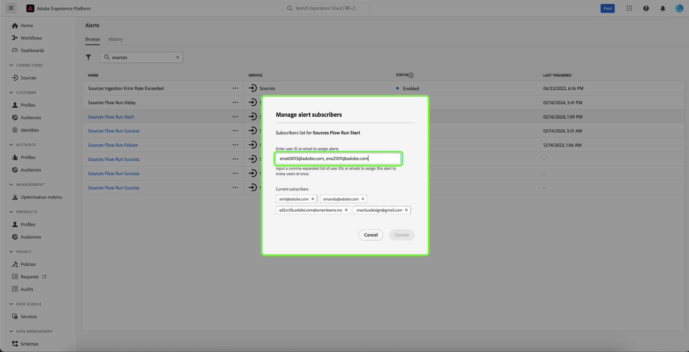

# 경고 UI 안내서

Adobe Experience Platform 사용자 인터페이스를 사용하면 Adobe Experience Platform Observability Insights에서 공개한 지표를 기반으로 받은 경고 내역을 볼 수 있습니다. 또한 UI를 통해 사용 가능한 경고 규칙을 보고, 활성화하고, 비활성화하고, 구독할 수 있습니다.

>[!NOTE]
>
>Experience Platform의 경고에 대한 소개는 [경고 개요](./overview.md)를 참조하십시오.

시작하려면 왼쪽 탐색에서 **[!UICONTROL 알림]**&#x200B;을 선택하세요.

![왼쪽 탐색에서 [!UICONTROL 경고]를 강조 표시하는 경고 페이지](../images/alerts/ui/workspace.png)

## 경고 규칙 관리 {#manage-rules}

**[!UICONTROL 찾아보기]** 탭에는 경고를 트리거할 수 있는 사용 가능한 규칙이 나열됩니다.

![사용 가능한 경고 목록이 [!UICONTROL 찾아보기] 탭에 표시됩니다.](../images/alerts/ui/rules.png)

목록에서 규칙을 선택하여 해당 설명 및 해당 구성 매개 변수를 오른쪽 레일에서 확인합니다(예: 임계값 및 심각도).

규칙 이름 옆의 생략 부호(**..**)를 선택하면 드롭다운에 경고를 활성화 또는 비활성화하고(현재 상태에 따라) 경고에 대한 이메일 알림을 구독 또는 구독 취소하는 컨트롤이 표시됩니다.

## 경고 구독자 관리 {#manage-subscribers}

>[!NOTE]
>
> Adobe 사용자 ID, 외부 이메일 주소 또는 이메일 그룹 목록에 경고를 할당하려면 관리자여야 합니다.

**[!UICONTROL 찾아보기]** 탭에는 경고를 트리거할 수 있는 사용 가능한 규칙이 나열됩니다.

![사용 가능한 경고 규칙 목록이 [!UICONTROL 찾아보기] 탭에 표시됩니다.](../images/alerts/ui/rules.png)

규칙 이름 옆의 생략 부호(**...**)를 선택하면 드롭다운에 컨트롤이 표시됩니다. **[!UICONTROL 경고 구독자 관리]**&#x200B;를 선택합니다.

![줄임표를 선택하여 드롭다운 메뉴를 표시합니다. [!UICONTROL 경고 구독자 관리] 옵션이 강조 표시되어 있습니다.](../images/alerts/ui/manage-alert-subscribers.png)

[!UICONTROL 경고 구독자 관리] 페이지가 나타납니다. 특정 사용자에게 알림을 할당하려면 Adobe 사용자 ID, 외부 이메일 주소 또는 이메일 그룹 목록을 입력한 다음 Enter 키를 누릅니다.

>[!NOTE]
>
>여러 사용자에게 이 알림을 한 번에 보내려면 쉼표로 구분하여 사용자 ID 또는 이메일 주소 목록을 제공하십시오.

이메일 주소는 나열된 현재 구독자 목록에 나타납니다. **[!UICONTROL 업데이트]**&#x200B;를 선택합니다.

![경고 구독자 관리 페이지에서 구독자를 강조 표시하고 [!UICONTROL 업데이트].](../images/alerts/ui/manage-alert-subscribers-added-email.png)

경고 알림 목록에 사용자를 추가했습니다. 이제 제출된 사용자는 아래 이미지에 표시된 대로 이 경고에 대한 이메일 알림을 받게 됩니다.

## 이메일 경고 활성화 {#enable-email}

경고 알림은 이메일로 직접 전달될 수 있습니다.

알림 및 공지를 표시하려면 오른쪽 상단 리본에 있는 벨 아이콘()을 선택하십시오. 표시되는 드롭다운에서 cog 아이콘()을 선택하여 Experience Cloud 환경 설정 페이지에 액세스합니다.

**프로필** 페이지가 표시됩니다. 전자 메일 경고 기본 설정에 액세스하려면 왼쪽 탐색에서 **[!UICONTROL 알림]**&#x200B;을(를) 선택하십시오.

![왼쪽 탐색에서 [!UICONTROL 알림]을 강조 표시하는 프로필 페이지입니다.](../images/alerts/ui/profile.png)

페이지 하단에 있는 **이메일** 섹션으로 스크롤한 다음 **[!UICONTROL 인스턴트 알림]**&#x200B;을 선택합니다.

구독한 모든 경고는 이제 Adobe ID 계정에 연결된 이메일 주소로 전달됩니다.

## 경고 임계값 사용자 지정 {#alert-threshold}

다음 경고 유형에 대해 경고 임계값을 사용자 정의할 수 있습니다.

| 경고 유형 | 사용자 지정 매개 변수 |
|---|---|
| 세그먼트 작업 지연 | 지연 임계값 |
| 세그먼트 내보내기 지연 | 지연 임계값 |
| 대상 플로우 실행 지연 | 지연 임계값 |
| ID 서비스 흐름 실행 지연 | 지연 임계값 |
| 프로필 흐름 실행 지연 | 지연 임계값 |
| 소스 플로우 실행 지연 | 지연 임계값 |
| 쿼리 실행 지연 | 지연 임계값 |
| 활성화 건너뛰기 비율 초과 | 오류 임계값 |
| 소스 수집 오류율 초과 | 오류 임계값 |

규칙 이름 옆의 생략 부호(**...**)를 선택하면 드롭다운에 컨트롤이 표시됩니다. **[!UICONTROL 편집]**&#x200B;을 선택합니다.

![선택한 규칙에 대해 [!UICONTROL 편집] 옵션이 강조 표시되어 있습니다.](../images/alerts/ui/threshold-edit.png)

**[!UICONTROL 경고 사용자 지정]** 페이지가 나타납니다. 임계값을 원하는 분으로 업데이트한 다음 **[!UICONTROL 확인]**&#x200B;을 선택합니다.

![경고 페이지에서 [!UICONTROL 임계값] 및 [!UICONTROL 확인] 옵션을 강조 표시합니다.](../images/alerts/ui/threshold-update.png)

**[!UICONTROL 알림]** 페이지로 돌아갔습니다. 경보에 대한 임계값 설정을 보려면 목록에서 규칙을 선택합니다. 상태 및 심각도와 같은 세부 사항을 포함하여 경고에 대한 임계값 설정을 오른쪽 레일에서 볼 수 있습니다.

![오른쪽 레일 및 강조 표시의 세부 정보를 표시하는 강조 표시된 경고 [!UICONTROL 임계값].](../images/alerts/ui/threshold-view.png)

## 경고 내역 보기 {#alert-history}

**[!UICONTROL 기록]** 탭에는 경고를 트리거한 규칙, 트리거된 날짜 및 해결된 날짜(해당되는 경우)를 포함하여 조직에 대해 받은 경고의 기록이 표시됩니다.

![받은 알림 목록이 [!UICONTROL 기록] 탭에 표시됩니다.](../images/alerts/ui/history.png)

나열된 경고를 선택하면 경고를 트리거한 이벤트에 대한 간단한 요약을 포함하여 자세한 정보가 오른쪽 레일에 표시됩니다.

## 다음 단계

이 문서에서는 Platform UI에서 경고를 보고 관리하는 방법에 대한 개요를 제공했습니다. 서비스 기능에 대한 자세한 내용은 [Observability Insights](../home.md)의 개요를 참조하십시오.
