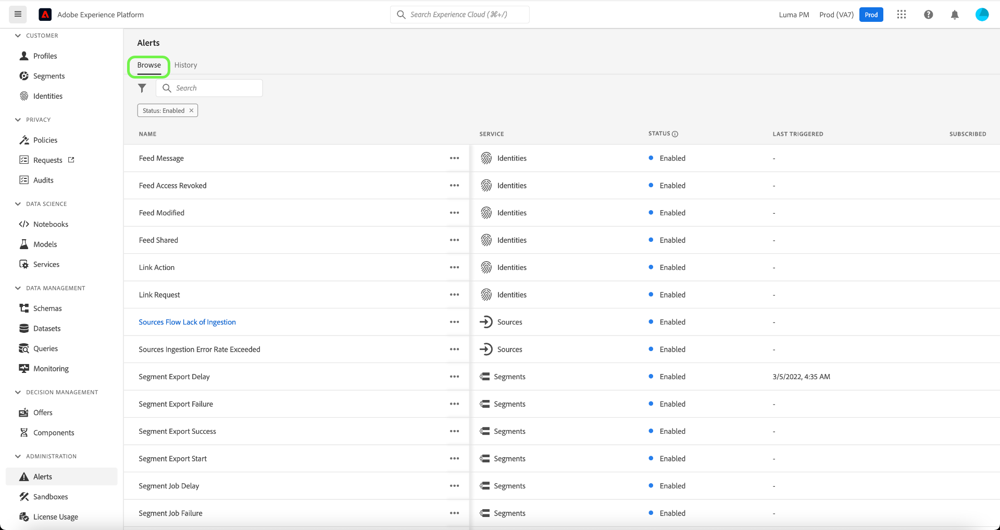

# 경고 UI 안내서

Adobe Experience Platform 사용자 인터페이스를 사용하면 Adobe Experience Platform Observability Insights에서 공개한 지표를 기반으로 받은 경고 내역을 볼 수 있습니다. 또한 UI를 통해 사용 가능한 경고 규칙을 보고, 활성화하고, 비활성화하고, 구독할 수 있습니다.

>[!NOTE]
>
>Experience Platform의 경고에 대한 소개는 [경고 개요](./overview.md).

시작하려면 다음을 선택합니다. **[!UICONTROL 경고]** 왼쪽 탐색.

## 경고 규칙 관리

다음 **[!UICONTROL 찾아보기]** 탭에는 경고를 트리거할 수 있는 사용 가능한 규칙이 나열됩니다.

목록에서 규칙을 선택하여 해당 설명 및 해당 구성 매개 변수를 오른쪽 레일에서 확인합니다(예: 임계값 및 심각도).

줄임표(**...**) 규칙 이름 옆에 있는 드롭다운에 경고를 활성화 또는 비활성화하고(현재 상태에 따라) 경고에 대한 이메일 알림을 구독 또는 구독 취소하는 컨트롤이 표시됩니다.

## 이메일 경고 활성화

경고 알림은 이메일로 직접 전달될 수 있습니다.

벨 아이콘() 알림 및 공지를 표시할 오른쪽 상단 리본에 있습니다. 표시되는 드롭다운에서 cog 아이콘()을 클릭하여 Experience Cloud 환경 설정 페이지에 액세스합니다.

다음 **프로필** 탭이 표시됩니다. 다음 항목 선택 **[!UICONTROL 알림]** 왼쪽 탐색에서 이메일 경고 기본 설정에 액세스합니다.

다음으로 스크롤 **이메일** 페이지 하단에 있는 섹션을 선택하고 다음을 선택합니다. **[!UICONTROL 인스턴트 알림]**

구독한 모든 경고는 이제 Adobe ID 계정에 연결된 이메일 주소로 전달됩니다.

## 경고 내역 보기

다음 **[!UICONTROL 기록]** 탭에는 경고를 트리거한 규칙, 트리거된 날짜 및 해결된 날짜(해당되는 경우)를 포함하여 조직에 대해 받은 경고 내역이 표시됩니다.

나열된 경고를 선택하면 경고를 트리거한 이벤트에 대한 간단한 요약을 포함하여 자세한 정보가 오른쪽 레일에 표시됩니다.

## 다음 단계

이 문서에서는 Platform UI에서 경고를 보고 관리하는 방법에 대한 개요를 제공했습니다. 의 개요 보기 [가시성 통찰력](../home.md) 를 참조하십시오.
