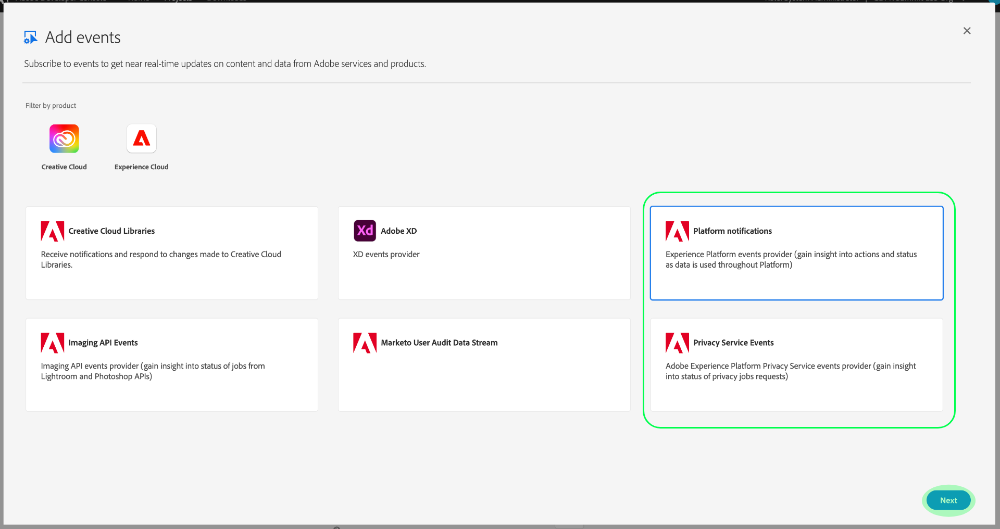

# Adobe I/O 이벤트 알림 구독

[!DNL Observability Insights] adobe experience platform 활동과 관련된 Adobe I/O 이벤트 알림에 가입할 수 있습니다. 이러한 이벤트는 작업 모니터링을 효율적으로 자동화하기 위해 구성된 웹후크로 전송됩니다.

이 문서에서는 Adobe Experience Platform 서비스에 대한 Adobe I/O 이벤트 알림을 구독하는 방법에 대해 설명합니다. 사용 가능한 이벤트 유형에 대한 참조 정보도 제공되며, 각 해당 서비스에 대해 반환된 이벤트 데이터를 해석하는 방법에 대한 추가 설명서에 대한 링크도 [!DNL Platform] 제공됩니다.

## 시작하기

이 문서를 사용하려면 웹 후크에 대한 작업 내용과 한 애플리케이션에서 다른 애플리케이션으로 웹 후크를 연결하는 방법이 필요합니다. 웹후크 [[!DNL I/O Events] 에 대한 소개는 설명서를](https://www.adobe.io/apis/experienceplatform/events/docs.html#!adobedocs/adobeio-events/master/intro/webhook_docs_intro.md) 참조하십시오.

## 웹 후크 만들기

알림을 받으려면 고유 웹 후크 URL을 이벤트 등록 세부 정보의 일부로 지정하여 웹 후크를 등록해야 합니다. [!DNL I/O Event]

원하는 클라이언트를 사용하여 웹 후크를 구성할 수 있습니다. 이 자습서의 일부로 사용할 임시 웹 후크 주소는 Webhook.site를  방문하여 제공된 고유한 URL을 복사합니다.

초기 유효성 검사 프로세스 동안 [!DNL I/O Events] 는 GET 요청에 `challenge` 있는 쿼리 매개 변수를 웹 후크에 보냅니다. 응답 페이로드에서 이 매개 변수의 값을 반환하려면 웹 후크를 구성해야 합니다. Webhook.site를 사용 중인 경우 오른쪽 상단 **[!DNL Edit]** 에서 선택한 다음 선택하기 `$request.query.challenge$` 전에 아래 **[!DNL Response body]** 를 입력합니다 **[!DNL Save]**.

## Adobe 개발자 콘솔에서 새 프로젝트 만들기

Adobe 개발자 [콘솔로](https://www.adobe.com/go/devs_console_ui) 이동하여 Adobe ID에 로그인합니다. 그런 다음 Adobe 개발자 콘솔 설명서에서 빈 프로젝트 [를 만드는](https://www.adobe.io/apis/experienceplatform/console/docs.html#!AdobeDocs/adobeio-console/master/projects-empty.md) 자습서에 나와 있는 단계를 따릅니다.

## 이벤트 구독

새 프로젝트를 만들었으면 해당 프로젝트의 개요 화면으로 이동합니다. 여기에서 이벤트 **[!UICONTROL 추가를 선택합니다]**.

프로젝트에 이벤트 공급자를 추가할 수 있는 대화 상자가 나타납니다.

* 알림을 구독하는 경우 [!DNL Experience Platform] 플랫폼 **[!UICONTROL 알림을 선택합니다.]**
* Adobe Experience Platform 알림을 구독하는 경우 [ [!DNL Privacy Service] **[!UICONTROL Privacy Service 이벤트]를 선택합니다.]**

이벤트 공급자를 선택한 후 [다음]을 **[!UICONTROL 선택합니다]**.

다음 화면에는 가입할 이벤트 유형 목록이 표시됩니다. 가입할 이벤트를 선택한 다음 **[!UICONTROL 다음을 선택합니다]**.

>[!NOTE]
>
>사용 중인 서비스에 가입해야 하는 이벤트를 확인하려면 서비스별 알림 설명서를 참조하십시오.
>
>* [[!DNL Privacy Service] 알림](../../privacy-service/privacy-events.md)
>* [[!DNL Data Ingestion] 알림](../../ingestion/quality/subscribe-events.md)
>* [[!DNL Flow Service (sources)] 알림](../../sources/notifications.md)

다음 화면에 JWT(JSON 웹 토큰)를 만들라는 메시지가 표시됩니다. 키 쌍을 자동으로 생성하거나 터미널에서 생성된 자신의 공개 키를 업로드할 수 있는 옵션이 제공됩니다.

이 튜토리얼의 목적을 위해 첫 번째 옵션이 따릅니다. 키 쌍 **[!UICONTROL 생성 옵션 상자]**&#x200B;를 선택한 다음 오른쪽 아래 모서리에서 키 쌍 **[!UICONTROL 생성]** 단추를 선택합니다.

키 쌍이 생성되면 브라우저에 의해 자동으로 다운로드됩니다. 이 파일은 개발자 콘솔에서 지속되지 않으므로 직접 저장해야 합니다.

다음 화면에서는 새로 생성된 키 쌍의 세부 사항을 검토할 수 있습니다. Select **[!UICONTROL Next]** to continue.

다음 화면에서 [ [!UICONTROL 이벤트 등록 세부 사항] 섹션에 이벤트 등록에 대한 이름과 설명을] 입력합니다. 가장 좋은 방법은 이 이벤트 등록을 동일한 프로젝트의 다른 사용자와 구별할 수 있는 고유한 이름을 만드는 것입니다.

이벤트 수신 [!UICONTROL 방법 섹션 아래의 동일한 화면에서] 추가로, 이벤트를 수신하는 방법을 구성할 수도 있습니다. **[!UICONTROL Webhook]** 를 사용하면 이벤트를 수신할 사용자 정의 웹 후크 주소를 제공할 수 있지만 **[!UICONTROL 런타임 작업을]** 사용하면 [Adobe I/O Runtime](https://www.adobe.io/apis/experienceplatform/runtime/docs.html)를 사용하여 동일한 작업을 수행할 수 있습니다.

이 자습서의 경우 **[!UICONTROL 웹후크를]** 선택하고 이전에 만든 웹 후크의 URL을 제공합니다. 완료되면 [구성된 이벤트 **[!UICONTROL 저장]** ]을 선택하여 이벤트 등록을 완료합니다.

새로 만든 이벤트 등록에 대한 세부 정보 페이지가 나타납니다. 이 페이지에서 구성을 편집하고, 수신한 이벤트를 검토하고, 디버그 추적을 수행하며, 새 이벤트 공급자를 추가할 수 있습니다.

## 다음 단계

이 튜토리얼을 따라 웹 후크를 등록하여 [!DNL I/O Event] 및/또는 [!DNL Experience Platform] [!DNL Privacy Service]에 대한 알림을 받습니다. 사용 가능한 이벤트 및 각 서비스에 대한 알림 페이로드를 해석하는 방법은 다음 설명서를 참조하십시오.

* [[!DNL Privacy Service] 알림](../../privacy-service/privacy-events.md)
* [[!DNL Data Ingestion] 알림](../../ingestion/quality/subscribe-events.md)
* [[!DNL Flow Service (sources)] 알림](../../sources/notifications.md)

및 [[!DNL Observability Insights] 에서 활동을 모니터하는 방법에 대한 자세한 내용은](../home.md) 개요를 [!DNL Experience Platform] 참조하십시오 [!DNL Privacy Service].