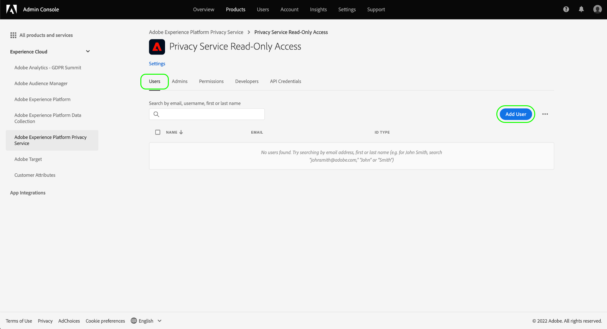
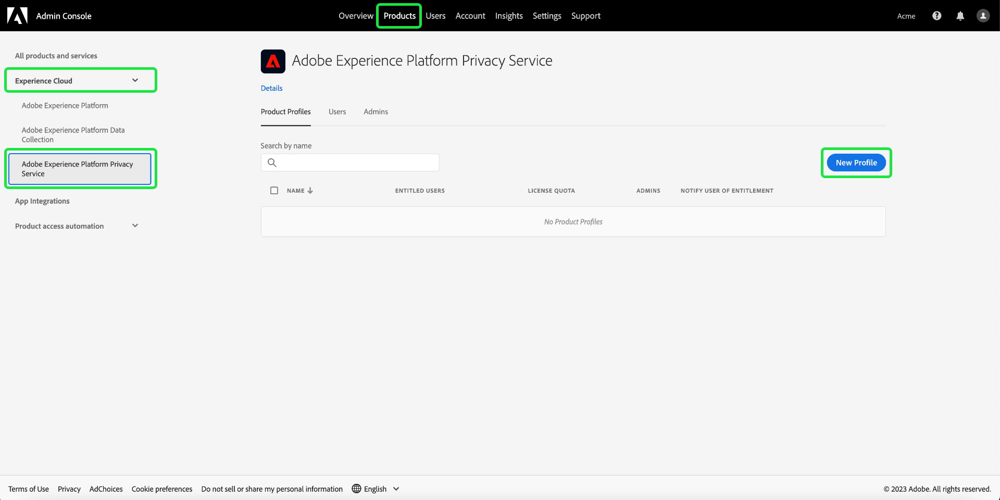

# Privacy Service에 대한 권한 관리

[Adobe Experience Platform Privacy Service](./home.md)에 대한 액세스는 Adobe Admin Console의 역할 기반의 세분화된 권한을 통해 제어됩니다. 사용자 그룹에 권한을 할당하는 제품 프로필을 만들어 Privacy Service [UI](./ui/overview.md) 및 [API](./api/overview.md) 기능에 액세스할 수 있는 사용자를 확인할 수 있습니다.

>[!NOTE]
>
>Privacy Service API에 대한 통합을 생성할 때 통합에 권한이 있는 기능 또는 작업을 확인하려면 기존 제품 프로필을 선택해야 합니다. 자세한 내용은 [Privacy Service API 시작하기](./api/getting-started.md)를 참조하십시오.

이 안내서는 Privacy Service에 대한 권한을 관리하는 방법을 보여 줍니다.

## 시작하기

Privacy Service에 대한 액세스 제어를 구성하려면 Adobe Experience Platform Privacy Service와 제품 통합이 있는 조직에 대한 관리자 권한이 있어야 합니다. 권한을 부여하거나 철회할 수 있는 최소 역할은 **제품 프로필 관리자**&#x200B;입니다. 권한을 관리할 수 있는 다른 관리자 역할은 **제품 관리자**(제품 내의 모든 프로필을 관리할 수 있음) 및 **시스템 관리자**(제한 없음)입니다. 자세한 내용은 Adobe 엔터프라이즈 관리 안내서의 [관리자 역할](https://helpx.adobe.com/enterprise/using/admin-roles.html)에 관한 기사를 참조하십시오.

이 안내서에서는 귀하가 제품 프로필과 같은 기본 Admin Console 개념과 개별 사용자 및 그룹에 제품 권한을 부여하는 방법에 익숙하다고 가정합니다. 자세한 내용은 [Admin Console 사용 안내서](https://helpx.adobe.com/enterprise/using/admin-console.html)를 참조하십시오.

## 사용 가능한 권한

다음 표에는 액세스 권한을 부여하는 특정 기능에 대한 설명과 함께 Privacy Service에 사용 가능한 권한이 요약되어 있습니다.

>[!NOTE]
>
>모든 Privacy Service 및 [!UICONTROL 판매 중지] 권한은 기능이 중복되지 않고 서로 구별됩니다. 이는 Privacy Service API가 동일하다고 간주되기 때문에 가능합니다.

| 카테고리 | 사용 권한 | 설명 |
| --- | --- | --- |
| [!UICONTROL Privacy Service 권한] | [!UICONTROL 개인정보 보호 읽기 권한] | 사용자가 세부 정보와 함께 기존 액세스 및 삭제 요청을 볼 수 있는지 여부를 결정합니다. |
| [!UICONTROL Privacy Service 권한] | [!UICONTROL 개인정보 보호 쓰기 권한] | 사용자가 새 액세스 및 삭제 요청을 생성할 수 있는지 여부를 결정합니다. |
| [!UICONTROL Privacy Service 권한] | [!UICONTROL 읽기(액세스) 콘텐츠 게재 권한] | Privacy Service에서 액세스 요청을 처리하면 고객 데이터가 포함된 ZIP 파일이 해당 고객에게 전송됩니다. 액세스 요청의 세부 정보를 조회할 때 이 권한은 사용자가 요청의 ZIP 파일에 대한 다운로드 링크에 액세스할 수 있는지 여부를 결정합니다. |
| [!UICONTROL 판매 중지 권한] | [!UICONTROL 읽기 권한 - 판매 중지] | 사용자가 세부 정보와 함께 기존 판매 중지 요청을 볼 수 있는지 여부를 결정합니다. |
| [!UICONTROL 판매 중지 권한] | [!UICONTROL 쓰기 권한 - 판매 중지] | 사용자가 새 판매 중지 요청을 생성할 수 있는지 여부를 결정합니다. |

{style="table-layout:auto"}

## 권한 관리 {#manage}

Privacy Service 권한을 관리하려면 [Admin Console](https://adminconsole.adobe.com/)에 로그인한 다음 상단 탐색 영역에서 **[!UICONTROL 제품]**&#x200B;을 선택합니다. 여기에서 **[!UICONTROL Adobe Experience Platform Privacy Service]**&#x200B;를 선택합니다.

### 제품 프로필 선택 또는 만들기

다음 화면에는 조직에서 Privacy Service에 사용할 수 있는 제품 프로필 목록이 표시됩니다. 제품 프로필이 없으면 **[!UICONTROL 새 프로필]**&#x200B;을 선택하여 새로 만듭니다. 조직에 서로 다른 액세스 수준이 필요한 여러 역할 또는 사용자 그룹이 있는 경우 각각에 대해 별도의 제품 프로필을 만들어야 합니다.

제품 프로필을 선택한 후 **[!UICONTROL 권한]** 탭을 사용하여 프로필에 대한 [권한 편집](#edit-permissions)을 시작하거나 **[!UICONTROL 사용자]** 탭을 선택하여 프로필에 [사용자 할당](#assign-users)을 시작할 수 있습니다.

### 프로필에 대한 권한 편집 {#edit-permissions}

**[!UICONTROL 권한]** 탭에서 표시된 권한 카테고리 중 하나를 선택하여 권한 편집 보기에 액세스합니다.

프로필에 대한 권한을 편집할 때 사용 가능한 권한은 왼쪽 열에 나열되고 프로필에 포함된 권한은 오른쪽 열에 나열됩니다. 두 열 사이에 이동하려면 나열된 권한을 선택합니다.

권한은 카테고리로 구성됩니다. 카테고리 간에 전환하려면 왼쪽 탐색 영역에서 원하는 카테고리를 선택합니다.

![다음 [!UICONTROL 판매 거부] 섹션 아래에 표시됩니다.](./images/permissions/switch-category.png)

구성 권한을 완료하면 **[!UICONTROL 저장]**&#x200B;을 선택합니다.

추가된 권한이 반영된 제품 프로필 보기가 다시 표시됩니다.

### 프로필에 사용자 할당 {#assign-users}

사용자를 제품 프로필에 할당하고 프로필의 구성된 권한을 부여하려면 **[!UICONTROL 사용자]** 탭을 선택한 다음 **[!UICONTROL 사용자 추가]**&#x200B;를 선택합니다.

제품 프로필에 대한 사용자 관리에 대한 자세한 내용은 [Admin Console 설명서](https://helpx.adobe.com/enterprise/using/manage-product-profiles.html)를 참조하십시오.

### 기존 API 자격 증명을 프로필로 마이그레이션 {#migrate-tech-accounts}

>[!NOTE]
>
>이 섹션은 Privacy Service 권한이 Adobe Admin Console에 통합되기 전에 생성된 기존 API 자격 증명에만 적용됩니다. 새 자격 증명의 경우 [Adobe Developer Console 프로젝트](https://developer.adobe.com/developer-console/docs/guides/projects/)를 통해 제품 프로필 및 해당 권한이 대신 할당됩니다.  자세한 내용은 Privacy Service API 시작 안내서의 [프로필에 제품 프로필 할당](./api/getting-started.md#product-profiles)을 참조하십시오.

이전에는 통합 및 권한을 위해 기술 계정에 제품 프로필이 필요하지 않았습니다. 그러나 Privacy Service 권한이 최근 개선되면서 이제 기존 API 자격 증명을 제품 프로필로 마이그레이션해야 합니다. 이 업데이트를 통해 기술 계정 소유자에게 세분화된 권한을 부여할 수 있습니다. 아래 나온 단계에 따라 Privacy Service에 대한 기술 계정 권한을 업데이트하십시오.

#### 기술 계정 권한 업데이트 {#update-tech-account-permissions}

기술 계정에 권한 세트를 할당하는 첫 번째 단계는 [Adobe Admin Console](https://adminconsole.adobe.com/)로 이동하여 Privacy Service에 대한 새 제품 프로필을 만드는 것입니다.

Admin Console UI의 탐색 모음에서 **제품**&#x200B;을 선택한 다음 왼쪽 사이드바에서 **[!UICONTROL Experience Cloud]** 및 **[!UICONTROL Adobe Experience Platform Privacy Service]**&#x200B;를 선택합니다. [!UICONTROL 제품 프로필] 탭이 표시됩니다. **새 프로필**&#x200B;을 선택하여 Privacy Service에 대한 새 제품 프로필을 만듭니다.

[!UICONTROL 새 제품 프로필 만들기] 대화 상자가 표시됩니다. 제품 프로필을 만드는 방법에 대한 전체 지침은 [프로필 생성을 위한 UI 안내서](../access-control/ui/create-profile.md)를 참조하십시오.

새 제품 프로필을 저장한 후에 [Adobe Developer Console](https://developer.adobe.com/console/home)로 이동하여 해당 제품 또는 해당 프로젝트에 로그인합니다. 상단 탐색 영역에서 **[!UICONTROL 프로젝트]**&#x200B;를 선택한 다음 프로젝트 카드를 선택합니다.

>[!NOTE]
>
>Developer Console 프로젝트 목록에 새 프로젝트가 표시될 때까지 캐시를 지우거나 잠시 기다려야 할 수 있습니다.

프로젝트에 로그인한 후 왼쪽 사이드바에서 **[!UICONTROL Privacy Service API]**&#x200B;통합을 선택합니다.

Privacy Service API 통합 대시보드가 표시됩니다. 이 대시보드에서 해당 프로젝트와 연결된 제품 프로필을 편집할 수 있습니다. **[!UICONTROL 제품 프로필 편집]**&#x200B;을 선택하여 프로세스를 시작합니다. [!UICONTROL API 구성] 대화 상자가 표시됩니다.

[!UICONTROL API 구성] 대화 상자에는 현재 서비스에 있는 사용 가능한 제품 프로필이 표시됩니다. 관리 콘솔에서 생성된 제품 프로필과 관련이 있습니다. 사용 가능한 제품 프로필 목록에서 관리 콘솔의 기술 계정에 대해 생성한 새 제품 프로필의 확인란을 선택합니다. 이렇게 하면 이 기술 계정이 선택한 제품 프로필의 권한과 자동으로 연결됩니다. **[!UICONTROL 구성된 API 저장]**&#x200B;을 선택하여 설정을 확인합니다.

>[!NOTE]
>
>기술 계정이 이미 제품 프로필과 연결된 경우 사용 가능한 제품 프로필 목록의 확인란 중 하나가 이미 선택되어 있습니다.

#### 설정이 적용되었는지 확인 {#confirm-applied-settings}

설정이 계정에 적용되었는지 확인합니다. [Admin Console](https://adminconsole.adobe.com/)로 돌아가서 새로 만든 제품 프로필로 이동합니다. 연결된 프로젝트 목록을 보려면 **[!UICONTROL API 자격 증명]** 탭을 선택합니다. 기술 계정에 제품 프로필을 할당한 Developer Console에서 사용된 프로젝트가 자격 증명 목록에 표시됩니다. 각 API 자격 증명의 이름은 끝에 임의로 생성된 숫자가 붙은 프로젝트 이름으로 구성됩니다. 자격 증명을 선택하여 [!UICONTROL 세부 정보] 패널을 엽니다.

[!UICONTROL 세부 정보] 패널에는 관련 기술 ID, API 키, 생성 날짜 및 마지막으로 수정된 날짜, 관련 Adobe 제품을 비롯한 API 자격 증명에 대한 정보가 포함되어 있습니다.

## 다음 단계

이 안내서에는 사용 가능한 Privacy Service 권한과 Admin Console을 통해 이를 관리하는 방법이 나와 있습니다.

제품 프로필을 설정한 후에 새 API 통합을 생성하는 방법에 대한 단계는 [=Privacy Service API의 시작 안내서](./api/getting-started.md)를 참조하십시오. 기타 Adobe Experience Platform 기능의 권한을 관리하는 방법에 대한 자세한 내용은 [액세스 제어 설명서](../access-control/home.md)를 참조하십시오.
