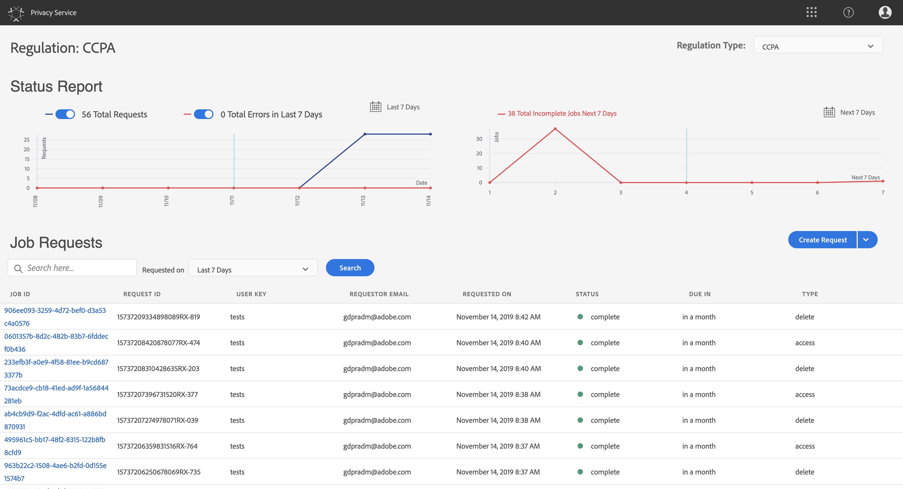

# Privacy Service UI에서 개인 정보 작업 관리 {#user-guide}

>[!CONTEXTUALHELP]
>id="platform_privacyConsole_requests_description"
>title="데이터 주체 개인 정보 보호 요청 적용"
>abstract="<h2>설명</h2>
Adobe Experience Platform Privacy Service을 사용하면 법적 개인 정보 보호 규정에 따라 개인 데이터에 액세스하거나 삭제하려는 고객을 대신하여 개인 정보 보호 요청을 만들고 관리할 수 있습니다.
"

이 문서에서는 [!DNL Privacy Service] 사용자 인터페이스.

>[!IMPORTANT]
>
>Privacy Service은 데이터 주체 및 소비자 권한 요청에 대해서만 사용됩니다. 데이터 정리 또는 유지 관리에 대한 다른 Privacy Service 사용은 지원되거나 허용되지 않습니다. Adobe은 적시에 그것들을 이행할 법적 의무가 있다. 따라서 Privacy Service에 대한 로드 테스트는 프로덕션 전용 환경이며, 유효한 개인 정보 보호 요청의 불필요한 백로그를 사용하므로 허용되지 않습니다.
>
>서비스 남용을 방지하기 위해 이제 하루 동안 하드 업로드 제한이 적용됩니다. 이 시스템을 악용한 사용자는 이 서비스에 대한 액세스 권한을 잃게 됩니다. 그런 다음 해당 Privacy Service과 함께 자신의 행동에 대해 논의하고 허용 가능한 사용 방법에 대해 논의할 예정입니다.

## 찾아보기 [!DNL Privacy Service] UI 대시보드

에 대한 대시보드 [!DNL Privacy Service] UI는 개인 정보 작업의 상태를 볼 수 있는 두 가지 위젯을 제공합니다. &quot;[!UICONTROL 상태 보고서]&quot; 및 &quot;[!UICONTROL 작업 요청]&quot;. 대시보드에는 표시된 작업에 대해 현재 선택된 규정도 표시됩니다.

### 규정 유형

[!DNL Privacy Service] 에서는 여러 개인 정보 보호 규정에 대한 작업 요청을 지원합니다. 다음 표에는 UI에 표시된 대로 지원되는 규정 및 해당 레이블이 나열되어 있습니다.

| UI 레이블 | 규정 |
| --- | --- |
| [!UICONTROL CCPA] | [!DNL California Consumer Privacy Act] |
| [!UICONTROL GDPR] | 유럽 연합 [!DNL General Data Protection Regulation] |
| [!UICONTROL PDPA_THA] | 태국 [!DNL Personal Data Protection Act] |
| [!UICONTROL LGPD_BRA] | 브라질 [!DNL Lei Geral de Proteção de Dados] |
| [!UICONTROL NZPA_NZL] | 뉴질랜드 [!DNL Privacy Act] |
| [!UICONTROL VCDPA_USA] | [!DNL Virginia Consumer Data Protection Act] |
| [!UICONTROL CPRA_USA] | [!DNL California Consumer Privacy Rights Act (CPRA)] |
| [!UICONTROL APA_AUS] | [!DNL Australia Privacy Act (Privacy Act)] |
| [!UICONTROL HIPAA_AUS] | [!DNL Health Insurance Portability and Accountability Act] |

{style="table-layout:auto"}

>[!NOTE]
>
>다음 사항에 대한 개요를 참조하십시오. [지원되는 개인 정보 보호 규정](../regulations/overview.md) 각 규정의 법적 문맥에 대한 자세한 정보.

각 규정 유형에 대한 작업은 별도로 추적됩니다. 규칙 유형 간을 전환하려면 **[!UICONTROL 규정 유형]** 드롭다운 메뉴를 선택하고 목록에서 원하는 규칙을 선택합니다.

규정 유형을 변경하면, 대시보드가 선택한 규칙에 적용되는 모든 작업, 필터, 위젯 및 작업 생성 대화 상자를 표시하도록 업데이트됩니다.

### 상태 보고서

상태 보고서 위젯의 왼쪽에 있는 그래프는 오류가 있는 다시 보고될 수 있는 작업에 대해 제출된 작업을 추적합니다. 오른쪽의 그래프는 30일 동안의 규정 준수 기간 끝에 가까운 작업을 추적합니다.

각 지표를 표시하거나 숨기려면 그래프 위에 있는 두 전환 단추 중 하나를 선택합니다.

마우스로 해당 데이터 포인트를 가리키면 그래프의 데이터 포인트와 연관된 정확한 작업 수를 볼 수 있습니다.

지정된 데이터 포인트에 대한 세부 정보를 보려면 해당 데이터 포인트를 선택하여 작업 요청 위젯에 연관된 작업을 표시합니다. 작업 목록 바로 위에 적용되는 필터를 확인하십시오.

>[!NOTE]
>
>작업 요청 위젯에 필터가 적용되면 **X** 필터 알약 그런 다음 작업 요청이 기본 추적 목록으로 반환됩니다.

### 작업 요청

작업 요청 위젯은 요청 유형, 현재 상태, 기한 및 요청자 이메일과 같은 세부 정보를 포함하여 조직에서 사용 가능한 모든 작업 요청을 나열합니다.

>[!NOTE]
>
>이전에 만든 작업의 데이터는 완료 날짜 후 30일 동안에만 액세스할 수 있습니다.

작업 요청 제목 아래의 검색 표시줄에 키워드를 입력하여 목록을 필터링할 수 있습니다. 입력하는 대로 목록이 자동으로 필터링되므로 검색어와 일치하는 값을 포함하는 요청을 표시할 수 있습니다. 를 사용할 수도 있습니다 **[!UICONTROL 요청 시간]** 드롭다운 메뉴를 사용하여 나열된 작업의 시간 범위를 선택합니다.

특정 작업 요청의 세부 정보를 보려면 목록에서 해당 요청의 작업 ID를 선택하여 **[!UICONTROL 작업 세부 사항]** 페이지.

이 대화 상자에는 각 항목에 대한 상태 정보가 포함되어 있습니다 [!DNL Experience Cloud] 전체 작업과 관련된 솔루션 및 현재 상태입니다. 모든 개인 정보 보호 작업이 비동기적이므로, 일부는 요청을 처리하는 데 다른 사람들보다 더 많은 시간이 필요하므로 페이지에는 각 솔루션의 최신 통신 날짜 및 시간(GMT)이 표시됩니다.

솔루션에서 추가 데이터를 제공한 경우 이 대화 상자에서 이 데이터를 볼 수 있습니다. 개별 제품 행을 선택하여 이 데이터를 볼 수 있습니다.

전체 작업 데이터를 CSV 파일로 다운로드하려면 다음을 선택합니다 **[!UICONTROL CSV로 내보내기]** 을 클릭합니다.

## 새 개인 정보 작업 요청 만들기 {#create-a-new-privacy-job-request}

>[!CONTEXTUALHELP]
>id="platform_privacyConsole_requests_instructions"
>title="지침"
>abstract="<ul><li>선택 <a href="https://experienceleague.adobe.com/docs/experience-platform/privacy/ui/overview.html#logging-in-from-experience-platform">요청</a> 왼쪽 탐색에서 개인 정보 URL을 연 다음 을 선택합니다 <b>요청 만들기</b>.</li><li>여기에서 요청 빌더를 사용하거나 데이터 주체의 JSON 파일을 업로드할 수 있습니다.</li><li>요청 빌더를 사용하는 경우 작업 유형(액세스 및/또는 삭제)을 선택한 다음 제공할 ID 유형(이메일, ECID 또는 AAID)을 선택하거나 사용자 지정 ID 네임스페이스를 입력합니다. 고객에 대한 적절한 ID 값을 입력하고 <b>만들기</b> 완료됨.</li><li>JSON 파일을 업로드하는 경우 요청 만들기 옆에 있는 화살표를 선택합니다. 옵션 목록에서 <b>JSON 업로드</b> 파일을 업로드합니다. 업로드할 JSON 파일이 없다면 를 선택합니다. <b>Adobe-GDPR-Request.json 다운로드</b> 을 눌러 채울 수 있는 템플릿을 다운로드합니다. JSON을 업로드하고 를 선택합니다 <b>만들기</b> 완료됨.</li><li>이 기능에 대한 자세한 내용은 <a href="https://experienceleague.adobe.com/docs/experience-platform/privacy/ui/user-guide.html?lang=ko">Privacy Service 사용 안내서</a> Experience League에서 확인하십시오.</li></ul>"

>[!NOTE]
>
>개인 정보 보호 작업 요청을 만들려면 데이터에 액세스하거나 삭제할 특정 고객에 대한 ID 정보를 제공해야 합니다. 다음 문서를 검토하십시오 [개인 정보 보호 요청에 대한 id 데이터](../identity-data.md) 이 섹션을 계속하기 전에

다음 [!DNL Privacy Service] UI는 새 작업 요청을 만드는 두 가지 방법을 제공합니다.

* [Request Builder 사용](#request-builder)
* [JSON 파일 업로드](#json)

이러한 각 방법을 사용하는 단계는 다음 섹션에 나와 있습니다.

### Request Builder 사용 {#request-builder}

요청 빌더를 사용하여 사용자 인터페이스에서 새 개인 정보 보호 작업 요청을 수동으로 만들 수 있습니다. 요청 빌더는 요청에서 사용자당 ID 유형만 갖도록 제한하므로 더 간단하고 작은 요청 세트에 가장 잘 사용됩니다. 복잡한 요청의 경우 다음을 수행하는 것이 좋습니다. [json 파일 업로드](#json) 을 가리키도록 업데이트하는 것이 좋습니다.

요청 빌더 사용을 시작하려면 다음을 선택합니다 **[!UICONTROL 요청 만들기]** 화면 오른쪽의 상태 보고서 위젯 아래에 표시됩니다.

다음 **[!UICONTROL 요청 만들기]** 대화 상자가 열리고 현재 선택한 규정 유형에 대한 개인 정보 작업 요청 제출에 사용할 수 있는 옵션이 표시됩니다.

 

을(를) 선택합니다 **[!UICONTROL 작업 유형]** 요청(&quot;삭제&quot; 또는 &quot;액세스&quot;)과 하나 이상의 사용 가능한 제품이 목록에서 나열됩니다.

 

아래 **[!UICONTROL 네임스페이스 유형]**&#x200B;로 전송하는 고객 ID에 적합한 네임스페이스 유형을 선택합니다 [!DNL Privacy Service].

 

표준 네임스페이스 유형을 사용하는 경우 드롭다운 메뉴(이메일, ECID 또는 AAID)에서 네임스페이스를 선택한 다음 오른쪽 텍스트 상자에 ID 값을 입력하고 키를 누릅니다 **\&lt;enter>** 를 추가하여 목록에 추가합니다.

 

사용자 지정 네임스페이스 유형을 사용할 때는 아래에 ID 값을 제공하기 전에 수동으로 네임스페이스에 입력해야 합니다.

 

완료되면 을 선택합니다 **[!UICONTROL 만들기]**.

 

대화 상자가 사라지고 새 작업(또는 작업)이 현재 처리 상태와 함께 작업 요청 위젯에 나열됩니다.

### JSON 파일 업로드 {#json}

처리 중인 각 데이터 주체에 대해 여러 ID 유형을 사용하는 요청과 같이 더 복잡한 요청을 만들 때 JSON 파일을 업로드하여 요청을 만들 수 있습니다.

옆에 있는 화살표를 선택합니다 **[!UICONTROL 요청 만들기]**&#x200B;를 반환합니다. 표시되는 옵션 목록에서 **[!UICONTROL JSON 업로드]**.

다음 **[!UICONTROL JSON 업로드]** JSON 파일을 에 끌어다 놓을 수 있는 창을 제공하는 대화 상자가 나타납니다.

 

업로드할 JSON 파일이 없다면 를 선택합니다. **[!UICONTROL Adobe-GDPR-Request.json 다운로드]** 템플릿을 다운로드하려면 데이터 주체에서 수집한 값에 따라 채울 수 있습니다.

 

컴퓨터에서 JSON 파일을 찾아 대화 상자 창으로 드래그합니다. 업로드가 성공적으로 수행되면 대화 상자에 파일 이름이 나타납니다. 필요에 따라 JSON 파일을 대화 상자로 드래그하여 놓아 계속 추가할 수 있습니다.

완료되면 을 선택합니다 **[!UICONTROL 만들기]**. 대화 상자가 사라지고 새 작업(또는 작업)이 현재 처리 상태와 함께 작업 요청 위젯에 나열됩니다.

### 다음 단계

이 문서를 읽은 후에는 [!DNL Privacy Service] 개인 정보 작업을 만들고, 작업 세부 사항을 보고, 처리 상태를 모니터링하고, 완료되면 결과를 다운로드하려면 UI를 사용하십시오.

를 사용하여 프로그래밍 방식으로 이러한 작업을 수행하는 방법에 대한 절차 [!DNL Privacy Service] API는 [API 안내서](../api/overview.md).
