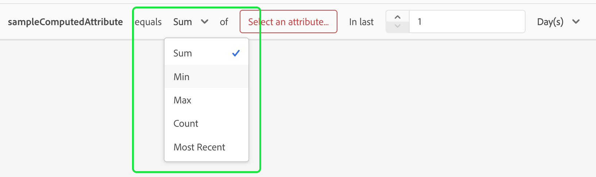

# 계산된 속성 UI 안내서

>[!NOTE]
>
>연산 속성에 액세스하려면 적절한 권한(**연산 속성 보기** 및 **연산 속성 관리**)이 있어야 합니다. 필요한 권한에 대한 자세한 내용은 [액세스 제어 문서](../../access-control/home.md)를 참조하십시오. 이러한 권한을 적용하는 방법에 대해 알아보려면 [권한 관리 안내서](../../access-control/ui/permissions.md)를 읽어 보십시오.

Adobe Experience Platform에서 계산된 속성은 이벤트 수준 데이터를 프로필 수준 속성으로 집계하는 데 사용되는 함수입니다. 이러한 함수는 세그먼테이션, 활성화 및 개인화에서 사용할 수 있도록 자동으로 계산됩니다.

이 문서에서는 Adobe Experience Platform UI를 사용하여 계산된 속성을 만들고 업데이트하는 방법에 대한 안내서를 제공합니다.

## 시작

이 UI 안내서를 사용하려면 [!DNL Experience Platform] 관리와 관련된 다양한 [!DNL Real-Time Customer Profiles] 서비스를 이해해야 합니다. 이 안내서를 읽거나 UI에서 작업하기 전에 다음 서비스에 대한 설명서를 검토하십시오.

- [[!DNL Real-Time Customer Profile]](../home.md): 여러 원본의 집계된 데이터를 기반으로 통합된 실시간 소비자 프로필을 제공합니다.
- [[!DNL Experience Data Model (XDM) System]](../../xdm/home.md): [!DNL Experience Platform]에서 고객 경험 데이터를 구성하는 표준화된 프레임워크입니다.

## 계산된 속성 보기 {#view}

Experience Platform UI의 왼쪽 탐색에서 **[!UICONTROL Profiles]**&#x200B;을(를) 선택하고 **[!UICONTROL Computed attributes]**&#x200B;을(를) 선택하여 조직에 사용할 수 있는 계산된 특성 목록을 확인합니다. 여기에는 계산된 속성의 이름, 설명, 마지막 평가 날짜 및 마지막 평가 상태에 대한 정보가 포함됩니다.

![섹션 [!UICONTROL Profile]과(와) 탭 [!UICONTROL Computed attributes]이(가) 강조 표시되어 사용자가 계산된 특성 검색 페이지에 액세스하는 방법을 보여 줍니다.](./images/ui/browse.png)

표시할 필드를 선택하려면 을 선택하여 표시할 필드를 추가하거나 제거할 수 있습니다.

| 필드 | 설명 |
| ----- | ----------- |
| [!UICONTROL Name] | 계산된 속성의 표시 이름입니다. |
| [!UICONTROL Description] | 계산된 속성에 대한 설명입니다. |
| [!UICONTROL Evaluation method] | 계산된 속성에 대한 평가 메서드입니다. 지금은 **일괄 처리**&#x200B;만 지원됩니다. |
| [!UICONTROL Last evaluated] | 이 타임스탬프는 마지막으로 성공한 평가 실행을 나타냅니다. 이 타임스탬프에서 **이전**&#x200B;에 발생한 이벤트만 마지막으로 성공한 평가에서 고려됩니다. |
| [!UICONTROL Last evaluation status] | 계산된 속성이 마지막 평가 실행에서 성공적으로 계산되었는지 여부를 나타내는 상태입니다. Possible values include **[!UICONTROL Success]** or **[!UICONTROL Failed]**. |
| [!UICONTROL Refresh frequency] | An indication on how frequently the computed attribute is expected to be refreshed. Possible values include hourly, daily, weekly, or monthly. |
| [!UICONTROL Fast refresh] | 이 연산 속성에 대해 빠른 새로 고침이 활성화되었는지 여부를 보여 주는 값입니다. 빠른 새로 고침을 활성화하면 계산된 속성을 주별, 격주 또는 월별 기준이 아닌 일별로 새로 고칠 수 있습니다. 이 값은 전환 확인 기간이 주 단위보다 긴 계산된 속성에만 적용할 수 있습니다. |
| [!UICONTROL Lifecycle status] | 계산된 속성의 현재 상태입니다. 가능한 상태는 세 가지가 있습니다. <ul><li>**[!UICONTROL Draft]:** 계산된 특성에 아직 스키마에 필드가 만들어지지 않았습니다&#x200B;**not**. 이 상태에서는 계산된 속성을 편집할 수 있습니다. </li><li>**[!UICONTROL Published]:** 계산된 특성에 스키마에 생성된 필드가 있으며 사용할 준비가 되었습니다. In this state, the computed attribute **cannot** be edited.</li><li>**[!UICONTROL Inactive]:** The computed attribute is disabled. For more information about the inactive status, please read the [FAQ page](./faq.md#inactive-status). </li> |
| [!UICONTROL Created] | 계산된 속성이 생성된 날짜와 시간을 보여 주는 타임스탬프입니다. |
| [!UICONTROL Last modified] | 계산된 속성이 마지막으로 수정된 날짜와 시간을 보여 주는 타임스탬프입니다. |

라이프사이클 상태에 따라 표시된 계산된 속성을 필터링할 수도 있습니다.  아이콘을 선택합니다.

You can now choose to filter the computed attributes by status ([!UICONTROL Draft], [!UICONTROL Published], and [!UICONTROL Inactive]).

![The options tht you can filter the computed attributes by are highlighted. These options include [!UICONTROL Draft], [!UICONTROL Published], and [!UICONTROL Inactive].](./images/ui/view-filters.png)

Additionally, you can select a computed attribute to see more detailed information about it. For more information on the computed attributes details page, please read the [view a computed attribute&#39;s details section](#view-details).

## 계산된 속성 만들기 {#create}

새 계산된 특성을 만들려면 **[!UICONTROL Create computed attribute]**&#x200B;을(를) 선택하여 새 계산된 특성 워크플로를 입력합니다.

![[!UICONTROL Create computed attributes] 단추가 강조 표시되어 사용자가 연산 속성 만들기 페이지에 도달하는 방법을 보여 줍니다.](./images/ui/create.png)

**[!UICONTROL Create computed attribute]** 페이지가 나타납니다. 이 페이지에서는 생성하려는 계산된 속성에 대한 기본 정보를 추가할 수 있습니다.

| 필드 | 설명 |
| ----- | ----------- |
| [!UICONTROL Display name] | 계산된 속성을 알 수 있는 이름입니다. You should keep this display name unique for each computed attribute. 가장 좋은 방법은 이 표시 이름에 계산된 속성과 관련된 식별자를 포함하는 것입니다. 예를 들어 &quot;지난 7일 동안의 신발 구매 금액 합계&quot;가 여기에 해당합니다. |
| [!UICONTROL Field name] | 다른 다운스트림 서비스에서 계산된 속성을 참조하는 데 사용되는 이름입니다. 이 이름은 표시 이름에서 자동으로 파생되며 camelCase로 작성됩니다. |
| [!UICONTROL Description] | 만들려는 계산된 속성에 대한 설명입니다. |

![The [!UICONTROL Basic information] section of the [!UICONTROL Create computed attribute] page is highlighted.](./images/ui/basic-information.png)

After adding the computed attribute details, you can start  defining your rules.

### Specify event filtering conditions

To create a rule, first select attributes from the **[!UICONTROL Events]** section to filter down events that you want to aggregate on. Currently, only non-array type event attributes are supported.

![The [!UICONTROL Events] section is highlighted.](./images/ui/events.png)

계산된 속성 정의에 사용할 속성을 선택한 후 이 값을 비교할 대상을 선택할 수 있습니다.

### 집계 함수 적용

이제 조건부 출력에서 필드에 함수를 적용할 수 있습니다. 먼저 집계 함수 유형을 선택합니다. 사용 가능한 옵션은 [!UICONTROL Sum], [!UICONTROL Min], [!UICONTROL Max], [!UICONTROL Count] 및 [!UICONTROL Most Recent]입니다. 이러한 함수에 대한 자세한 내용은 계산된 특성 개요의 [함수 섹션](./overview.md#functions)에서 찾을 수 있습니다.

함수를 선택한 후 집계할 필드를 선택할 수 있습니다. 선택할 적격 필드는 선택한 기능에 따라 다릅니다.

### 전환 확인 기간

집계 함수를 적용한 후에는 계산된 속성의 전환 확인 기간을 정의해야 합니다. 이 전환 확인 기간은 이벤트를 집계할 시간을 지정합니다. 이 전환 확인 기간은 시간, 일, 주 또는 월로 지정할 수 있습니다.

### 빠른 새로 고침 {#fast-refresh}

>[!CONTEXTUALHELP]
>id="platform_profile_computedAttributes_fastRefresh"
>title="빠른 새로 고침"
>abstract="빠른 새로 고침을 사용하면 속성을 최신 상태로 유지할 수 있습니다. 이 옵션을 활성화하면 더 긴 전환 기간 동안에도 계산된 속성을 매일 새로 고쳐 사용자 활동에 신속하게 대응할 수 있습니다. 이 값은 전환 확인 기간이 주 단위보다 긴 계산된 속성에만 적용할 수 있습니다."

집계 함수를 적용하는 동안 전환 확인 기간이 1주보다 큰 경우 빠른 새로 고침을 활성화할 수 있습니다.

![[!UICONTROL Fast Refresh] 확인란이 강조 표시되어 있습니다.](./images/ui/enable-fast-refresh.png)

빠른 새로 고침을 사용하면 속성을 최신 상태로 유지할 수 있습니다. 이 옵션을 활성화하면 더 긴 전환 확인 기간에도 계산된 속성을 매일 새로 고칠 수 있으므로 사용자 활동에 빠르게 반응할 수 있습니다.

빠른 새로 고침에 대한 자세한 내용은 계산된 특성 개요의 [빠른 새로 고침 섹션](./overview.md#fast-refresh)을 참조하십시오.

이러한 단계를 완료하면 이제 이 계산된 속성을 초안으로 저장하거나 즉시 게시하도록 선택할 수 있습니다.

![[!UICONTROL Save as draft] 및 [!UICONTROL Publish] 단추가 강조 표시되어 있습니다.](./images/ui/draft-or-publish.png)

## 계산된 속성의 세부 정보 보기 {#view-details}

To view the details of a computed attribute, select the computed attribute you want to see details about on the [!UICONTROL **Browse**] page.

The content of the page differs, depending if the computed attribute is **[!UICONTROL Published]** or in **[!UICONTROL Draft]**.

### 게시된 계산된 속성 {#published}

게시된 계산된 속성을 선택하면 계산된 속성 세부 사항 페이지가 나타납니다.

이 페이지에는 계산된 속성의 세부 정보 요약과 값 분포를 보여주는 그래프와 계산된 속성에 적합한 샘플 프로필이 표시됩니다.

>[!NOTE]
>
>값 분포는 샘플링 작업 시 프로필에 대한 속성 값 분포를 반영합니다. 샘플 프로필의 계산된 속성 값은 일부 샘플 프로필에 대해 가장 최근에 병합된 프로필 값을 반영합니다.

### Draft computed attribute {#draft}

초안 연산 속성을 선택하면 **[!UICONTROL Edit computed attributes]** 페이지가 나타납니다. [!UICONTROL Create computed attributes] 페이지와 마찬가지로 이 페이지에서는 초안을 업데이트하거나 게시하기 전에 계산된 속성의 기본 정보와 해당 정의를 편집할 수 있습니다.

![[!UICONTROL Edit computed attributes] 페이지가 표시됩니다.](./images/ui/edit.png)

## 계산된 속성 사용 {#usage}

>[!IMPORTANT]
>
>세그먼트 정의에서 **가장 최근** 함수와 함께 계산된 특성을 사용하는 경우 **반드시**&#x200B;계산된 특성 개체에 **값과 타임스탬프 값을 모두**&#x200B;포함해야 합니다.
>
>For example, if you&#39;re creating a segment definition that is looking for &quot;All profiles that have a valid email address&quot; where the email address field is populated by a computed attribute with the most recent function, you **must** include both the email address&#39; value exists **and** the email address&#39; timestamp exists.

계산된 특성을 만든 후에는 다른 다운스트림 서비스에서 **게시된** 계산된 특성을 사용할 수 있습니다. 계산된 속성은 프로필 결합 스키마에서 생성된 프로필 속성 필드이므로, 실시간 고객 프로필에 대해 계산된 속성 값을 조회하고 대상에서 사용하거나 대상에 대해 활성화하거나 Adobe Journey Optimizer의 여정에서 개인화에 사용할 수 있습니다.

>[!NOTE]
>
>계산된 특성 **은(는) 대상**&#x200B;컴포지션&#x200B;**에서 사용할 수 없습니다**.

## 다음 단계

연산 속성에 대한 자세한 내용은 [연산 속성 개요](./overview.md)를 참조하십시오. API를 사용하여 계산된 특성을 만들고 구성하는 방법에 대한 자세한 내용은 [계산된 특성 개발자 안내서](./api.md)를 참조하십시오.
