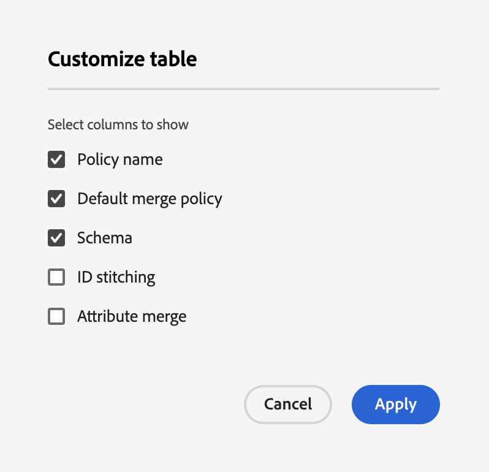
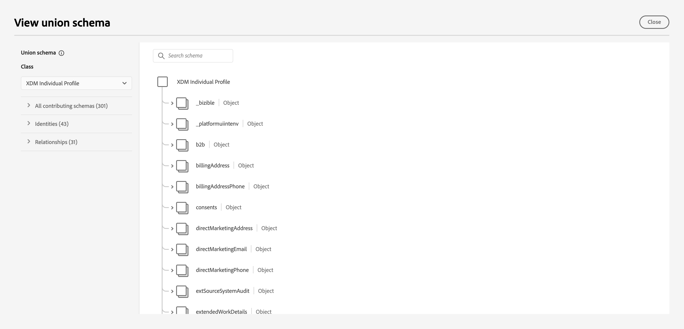

# 병합 정책 UI 안내서

Adobe Experience Platform을 사용하면 여러 소스에서 데이터 조각을 한데 모아 결합하여 각 개별 고객에 대한 전체 보기를 볼 수 있습니다. 이 데이터를 결합할 때 병합 정책은 [!DNL Platform] 는 을 사용하여 데이터의 우선 순위 지정 방법 및 통합 보기를 만들기 위해 결합할 데이터를 결정합니다.

RESTful API 또는 사용자 인터페이스를 사용하여 새 병합 정책을 만들고 기존 정책을 관리하며 조직의 기본 병합 정책을 설정할 수 있습니다. 이 안내서에서는 Adobe Experience Platform UI(사용자 인터페이스)를 사용하여 병합 정책 작업에 대한 단계별 지침을 제공합니다.

병합 정책과 Experience Platform 내에서 수행하는 역할에 대해 자세히 알아보려면 다음을 읽으십시오. [병합 정책 개요](overview.md).

## 시작하기

이 안내서를 사용하려면 몇 가지 중요한 사항에 대해 작업해야 합니다 [!DNL Experience Platform] 기능. 이 안내서를 따르기 전에 다음 서비스에 대한 설명서를 검토하십시오.

* [실시간 고객 프로필](../home.md): 여러 소스의 집계 데이터를 기반으로 통합 실시간 소비자 프로필을 제공합니다.
* [Adobe Experience Platform ID 서비스](../../identity-service/home.md): 수집되는 개별 데이터 소스의 ID를 브리징하여 실시간 고객 프로필 활성화 [!DNL Platform].
* [경험 데이터 모델(XDM)](../../xdm/home.md): 표준화된 프레임워크 [!DNL Platform] 고객 경험 데이터를 구성합니다.

## 병합 정책 보기 {#view-merge-policies}

다음 범위 내 [!DNL Experience Platform] UI에서, 을 선택하여 병합 정책 작업을 시작할 수 있습니다. **[!UICONTROL 프로필]** 왼쪽 탐색에서 을 선택한 다음 **[!UICONTROL 병합 정책]** 탭. 이 탭에는 조직에 대한 모든 기존 병합 정책 목록과 정책 이름, 병합 정책이 기본 병합 정책인지 여부 및 병합 정책과 관련된 스키마 클래스를 비롯한 각 병합 정책에 대한 세부 정보가 포함됩니다.

표시되는 세부 정보를 선택하거나 디스플레이에 열을 추가하려면 을 선택합니다. **[!UICONTROL 열 구성]** 열 이름을 클릭하여 보기에서 추가하거나 제거합니다.

## 병합 정책 만들기 {#create-a-merge-policy}

새 병합 정책을 만들려면 다음을 선택합니다. **[!UICONTROL 병합 정책 만들기]** 병합 정책 탭에서 새 병합 정책 워크플로를 입력합니다.

다음 **[!UICONTROL 새 병합 정책]** 워크플로우에서는 일련의 안내가 있는 단계를 통해 새 병합 정책에 대한 중요한 정보를 제공해야 합니다. 이러한 단계는 다음 섹션에 설명되어 있습니다.

## [!UICONTROL 구성] {#configure}

워크플로우의 첫 번째 단계에서는 기본 정보를 제공하여 병합 정책을 구성할 수 있습니다. 이 정보에는 다음이 포함됩니다.

* **[!UICONTROL 이름]**: 병합 정책의 이름은 설명적이면서도 간결해야 합니다.
* **[!UICONTROL 스키마 클래스]**: 병합 정책과 연결된 XDM 스키마 클래스. 이 병합 정책이 생성되는 스키마 클래스를 지정합니다. 조직은 스키마 클래스당 여러 병합 정책을 생성할 수 있습니다. 현재는 [!UICONTROL XDM 개별 프로필] 클래스는 UI에서 사용할 수 있습니다. 을 선택하여 스키마 클래스에 대한 유니온 스키마를 미리 볼 수 있습니다. **[!UICONTROL 유니온 스키마 보기]**. 자세한 내용은 다음 섹션 을 참조하십시오 [유니온 스키마 보기](#view-union-schema) 그 다음입니다.
* **[!UICONTROL ID 결합]**: 이 필드는 고객의 관련 ID를 결정하는 방법을 정의합니다. ID 결합에는 두 가지 가능한 값이 있으며, 선택하는 ID 결합 유형이 데이터에 어떤 영향을 미치는지 이해하는 것이 중요합니다. 자세한 내용은 다음을 참조하십시오 [병합 정책 개요](overview.md).
   * **[!UICONTROL 없음]**: ID 결합을 수행하지 않습니다.
   * **[!UICONTROL 비공개 그래프]**: 개인 ID 그래프를 기반으로 ID 결합을 수행합니다.
* **[!UICONTROL 기본 병합 정책]**: 이 병합 정책이 조직의 기본값이 되는지 여부를 선택할 수 있는 토글 버튼입니다. 선택기가 전환되면 조직의 기본 병합 정책을 변경할 것인지 확인하는 경고가 나타납니다. 다음을 참조하십시오. [병합 정책 개요](overview.md) 기본 병합 정책에 대해 자세히 알아보십시오.
  
* **[!UICONTROL Active-On-Edge 병합 정책]**: 이 병합 정책을 에지에서 활성화할지 여부를 선택할 수 있는 토글 버튼입니다. 모든 프로필 소비자가 에지에서 동일한 보기로 작업할 수 있도록 병합 정책을 에지에서 활성으로 표시할 수 있습니다. 대상이 Edge에서 활성화되려면(Edge Audience로 표시됨) Edge에서 활성으로 표시된 병합 정책에 연결되어 있어야 합니다. 대상이 다음과 같은 경우 **아님** edge에서 활성으로 표시된 병합 정책에 연결되어 있는 대상은 edge에서 활성으로 표시되지 않고 스트리밍 대상으로 표시됩니다. 또한 조직의 각 샌드박스는 **1** edge에서 활성 상태인 병합 정책입니다.

필수 필드가 완료되면 다음을 선택할 수 있습니다. **[!UICONTROL 다음]** 을 클릭하여 워크플로우를 계속합니다.

## [!UICONTROL 유니온 스키마 보기] {#view-union-schema}

병합 정책을 생성하거나 편집할 때 를 선택하여 선택한 스키마 클래스에 대한 결합 스키마를 볼 수 있습니다. **[!UICONTROL 유니온 스키마 보기]**.

이렇게 하면 [!UICONTROL 유니온 스키마 보기] 유니온 스키마와 연결된 모든 기여 스키마, ID 및 관계를 보여 주는 대화 상자. 대화 상자를 사용하여 다음에 액세스한 것과 같은 방식으로 유니온 스키마를 탐색할 수 있습니다. [!UICONTROL 유니온 스키마] 의 탭 [!UICONTROL 프로필] 플랫폼 UI의 섹션에 자세히 설명되어 있습니다.

에서 유니온 스키마와 상호 작용하는 방법을 포함하여 자세한 유니온 스키마 정보 [!UICONTROL 유니온 스키마] 탭 또는 [!UICONTROL 유니온 스키마 보기] 병합 정책 워크플로에 표시되는 대화 상자에서 다음을 방문하십시오. [유니온 스키마 UI 안내서](../ui/union-schema.md).

## [!UICONTROL 프로필 데이터 세트 선택] {#select-profile-datasets}

다음에서 **[!UICONTROL 프로필 데이터 세트 선택]** 화면에서 다음을 선택해야 합니다 **[!UICONTROL 병합 방법]** 병합 정책에 사용할 수 있습니다. 화면에 표시되는 총 횟수는 다음과 같습니다 [!UICONTROL 프로필 데이터 세트] 이전 화면에서 선택한 스키마 클래스와 관련된 조직의 .

선택한 병합 방법에 따라 모든 프로필 데이터 세트가 마지막으로 업데이트된 순서(타임스탬프 정렬)에 따라 병합되거나 병합 정책에 포함할 프로필 데이터 세트와 이를 병합할 순서(데이터 세트 우선 순위)를 선택해야 합니다.

병합 방법에 대한 자세한 내용은 [병합 정책 개요](overview.md).

### 타임스탬프 정렬됨 {#timestamp-ordered-profile}

선택 **[!UICONTROL 타임스탬프 정렬됨]** 병합 메서드는 가장 최근에 업데이트된 데이터 세트의 속성이 우선함을 의미합니다. 이는 모든 프로필 데이터 세트에 적용됩니다.

>[!NOTE]
>
>대괄호 안의 숫자 옆에 있는 **[!UICONTROL 프로필 데이터 세트]** (예: `(37)` 표시되는 이미지에서 포함할 총 프로필 데이터 세트 수를 보여 줍니다.

### 데이터 세트 우선 순위 {#dataset-precedence-profile}

선택 **[!UICONTROL 데이터 세트 우선 순위]** 병합 방법을 사용하려면 프로필 데이터 세트를 선택하고 수동으로 우선 순위를 지정해야 합니다. 나열된 각 데이터 세트에는 마지막으로 수집된 일괄 처리의 상태도 포함되거나 해당 데이터 세트에 일괄 처리가 수집되지 않았다는 알림이 표시됩니다.

데이터 세트 목록에서 병합 정책에 포함할 최대 50개의 데이터 세트를 선택할 수 있습니다.

>[!NOTE]
>
>대괄호 안의 숫자 옆에 있는 **[!UICONTROL 프로필 데이터 세트]** (예: `(37)` 표시된 이미지에서 선택 가능한 총 프로필 데이터 세트 수를 보여 줍니다.

데이터 세트를 선택하면 해당 데이터 세트가 **[!UICONTROL 데이터 세트 선택]** 섹션을 통해 데이터 세트를 끌어다 놓고 원하는 우선 순위에 따라 순서를 지정할 수 있습니다. 데이터 세트가 목록에서 조정되면 데이터 세트 옆에 있는 서수(1, 2, 3 등)가 업데이트되어 우선 순위(1이 가장 높은 우선 순위를 부여받고 2가 그 이후에)가 표시됩니다.

데이터 세트를 선택하면 **[!UICONTROL 유니온 스키마]** 섹션: 각 데이터 세트가 데이터를 기여하는 유니온 스키마의 필드를 보여줍니다. UI의 시각화와 상호 작용하는 방법을 포함하여 결합 스키마에 대한 자세한 내용은 다음을 참조하십시오. [유니온 스키마 UI 안내서](../ui/union-schema.md)

## [!UICONTROL ExperienceEvent 데이터 세트 선택] {#select-experienceevent-datasets}

워크플로우의 다음 단계에서는 ExperienceEvent 데이터 세트를 선택해야 합니다. 이 화면은에서 선택한 병합 방법의 영향을 받습니다. [[!UICONTROL 프로필 데이터 세트 선택]](#select-profile-datasets) 화면.

### 타임스탬프 정렬됨 {#timestamp-ordered-experienceevent}

선택한 경우 **[!UICONTROL 타임스탬프 정렬됨]** 프로필 데이터 세트에 대한 병합 방법으로, 가장 최근에 업데이트된 ExperienceEvent 데이터 세트의 속성이 여기에서도 우선합니다.

>[!NOTE]
>
>대괄호 안의 숫자 옆에 있는 **[!UICONTROL ExperienceEvent 데이터 세트]** (예: `(20)` 표시된 그림에서 )는 병합 정책 구성 화면에서 선택한 스키마 클래스와 관련하여 조직에서 만든 총 ExperienceEvent 데이터 세트 수를 보여줍니다.

### 데이터 세트 우선 순위 {#dataset-precedence-experienceevent}

선택한 경우 **[!UICONTROL 데이터 세트 우선 순위]** 프로필 데이터 세트에 대한 병합 방법으로, 포함할 ExperienceEvent 데이터 세트를 선택해야 합니다. 데이터 세트 목록에서 최대 50개의 ExperienceEvent 데이터 세트를 선택할 수 있습니다.

>[!NOTE]
>
>대괄호 안의 숫자 옆에 있는 **[!UICONTROL ExperienceEvent 데이터 세트]** (예: `(20)` 표시된 그림에서 )는 병합 정책 구성 화면에서 선택한 스키마 클래스와 관련하여 조직에서 만든 총 ExperienceEvent 데이터 세트 수를 보여줍니다.

데이터 세트를 선택하면 [!UICONTROL 데이터 세트 선택] 섹션.

ExperienceEvent 데이터 세트는 수동으로 정렬할 수 없습니다. 대신 ExperienceEvent 데이터 세트의 속성이 동일한 프로필 조각에 속하는 경우 프로필 데이터 세트에 추가됩니다.

프로필 데이터 세트를 선택하는 것과 마찬가지로 ExperienceEvent 데이터 세트를 선택하면 **[!UICONTROL 유니온 스키마]** 섹션: 각 데이터 세트가 데이터를 기여하는 유니온 스키마의 필드를 보여줍니다. UI의 시각화와 상호 작용하는 방법을 포함하여 결합 스키마에 대한 자세한 내용은 다음을 참조하십시오. [유니온 스키마 UI 안내서](../ui/union-schema.md)

## [!UICONTROL 검토] {#review}

워크플로우의 마지막 단계는 병합 정책을 검토하는 것입니다. 다음 **[!UICONTROL 리뷰]** 화면에는 선택한 ID 결합 방법, 선택한 병합 방법 및 포함된 데이터 세트를 포함하여 병합 정책에 대한 정보가 표시됩니다. 포함된 모든 Profile 또는 ExperienceEvent 데이터 세트를 보려면 데이터 세트 수를 선택하여 드롭다운 목록을 확장합니다.

또한 검토 화면에는 다음 항목이 포함됩니다. **[!UICONTROL 데이터 미리 보기]** 병합 정책을 사용하는 샘플 프로필 레코드를 보여 주는 표입니다. 이를 통해 병합 정책을 저장하기 전에 고객 프로필의 모양을 미리 볼 수 있습니다.

선택하기 전에 병합 정책 구성을 검토하고 데이터를 주의 깊게 미리 확인하십시오. **[!UICONTROL 완료]** 을 클릭하여 만들기 워크플로를 완료합니다.

### 타임스탬프 정렬됨 {#timestamp-ordered-review}

선택한 경우 **[!UICONTROL 타임스탬프 정렬됨]** 병합 정책에 대한 병합 방법으로, 프로필 데이터 세트 목록에는 스키마 클래스와 관련하여 조직에서 만든 모든 데이터 세트가 타임스탬프 순서로 포함됩니다. ExperienceEvent 데이터 세트 목록에는 조직에서 선택한 스키마 클래스에 대해 만든 모든 데이터 세트가 포함되어 있으며 프로필 데이터 세트에 추가됩니다.

다음 **[!UICONTROL 데이터 미리 보기]** 표는 데이터 세트의 타임스탬프 순서를 기반으로 하는 샘플 프로필 레코드를 보여 줍니다. 이를 통해 병합 정책을 저장하기 전에 고객 프로필의 모양을 미리 볼 수 있습니다.

### 데이터 세트 우선 순위 {#dataset-precedence-review}

선택한 경우 **[!UICONTROL 데이터 세트 우선 순위]** 병합 정책에 대한 병합 방법으로 Profile 및 ExperienceEvent 데이터 세트 목록에는 각각 생성 워크플로 중에 선택한 Profile 및 ExperienceEvent 데이터 세트만 포함됩니다. 프로필 데이터 세트의 순서는 작성 중에 지정한 우선 순위와 일치해야 합니다. 그렇지 않으면 [!UICONTROL 뒤로] 단추를 클릭하여 이전 워크플로 단계로 돌아가서 우선 순위를 조정합니다.

다음 **[!UICONTROL 데이터 미리 보기]** 표는 선택한 데이터 세트를 사용하는 샘플 프로필 레코드를 보여 줍니다. 이를 통해 병합 정책을 저장하기 전에 고객 프로필의 모양을 미리 볼 수 있습니다.

### 업데이트된 병합 정책 목록 {#updated-list}

새 병합 정책을 만드는 워크플로를 완료하면 (으)로 돌아갑니다. **[!UICONTROL 병합 정책]** 탭. 이제 조직의 병합 정책 목록에 방금 만든 병합 정책이 포함됩니다.

## 병합 정책 편집

다음에서 [!UICONTROL 병합 정책] 탭에서는에 대해 생성된 기존 병합 정책을 수정할 수 있습니다. [!DNL XDM Individual Profile] 클래스를 만드는 데 사용할 수 있습니다. **[!UICONTROL 정책 이름]** 편집할 병합 정책에 대해 설명합니다.

다음의 경우 **[!UICONTROL 병합 정책 편집]** 화면이 나타나면 이름 및 을 변경할 수 있습니다 [!UICONTROL ID 결합] 이 정책이 조직의 기본 병합 정책인지 여부를 변경할 수 있습니다.

선택 **[!UICONTROL 다음]** 병합 정책 워크플로우를 계속 진행하여 병합 정책에 포함된 병합 방법 및 데이터 세트를 업데이트합니다.

필요한 변경 작업을 수행한 후 병합 정책을 검토하고 를 선택합니다 **[!UICONTROL 완료]** 변경 사항을 저장하고 [!UICONTROL 병합 정책] 탭.

>[!WARNING]
>
>병합 정책을 변경하면 데이터 충돌이 해결되는 방식이 변경되므로 세그먼테이션 및 프로필 결과에 영향을 줄 수 있습니다. 병합 정책에 대한 변경 사항을 저장하기 전에 주의 깊게 검토하십시오.

## 데이터 거버넌스 정책 위반

병합 정책을 만들거나 업데이트할 때, 병합 정책이 조직에서 정의한 데이터 사용 정책을 위반하는지 확인하기 위해 검사를 수행합니다. 데이터 사용 정책은 Adobe Experience Platform 데이터 거버넌스의 일부이며 특정 항목에서 수행하도록 허용하거나 제한하는 마케팅 작업 종류를 설명하는 규칙입니다 [!DNL Platform] 데이터. 예를 들어, 병합 정책을 사용하여 서드파티 대상으로 활성화된 대상을 만들고 조직에 특정 데이터를 서드파티로 내보낼 수 없는 데이터 사용 정책이 있는 경우 **[!UICONTROL 데이터 거버넌스 정책 위반이 감지됨]** 병합 정책을 저장하는 동안 알림이 표시됩니다.

이 알림에는 위반된 데이터 사용 정책 목록이 포함되어 있으며 목록에서 정책을 선택하여 위반 세부 정보를 볼 수 있습니다. 위반한 정책을 선택하면 **[!UICONTROL 데이터 계보]** 탭은 위반 이유와 영향을 받는 활성화를 제공하며, 각 활성화는 데이터 사용 정책이 어떻게 위반되었는지 자세히 설명합니다.

Adobe Experience Platform 내에서 데이터 거버넌스를 수행하는 방법에 대한 자세한 내용은 [데이터 거버넌스 개요](../../data-governance/home.md).

## 다음 단계

조직에 대한 병합 정책을 만들고 구성했으므로 이를 사용하여 플랫폼 내에서 고객 프로필 보기를 조정하고 프로필 데이터에서 대상을 만들 수 있습니다. 다음을 참조하십시오. [세그먼테이션 개요](../../segmentation/home.md) 을(를) 사용하여 대상자를 만들고 작업하는 방법에 대한 자세한 내용은 [!DNL Experience Platform] UI 및 API.
