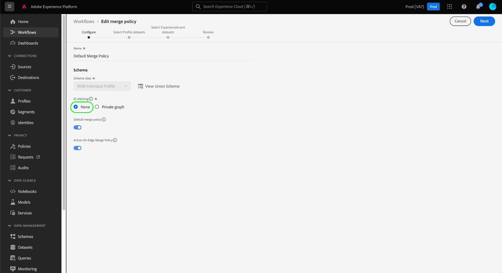

# 에서 개인 정보 보호 요청 처리 중 [!DNL Real-Time Customer Profile]

Adobe Experience Platform [!DNL Privacy Service] 는 GDPR(일반 데이터 보호 규정) 및 과 같은 개인 정보 보호 규정에 명시된 대로 개인 데이터에 액세스하거나, 판매를 거부하거나, 삭제하도록 고객 요청을 처리합니다. [!DNL California Consumer Privacy Act] (CCPA).

이 문서에서는 의 개인 정보 보호 요청 처리와 관련된 필수 개념을 다룹니다. [!DNL Real-Time Customer Profile] Adobe Experience Platform 내.

>[!NOTE]
>
>이 안내서에서는 Experience Platform의 프로필 데이터 저장소에 대해 개인 정보 보호 요청을 하는 방법만 다룹니다. Platform 데이터 레이크에 대한 개인 정보 보호 요청도 수행할 계획이라면 의 안내서를 참조하십시오 [데이터 레이크에서 개인 정보 보호 요청 처리](../catalog/privacy.md) 이 튜토리얼 외에.
>
>다른 Adobe Experience Cloud 애플리케이션에 대한 개인 정보 보호 요청을 하는 방법에 대한 단계는 [Privacy Service 설명서](../privacy-service/experience-cloud-apps.md).

## 시작하기

이 안내서에서는 다음 사항을 잘 이해하고 있어야 합니다 [!DNL Platform] 구성 요소:

* [[!DNL Privacy Service]](../privacy-service/home.md): Adobe Experience Cloud 애플리케이션 전반에 걸친 개인 데이터 액세스, 판매 중지 또는 삭제에 대한 고객 요청을 관리합니다.
* [[!DNL Identity Service]](../identity-service/home.md): 디바이스와 시스템 간에 ID를 연결하여 고객 경험 데이터의 단편화로 인해 발생하는 근본적인 문제를 해결합니다.
* [[!DNL Real-Time Customer Profile]](home.md): 여러 소스의 집계 데이터를 기반으로 통합 실시간 소비자 프로필을 제공합니다.

## ID 네임스페이스 이해 {#namespaces}

Adobe Experience Platform [!DNL Identity Service] 시스템 및 장치 간에 고객 id 데이터를 연결합니다. [!DNL Identity Service] 사용 **id 네임스페이스** ID 값을 원래 시스템에 연결하여 컨텍스트를 제공합니다. 네임스페이스는 이메일 주소(&quot;이메일&quot;)와 같은 일반적인 개념을 나타내거나 Adobe Advertising Cloud ID(&quot;AdCloud&quot;) 또는 Adobe Target ID(&quot;TNTID&quot;)와 같은 특정 애플리케이션과 ID를 연결할 수 있습니다.

ID 서비스는 전역 정의(표준) 및 사용자 정의(사용자 정의) ID 네임스페이스 저장소를 유지 관리합니다. 표준 네임스페이스는 모든 조직에서 사용할 수 있으며(예: &quot;이메일&quot; 및 &quot;ECID&quot;), 조직에서는 특정 요구 사항에 맞게 사용자 정의 네임스페이스를 만들 수도 있습니다.

의 ID 네임스페이스에 대한 자세한 내용 [!DNL Experience Platform], 다음을 참조하십시오. [id 네임스페이스 개요](../identity-service/namespaces.md).

## 요청 제출 {#submit}

아래 섹션에서는 다음에 대한 개인 정보 보호 요청을 하는 방법에 대해 간략하게 설명합니다. [!DNL Real-Time Customer Profile] 사용 [!DNL Privacy Service] API 또는 UI. 이 섹션을 읽기 전에 다음을 검토하는 것이 좋습니다. [PRIVACY SERVICE API](../privacy-service/api/getting-started.md) 또는 [PRIVACY SERVICE UI](../privacy-service/ui/overview.md) 요청 페이로드에서 제출된 사용자 id 데이터를 적절히 포맷하는 방법을 포함하여 개인 정보 보호 작업을 제출하는 방법에 대한 전체 단계에 대한 설명서입니다.

>[!IMPORTANT]
>
>Privacy Service은 만 처리할 수 있습니다. [!DNL Profile] id 결합을 수행하지 않는 병합 정책을 사용하는 데이터. 의 섹션을 참조하십시오. [병합 정책 제한 사항](#merge-policy-limitations) 추가 정보.
>
>개인 정보 보호 요청을 완료하는 데 걸릴 수 있는 시간입니다. **할 수 없음** 보장됩니다. 에 변경 사항이 발생하는 경우 [!DNL Profile] 요청이 아직 처리되는 동안에는 해당 레코드가 처리되는지 여부도 보장되지 않습니다.

### API 사용

API에서 작업 요청을 만들 때 내에 제공된 모든 ID `userIDs` 은(는) 다음을 사용해야 합니다. `namespace` 및 `type`. 유효 [id 네임스페이스](#namespaces) 인식한 사람 [!DNL Identity Service] 다음에 대한 을(를) 제공해야 합니다. `namespace` 값, 반면에 `type` 은(는) 다음 중 하나여야 합니다. `standard` 또는 `unregistered` (표준 및 사용자 정의 네임스페이스의 경우 각각).

>[!NOTE]
>
>ID 그래프 및 프로필 조각이 Platform 데이터 세트에서 배포되는 방법에 따라 각 고객에 대해 두 개 이상의 ID를 제공해야 할 수 있습니다. 다음 섹션 보기 [프로필 조각](#fragments) 추가 정보.

또한 `include` 요청 페이로드의 배열에는 요청이 수행되는 다양한 데이터 저장소에 대한 제품 값이 포함되어야 합니다. ID와 연결된 프로필 데이터를 삭제하려면 배열에 값을 포함해야 합니다 `ProfileService`. 고객의 ID 그래프 연결을 삭제하려면 배열에 값을 포함해야 합니다 `identity`.

>[!NOTE]
>
>의 섹션을 참조하십시오. [프로필 요청 및 id 요청](#profile-v-identity) 사용의 효과에 대한 자세한 내용은 이 문서의 뒷부분에 설명되어 있습니다 `ProfileService` 및 `identity` 다음 범위 내 `include` 배열입니다.

다음 요청은 의 단일 고객 데이터에 대한 새 개인 정보 보호 작업을 생성합니다 [!DNL Profile] 저장. 에서 고객을 위한 두 가지 ID 값이 제공됩니다. `userIDs` 배열, 표준을 사용하는 배열 `Email` id 네임스페이스 및 사용자 지정 을 사용하는 기타 네임스페이스 `Customer_ID` 네임스페이스입니다. 또한 다음에 대한 제품 값도 포함됩니다. [!DNL Profile] (`ProfileService`)에 있는 `include` 배열:

**요청**

```shell
curl -X POST \
  https://platform.adobe.io/data/core/privacy/jobs \
  -H 'Authorization: Bearer {ACCESS_TOKEN}' \
  -H 'x-api-key: {API_KEY}' \
  -H 'x-gw-ims-org-id: {ORG_ID}' \
  -H 'Content-Type: application/json' \
  -d '{
    "companyContexts": [
      {
        "namespace": "imsOrgID",
        "value": "{ORG_ID}"
      }
    ],
    "users": [
      {
        "key": "user12345",
        "action": ["access","delete"],
        "userIDs": [
          {
            "namespace": "Email",
            "value": "ajones@acme.com",
            "type": "standard"
          },
          {
            "namespace": "Customer_ID",
            "value": "12345678",
            "type": "unregistered"
          }
        ]
      }
    ],
    "include": ["ProfileService","identity"],
    "expandIds": false,
    "priority": "normal",
    "regulation": "ccpa"
}'
```

>[!IMPORTANT]
>
>Platform은 모든 개인 정보 보호 요청을 처리합니다. [샌드박스](../sandboxes/home.md) 조직에 속해 있어야 합니다. 그 결과 `x-sandbox-name` 요청에 포함된 헤더는 시스템에서 무시됩니다.

**제품 응답**

프로필 서비스의 경우 개인정보 보호 작업이 완료되면 요청된 사용자 ID에 대한 정보와 함께 JSON 형식으로 응답이 반환됩니다.

```json
{
    "privacyResponse": {
        "jobId": "7467850f-9698-11ed-8635-355435552164",
        "response": [
            {
                "sandbox": "prod",
                "mergePolicyId": "none",
                "result": {
                    "person": {
                        "gender": "female"           
                    },
                    "personalEmail": {
                        "address": "ajones@acme.com",
                    },
                    "identityMap": {
                        "crmid": [
                            {
                                "id": "5b7db37a-bc7a-46a2-a63e-2cfe7e1cc068"
                            }
                        ]
                    }
                }
            },
            {
                "sandbox": "prod",
                "mergePolicyId": "none",
                "result": {
                    "person": {
                        "gender": "male"
                    },
                    "id": 12345678,
                    "identityMap": {
                        "crmid": [
                            {
                                "id": "e9d439f2-f5e4-4790-ad67-b13dbd89d52e"
                            }
                        ]
                    }
                }
            }
        ]
    }
}
```

### UI 사용

UI에서 작업 요청을 만들 때 다음을 선택해야 합니다. **[!UICONTROL AEP 데이터 레이크]** 및/또는 **[!UICONTROL 프로필]** 아래에 **[!UICONTROL 제품]** 데이터 레이크 또는 [!DNL Real-Time Customer Profile], 각각


## 개인 정보 보호 요청의 프로필 조각 {#fragments}

다음에서 [!DNL Profile] 데이터 저장소인 개별 고객에 대한 개인 데이터는 종종 id 그래프를 통해 사용자와 연결되는 여러 프로필 조각으로 구성됩니다. 에 개인 정보 보호 요청을 할 때 [!DNL Profile] 저장에서 요청은 전체 프로필이 아닌 프로필 조각 수준에서만 처리됩니다.

예를 들어 고객 속성 데이터를 세 개의 개별 데이터 세트에 저장하고, 서로 다른 식별자를 사용하여 해당 데이터를 개별 고객과 연결하는 상황을 생각해 보겠습니다.

| 데이터 세트 이름 | 기본 ID 필드 | 저장된 속성 |
| --- | --- | --- |
| 데이터 세트 1 | `customer_id` | `address` |
| 데이터 세트 2 | `email_id` | `firstName`, `lastName` |
| 데이터 세트 3 | `email_id` | `mlScore` |

데이터 세트 중 하나에서 `customer_id` 를 기본 식별자로 사용하는 반면 다른 두 개는 를 사용합니다 `email_id`. 을 사용하여 개인 정보 보호 요청(액세스 또는 삭제)을 전송하려는 경우 `email_id` 를 사용자 ID 값으로 `firstName`, `lastName`, 및 `mlScore` 속성은 처리되는 반면 `address` 에는 영향을 주지 않습니다.

개인 정보 보호 요청이 모든 관련 고객 속성을 처리하도록 하려면, 해당 속성이 저장될 수 있는 모든 적용 가능한 데이터 세트에 대한 기본 ID 값(고객당 최대 9개의 ID)을 제공해야 합니다. 에서 ID 필드에 대한 섹션을 참조하십시오. [스키마 컴포지션 기본 사항](../xdm/schema/composition.md#identity) 를 참조하십시오.

## 삭제 요청 처리 {#delete}

날짜 [!DNL Experience Platform] 에서 삭제 요청을 수신합니다. [!DNL Privacy Service], [!DNL Platform] (으)로 확인 보내기 [!DNL Privacy Service] 요청을 수신하고 영향을 받는 데이터를 삭제하도록 표시했는지 여부. 그런 다음 개인 정보 보호 작업이 완료되면 레코드가 제거됩니다.

>[!IMPORTANT]
>
>개인 정보 삭제 요청은 즉시 발생하지 않으며, 관련된 서비스 및 지리적 위치와 같은 기타 영향 요소에 따라 달라질 수 있습니다. 개인 정보 보호 작업 완료 기간은 15일에서 45일 사이일 수 있지만 보장되지는 않습니다.

ID 서비스도 포함했는지 여부에 따라 다름(`identity`) 및 데이터 레이크(`aepDataLake`)을 프로필 개인정보 보호 요청에 있는 제품으로 사용(`ProfileService`)에서 프로필과 관련된 다양한 데이터 세트가 잠재적으로 다른 시간에 시스템에서 제거됩니다.

| 포함된 제품 | 효과 |
| --- | --- |
| `ProfileService` 전용 | Platform에서 삭제 요청이 수신되었다는 확인을 전송하는 즉시 프로필이 즉시 삭제됩니다. 그러나 프로필의 ID 그래프는 여전히 남아 있으며 동일한 ID를 가진 새 데이터가 수집되면 프로필을 다시 구성할 수 있습니다. 프로필과 연결된 데이터도 데이터 레이크에 유지됩니다. |
| `ProfileService` 및 `identity` | Platform에서 삭제 요청이 수신되었다는 확인을 전송하는 즉시 프로필 및 관련 ID 그래프가 즉시 삭제됩니다. 프로필과 연결된 데이터는 데이터 레이크에 유지됩니다. |
| `ProfileService` 및 `aepDataLake` | Platform에서 삭제 요청이 수신되었다는 확인을 전송하는 즉시 프로필이 즉시 삭제됩니다. 그러나 프로필의 ID 그래프는 여전히 남아 있으며 동일한 ID를 가진 새 데이터가 수집되면 프로필을 다시 구성할 수 있습니다.<br><br>데이터 레이크 제품이 요청을 받고 현재 처리 중이라는 응답을 하는 경우 프로필과 연관된 데이터가 일시 삭제되므로 다른 사용자도 해당 데이터에 액세스할 수 없습니다 [!DNL Platform] 서비스. 작업이 완료되면 데이터가 데이터 레이크에서 완전히 제거됩니다. |
| `ProfileService`, `identity`, 및 `aepDataLake` | Platform에서 삭제 요청이 수신되었다는 확인을 전송하는 즉시 프로필 및 관련 ID 그래프가 즉시 삭제됩니다.<br><br>데이터 레이크 제품이 요청을 받고 현재 처리 중이라는 응답을 하는 경우 프로필과 연관된 데이터가 일시 삭제되므로 다른 사용자도 해당 데이터에 액세스할 수 없습니다 [!DNL Platform] 서비스. 작업이 완료되면 데이터가 데이터 레이크에서 완전히 제거됩니다. |

다음을 참조하십시오. [[!DNL Privacy Service] 설명서](../privacy-service/home.md#monitor) 작업 상태 추적에 대한 자세한 내용을 참조하십시오.

### 프로필 요청 대 ID 요청 {#profile-v-identity}

프로필( )에 대해 삭제 요청이 이루어진 경우`ProfileService`) ( ID 서비스 는 아님)`identity`) 결과 작업은 고객(또는 고객 집합)에 대해 수집된 속성 데이터를 제거하지만 id 그래프에 설정된 연관은 제거하지 않습니다.

예를 들어 고객의 `email_id` 및 `customer_id` 는 해당 ID에 저장된 모든 속성 데이터를 제거합니다. 그러나 이후에 동일한 방법으로 수집된 모든 데이터 `customer_id` 는 여전히 적절한 와 연결됩니다. `email_id`: 연결이 여전히 존재함.

지정된 고객에 대한 프로필 및 모든 ID 연결을 제거하려면 삭제 요청에 Profile 및 Identity Service 를 대상 제품으로 포함해야 합니다.

### 병합 정책 제한 사항 {#merge-policy-limitations}

Privacy Service은 만 처리할 수 있습니다. [!DNL Profile] id 결합을 수행하지 않는 병합 정책을 사용하는 데이터. UI를 사용하여 개인 정보 보호 요청이 처리되고 있는지 확인하는 경우 **[!DNL None]** as its [!UICONTROL ID 결합] 유형. 즉, 다음과 같은 경우에는 병합 정책을 사용할 수 없습니다. [!UICONTROL ID 결합] 이(가) (으)로 설정됨 [!UICONTROL 비공개 그래프].
>>

>
## 다음 단계

이 문서를 읽으면에서 개인 정보 보호 요청 처리와 관련된 중요한 개념에 대해 소개합니다 [!DNL Experience Platform]. ID 데이터를 관리하고 개인 정보 보호 작업을 만드는 방법에 대한 이해를 심화하려면 이 안내서 전반에 걸쳐 제공된 설명서를 계속 읽으십시오.

의 개인 정보 보호 요청 처리에 대한 자세한 내용 [!DNL Platform] 에서 사용하지 않는 리소스 [!DNL Profile], 다음에 대한 문서 참조 [데이터 레이크에서 개인 정보 보호 요청 처리](../catalog/privacy.md).
