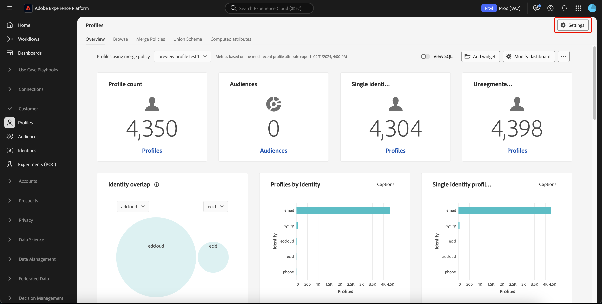

# 익명 프로필 데이터 만료

Adobe Experience Platform에서는 익명 프로필에 대한 데이터 만료 시간을 구성하여 사용 사례에 더 이상 유효하지 않거나 유용하지 않은 데이터를 프로필 저장소에서 자동으로 제거할 수 있습니다.

## 익명 프로필 {#pseudonymous-profile}

>[!CONTEXTUALHELP]
>id="platform_profile_pseudonymousprofile"
>title="익명 프로필이란 무엇입니까?"
>abstract="익명 프로필은 익명 또는 알 수 없는 ID 네임스페이스를 가진 프로필이거나 일정 시간 동안 활동이 이루어지지 않은 프로필입니다."
>text="Learn more in documentation"

>[!CONTEXTUALHELP]
>id="platform_profile_pseudonymousprofile_dataexpiration"
>title="익명 프로필 데이터 만료"
>abstract="익명 프로필 데이터 만료는 익명 프로필이 제거되기 전까지 Adobe Experience Platform에 남아 있는 일수를 나타냅니다. 이 값은 최소 1로 설정해야 합니다. 익명 프로필이 삭제되는 데 최대 3일 정도 소요될 수 있습니다."

프로필은 다음 조건을 충족하는 경우 익명 데이터 만료로 간주됩니다.

- 결합된 프로필의 ID 네임스페이스는 고객이 익명 또는 알 수 없는 ID 네임스페이스로 지정한 네임스페이스와 일치합니다.
   - 예를 들어 프로필의 ID 네임스페이스가 `ECID`, `GAID` 또는 `AAID`인 경우. 결합된 프로필에는 다른 ID 네임스페이스의 ID가 없습니다. 이 예제에서 결합된 프로필은 **not**&#x200B;에 이메일 또는 CRM ID가 있습니다.
- 사용자가 정의한 시간 내에 어떤 활동도 수행되지 않았습니다. 활동은 수집되는 경험 이벤트 또는 프로필 속성에 대한 고객이 시작한 업데이트로 정의됩니다.
   - 예를 들어 새 페이지 보기 이벤트 또는 나이 속성 업데이트는 활동으로 간주됩니다. 그러나 사용자가 시작하지 않은 대상 멤버십 업데이트는 활동으로 간주되는 **not**&#x200B;입니다. 현재, 데이터 만료를 계산하기 위해 프로필 수준에서의 추적은 경험 이벤트에 대한 이벤트 시간 및 프로필 속성에 대한 수집 시간을 기반으로 합니다.

## 액세스 {#access}

>[!AVAILABILITY]
>
>이 기능에 액세스하려면 다음 권한이 있어야 합니다.
>
>- 프로필 설정 관리
>- 프로필 보기
>- ID 네임스페이스 보기
>
>**프로필 설정 관리** 권한을 사용하면 데이터 만료를 설정할 수 있고, **프로필 보기** 권한을 사용하면 데이터 만료를 볼 수 있으며, **ID 네임스페이스 보기** 권한을 사용하면 사용할 수 있는 ID 네임스페이스를 볼 수 있습니다.
>
>Experience Platform의 권한에 대한 자세한 내용은 [액세스 제어 개요](../access-control/home.md#permissions)를 참조하십시오.

조직에 익명 프로필 데이터 만료를 추가하려면 프로필 대시보드로 이동하여 **[!UICONTROL 설정]**&#x200B;을 선택하세요.

[!UICONTROL 프로필 설정] 팝오버가 나타납니다. 이 팝오버에서는 익명 프로필 데이터 만료 기간(일)과 데이터 만료에 사용되는 ID 네임스페이스를 설정할 수 있습니다.

프로덕션 샌드박스의 경우 기본 익명 프로필 데이터 만료는 14일이며 최소는 1일이고 최대는 365일입니다. 개발 샌드박스의 경우 기본 익명 프로필 데이터 만료는 3일이며 최소는 1일이고 최대는 365일입니다.

**[!UICONTROL 적용]**&#x200B;을 선택하여 데이터 만료 설정을 저장합니다.

{width="800" zoomable="yes"}

## 자주 묻는 질문 {#faq}

다음 섹션에서는 익명 프로필 데이터 만료와 관련하여 자주 묻는 질문에 대해 설명합니다.

### 익명 프로필 데이터 만료는 경험 이벤트 데이터 만료와 어떻게 다릅니까?

+++ 답변

익명 프로필 데이터 만료와 경험 이벤트 데이터 만료는 상호 보완적인 기능입니다.

#### 세부 기간

익명 프로필 데이터 만료는 **샌드박스** 수준에서 작동합니다. 따라서 데이터 만료는 샌드박스의 모든 프로필에 영향을 줍니다.

경험 이벤트 데이터 만료는 **데이터 세트** 수준에서 작동합니다. 따라서 각 데이터 세트에 다른 데이터 만료 설정이 있을 수 있습니다.

#### ID 유형

익명 프로필 데이터 만료 **만**&#x200B;에서는 `ECID`, `AAID` 또는 다른 유형의 쿠키와 같이 고객이 선택한 ID 네임스페이스가 포함된 ID 그래프가 있는 프로필을 고려합니다. 고객이 선택한 목록에 **not**&#x200B;인 **any** 추가 ID 네임스페이스가 프로필에 포함되어 있으면 프로필이 **not** 삭제됩니다.

경험 이벤트 데이터 만료는 이벤트 레코드의 타임스탬프를 기준으로 이벤트를 **only** 제거합니다. 포함된 ID 네임스페이스가 만료 목적으로 **무시됨**&#x200B;입니다.

#### 제거된 항목

익명 프로필 데이터 만료로 **이벤트 및 프로필 레코드**&#x200B;개가 모두 제거됩니다. 따라서 프로필 클래스 데이터도 제거됩니다.

경험 이벤트 데이터 만료 **만**&#x200B;은(는) 이벤트를 제거하고 **안 함**&#x200B;은(는) 프로필 클래스 데이터를 제거합니다. 프로필 클래스 데이터는 **모든** 데이터 세트에서 모든 데이터가 제거되고 프로필에 대해 **없음**&#x200B;의 프로필 클래스 레코드가 남아 있는 경우에만 제거됩니다.

+++

### 익명 프로필 데이터 만료와 경험 이벤트 데이터 만료를 함께 사용하려면 어떻게 해야 합니까?

+++ 답변

익명 프로필 데이터 만료와 경험 이벤트 데이터 만료는 서로 보완하는 데 사용할 수 있습니다.

알려진 고객에 대한 데이터를 유지해야 하는 필요에 따라 데이터 세트에서 경험 이벤트 데이터 만료를 **항상**&#x200B;설정해야 합니다. 경험 이벤트 데이터 만료가 설정되면 익명 프로필 데이터 만료 을 사용하여 익명 프로필을 자동으로 제거할 수 있습니다. 일반적으로 익명 프로필의 데이터 만료 기간은 경험 이벤트의 데이터 만료 기간보다 짧습니다.

일반적인 사용 사례의 경우 알려진 사용자 데이터의 값을 기반으로 경험 이벤트 데이터 만료를 설정할 수 있고, 익명 프로필 데이터 만료를 훨씬 짧은 기간으로 설정하여 Experience Platform 라이선스 준수에 미치는 익명 프로필의 영향을 제한할 수 있습니다.

+++

### 익명 프로필 데이터 만료를 사용해야 하는 사용 사례는 무엇입니까?

+++ 답변

- Web SDK을 사용하여 데이터를 Experience Platform으로 직접 전송하는 경우.
- 인증되지 않은 고객을 대량으로 제공하는 웹 사이트가 있는 경우.
- 데이터 세트에 과도한 프로필 수가 있고 이 과도한 프로필 수가 익명 쿠키 기반 ID 네임스페이스 때문임을 확인한 경우.
   - 이를 확인하려면 ID 네임스페이스 중복 보고서를 사용해야 합니다. 이 보고서에 대한 자세한 내용은 미리 보기 샘플 상태 API 안내서의 [ID 중복 보고서 섹션](./api/preview-sample-status.md#identity-overlap-report)에서 확인할 수 있습니다.

+++

### 익명 프로필 데이터 만료를 사용하기 전에 주의해야 할 몇 가지 사항은 무엇입니까?

+++ 답변

- 익명 프로필 데이터 만료는 **샌드박스** 수준에서 실행됩니다. 프로덕션 및 개발 샌드박스에 대해 서로 다른 구성을 선택할 수 있습니다.
- 이 기능을 활성화하면 프로필이 **영구적으로** 삭제됩니다. 삭제된 프로필을 되돌리거나 복원하는 방법은 **없습니다**.
- 일회성 정리 작업인 **not**&#x200B;입니다. 익명 프로필 데이터 만료는 하루에 한 번 실행되며 고객의 입력과 일치하는 프로필을 삭제합니다.
- 익명 프로필로 정의된 **모든**&#x200B;개의 프로필은 익명 프로필 데이터 만료의 영향을 받습니다. 프로필이 Experience Event에만 해당되거나 프로필 특성만 포함된 경우에도 **not**&#x200B;됩니다.
- 이 정리는 프로필에서 **only**&#x200B;됩니다. 프로필에 두 개 이상의 연결된 익명 ID(예: `AAID` 및 `ECID`)가 있는 경우 ID 서비스가 정리 후 그래프 내에서 삭제된 ID를 계속 표시할 수 있습니다. 이러한 불일치는 가까운 미래에 해결될 것이다.
- 익명 프로필 데이터 만료는 즉시 **실행되지** 않으며 처리하는 데 최대 3일이 소요될 수 있습니다.

+++

### 익명 프로필 데이터 만료는 ID 서비스 데이터의 보호와 어떻게 상호 작용합니까?

+++ 답변

- Identity 서비스 [&quot;선입 선출&quot; 삭제 시스템](../identity-service/guardrails.md)에서 Identity 서비스에 저장된 ID 그래프의 ECID를 삭제할 수 있습니다.
- 이 삭제 동작으로 인해 ECID 전용 프로필이 실시간 고객 프로필(프로필 스토어)에 저장되는 경우 익명 프로필 데이터 만료로 프로필 스토어에서 이 프로필이 삭제됩니다.

+++

## 다음 단계

이 안내서를 읽고 나면 익명 프로필 데이터 만료일을 보고 만드는 방법을 알 수 있습니다. Experience Platform 전체의 데이터 관리에 대한 자세한 내용은 [데이터 관리 라이선스 권한 모범 사례 안내서](../landing/license-usage-and-guardrails/data-management-best-practices.md)를 참조하십시오.

