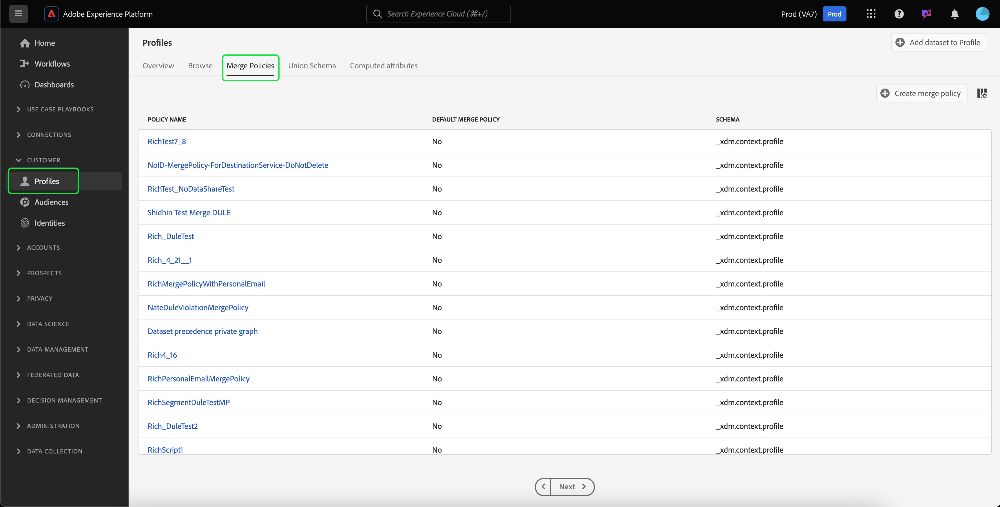

# 정책 병합 UI 안내서

Adobe Experience Platform을 사용하면 여러 소스에서 수집한 데이터 조각을 결합하여 개별 고객을 전체적으로 확인할 수 있습니다. 이 데이터를 함께 가져올 때 병합 정책은 데이터 우선 순위를 지정하는 방법과 통합 보기를 만들기 위해 결합할 데이터를 결정하는 데 사용하는 규칙입니다.[!DNL Platform]

예를 들어 고객이 여러 채널에서 브랜드와 상호 작용하는 경우 조직은 여러 데이터 세트에 나타나는 해당 단일 고객과 관련된 여러 프로필 조각을 갖게 됩니다. 이러한 조각을 Platform(플랫폼)으로 인제스트하면 해당 고객에 대한 단일 프로파일을 만들기 위해 병합됩니다. 여러 소스의 데이터가 충돌하면(예: 한 조각은 고객을 &quot;single&quot;로, 다른 조각은 고객을 &quot;기혼&quot;으로 나열합니다) 병합 정책은 각 개인에 대해 프로필에 포함할 정보를 결정합니다.

RESTful API 또는 사용자 인터페이스를 사용하여 새 병합 정책을 만들고 기존 정책을 관리하고 조직에 대한 기본 병합 정책을 설정할 수 있습니다. 이 안내서에서는 Adobe Experience Platform 사용자 인터페이스(UI)를 사용하여 병합 정책을 사용하기 위한 단계별 지침을 제공합니다.

[!DNL Real-time Customer Profile] API를 사용하여 병합 정책을 사용하려면 [병합 정책 API 안내서](../api/merge-policies.md)에 설명된 지침을 따르십시오.

## 시작하기

이 안내서는 몇 가지 중요한 [!DNL Experience Platform] 기능에 대해 작업해야 합니다. 이 안내서를 따르거나 프로필 API를 사용하기 전에 다음 서비스에 대한 설명서를 검토하십시오.

* [실시간 고객 프로필](../home.md):여러 소스에서 집계된 데이터를 기반으로 통합된 실시간 소비자 프로필을 제공합니다.
* [Adobe Experience Platform ID 서비스](../../identity-service/home.md):인제스트되는 다양한 데이터 소스의 ID를 통합하여 실시간 고객 프로파일을 활성화합니다 [!DNL Platform].
* [경험 데이터 모델(XDM)](../../xdm/home.md):고객 경험 데이터를  [!DNL Platform] 구성하는 표준화된 프레임워크

## 병합 메서드 {#merge-methods}

각 프로필 조각에는 개인에 대해 존재할 수 있는 총 ID 수 중 하나의 ID에 대한 정보가 포함되어 있습니다. 고객 프로파일을 구성하기 위해 해당 데이터를 병합하는 경우 해당 정보가 충돌할 가능성이 있으며 우선순위를 지정해야 합니다. 병합 방법을 선택하면 데이터 집합 간에 병합 충돌이 발생하는 경우 우선 순위를 지정할 데이터 집합 속성을 지정할 수 있습니다.

병합 정책에 사용할 수 있는 병합 방법은 두 가지가 있습니다. 이러한 각 방법은 아래의 섹션에 제공된 추가 세부 사항과 함께 요약됩니다.

* **[!UICONTROL Timestamp ordered]:** 충돌이 발생한 경우 가장 최근에 업데이트된 프로필 조각에 우선 순위가 지정됩니다.
   * **사용자 지정 타임스탬프:** [!UICONTROL Timestamp ordered] 또한 동일한 데이터 세트(다중 ID) 또는 데이터 집합 간에 데이터를 병합할 때 시스템 타임스탬프보다 우선하는 사용자 지정 타임스탬프를 지원합니다. 자세한 내용은 [사용자 지정 타임스탬프](#custom-timestamps)를 사용하는 섹션을 참조하십시오.
* **[!UICONTROL Dataset precedence]: 충돌** 이 발생한 경우 프로필 조각을 원래 있던 데이터 세트에 따라 우선 순위를 지정합니다. 이 옵션을 선택할 때는 관련 데이터 세트와 해당 우선 순위 순서를 선택해야 합니다.

### 타임스탬프가 {#timestamp-ordered}로 정렬됨

프로필 레코드가 Experience Platform에 수집되면 수집 시 시스템 타임스탬프를 입수하여 레코드에 추가합니다. 병합 정책의 병합 방법으로 **[!UICONTROL Timestamp ordered]**&#x200B;을 선택하면 시스템 타임스탬프를 기반으로 프로필이 병합됩니다. 즉, 병합은 레코드를 Platform으로 인제스트한 시간에 대한 타임스탬프를 기반으로 수행됩니다.

#### 사용자 지정 타임스탬프 사용 {#custom-timestamps}

사용자 지정 타임스탬프를 제공하고 병합 정책이 시스템 타임스탬프가 아닌 사용자 지정 타임스탬프를 준수하도록 하는 데 필요한 경우도 있습니다. 이러한 예로는 데이터를 채우거나 레코드가 순서가 맞지 않는 경우 올바른 이벤트 순서를 보장하는 것이 있습니다.

사용자 지정 타임스탬프를 사용하려면 **[!UICONTROL External Source System Audit Details Mixin]**&#x200B;을(를) 프로필 스키마에 추가해야 합니다. 사용자 지정 타임스탬프가 추가되면 `lastUpdatedDate` 필드를 사용하여 채울 수 있습니다. 레코드를 `lastUpdatedDate` 필드가 채워진 상태로 인제스트하면 Experience Platform은 해당 필드를 사용하여 데이터 집합 간에 레코드를 병합합니다. `lastUpdatedDate`이(가) 없거나 채워지지 않으면 플랫폼에서는 시스템 타임스탬프를 계속 사용합니다.

>[!NOTE]
>
>동일한 레코드에서 업데이트를 인제스트할 때 `lastUpdatedDate` 타임스탬프가 채워지는지 확인해야 합니다.

다음 스크린샷은 [!UICONTROL External Source System Audit Details Mixin]의 필드를 표시합니다. 스키마에 혼합을 추가하는 방법을 비롯하여 플랫폼 UI를 사용하여 스키마 작업에 대한 단계별 지침을 보려면 [튜토리얼을 참조하여 UI](../../xdm/tutorials/create-schema-ui.md)을(를) 사용하여 스키마를 만드십시오.

API를 사용하여 사용자 지정 타임스탬프를 사용하려면 사용자 지정 타임스탬프](../api/merge-policies.md#custom-timestamps)에 대한 [정책 병합 끝점 안내서 섹션을 참조하십시오.

### 데이터 세트 우선 순위 {#dataset-precedence}

병합 정책의 병합 방법으로 **[!UICONTROL Dataset precedence]**&#x200B;을 선택한 경우 가져온 데이터 세트에 따라 프로필 조각에 우선 순위를 지정할 수 있습니다. 사용 사례는 조직에서 다른 데이터 세트에 있는 데이터를 통해 선호되거나 신뢰할 수 있는 하나의 데이터 세트에 정보가 있는 경우입니다.

**[!UICONTROL Dataset precedence]**&#x200B;을(를) 사용하여 병합 정책을 만들려면 포함된 프로필 및 ExperienceEvent 데이터 집합을 선택한 다음 프로필 데이터 집합이 우선하도록 수동으로 순서를 지정할 수 있습니다. 데이터 세트를 선택하고 정렬하면 상위 데이터 세트에 우선 순위가 가장 높은 다음 두 번째 데이터 세트가 두 번째로 높은 데이터 세트가 됩니다.

## [!UICONTROL ID stitching] {#id-stitching}

ID 스티칭([!UICONTROL ID stitching])은 데이터 조각을 식별하고 결합하여 전체 프로필 레코드를 구성하는 프로세스입니다. 서로 다른 연결 동작을 설명하는 데 도움이 되도록 두 개의 서로 다른 이메일 주소를 사용하여 브랜드와 상호 작용하는 단일 고객을 고려하십시오.

* **[!UICONTROL None]:** 이 옵션을 선택하면 ID가 함께 결합되지 않습니다. 세그먼테이션이 발생하면, 동일한 사람에 속할 수 있는 ID는 함께 결합되지 않으며, 세그먼테이션은 고객이 세그먼트 멤버십에 자격이 있는지 여부를 결정할 때 각 개별 ID에 첨부된 특성만 고려합니다. 이로 인해 단일 고객이 여러 프로파일을 갖고 있고 각 프로파일이 서로 다른 세그먼트를 평가할 수 있으므로 동일한 고객에게 여러 마케팅 메시지를 보낼 수 있습니다.
* **[!UICONTROL Private graph]개인 그래프를** 선택하면 동일한 개인과 관련된 여러 ID가 함께 결합됩니다. 이로 인해 고객은 단일 프로파일을 갖게 되며 세그먼트 자격을 결정할 때 세그먼테이션에서 여러 관련 ID의 여러 속성을 고려할 수 있습니다. 이 시나리오에서 고객은 단일 프로파일을 가지고 ID 간 특성 조합을 기반으로 한 한 세그먼트에 적용되며 하나의 마케팅 메시지만 수신할 수 있습니다.

프로필 및 세그먼트를 생성할 때 ID와 그 역할에 대한 자세한 내용을 보려면 [ID 서비스 개요](../../identity-service/home.md)를 읽으십시오.

## 기본 병합 정책 {#default-merge-policy}

조직은 프로필 조각을 병합할 때 사용할 조직의 기본 병합 정책을 만들 수 있습니다. 이를 통해 사용자는 고객 프로파일을 보거나 세그먼트를 만드는 등의 Experience Platform 작업을 수행할 때 기본 정책을 손쉽게 선택할 수 있습니다. 대부분의 경우 다른 병합 정책을 지정하지 않으면 기본 병합 정책이 사용됩니다.

각 조직은 단일 XDM 스키마 클래스와 관련된 여러 병합 정책을 만들 수 있지만 각 클래스에 대해 하나의 기본 병합 정책만 선언할 수 있습니다. 예를 들어 조직에서 [!DNL XDM Individual Profile] 클래스와 관련된 기본 병합 정책을 사용하고 사용자 지정 빌드 제품 인벤토리 클래스에 대해 다른 기본 병합 정책을 가질 수 있습니다.

새 병합 정책을 만들고 기본값으로 설정하면 이전 기본 병합 정책이 더 이상 기본값이 되지 않도록 시스템에 의해 자동으로 업데이트됩니다.

>[!WARNING]
>
>기존 연결된 기본 병합 정책이 있는 프로필 수 및 세그먼트에 영향을 줄 수 있습니다. 기본 병합 정책이 적용된 모든 세그먼트는 새로운 기본 병합 정책으로 업데이트됩니다.

## 병합 정책 보기 {#view-merge-policies}

[!DNL Experience Platform] UI 내에서 왼쪽 탐색 메뉴에서 **[!UICONTROL Profiles]**&#x200B;을 선택한 다음 **[!UICONTROL Merge Policies]** 탭을 선택하여 병합 정책 작업을 시작할 수 있습니다. 이 탭에는 조직에 대한 모든 기존 병합 정책의 목록과 정책 이름, 병합 정책이 기본 병합 정책인지 여부 및 병합 정책이 관련된 스키마 클래스 등 각 병합 정책에 대한 세부 정보가 포함되어 있습니다.

표시할 세부 사항을 선택하거나 표시에 열을 추가하려면 **[!UICONTROL Configure columns]**&#x200B;을 선택하고 열 이름을 클릭하여 보기에서 추가하거나 제거합니다.

## 병합 정책 만들기 {#create-a-merge-policy}

새 병합 정책을 만들려면 병합 정책 탭에서 **[!UICONTROL Create merge policy]**&#x200B;을 선택합니다.

**[!UICONTROL New merge policy]** 워크플로우 화면에서 일련의 안내 단계를 통해 새 병합 정책에 대한 중요한 정보를 제공할 수 있습니다.

### [!UICONTROL Configure] {#configure}

워크플로우의 첫 번째 단계에서는 기본 정보를 제공하여 병합 정책을 구성할 수 있습니다. 이 정보에는 다음이 포함됩니다.

* **[!UICONTROL Name]**:병합 정책의 이름은 설명적이지만 간결해야 합니다.
* **[!UICONTROL Schema class]**:병합 정책과 연결된 XDM 스키마 클래스입니다. 이 병합 정책을 만들 스키마 클래스를 지정합니다. 조직에서는 스키마 클래스당 여러 병합 정책을 만들 수 있습니다. 현재 UI에서는 [!UICONTROL XDM Individual Profile] 클래스만 사용할 수 있습니다. **[!UICONTROL View Union Schema]**&#x200B;을 선택하여 스키마 클래스에 대한 공용 스키마를 미리 볼 수 있습니다. 자세한 내용은 다음 조합 스키마 보기](#view-union-schema)에 있는 섹션을 참조하십시오.[
* **[!UICONTROL ID stitching]**:이 필드는 고객의 관련 ID를 확인하는 방법을 정의합니다. 자세한 내용은 이 안내서의 [ID 스티칭](#id-stitching)에 대한 섹션을 참조하십시오. 다음 두 가지 값을 사용할 수 있습니다.
   * **[!UICONTROL None]**:ID 스티칭을 수행하지 않습니다.
   * **[!UICONTROL Private Graph]**:개인 ID 그래프를 기반으로 ID 스티칭을 수행합니다.
* **[!UICONTROL Default merge policy]**:이 병합 정책이 조직의 기본값인지 여부를 선택할 수 있는 전환 단추입니다. 선택기가 켜진 경우 조직의 기본 병합 정책을 변경할지 확인하는 메시지가 표시됩니다. 자세한 내용은 이 안내서의 [기본 병합 정책](#default-merge-policy)에 대한 섹션을 참조하십시오.
   

필수 필드가 완료되면 **[!UICONTROL Next]**&#x200B;을 선택하여 워크플로우를 계속할 수 있습니다.

#### [!UICONTROL View Union Schema] {#view-union-schema}

병합 정책을 만들거나 편집할 때 **[!UICONTROL View Union Schema]**&#x200B;을 선택하여 선택한 스키마 클래스에 대한 결합 스키마를 볼 수 있습니다.

그러면 조합 스키마와 연관된 모든 기여 스키마, ID 및 관계를 표시하는 [!UICONTROL View Union Schema] 대화 상자가 열립니다. 대화 상자를 사용하여 플랫폼 UI의 [!UICONTROL Profiles] 섹션에 있는 [!UICONTROL Union Schema] 탭에 액세스하여 이와 동일한 방식으로 결합 스키마를 탐색할 수 있습니다.

병합 정책 워크플로우에 표시된 [!UICONTROL Union Schema] 탭 또는 [!UICONTROL View Union Schema] 대화 상자에서 스키마 상호 작용하는 방법을 비롯하여 결합 스키마에 대한 자세한 내용을 보려면 [조합 스키마 UI 안내서](union-schema.md)를 방문하십시오.

### [!UICONTROL Select Profile datasets] {#select-profile-datasets}

**[!UICONTROL Select Profile datasets]** 화면에서 병합 정책에 사용할 **[!UICONTROL Merge method]**&#x200B;을 선택해야 합니다. 또한 화면에 표시되는 전체 수는 이전 화면에서 선택한 스키마 클래스와 관련된 조직의 [!UICONTROL Profile datasets]입니다.

선택한 병합 방법에 따라 모든 프로필 데이터 집합이 마지막으로 업데이트되는 순서(타임스탬프 순서가 지정됨)로 병합되거나 병합 정책에 포함할 프로필 데이터 세트와 이를 병합할 순서(데이터 집합 우선 순위)를 선택해야 합니다. 병합 방법에 대한 자세한 내용은 이 문서의 앞 부분에서 제공하는 [병합 메서드](#merge-methods) 섹션을 검토하십시오.

#### 타임스탬프가 {#timestamp-ordered-profile}로 정렬됨

병합 방법으로 **[!UICONTROL Timestamp ordered]**&#x200B;을 선택하면 가장 최근에 업데이트된 데이터 세트에서 속성이 우선합니다. 모든 프로필 데이터 세트에 적용됩니다.

#### 데이터 세트 우선 순위 {#dataset-precedence-profile}

병합 방법으로 **[!UICONTROL Dataset precedence]**&#x200B;을 선택하려면 프로필 데이터 세트를 선택하고 수동으로 우선 순위를 지정해야 합니다. 나열된 각 데이터 집합에는 마지막으로 인제스트한 일괄 처리 상태가 포함되거나 해당 데이터 세트에 인제스트된 배치가 없다는 알림이 표시됩니다.

데이터 집합 목록에서 최대 50개의 데이터 집합을 선택하여 병합 정책에 포함할 수 있습니다. 데이터 세트를 선택하면 데이터 세트가 **[!UICONTROL Select datasets]** 섹션에 추가되므로 데이터 세트를 드래그 앤 드롭하고 원하는 우선 순위에 따라 정렬할 수 있습니다. 데이터 세트가 목록에서 조정되면 데이터 세트 옆에 있는 서수(1, 2, 3 등)가 업데이트되어 우선 순위(1이 가장 높은 우선 순위로 지정된 후 2, 그 다음으로 표시됨)가 표시됩니다.

데이터 세트를 선택하면 또한 **[!UICONTROL Union schema]** 섹션이 업데이트되어 각 데이터 세트에 데이터가 기여하는 결합 스키마의 필드가 표시됩니다. UI의 시각화와 상호 작용하는 방법 등 결합 스키마에 대한 자세한 내용은 [공용 스키마 UI 안내서](union-schema.md)를 참조하십시오.

### [!UICONTROL Select ExperienceEvent datasets] {#select-experienceevent-datasets}

워크플로우의 다음 단계에서는 ExperienceEvent 데이터 세트를 선택해야 합니다. 이 화면은 [[!UICONTROL Select Profile datasets]](#select-profile-datasets) 화면에서 선택한 병합 방법의 영향을 받습니다.

이 화면에 표시되는 총 **[!UICONTROL ExperienceEvent datasets]** 수는 병합 정책 구성 화면에서 선택한 스키마 클래스와 관련된 조직에서 만든 총 수입니다.

#### 타임스탬프가 {#timestamp-ordered-experienceevent}로 정렬됨

프로필 데이터 집합에 대한 병합 방법으로 **[!UICONTROL Timestamp ordered]**&#x200B;을 선택한 경우 여기에서 가장 최근에 업데이트된 ExperienceEvent 데이터 집합의 속성이 우선합니다.

#### 데이터 세트 우선 순위 {#dataset-precedence-experienceevent}

프로필 데이터 집합의 병합 방법으로 **[!UICONTROL Dataset precedence]**&#x200B;을 선택한 경우 포함할 ExperienceEvent 데이터 집합을 선택해야 합니다. 데이터 세트 목록에서 최대 50개의 ExperienceEvent 데이터 세트를 선택할 수 있습니다. 데이터 세트가 선택되면 [!UICONTROL Select datasets] 섹션에 표시됩니다.

ExperienceEvent 데이터 집합을 수동으로 정렬할 수 없습니다. 대신 동일한 프로필 조각의 일부인 경우 ExperienceEvent 데이터 집합의 속성이 프로필 데이터 집합에 추가됩니다.

프로필 데이터 집합을 선택하는 것과 마찬가지로 ExperienceEvent 데이터 집합을 선택하면 또한 **[!UICONTROL Union schema]** 섹션이 업데이트되어 각 데이터 집합에 데이터가 기여하는 결합 스키마의 필드를 표시합니다. UI의 시각화와 상호 작용하는 방법 등 결합 스키마에 대한 자세한 내용은 [공용 스키마 UI 안내서](union-schema.md)를 참조하십시오.

### [!UICONTROL Review] {#review}

워크플로우의 마지막 단계는 병합 정책을 검토하는 것입니다. **[!UICONTROL Review]** 화면에는 새 병합 정책의 이름, 이 정책의 기반이 되는 스키마 클래스, 선택한 [!UICONTROL ID stitching] 옵션, 병합 메서드 및 병합 정책에 포함된 데이터 세트가 표시됩니다. 포함된 프로필 또는 ExperienceEvent 데이터 집합을 모두 보려면 드롭다운 목록을 확장할 데이터 세트 수를 선택합니다.

만들기 작업 과정을 완료하려면 **[!UICONTROL Finish]**&#x200B;을 선택하기 전에 병합 정책을 주의 깊게 검토하십시오.

#### 타임스탬프가 {#timestamp-ordered-review}로 정렬됨

병합 정책에 대한 병합 방법으로 **[!UICONTROL Timestamp ordered]**&#x200B;을 선택한 경우 프로필 데이터 집합 목록에는 타임스탬프 순서대로 스키마 클래스와 관련된 조직에서 만든 모든 데이터 집합이 포함됩니다. ExperienceEvent 데이터 집합 목록에는 조직에서 선택한 스키마 클래스에 대해 만든 모든 데이터 집합이 포함되며 프로필 데이터 집합에 추가됩니다.

#### 데이터 세트 우선 순위 {#dataset-precedence-review}

병합 정책에 대한 병합 방법으로 **[!UICONTROL Dataset precedence]**&#x200B;을 선택한 경우, 프로필 및 ExperienceEvent 데이터 집합 목록에는 작성 작업 과정 중에 선택한 프로필 및 ExperienceEvent 데이터 집합만 각각 포함됩니다. 프로필 데이터 집합의 순서는 만드는 동안 지정한 우선 순위와 일치해야 합니다. 그렇지 않은 경우 [!UICONTROL Back] 단추를 사용하여 이전 워크플로우 단계로 돌아가서 우선 순위를 조정합니다.

### 병합 정책 목록 {#updated-list} 업데이트

새 병합 정책을 만드는 작업 과정을 완료한 후 **[!UICONTROL Merge Policies]** 탭으로 돌아갑니다. 이제 조직의 병합 정책 목록에 방금 만든 병합 정책이 포함되어야 합니다.

## 병합 정책 편집

[!UICONTROL Merge Policies] 탭에서 편집할 병합 정책에 대해 **[!UICONTROL Policy name]**&#x200B;을 선택하여 [!DNL XDM Individual Profile] 클래스에 대해 만든 기존 병합 정책을 수정할 수 있습니다.

**[!UICONTROL Edit merge policy]** 화면이 나타나면 이름 및 [!UICONTROL ID stitching]을 변경할 수 있을 뿐만 아니라 이 정책이 조직의 기본 병합 정책인지 여부를 변경할 수 있습니다.

병합 정책 작업 과정을 계속하려면 **[!UICONTROL Next]**&#x200B;을 선택하여 병합 정책에 포함된 병합 방법 및 데이터 집합을 업데이트합니다.

필요한 변경 사항이 있으면 병합 정책을 검토하고 **[!UICONTROL Finish]**&#x200B;을 선택하여 **[!UICONTROL Merge policies]** 탭으로 돌아갑니다.

>[!WARNING]
>
>병합 정책을 변경하면 데이터 충돌 해결 방법이 변경되므로 세그먼테이션 및 프로필 결과에 영향을 줄 수 있습니다.

## 데이터 거버넌스 정책 위반

병합 정책을 만들거나 업데이트할 때 병합 정책이 조직에서 정의한 데이터 사용 정책을 위반하는지 여부를 확인하는 검사가 수행됩니다. 데이터 사용 정책은 Adobe Experience Platform [!DNL Data Governance]의 일부이며 특정 [!DNL Platform] 데이터에서 수행하도록 허용되거나 제한된 마케팅 작업의 종류를 설명하는 규칙입니다. 예를 들어, 병합 정책을 사용하여 제3자 대상에 대해 활성화된 세그먼트를 만들고 조직에서 특정 데이터를 제3자로 내보낼 수 없도록 데이터 사용 정책을 적용하면 병합 정책을 저장하려고 할 때 **[!UICONTROL Data governance policy violation detected]** 알림을 받게 됩니다.

이 알림에는 위반된 데이터 사용 정책 목록이 포함되어 있으며 목록에서 정책을 선택하여 위반 세부 사항을 볼 수 있습니다. 위반된 정책을 선택하면 **[!UICONTROL Data lineage]** 탭은 위반의 이유와 영향을 받는 활동을 제공하며, 각 탭에는 데이터 사용 정책이 위반된 방식에 대한 자세한 정보가 제공됩니다.

Adobe Experience Platform 내에서 데이터 거버넌스가 수행되는 방식에 대한 자세한 내용은 [데이터 거버넌스 개요](../../data-governance/home.md)를 읽으십시오.

## 다음 단계

조직의 병합 정책을 만들고 구성했으므로 이제 이러한 정책을 사용하여 플랫폼 내의 고객 프로필 보기를 조정하고 프로필 데이터에서 대상 세그먼트를 만들 수 있습니다. [!DNL Experience Platform] UI 및 API를 사용하여 세그먼트를 만들고 사용하는 방법에 대한 자세한 내용은 [세그멘테이션 개요](../../segmentation/home.md)을 참조하십시오.
