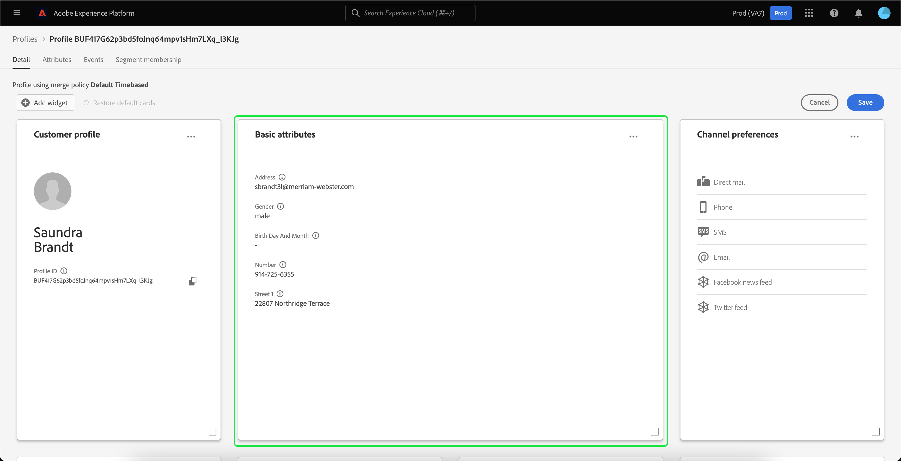
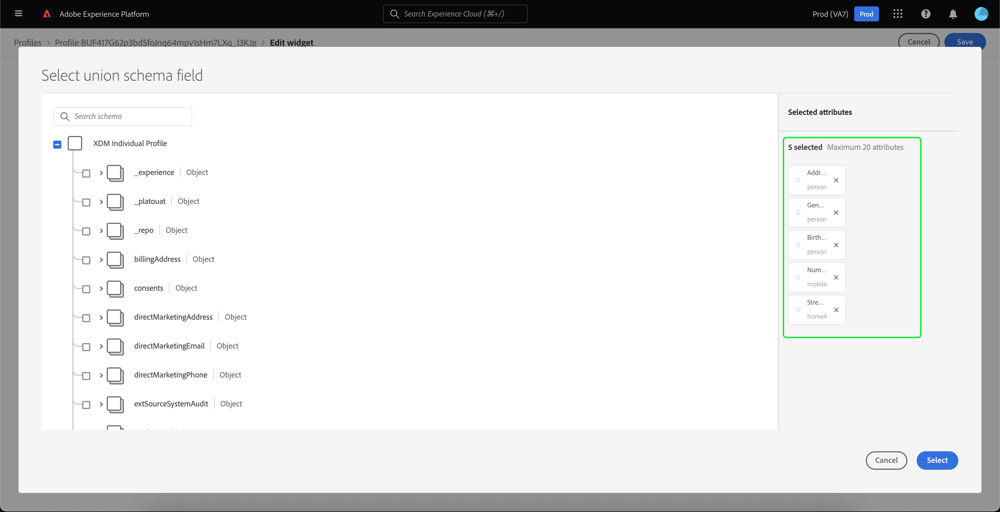

# [!DNL Real-Time Customer Profile] 세부 사항 사용자 정의 {#profile-detail-customization}

Adobe Experience Platform 사용자 인터페이스 내에서 를 보고 상호 작용할 수 있습니다 [!DNL Real-Time Customer Profile] 고객 프로필 형식의 데이터. UI에 표시되는 프로필 정보가 여러 프로필 조각에서 함께 병합되어 각 개별 고객에 대한 단일 뷰를 형성합니다. 여기에는 기본 속성, 연결된 ID 및 채널 환경 설정 등의 세부 사항이 포함됩니다. 프로필에 표시되는 기본 필드를 조직 수준에서 변경하여 기본 설정을 표시할 수도 있습니다 [!DNL Profile] 속성. 이 안내서에서는 다음 작업을 수행하는 방법을 사용자 지정하는 단계별 지침을 제공합니다. [!DNL Profile] 데이터는 Platform UI 내에 표시됩니다.

프로필 UI에 대한 전체 안내서는 다음을 참조하십시오. [프로필 UI 안내서](user-guide.md).

## 카드 순서 조정 및 크기 조정 {#reorder-and-resize-cards}

다음에서 **[!UICONTROL 세부 사항]** 고객 프로필 탭에서 다음을 선택할 수 있습니다. **[!UICONTROL 프로필 세부 정보 사용자 정의]** 기존 카드의 크기를 조정하고 순서를 변경할 수 있습니다.

대시보드를 수정하도록 선택한 후 카드 제목을 선택하고 카드를 원하는 순서로 드래그 앤 드롭하여 카드 순서를 변경할 수 있습니다. 카드의 오른쪽 아래 모서리에 있는 각도 기호를 선택하여 카드의 크기를 조정할 수도 있습니다(`⌟`)을 클릭하고 카드를 원하는 크기로 드래그합니다. 이 예에서는 **[!UICONTROL 기본 속성]** 카드 크기를 조정하고 있습니다.

![[기본 속성] 카드 내에서 [크기 조정] 버튼이 강조 표시됩니다.](../images/profile-customization/resize.png)

선택한 카드가 원하는 크기로 조정되고 주변 카드가 동적으로 재배치됩니다. 이로 인해 일부 카드가 추가 행으로 이동되어 모든 카드를 보려면 아래로 스크롤해야 할 수 있습니다. 예를 들어, &quot;[!UICONTROL 기본 속성]&quot; 카드의 크기가 &quot; &quot;으로 조정되었습니다.[!UICONTROL 연결된 ID]&quot;카드가 더 이상 맨 위 행에 표시되지 않으며 이제 프로필 내의 새 두 번째 행에 표시됩니다(표시되지 않음). 를 반환합니다.[!UICONTROL 연결된 ID]&quot;카드를 맨 위 행으로 드래그하여 &quot;&quot;의 현재 위치에 놓을 수 있습니다.[!UICONTROL 채널 환경 설정]&quot; 카드.

## 카드 편집 및 제거

카드 크기 조정 및 재정렬 외에도 특정 카드의 내용을 편집하고 대시보드에서 일부 카드를 완전히 제거할 수 있습니다. 줄임표(`...`)를 클릭하여 편집하거나 제거할 수 있습니다. 그러면 선택한 카드의 속성에 따라 카드를 편집하거나 제거할 수 있는 옵션이 있는 드롭다운이 열립니다.

>[!NOTE]
>
>모든 카드를 편집하거나 제거할 수 있는 것은 아닙니다. 일부 카드에 읽기 전용 또는 필수 정보가 포함되어 있기 때문입니다. 오른쪽 상단 모서리에 줄임표가 없는 카드는 읽기 전용 AND 필수 정보를 포함하고 있으며 편집하거나 제거할 수 없습니다. 카드에 모서리에 줄임표가 있고 이 카드를 선택하면 카드를 제거할 수 있는 옵션만 표시되는 경우 카드 정보는 읽기 전용이며 편집할 수 없습니다.

선택 **[!UICONTROL 편집]** 드롭다운에서 을 엽니다. **[!UICONTROL 위젯 편집]** 작업공간: 카드 제목을 업데이트하거나, 표시되는 속성을 재정렬 또는 제거하거나, **[!UICONTROL 속성 추가]** 단추를 클릭합니다.

## 속성 추가 {#add-attributes}

다음에서 **[!UICONTROL 위젯 편집]** 화면, 선택 **[!UICONTROL 속성 추가]** 을 눌러 해당 카드에 속성을 추가합니다.

다음의 경우 **[!UICONTROL 유니온 스키마 필드 선택]** 대화 상자가 열리면 대화 상자의 왼쪽에 전체 항목이 표시됩니다. [!UICONTROL XDM 개별 프로필] 유니온 스키마, 아래에 필드가 중첩되어 있습니다. 유니온 스키마에 대한 자세한 내용은 [의 유니온 스키마 섹션 [!DNL Profile] 사용 안내서](user-guide.md#union-schema).

다음 **[!UICONTROL 선택한 속성]** 대화 상자 오른쪽의 섹션에 편집 중인 카드에 현재 포함된 속성이 표시됩니다. 여기에서 속성을 제거하고 순서를 변경할 수도 있습니다. 선택된 총 속성 수와 단일 카드에 추가할 수 있는 최대 속성 수(20개)가 표시됩니다.

사용 가능한 유니온 스키마 필드를 선택하여 편집 중인 카드의 속성을 사용자 정의할 수 있습니다. 필드를 선택할 때 파일 경로 이름이나 표시 이름을 표시하도록 선택할 수 있습니다. 이 두 디스플레이 간을 전환하려면 **[!UICONTROL 표시 이름 표시]** 토글.

![다음 [!UICONTROL 표시 이름 표시] [프로필 세부 정보] 페이지에서 토글이 강조 표시됩니다.](../images/profile-customization/show-display-names.png)

선택한 필드 옆에 확인 표시가 나타나고 선택한 속성 목록에 자동으로 추가됩니다. 카드에 표시하고자 하는 모든 속성을 추가한 후 을 선택합니다 **[!UICONTROL 선택]** (으)로 돌아가기 **[!UICONTROL 위젯 편집]** 화면.

다음으로 돌아가기 **[!UICONTROL 위젯 편집]** 화면의 카드에 있는 속성 목록을 업데이트하여 선택 사항을 반영해야 합니다. 필요에 따라 카드 특성을 제거하거나 순서를 변경하거나 카드 제목을 편집할 수 있습니다. 편집이 완료되면 다음을 선택합니다. **[!UICONTROL 저장]** 변경 사항을 저장합니다.

저장한 후 로 돌아갑니다. **[!UICONTROL 세부 사항]** 업데이트된 카드 및 속성을 볼 수 있는 탭입니다.

## 새 카드 추가 {#add-a-new-card}

Experience Platform 내에서 프로필 모양을 추가로 사용자 정의하려면 대시보드에 새 카드를 추가하도록 선택하고 해당 카드에 표시할 속성을 선택할 수 있습니다. 시작하려면 다음을 선택합니다. **[!UICONTROL 대시보드 수정]** 다음에 있음 **[!UICONTROL 세부 사항]** 탭.

그런 다음 을 선택합니다. **[!UICONTROL 위젯 추가]** 을 클릭합니다.

![[위젯 추가] 버튼이 강조 표시됩니다.](../images/profile-customization/add-widget.png)

새 카드를 추가하도록 선택하면 **[!UICONTROL 위젯 편집]** 새 카드의 제목을 입력하고 카드에 표시할 속성을 선택할 수 있는 화면입니다. 카드에 속성을 추가하려면 를 선택합니다. **[!UICONTROL 속성 추가]**.

![빈 새 위젯 카드가 [위젯 편집] 화면에 표시됩니다.](../images/profile-customization/edit-widget.png)

다음의 경우 **[!UICONTROL 유니온 스키마 필드 선택]** 대화 상자가 열리면 대화 상자의 왼쪽에 전체 항목이 표시됩니다. [!UICONTROL XDM 개별 프로필] 유니온 스키마 및 **[!UICONTROL 선택한 속성]** 대화 상자 오른쪽의 섹션에 카드에 대해 선택한 속성이 표시됩니다. 속성 추가에 대한 자세한 내용은 [속성 추가 섹션](#add-attributes) 이 문서의 앞부분에 나와 있습니다.

선택된 총 속성 수와 단일 카드에 추가할 수 있는 최대 속성 수(20개)가 표시됩니다. 이 화면에서 선택한 속성을 제거하고 순서를 변경할 수도 있습니다. 카드에 표시할 속성을 모두 추가한 후에는 을 선택합니다 **[!UICONTROL 선택]** (으)로 돌아가기 **[!UICONTROL 위젯 편집]** 화면.

다음으로 돌아가기 **[!UICONTROL 위젯 편집]** 화면의 카드에 있는 속성 목록은 이전 화면의 선택 사항을 반영해야 합니다. 필요에 따라 카드 속성을 재정렬하고 제거할 수도 있습니다.

새 카드를 저장하려면 먼저 **[!UICONTROL 카드 제목]**&#x200B;을 선택한 다음 을 선택할 수 있습니다. **[!UICONTROL 저장]** 카드 만들기 프로세스를 완료합니다.

저장한 후 로 돌아갑니다. **[!UICONTROL 세부 사항]** 새 카드 및 특성이 표시되는 탭입니다.

## 기본 카드 복원

어느 시점에서든 이후에 제거된 기본 카드를 복원하려는 경우 빠르고 쉽게 복원할 수 있습니다. 먼저 을(를) 선택합니다 **[!UICONTROL 대시보드 수정]**&#x200B;을 선택한 다음 을 선택합니다. **[!UICONTROL 기본 카드 복원]**. 기본 카드가 표시되면 다음을 선택할 수 있습니다 **[!UICONTROL 저장]** 변경 사항을 저장하거나 **[!UICONTROL 취소]** 기본 카드를 복원하지 않으려는 경우

## 다음 단계

이 문서에 따라 이제 카드 추가 및 제거, 카드 세부 정보 및 속성 편집, 카드 재정렬 및 크기 조정을 포함하여 조직의 프로필 보기를 업데이트할 수 있습니다. 작업에 대해 자세히 알아보려면 [!DNL Profile] Experience Platform UI의 데이터입니다. [[!DNL Profile] 사용 안내서](user-guide.md).
