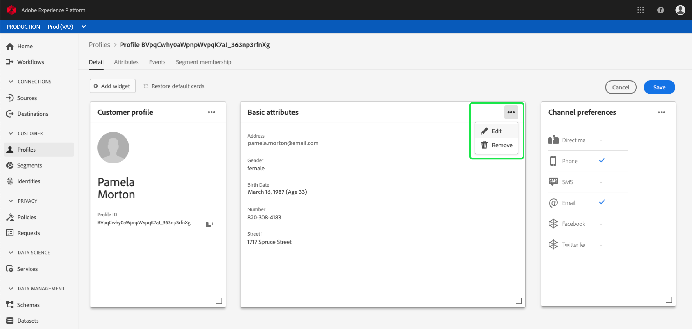
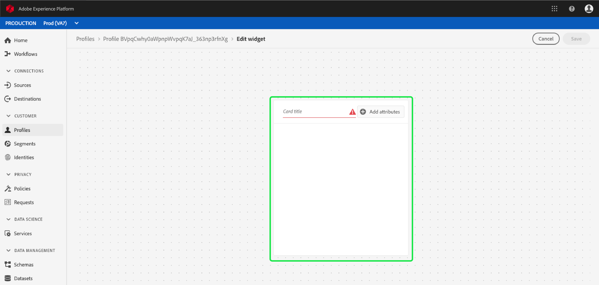
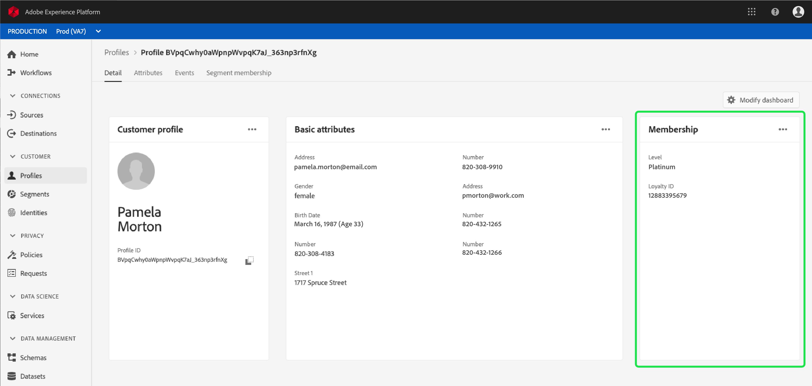

# [!DNL Real-time Customer Profile] 세부 맞춤화  {#profile-detail-customization}

Adobe Experience Platform 사용자 인터페이스 내에서 고객 프로필 형식으로 [!DNL Real-time Customer Profile] 데이터를 보고 상호 작용할 수 있습니다. UI에 표시되는 프로필 정보는 여러 프로필 조각에서 병합되어 각 개별 고객의 단일 보기를 형성했습니다. 여기에는 기본 속성, 연결된 ID 및 채널 환경 설정과 같은 세부 사항이 포함됩니다. 프로필에 표시된 기본 필드는 조직 수준에서 변경하여 기본 설정 [!DNL Profile] 특성을 표시할 수도 있습니다. 이 안내서에서는 플랫폼 UI 내에 [!DNL Profile] 데이터가 표시되는 방식을 사용자 지정하기 위한 단계별 지침을 제공합니다.

프로필 UI에 대한 전체 안내는 [프로필 UI 안내서](user-guide.md)를 참조하십시오.

## 카드 순서 변경 및 크기 조정 {#reorder-and-resize-cards}

고객 프로필의 **[!UICONTROL Detail]** 탭에서 **[!UICONTROL Modify dashboard]**&#x200B;을 선택하여 기존 카드의 크기를 조정하고 순서를 변경할 수 있습니다.

대시보드를 수정하도록 선택한 후 카드 제목을 선택하고 카드를 원하는 순서로 드래그하여 놓아 카드의 순서를 변경할 수 있습니다. 카드(`⌟`)의 오른쪽 하단에 있는 각도 기호를 선택하고 카드를 원하는 크기로 드래그하여 카드의 크기를 조정할 수도 있습니다. 이 예에서 **[!UICONTROL Basic attributes]** 카드의 크기가 조정되고 있습니다.

선택한 카드가 원하는 크기에 맞게 조정되고 주변 카드가 동적으로 다시 배치됩니다. 이로 인해 일부 카드가 추가 행으로 이동될 수 있으므로 모든 카드를 보려면 아래로 스크롤해야 합니다. 예를 들어 &quot;[!UICONTROL Basic attributes]&quot; 카드의 크기가 변경되면 &quot;[!UICONTROL Linked identities]&quot; 카드가 더 이상 위쪽 행에 표시되지 않고 이제 프로필 내의 새 두 번째 행에 표시됩니다(표시되지 않음). &quot;[!UICONTROL Linked identities]&quot; 카드를 맨 위 행으로 되돌리려면 &quot;[!UICONTROL Channel preferences]&quot; 카드의 현재 위치로 끌어 놓을 수 있습니다.

## 카드 편집 및 제거

카드 크기 조정 및 순서 변경 외에도 특정 카드의 컨텐츠를 편집하고 대시보드에서 일부 카드를 완전히 제거할 수 있습니다. 카드를 편집하거나 제거하려면 카드의 오른쪽 위 모서리에서 줄임표(`...`)를 선택합니다. 선택한 카드의 속성에 따라 카드를 편집하거나 제거하는 옵션이 있는 드롭다운이 열립니다.

>[!NOTE]
>
>일부 카드는 편집하거나 제거할 수 없습니다. 이것은 일부 카드에 읽기 전용 또는 필수 정보가 포함되어 있기 때문입니다. 오른쪽 위 모서리에 타원이 없는 경우, 카드에 읽기 전용 AND 필수 정보가 포함되어 있으며 편집하거나 제거할 수 없습니다. 카드에 타원이 있고 카드를 선택하는 경우 카드를 제거하는 옵션만 표시될 경우 카드 정보는 읽기 전용이므로 편집할 수 없습니다.

드롭다운에서 **[!UICONTROL Edit]**&#x200B;을 선택하여 **[!UICONTROL Edit widget]** 작업 영역을 엽니다. 이 작업 영역에서 카드 제목을 업데이트하거나, 보이는 속성을 순서를 변경하거나 제거하거나, **[!UICONTROL Add attributes]** 단추를 사용하여 추가 속성을 추가할 수 있습니다.

## {#add-attributes} 특성 추가

**[!UICONTROL Edit widget]** 화면에서 카드의 오른쪽 위 모서리에서 **[!UICONTROL Add attributes]**&#x200B;을 선택하여 해당 카드에 속성을 추가하기 시작합니다.

**[!UICONTROL Select union schema field]** 대화 상자가 열리면 대화 상자의 왼쪽에는 아래에 중첩된 필드가 포함된 전체 [!UICONTROL XDM Individual Profile] 결합 스키마가 표시됩니다. 결합 스키마에 대한 자세한 내용은  [!DNL Profile] 사용자 안내서](user-guide.md#union-schema)의 [공용 스키마 섹션을 참조하십시오.

대화 상자 오른쪽의 **[!UICONTROL Selected Attributes]** 섹션에는 편집 중인 카드에 현재 포함되어 있는 속성이 표시됩니다. 여기에서 속성을 제거하고 순서를 변경할 수도 있습니다. 선택한 총 속성 수와 단일 카드에 추가할 수 있는 최대 속성 수(20)가 표시됩니다.

사용 가능한 결합 스키마 필드 중 하나를 선택하여 편집 중인 카드의 속성을 사용자 정의할 수 있습니다. 선택한 필드는 해당 필드 옆에 확인 표시가 표시되며 선택한 속성 목록에 자동으로 추가됩니다. 카드에 표시할 모든 특성을 추가했으면 **[!UICONTROL Select]**&#x200B;을 선택하여 **[!UICONTROL Edit widget]** 화면으로 돌아갑니다.

이제 **[!UICONTROL Edit widget]** 화면으로 돌아갈 때 선택 사항을 반영하도록 카드의 속성 목록을 업데이트해야 합니다. 필요에 따라 카드 속성을 제거하거나 순서를 변경하거나 카드 제목을 편집할 수 있습니다. 편집 작업이 완료되면 **[!UICONTROL Save]**&#x200B;을 선택하여 변경 내용을 저장합니다.

저장 후 업데이트된 카드 및 속성이 표시되는 **[!UICONTROL Detail]** 탭으로 돌아갑니다.

## 새 카드 {#add-a-new-card} 추가

Experience Platform 내의 프로필 모양을 추가로 사용자 정의하려면 대시보드에 새 카드를 추가하고 해당 카드에 표시할 속성을 선택할 수 있습니다. 시작하려면 **[!UICONTROL Detail]** 탭에서 **[!UICONTROL Modify dashboard]**&#x200B;을 선택합니다.

그런 다음 대시보드의 왼쪽 위 모서리에서 **[!UICONTROL Add widget]**&#x200B;을 선택합니다.

새 카드를 추가하도록 선택하면 새 카드의 제목을 제공하고 표시할 카드의 속성을 선택할 수 있는 **[!UICONTROL Edit widget]** 화면이 열립니다. 카드에 특성 추가를 시작하려면 **[!UICONTROL Add attributes]**&#x200B;을 선택합니다.

**[!UICONTROL Select union schema field]** 대화 상자가 열리면 대화 상자의 왼쪽에 전체 [!UICONTROL XDM Individual Profile] 결합 스키마가 표시되고 대화 상자의 오른쪽의 **[!UICONTROL Selected Attributes]** 섹션에는 카드에 대해 선택한 특성이 표시됩니다. 특성 추가에 대한 자세한 내용은 이 문서 앞에 나타나는 ](#add-attributes) 특성 추가에 대한 [섹션을 참조하십시오.

선택한 총 속성 수와 단일 카드에 추가할 수 있는 최대 속성 수(20)가 표시됩니다. 이 화면에서 선택한 속성을 제거하고 순서를 변경할 수도 있습니다. 카드에 표시할 모든 특성을 추가했으면 **[!UICONTROL Select]**&#x200B;을 선택하여 **[!UICONTROL Edit widget]** 화면으로 돌아갑니다.

**[!UICONTROL Edit widget]** 화면으로 돌아가면 카드의 속성 목록은 이전 화면에서 선택한 항목을 반영해야 합니다. 필요에 따라 카드 속성의 순서를 변경하거나 제거할 수도 있습니다.

새 카드를 저장하려면 먼저 **[!UICONTROL Card title]**&#x200B;을 제공해야 합니다. 그러면 **[!UICONTROL Save]**&#x200B;을 선택하고 카드 만들기 프로세스를 완료할 수 있습니다.

저장 후 새 카드 및 속성이 표시되는 **[!UICONTROL Detail]** 탭으로 돌아갑니다.

## 기본 카드 복원

언제든지 제거된 기본 카드를 복원할 경우 빠르고 쉽게 복원할 수 있습니다. 먼저 **[!UICONTROL Modify dashboard]**&#x200B;을 선택하고 **[!UICONTROL Restore default cards]**&#x200B;을 선택합니다. 기본 카드가 표시되면 **[!UICONTROL Save]**&#x200B;을 선택하여 변경 내용을 저장하거나, 기본 카드를 복원하지 않으려는 경우 **[!UICONTROL Cancel]**&#x200B;을 선택할 수 있습니다.

## 다음 단계

이 문서를 따르면 카드 추가 및 제거, 카드 세부 사항 및 속성 편집, 카드 순서 변경 및 크기 조정 등 조직의 프로필 보기를 업데이트할 수 있습니다. Experience Platform UI에서 [!DNL Profile] 데이터를 사용하여 작업하는 방법에 대한 자세한 내용은 [[!DNL Profile] 사용자 안내서](user-guide.md)를 참조하십시오.
