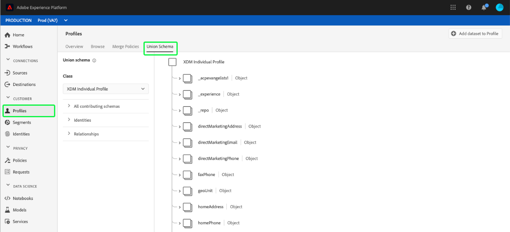
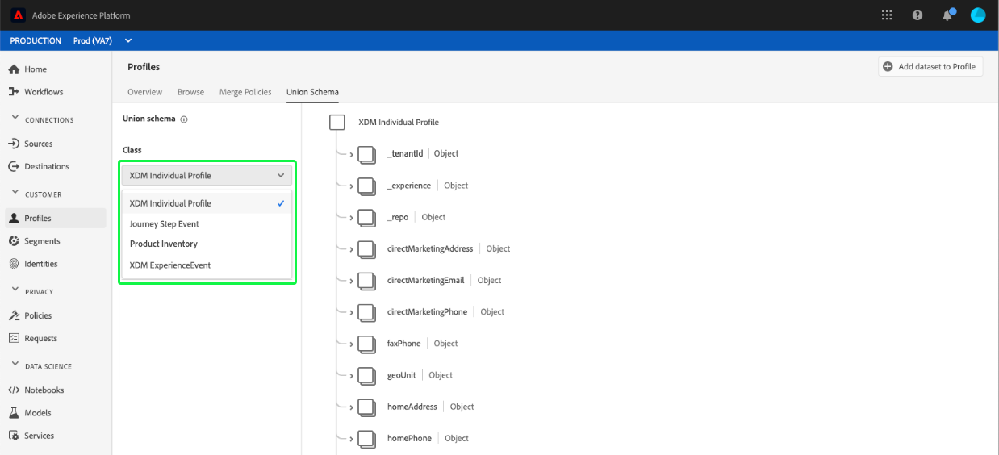
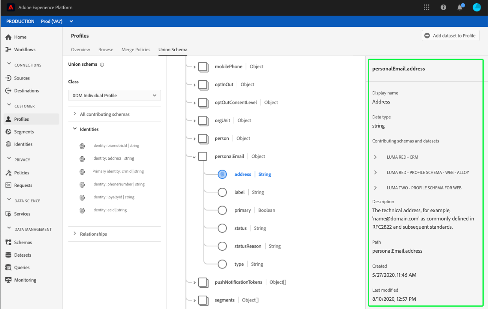

# [!UICONTROL Union schema] UI 가이드

Adobe Experience Platform 사용자 인터페이스(UI)에서는 조직 내의 모든 조합 스키마를 쉽게 확인하고 특정 클래스에 대한 필드, ID, 관계 및 기여 스키마를 미리 볼 수 있습니다. 이 안내서에서는 플랫폼 UI를 사용하여 결합 스키마를 보고 탐색하는 방법에 대한 자세한 정보를 제공합니다.

## 시작하기

이 UI 가이드를 사용하려면 실시간 고객 프로필 데이터 관리와 관련된 다양한 [!DNL Experience Platform] 서비스를 이해해야 합니다. 이 안내서를 읽거나 UI에서 작업하기 전에 다음 서비스에 대한 설명서를 검토하십시오.

* [[!DNL Real-time Customer Profile]](../home.md):여러 소스에서 집계된 데이터를 기반으로 통합된 실시간 소비자 프로필을 제공합니다.
* [[!DNL Identity Service]](../../identity-service/home.md):인제스트할  [!DNL Real-time Customer Profile] 때 서로 다른 데이터 소스의 ID를 브리싱하여 사용할 수  [!DNL Platform]있습니다.
* [[!DNL Experience Data Model (XDM)]](../../xdm/home.md):고객 경험 데이터를  [!DNL Platform] 구성하는 표준화된 프레임워크

## 결합 스키마 이해

실시간 고객 프로필을 사용하면 Adobe Experience Platform과 통합된 시스템에서 고객 속성 및 타임스탬프가 있는 이벤트를 포함하는 강력하고 중앙 집중식 프로파일을 만들 수 있습니다. 이 데이터의 형식 및 구조는 XDM(Experience Data Model) 스키마에서 제공하며 각 스키마는 XDM 클래스를 기반으로 하며 해당 클래스와 호환되는 필드가 들어 있습니다.

여러 사용 사례에 대해 스키마를 만들 수 있으며, 동일한 클래스를 참조하지만 해당 용도 전용 필드를 포함합니다. 프로파일에 대해 스키마가 활성화되면 공용 스키마의 일부가 됩니다. 즉, 결합 스키마는 동일한 클래스를 공유하고 프로필에 대해 활성화된 여러 스키마로 구성됩니다. 결합 스키마를 사용하면 동일한 클래스를 공유하는 스키마 내에 포함된 모든 필드의 병합을 볼 수 있습니다. 실시간 고객 프로필은 조합 스키마를 사용하여 각 개별 고객에 대한 전체적인 관점을 생성합니다.

결합 스키마를 사용하려면 XDM 스키마를 깊이 이해해야 합니다. 자세한 내용은 스키마 컴포지션](../../xdm/schema/composition.md)의 [기본 사항을 읽으십시오.

## 결합 스키마 보기

플랫폼 UI 내에서 결합 스키마로 이동하려면 왼쪽 탐색 영역에서 **[!UICONTROL Profiles]**&#x200B;을 선택한 다음 **[!UICONTROL Union Schema]** 탭을 선택합니다. [!UICONTROL Union Schema] 탭이 열리고 현재 선택한 클래스에 대한 결합 스키마가 표시됩니다.

## 클래스 선택

특정 XDM 클래스에 대한 결합 스키마를 표시하려면 **[!UICONTROL Class]** 드롭다운에서 클래스를 선택합니다. 모든 클래스에는 결합 스키마가 없는 관계로 인해 드롭다운에는 공용 스키마(프로필에 대해 활성화된 스키마가 있는 클래스)가 있는 클래스만 사용할 수 있습니다.

클래스를 선택한 후 표시되는 스키마는 선택한 클래스의 공용 스키마를 반영하도록 업데이트됩니다. 예를 들어 **[!UICONTROL XDM Individual Profile]**&#x200B;을 선택하여 해당 클래스의 공용 스키마를 볼 수 있습니다.

## 결합 스키마 살펴보기

전체 스키마 구조를 보기 위해 위아래로 스크롤하고 오른쪽 꺾쇠 괄호(`>`)를 선택하여 중첩된 필드를 확장하면 조합 스키마를 탐색할 수 있습니다.

표시 이름, 데이터 유형, 설명, 경로, 만든 날짜 및 마지막으로 수정한 날짜를 포함하여 세부 사항을 볼 필드를 선택합니다. 선택한 필드를 포함하는 기여 스키마 목록을 볼 수도 있습니다.

기여 스키마의 이름을 선택하면 선택한 필드에 데이터를 수집하는 해당 스키마와 관련된 데이터 집합의 이름이 표시됩니다. 각 데이터 세트 이름은 링크로 나타납니다. 데이터 세트 이름을 선택하면 새 창에서 해당 데이터 세트에 대한 활동 탭이 열립니다.

데이터 집합 활동 보기 및 UI에서 데이터 집합 데이터 미리 보기를 포함하여 데이터 집합에 대한 자세한 내용을 보려면 [데이터 집합 UI 안내서](../../catalog/datasets/user-guide.md)를 방문하십시오.

## 기여 스키마 보기

스키마 목록을 확장하기 위해 **[!UICONTROL All contributing schemas]**&#x200B;을 선택하여 결합 스키마에 기여하는 특정 스키마를 확인할 수도 있습니다. 선택한 클래스 및 조직에서 플랫폼 내에서 만든 스키마 수에 따라 단일 스키마 또는 여러 스키마가 포함된 긴 목록이 들어 있는 짧은 목록이 될 수 있습니다.

특정 스키마 이름을 선택하면 선택한 스키마의 일부인 결합 스키마 내의 필드가 강조 표시됩니다. 스키마를 선택하면 결합 스키마가 기여 스키마의 일부인 필드를 나타내는 검은색 막대로 회색으로 표시됩니다.

## ID 보기

UI를 통해 목록을 확장하기 위해 **[!UICONTROL Identities]**&#x200B;을 선택하여 조합 스키마에 포함된 ID 목록을 볼 수 있습니다.

목록에서 개별 ID를 선택하면 표시된 스키마가 필요에 따라 ID 필드를 표시하는 데 자동으로 업데이트됩니다. ID 필드가 중첩된 경우 여러 필드를 확장할 수 있습니다.

ID 필드는 조합 스키마 내에서 강조 표시되고 ID의 세부 정보가 화면의 오른쪽에 표시됩니다. 세부 사항에는 ID 필드를 포함하는 기여 스키마 목록이 포함되어 있으며, 드릴다운하여 선택한 ID 필드에 데이터를 수집하는 해당 스키마와 관련된 데이터 세트에 대한 링크를 찾을 수 있습니다.

## 관계 보기

조합 스키마 UI를 사용하면 선택한 스키마 클래스를 기반으로 스키마에 대해 정의된 관계를 볼 수도 있습니다. 관계를 정의하는 것은 고객 데이터에 대한 보다 복잡한 통찰력을 얻기 위해 여러 클래스에 속하는 두 개의 스키마를 연결하는 방법입니다.

선택한 클래스에 대해 관계가 설정된 경우 **[!UICONTROL Relationships]**&#x200B;을 선택하면 관계를 만드는 데 사용된 필드 목록이 표시됩니다. 모든 스키마는 관계를 사용하거나 정의할 필요가 없으므로 관계 섹션에 필드를 포함하지 않는 것이 일반적입니다.

UI를 사용하여 스키마 관계를 정의하는 방법을 포함하여 스키마 관계에 대한 자세한 내용을 보려면 스키마 관계](../../xdm/tutorials/relationship-ui.md)에 있는 [이 문서를 참조하십시오.

목록에서 관계 필드를 선택하면 표시된 스키마가 필요에 따라 업데이트되어 강조 표시된 관계 필드를 표시합니다. 관계 필드가 중첩되어 있는 경우 여러 필드를 확장할 수 있습니다.

## 다음 단계

이제 이 안내서를 읽고 [!DNL Experience Platform] UI를 사용하여 결합 스키마를 보고 탐색하는 방법을 알 수 있습니다. 플랫폼 전체에서 사용하는 방법을 비롯하여 스키마에 대한 자세한 내용을 보려면 [XDM 시스템 개요](../../xdm/home.md)를 읽으십시오.
