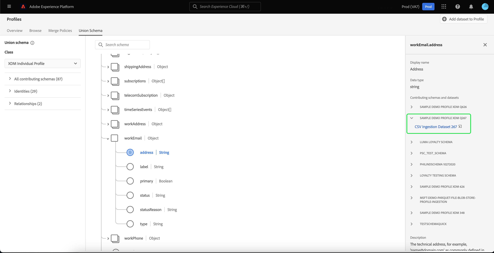
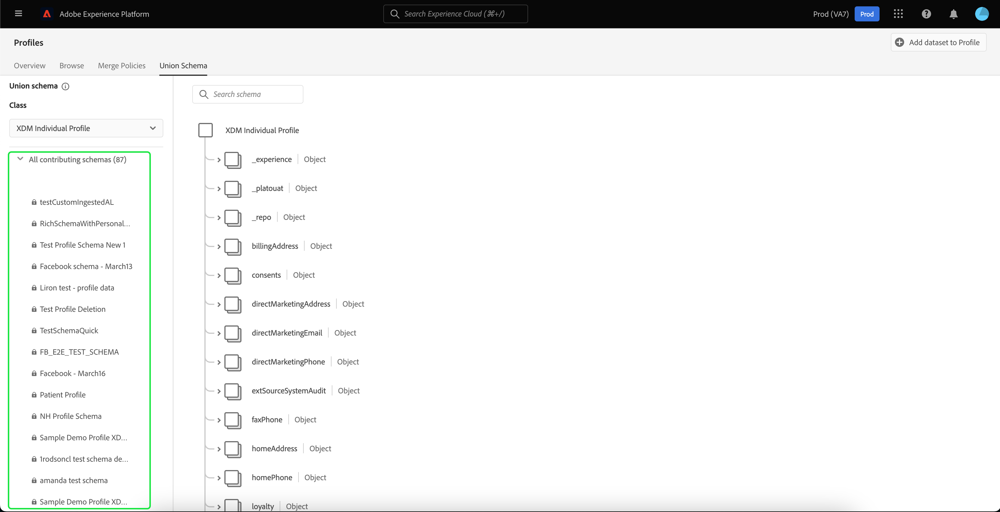

# [!UICONTROL 유니온 스키마] UI 안내서

Adobe Experience Platform UI(사용자 인터페이스)에서 조직 내의 모든 결합 스키마를 쉽게 보고 특정 클래스에 대한 필드, ID, 관계 및 기여 스키마를 미리 볼 수 있습니다. 이 안내서에서는 Platform UI를 사용하여 결합 스키마를 보고 탐색하는 방법에 대한 자세한 정보를 제공합니다.

## 시작하기

이 UI 안내서를 사용하려면 다양한 내용을 이해해야 합니다 [!DNL Experience Platform] 실시간 고객 프로필 데이터 관리와 관련된 서비스. 이 안내서를 읽거나 UI에서 작업하기 전에 다음 서비스에 대한 설명서를 검토하십시오.

* [[!DNL Real-Time Customer Profile]](../home.md): 여러 소스의 집계 데이터를 기반으로 통합 실시간 소비자 프로필을 제공합니다.
* [[!DNL Identity Service]](../../identity-service/home.md): 사용 [!DNL Real-Time Customer Profile] 서로 다른 데이터 소스의 id를 로 수집할 때 [!DNL Platform].
* [[!DNL Experience Data Model (XDM)]](../../xdm/home.md): 표준화된 프레임워크 [!DNL Platform] 고객 경험 데이터를 구성합니다.

## 유니온 스키마 이해

실시간 고객 프로필을 사용하면 Adobe Experience Platform과 통합된 시스템 전반에서 고객 특성 및 각 고객 상호 작용의 타임스탬프가 지정된 이벤트가 포함된 강력한 중앙 집중식 프로필을 만들 수 있습니다. 이 데이터의 형식 및 구조는 XDM(경험 데이터 모델) 스키마에서 제공하며 각 스키마는 XDM 클래스를 기반으로 하며 해당 클래스와 호환되는 필드를 포함합니다.

동일한 클래스를 참조하지만 해당 사용과 관련된 필드를 포함하는 여러 사용 사례에 대해 스키마를 만들 수 있습니다. 프로필에 대해 스키마가 활성화되면 유니온 스키마의 일부가 됩니다. 즉, 결합 스키마는 동일한 클래스를 공유하고 프로필에 대해 활성화된 여러 스키마로 구성됩니다. 통합 스키마를 사용하면 동일한 클래스를 공유하는 스키마 내에 포함된 모든 필드의 통합을 표시할 수 있습니다. 실시간 고객 프로필은 통합 스키마를 사용하여 각 개별 고객에 대한 거시적인 보기를 생성합니다.

유니온 스키마를 사용하여 작업하려면 XDM 스키마를 깊이 이해해야 합니다. 자세한 내용은 [스키마 컴포지션 기본 사항](../../xdm/schema/composition.md).

## 유니온 스키마 보기

Platform UI 내에서 결합 스키마로 이동하려면 다음을 선택합니다 **[!UICONTROL 프로필]** 왼쪽 탐색에서 **[!UICONTROL 유니온 스키마]** 탭. 다음 [!UICONTROL 유니온 스키마] 현재 선택한 클래스에 대한 유니온 스키마를 표시하는 탭이 열립니다.

![[프로필 및 유니온 스키마] 탭이 강조 표시된 유니온 스키마 페이지가 표시됩니다.](../images/union-schema/landing.png)

## 클래스 선택

특정 XDM 클래스에 대한 유니온 스키마를 표시하려면 **[!UICONTROL 클래스]** 드롭다운입니다. 모든 클래스에 결합 스키마가 있는 것은 아니므로 결합 스키마가 있는 클래스(프로필에 대해 활성화된 스키마가 있는 클래스)만 드롭다운에서 사용할 수 있습니다.

클래스를 선택하면 표시된 스키마가 업데이트되어 선택한 클래스의 유니온 스키마를 반영합니다. 예를 들어 다음을 선택할 수 있습니다 **[!UICONTROL XDM 개별 프로필]** 해당 클래스의 유니온 스키마를 보려면 다음을 수행하십시오.

## 유니온 스키마 살펴보기

위아래로 스크롤하여 전체 스키마 구조를 확인하고 오른쪽 꺾쇠 괄호( )를 선택하여 유니온 스키마를 탐색할 수 있습니다.`>`)을 클릭하여 중첩된 필드를 확장합니다.

표시 이름, 데이터 유형, 설명, 경로, 생성 날짜 및 마지막 수정 날짜를 포함하여 세부 정보를 보려면 필드를 선택합니다. 선택한 필드가 포함된 기여 스키마 목록을 볼 수도 있습니다.

기여 스키마 이름을 선택하면 데이터를 선택한 필드에 수집하는 해당 스키마와 관련된 데이터 세트 이름이 표시됩니다. 각 데이터 세트 이름은 링크로 표시됩니다. 데이터 세트 이름을 선택하면 새 창에서 해당 데이터 세트에 대한 활동 탭이 열립니다.

데이터 세트 활동 보기 및 UI에서 데이터 세트 데이터 미리 보기 등 데이터 세트에 대한 자세한 내용은 [데이터 세트 UI 안내서](../../catalog/datasets/user-guide.md).

## 기여 스키마 보기

을 선택하여 유니온 스키마에 기여하는 특정 스키마를 볼 수도 있습니다 **[!UICONTROL 모든 기여 스키마]** 스키마 목록을 확장합니다. 선택한 클래스와 조직에서 플랫폼 내에서 만든 스키마 수에 따라 단일 스키마를 포함하는 짧은 목록이나 여러 스키마를 포함하는 긴 목록일 수 있습니다.

특정 스키마의 이름을 선택하면 선택한 스키마의 일부인 유니온 스키마 내의 필드가 강조 표시됩니다. 스키마를 선택하면 유니온 스키마가 기여 스키마의 일부인 필드를 나타내는 검은색 막대로 회색으로 표시됩니다.

## ID 보기

UI를 통해 을 선택하여 유니온 스키마에 포함된 ID 목록을 볼 수 있습니다 **[!UICONTROL ID]** 목록을 확장합니다.

목록에서 개별 ID를 선택하면 ID 필드를 표시하는 데 필요한 경우 표시된 스키마가 자동으로 업데이트됩니다. ID 필드가 중첩된 경우 여러 필드를 확장할 수 있습니다.

유니온 스키마 내에서 ID 필드가 강조 표시되고 화면 오른쪽에 ID의 세부 사항이 표시됩니다. 세부 정보에는 ID 필드가 포함된 기여 스키마 목록이 포함되어 있으며 드릴다운하여 선택한 ID 필드로 데이터를 수집하는 해당 스키마와 관련된 데이터 세트에 대한 링크를 찾을 수 있습니다.

## 관계 보기

결합 스키마 UI를 사용하면 선택한 스키마 클래스를 기반으로 스키마에 대해 정의된 관계를 볼 수도 있습니다. 관계를 정의하는 것은 고객 데이터에 대한 보다 복잡한 통찰력을 얻기 위해 다른 클래스에 속하는 두 개의 스키마를 연결하는 방법입니다.

선택한 클래스에 대해 관계가 설정된 경우 **[!UICONTROL 관계]** 관계를 만드는 데 사용되는 필드 목록을 표시합니다. 모든 스키마가 관계를 사용하거나 정의해야 하는 것은 아니므로 관계 섹션에 필드가 포함되지 않는 것이 일반적입니다.

UI를 사용하여 스키마 관계를 정의하는 방법을 포함하여 스키마 관계에 대해 자세히 알아보려면 다음을 방문하십시오. [스키마 관계에 대한 이 문서](../../xdm/tutorials/relationship-ui.md).

목록에서 관계 필드를 선택하면 표시된 스키마가 필요에 따라 업데이트되어 강조 표시된 관계 필드를 표시합니다. 관계 필드가 중첩된 경우 여러 필드를 확장할 수 있습니다.

## 다음 단계

이 안내서를 읽으면 이제 다음을 사용하여 유니온 스키마를 보고 탐색하는 방법을 알 수 있습니다. [!DNL Experience Platform] UI. Platform 전체에서 스키마가 사용되는 방법을 포함하여 스키마에 대한 자세한 내용은 [XDM 시스템 개요](../../xdm/home.md).
