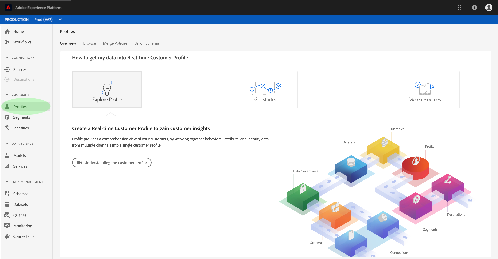

# 실시간 고객 프로필 사용 안내서

실시간 고객 프로파일은 온라인, 오프라인, CRM 및 서드파티 데이터를 비롯한 여러 채널의 데이터를 취합하여 각 개별 고객에 대한 전체적인 관점을 생성합니다.

이 문서는 Adobe Experience Platform 사용자 인터페이스에서 실시간 고객 프로필과 상호 작용하기 위한 가이드 역할을 합니다.

## 시작하기

이 사용자 가이드는 실시간 고객 프로필 관리와 관련된 다양한 경험 플랫폼 서비스를 이해해야 합니다. 이 사용자 안내서를 읽기 전에 다음 서비스에 대한 설명서를 검토하십시오.

* [실시간 고객 프로필](../home.md): 여러 소스에서 집계된 데이터를 기반으로 통합된 실시간 소비자 프로필을 제공합니다.
* [ID 서비스](../../identity-service/home.md): 인제스트되고 있는 다양한 데이터 소스의 ID를 플랫폼에 통합하여 실시간 고객 프로필을 활성화합니다.
* [XDM(Experience Data Model)](../../xdm/home.md): Platform(플랫폼)이 고객 경험 데이터를 구성하는 표준화된 프레임워크입니다.

## 프로필 개요

경험 플랫폼 [UI에서](http://platform.adobe.com)왼쪽 탐색 **에서 프로필** 을 클릭하여 프로필 작업 영역의 개요 __ 탭 _을_ 엽니다. 이 탭에는 전체 주소 지정 가능한 대상, 지난 주 동안 수집되었던 프로필 레코드 수, 동일한 기간 동안 성공 및 실패한 레코드 등의 통계를 포함하여 프로필 저장소에 대한 고급 정보를 제공하는 여러 개의 위젯이 표시됩니다.

## 프로필 샘플 보기

검색 **을** 클릭하여 사용 가능한 프로필의 샘플 목록을 봅니다. 이 샘플에는 총 [프로필 카운트에서 최대 50개의 프로필이 포함되어 있습니다](#profile-count). 샘플은 인제스트될 때 새 프로필 데이터를 선택하는 자동 작업에 의해 새로 고쳐집니다. 나열된 각 프로필에는 해당 ID, 이름, 성 및 개인 이메일이 표시됩니다. 나열된 프로필의 ID를 클릭하면 프로필 뷰어 내의 세부 [정보가 표시됩니다](#profile-viewer).

열 선택기 아이콘을 클릭하여 목록에 표시되는 속성을 사용자 정의할 수 있습니다. 여기에는 추가하거나 제거할 수 있는 공통 프로필 속성이 포함된 드롭다운 목록이 표시됩니다.

### 프로필 수 {#profile-count}

조직의 기본 병합 정책이 프로필 조각을 병합하여 각 개별 고객을 위한 단일 프로필을 구성한 후, 프로필 개수는 조직이 경험 플랫폼 내에 가지고 있는 총 프로필 수를 표시합니다. 즉, 조직은 여러 채널에서 브랜드와 상호 작용하는 단일 고객과 관련된 여러 프로필 조각을 가질 수 있지만 이러한 조각은 기본 병합 정책에 따라 병합되며 &quot;1&quot; 프로필의 개수가 반환됩니다. 모두 동일한 개인과 관련되어 있기 때문입니다.

프로필 수에는 속성(레코드 데이터)이 있는 프로필 및 Adobe Analytics 프로필과 같은 시간 시리즈(이벤트) 데이터만 포함된 프로파일도 모두 포함됩니다. 플랫폼 내에서 최신 총 프로필 수를 제공하기 위해 프로필 수는 정기적으로 새로 고쳐집니다.

프로필 스토어에 프로필 수집이 카운트를 5% 이상 늘리거나 줄이면 작업이 트리거되어 카운트를 업데이트합니다. 스트리밍 데이터 워크플로우의 경우 시간별로 검사하여 5% 증가 또는 감소 임계값이 충족되었는지 확인합니다. 있는 경우 프로필 카운트를 업데이트하도록 작업이 자동으로 트리거됩니다. 일괄 처리를 위해, 성공적으로 배치를 프로필 스토어에 인제스트한 후 15분 이내에 5% 증가 또는 감소 임계값이 충족되면 작업이 실행되어 프로필 카운트를 업데이트합니다.

### 프로필 검색

특정 프로필의 연결된 ID(예: 이메일 주소)를 알고 있는 경우 프로필 **찾기를 클릭하여 해당 프로필을 조회할 수 있습니다**. 이는 샘플 목록에 표시되는지 여부에 관계없이 특정 프로필에 액세스하는 가장 안정적인 방법입니다.

대화 상자가 표시되면 드롭다운 목록(&quot;이메일&quot;(이 예제의 경우)에서 적절한 ID 네임스페이스를 선택하고 아래 ID 값을 입력한 다음 확인을 **클릭합니다**. 검색된 경우 다음 섹션에 설명된 대로 타깃팅된 프로필의 세부 사항이 프로필 뷰어에 나타납니다.

### 프로필 뷰어 {#profile-viewer}

특정 프로필을 선택하거나 검색하면 프로필 뷰어의 _세부_ 정보 화면이 열립니다. 이 페이지에는 프로필의 기본 속성, 연결된 ID 및 사용 가능한 연락처 채널과 같이 선택한 프로필에 대한 정보가 표시됩니다. 표시되는 프로필 정보는 여러 프로필 조각에서 병합되어 개별 고객의 단일 보기를 형성했습니다.

프로필 뷰어는 이 프로필과 관련된 이벤트 및 세그먼트 멤버십이 있는 경우 이를 볼 수 있는 탭도 제공합니다.

## 정책 병합

정책 **병합을** 클릭하여 조직에 속하는 병합 정책 목록을 봅니다. 나열된 각 정책에는 해당 이름, 기본 병합 정책인지 여부 및 해당 정책이 적용되는 스키마가 표시됩니다.

UI에서 정책 병합 작업에 대한 자세한 내용은 정책 [병합 사용자 안내서를 참조하십시오](merge-policies.md).

## 결합 스키마

프로파일 **데이터 저장소에 대한 결합** 스키마를 보려면 조합 스키마를 누릅니다. 결합 스키마는 동일한 클래스 아래의 모든 XDM(경험 데이터 모델) 필드의 병합으로서, 스키마는 실시간 고객 프로필에서 사용할 수 있도록 설정되었습니다. 캔버스에서 해당 결합 스키마의 구조를 보려면 왼쪽 목록에서 클래스를 클릭합니다.

실시간 고객 프로필에서 유니온 스키마 및 [해당 역할에 대한 자세한 내용은 스키마 구성 안내서의](../../xdm/schema/composition.md) 조합 스키마 섹션을 참조하십시오.

## 다음 단계

이제 경험 플랫폼 UI를 사용하여 프로필 데이터를 보고 관리하는 방법을 알 수 있습니다. 실시간 고객 프로필 데이터를 활용하여 고객 세그먼트를 생성하는 방법에 대한 자세한 내용은 [세그멘테이션 설명서를 참조하십시오](../../segmentation/home.md).